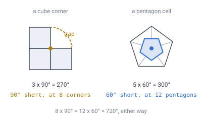

# 00 — Introduction

## What we are trying to build

A voxel world on a **sphere** rather than a flat plane. Blocks you can dig and
place, arranged over a planet.

You can walk in a straight line in any direction, forever, and come back to where
you started. Nowhere on the way does the ground go strange. No edge, no seam, no
pole, no stretched blocks.

Everything in this specification is in service of that one sentence.

**New here?** Start with [`demos/how-it-works.html`](../demos/how-it-works.html)
— an illustrated walkthrough of the construction in ten diagrams, which covers
in pictures what docs 02, 03 and 14 cover in prose.

---

## The constraint that shapes everything

The obvious approach is wrapping a cubic grid onto a sphere. It requires
distorting the cubes near the seams, and that distortion is the thing this design
exists to avoid. A cube is not a good unit cell for a sphere, and no amount of
clever projection fixes it — only spreads it around.

The reason is topological rather than a matter of engineering effort. Any closed
surface topologically equivalent to a sphere carries exactly **720° of angular
defect** that must be distributed somewhere.

"Defect" is the turn that is *missing* at a point. Lay flat tiles around a corner
and see how far they fall short of a full 360°: that shortfall is the defect, and
on a sphere it has to total 720° however you tile it. You can choose *where* it
goes and *how finely it is divided*, but you cannot make it zero. **Every design
decision in this project is a choice about where to put that 720°.**

*A cube sphere puts 90° into each of 8 corners — concentrated, and visible as a
pinch. A Goldberg polyhedron (hexagons plus twelve pentagons) spreads it across
twelve points that become individually negligible at scale.*

A useful way to compare candidates is therefore: how many points does the defect
land on, and how much lands on the worst one?

| Tiling | Defect points | Worst single point |
|---|---|---|
| Cube sphere | 8 | 90° |
| Rhombic triacontahedron | 32 (20 + 12) | 42.8° |
| Goldberg (hex + pentagons) | 12 pentagons | small, and shrinks with resolution |

[Doc 02](02-geometry-choice.md) works through the full survey and why the
Goldberg polyhedron wins it.

---

## Design goals

1. **Seamless wrapping.** No edge, no pole, no discontinuity in gameplay.
2. **No distorted cells.** Cells vary in size smoothly and with no visible break
   anywhere — which is the property that matters, and is not the same as varying
   *little*. The spread is about 2:1 in area ([doc 02](02-geometry-choice.md));
   what a cube sphere gets wrong is the discontinuity, not the magnitude.
3. **Edge-only adjacency.** Every adjacency is a shared edge — never a bare
   corner. This eliminates an entire class of diagonal-movement and
   corner-cutting bugs, and unlike the two qualifiers below it is exact,
   everywhere, with no exceptions.

   The two qualifiers: **twelve cells have five neighbours** rather than six,
   which [doc 02](02-geometry-choice.md) shows is forced rather than chosen; and
   neighbours are equidistant only to about **41%**, since hexagon area varies
   1.99:1. The first is small. The second is not — it is a measured 1.41:1 in
   spacing. Code that assumes otherwise is
   wrong — see [doc 13](13-gravity-and-orientation.md) for what the first costs
   and [doc 10](10-pathfinding.md) for what the second costs, which is an
   inadmissible search heuristic.
4. **Exact hierarchy.** A chunk must contain its children exactly, not
   approximately, so that level-of-detail, streaming, and hierarchical
   pathfinding are all sound.
5. **Nothing pregenerated.** A new planet should cost roughly a hundred bytes on
   disk. Terrain comes from a seed; only player modifications are stored.
6. **Addressing is arithmetic.** Finding a cell, its chunk, or its ancestors
   should be shifts and masks, not tree walks or spatial indices.

## Non-goals

- **Matching how a cube world feels.** Hexagons are not cubes. Buildings,
  recipes, and directional blocks all behave differently. This is accepted.
- **Perfectly uniform cell area.** Hexagons vary **1.99:1** across the sphere,
  2.74:1 counting the pentagons. Irrelevant for gameplay, but code must not assume
  uniformity, and anything dividing by "the" cell spacing must use the maximum.
- **A general-purpose geospatial library.** Google S2 and Uber H3 already exist
  and are excellent at that job. This is a game world.

---

## What "cell" means here

Two words carry most of the weight in what follows.

A **cell** is one hexagon (or one of the twelve pentagons) at one radial layer.
It is a hexagonal prism, and it is what a cube world would call a block.

A **chunk** is a triangular patch of the surface at a chosen subdivision level,
spanning all layers beneath it: the unit that is loaded, generated, meshed, and
stored.

[Doc 12](12-glossary.md) has the rest of the vocabulary.

---

## Reading order

The documents are ordered so that each depends only on those before it.
Doc 01 covers the prior art that shaped these choices; doc 02 explains the
geometry; doc 03 onwards is the design proper.

Two habits run through all of them. Every non-trivial idea has a **runnable
demo** — standalone HTML with no build step, opened directly in a browser. And
every non-obvious number has a **verification script**, plain Node with no
dependencies; claims marked **[verified]** name the script that produces them.

## Demos

After the walkthrough above, open
[`demos/sphere-tiling-shapes.html`](../demos/sphere-tiling-shapes.html), which
shows the geometric options side by side with the curvature defect
color-coded, and
[`demos/goldberg-voxel-sphere.html`](../demos/goldberg-voxel-sphere.html), which
shows the chosen tiling at increasing resolution.

---

## Still open

- **The spacing figure was 1.14:1 in earlier drafts**, quoted without a script
  behind it. Measured, it is **1.41:1**, and 1.48:1 counting the pentagons
  (`uniform.js`). Anything dividing by "the" cell spacing divides by
  **1.098 × nominal**.

---

## In one breath

- The goal is one sentence: **a voxel world on a sphere with no edge, no seam,
  no pole and no stretched blocks.**
- The surface is a **Goldberg polyhedron** — hexagons plus exactly **twelve**
  pentagons, which topology forces and no tiling can avoid.
- Cells sit on the **vertices** of a subdivided icosahedron, so triangles give
  the hierarchy and hexagons give the playfield.
- **Six neighbours everywhere** is the design goal, with two qualifiers: twelve
  cells have five, and spacing varies **1.41:1** rather than being uniform.
- **A cell** is one hexagon at one layer; **a chunk** is a triangular patch
  spanning every layer beneath it, and it is the unit that loads and stores.
- Terrain is **generated, not stored**, so only what a player changed is written
  down.
