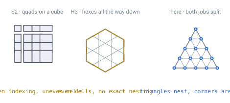

# 01 — Prior art

Two production systems already solve most of this problem, for different
purposes. Both are worth understanding in detail, because this design borrows
heavily from one and deliberately rejects the other's geometry.

The short version: **we take H3's shape and S2's addressing.**

*Each system is good at one of the two jobs and pays for it in the other. S2's
addressing is exact and its cells are badly uneven; H3's cells are even and its
hierarchy only approximate. The way out is to stop asking one shape to do both —
index the triangles, play on their corners.*

---

## Google S2

S2 is a spherical geometry library built for indexing and querying regions on
the Earth.

### How it works

The six faces of a cube are projected onto the unit sphere. Each face is a
quadtree: every cell subdivides into four children. Levels run **0 to 30**, with
leaf cells roughly **1 cm** across at Earth scale.

### The distortion fix

A naive projection makes cells near a face's edges much smaller than cells near
its centre. S2 applies a warping function between flat cube coordinates and the
sphere to even this out. Three variants exist, and the difference is large:

| Projection | Area ratio (max cell / min cell) |
|---|---|
| Linear | 5.20 |
| Quadratic | 2.08 |
| Tangent | 1.41 |

Tangent is the best but requires trigonometric functions. **Quadratic is the
default** — an approximation of the tangent projection that avoids trig entirely
for substantially better performance.

> **[verified]** `verification/s2.js` implements all three and measures the
> ratios directly with l'Huilier's formula. At 128×128 cells per face it reports
> 5.114 / 2.056 / 1.406, converging on the documented values as resolution
> increases. Total solid angle sums to exactly 4π in all three cases.

### The part worth stealing

Leaf cells are enumerated along a **Hilbert space-filling curve**, and each cell
gets a **64-bit ID** encoding both its position on the curve and its level. This
buys three things almost for free:

- **Spatial locality in a one-dimensional key.** Nearby cells get nearby
  integers, so range queries and disk layout are cache-friendly.
- **Hierarchy by bit manipulation.** Parent, children, and level all fall out of
  shifts and masks.
- **A region becomes a set of ID ranges.** Chunk streaming, LOD selection, and
  "what is near the player" all reduce to integer comparisons.

This idea is entirely separable from the tiling, and it is the core of what this
project adopts. [Doc 03](03-addressing.md) is that idea applied to triangles.

### Why the geometry is rejected

S2 reduces cube distortion; it does not remove the eight corners. Cells are
spherical quadrilaterals bounded by geodesics, and at each corner three of them
meet where four should — the 90° of defect from [doc 00](00-introduction.md),
sitting in plain sight.

S2 is built for indexing and querying regions, not for walking a grid —
neighbour traversal across face boundaries is special-cased rather than uniform.
For a world where players move and build cell to cell, that asymmetry surfaces
constantly.

**Demo:** [`demos/s2-vs-h3.html`](../demos/s2-vs-h3.html) — switch between the
three projections and watch the measured area ratio change; the red cells are
the eight corners, which no projection fixes.

---

## Uber H3

H3 is a hexagonal global grid system, and it is the direct inspiration for this
design.

### How it works

Hexagons are laid on the twenty flat faces of an icosahedron using **gnomonic
projections** centred on each face, then projected to the sphere.

- **Resolution 0**: 122 base cells — 110 hexagons and 12 pentagons, the
  pentagons centred on the icosahedron's vertices.
- **15 finer resolutions** beyond resolution 0.
- **Aperture 7**: each step scales unit length by √7, and each hexagon holds
  1/7 the area of its parent.

### The catch

Hexagons cannot be perfectly subdivided into seven hexagons — the same fact from
[doc 03](03-addressing.md), that hexagons never nest into hexagons. Finer cells
are therefore only **approximately contained** within a parent cell: children
rotate slightly at each level and spill across parent borders. Identifiers can
still be truncated to find the ancestor at a coarser resolution, which is what
matters for most geospatial work.

For a game world it matters more. Level-of-detail and hierarchical pathfinding
both want a chunk to contain exactly its children. Approximate containment means
edge cases at every chunk boundary, at every level.

### Pentagon handling

The grid is oriented so that the twelve pentagons fall over water, and the
library exposes a function to detect them so that code can take evasive action.
On a fictional planet the placement is a design decision rather than a
constraint — see [doc 11](11-open-topics.md), and
[doc 13](13-gravity-and-orientation.md) for what the pentagons actually cost.

---

## Why H3 is the inspiration and not the implementation

What H3 gets right, and this project copies:

- **Icosahedron base.** Twenty faces is the most even foothold that exists on a
  sphere; there is no Platonic solid with more.
- **Hexagonal cells.** Six neighbours, all equidistant, all sharing full edges.
- **Exactly twelve pentagons**, at the icosahedron vertices.
- **Hierarchical integer IDs**, truncatable to find ancestors.
- **An explicit pentagon predicate** in the API, because traversal code must
  handle a cell with five neighbours.

What this project does differently:

- **Aperture 4 instead of aperture 7.** Subdivision splits each triangle into
  four, which nests **exactly**.
- **The hierarchy lives on the triangles, not the hexagons.** Cells sit on the
  triangles' vertices. This is the key structural difference and it resolves the
  nesting problem completely — see [doc 03](03-addressing.md).
- **Nesting is a design choice, not an inherited approximation.**

The trade is real and worth stating plainly: a Goldberg tiling is exact at each
level but **levels do not nest into each other at all**, whereas H3's levels nest
approximately. By moving the hierarchy onto the underlying triangles, this design
gets exact nesting on the structure that needs it, and keeps the hexagons purely
as the playfield.

That trade has a cost, and it is paid in [doc 14](14-meshing-and-lod.md): because
the levels genuinely do not nest, level-of-detail cannot drop cells and must
re-evaluate the terrain function instead.

---

## Also considered

- **HEALPix** — 12 base quads subdividing 4-into-1, with every cell having
  exactly equal area. Built for astronomy. Excellent if equal-area sampling
  matters more than cell shape; rejected here because quads reintroduce the
  diagonal-adjacency problems hexagons solve.
- **Rhombic triacontahedron** — 30 identical golden rhombi. A genuinely
  better-behaved quad sphere than a cube. Covered in [doc 02](02-geometry-choice.md).

**Demo:** [`demos/s2-vs-h3.html`](../demos/s2-vs-h3.html) — the second tab shows
the H3-family structure with the icosahedron face edges overlaid, so you can see
where the per-face projections meet and that cells cross those seams freely.
Note the demo uses a Goldberg tiling as a structural stand-in; real H3 cells are
rotated relative to these because of aperture-7 subdivision.
