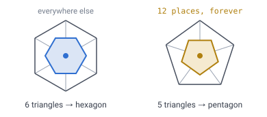

# 02 — Choosing the geometry

## What we have to pick

A unit cell shape that tiles a sphere seamlessly, without distorting the cell at
the seams. That is the whole job of this document, and the answer turns out to be
forced more than chosen.

## Three things you cannot have at once

1. Perfectly uniform cells
2. A perfect sphere
3. No distortion at seams

Pick any two. The reason is the 720° from [doc 00](00-introduction.md): every
closed surface topologically a sphere carries **exactly 720° of angular defect**.
This is the Gauss–Bonnet theorem, and it is not negotiable. The design question
is only *where that 720° goes* and *how finely it is subdivided*.

So the way to compare candidates is: **how many points does the defect land on,
and how much lands on the worst one?**

| Tiling | Defect points | Worst single point |
|---|---|---|
| Cube sphere | 8 | 90° |
| Rhombic triacontahedron | 32 (20 + 12) | 42.8° |
| Goldberg (hex + pentagons) | 12 pentagons | small, and shrinks with resolution |

## Why cubes are the worst choice

Six square faces wrapped onto a sphere put the entire 720° into eight corners,
90° each. That concentration is what produces visible pinching.

*At a cube corner, three squares meet where four would on a flat floor — the
empty quadrant **is** the 90° of defect. At a pentagon, five triangles meet where
six would, and the shortfall is only 60°. Warping the projection (as S2 does)
evens out cell **areas**, but the corners remain: three quads meet where four
should.*

**Demo:** [`demos/sphere-tiling-shapes.html`](../demos/sphere-tiling-shapes.html)
— compare *Quads · cube* against *Quads · rhombic 30* at the same resolution.
Red marks major defect, amber minor.

---

## The candidates, in full

### Hexagons plus twelve pentagons — **chosen**

Hexagons have zero curvature; they tile a plane and cannot close a sphere alone.
Pentagons carry positive curvature. Exactly twelve are required, and they are
not a hack — they are the solution.

The reason twelve is forced becomes obvious once you look at where a cell comes
from. Build the sphere by subdividing an icosahedron and put a cell on every
**corner** of the result. Six triangles meet at an ordinary corner, so its cell
has six sides. At the twelve original icosahedron corners only five meet.

*Twelve corners of the icosahedron survive every subdivision, so twelve cells are
pentagons at every level, forever. This is the same fact as the 720°, counted a
different way: 12 × 60° = 720°.*

This is the structure of soccer balls, buckminsterfullerene (C60), and geodesic
domes. Formally it is a **Goldberg polyhedron**, constructed as the **dual of a
subdivided icosahedron**: every vertex of the geodesic sphere becomes a cell;
degree-6 vertices become hexagons, and the twelve original icosahedron vertices,
which have degree 5, become the pentagons.

Cell counts follow `N(L) = 10 · 4^L + 2`:

| Level | Cells | Composition |
|---|---|---|
| 0 | 12 | 12 pentagons (a dodecahedron) |
| 1 | 42 | 30 hexagons + 12 pentagons |
| 2 | 162 | 150 + 12 |
| 3 | 642 | 630 + 12 |
| 4 | 2,562 | 2,550 + 12 |

**Why chosen:** best neighbour ergonomics of any option. Every adjacency is a
shared edge — no diagonals, no ambiguity, no corner-cutting. Away from the twelve
pentagons a cell has six neighbours, near enough equidistant to be treated as
such for movement.

"Near enough" is doing real work in that sentence, and the caveat below says how
much.

**Honest caveat:** the hexagons are **near-regular, not congruent**. Edge lengths
and angles vary slightly, with most distortion clustered near the twelve
pentagons and fading out. Area varies roughly **1.3:1** across the sphere, so
centre-to-centre spacing varies about **1.14:1** — area goes as the square of
spacing. This is small and *smoothly distributed* with no discontinuity, which is
the real win over a cube map — but "all hexagons are identical" is false, and
code must not assume it.

That 14% is the number to reach for whenever something divides by "the" cell
spacing. [Doc 10](10-pathfinding.md) is where it has teeth: a heuristic that
divides by nominal spacing rather than maximum spacing stops being admissible.

**Demo:**
[`demos/goldberg-voxel-sphere.html`](../demos/goldberg-voxel-sphere.html) —
the tiling at four resolutions, generated as the dual of a subdivided
icosahedron. At 2,562 cells the pentagons are hard to spot.

---

### Geodesic triangles

The dual of the above: the subdivided icosahedron itself. All cells are
triangles, perfectly uniform in shape; twelve vertices have five neighbours
instead of six.

**Rejected because** triangles alternate up/down orientation, which makes
movement rules, building, and adjacency logic messy. Kept as the *hierarchy*
layer — see [doc 03](03-addressing.md).

---

### Quads on a cube sphere

Simplest indexing, worst distribution. See above.

---

### Quads on a rhombic triacontahedron

Thirty identical **golden rhombi**, subdividable into an n×n grid per face.
Spreads the same 720° over 32 vertices instead of 8: 42.8° at each of the twelve
5-valent vertices, 10.3° at each of the twenty 3-valent ones.

> **[verified]** `verification/check.js` constructs the solid from the
> icosahedron — for each of the 30 edges, a rhombus formed by the edge's two
> vertices plus the two adjacent face centroids, scaled so the diagonals share a
> midpoint. All 30 faces come out planar (max non-planarity 8e-18) with diagonal
> ratio exactly φ = 1.618034 on every face. Defect sums to 720.00°.

**Rejected because** quads reintroduce diagonal adjacency, which is precisely
what hexagons remove. But it is a genuinely better quad sphere than a cube, and
worth knowing about if quad indexing is ever required.

---

### HEALPix

Twelve base quads subdividing 4-into-1, with **exactly equal cell area**. Built
for astronomy. Excellent when equal-area sampling matters most; rejected here for
the same reason as the rhombic-30.

---

### Face-transitive solids

If every cell must be *literally congruent*, you need a face-transitive solid:

- Pentagonal hexecontahedron — 60 identical pentagons
- Deltoidal hexecontahedron — 60 identical kites
- Rhombic triacontahedron — 30 identical rhombi

**Rejected because** they do not subdivide further while staying congruent.
Resolution is capped at 30–120 cells. Far too coarse for a world.

---

## Space-filling cells, for depth

A separate question from tiling the surface: what shape should fill the
*volume*? Two candidates tile 3D space perfectly with a single cell shape and are
far more isotropic than cubes:

- **Rhombic dodecahedron** — 12 identical rhombic faces, fills space in an FCC
  packing (the shape of a cell in the densest sphere packing).
- **Truncated octahedron** — 8 hexagons + 6 squares, fills space in a BCC
  packing. The most sphere-like single cell that tiles 3D space with no gaps.

Neither wraps a sphere any better than a cube does. They are relevant only if the
world is ever built as a large flat lattice carved into a ball, rather than as
radial layers over a spherical shell. **Not the chosen approach** — see
[doc 06](06-world-sizing.md) for how depth is handled instead.

**Demo:** [`demos/sphere-tiling-shapes.html`](../demos/sphere-tiling-shapes.html)
— the last two buttons show each solid plus its neighbours, demonstrating how
they pack.

---

## Decision

**Goldberg polyhedron**: hexagonal cells with exactly twelve pentagons,
constructed as the dual of a subdivided icosahedron.

The consequences that follow — where the hierarchy lives, how cells are
addressed, how positions are looked up — are the subject of the next documents.
