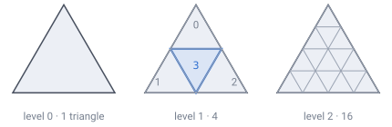
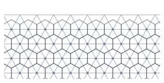
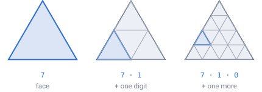
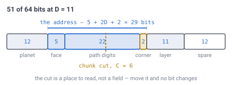
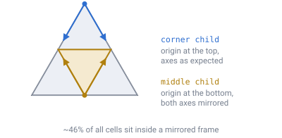

# 03 — Addressing

## What an address has to do

Give every cell an integer address such that:

- ancestors are found by truncating bits, exactly and unambiguously
- a contiguous ID range is a compact patch of surface
- no lookup table or spatial index is needed to convert between a position and
  an address

## The insight the whole scheme rests on

**Hexagons never nest into hexagons.** Draw a hexagon, try to fill it exactly
with smaller hexagons, and it cannot be done — the edges never line up. This is
not an H3 limitation you escape by rolling your own; it is why H3 settled for
approximate containment. Building the hierarchy on the hex cells inherits the
same problem.

The way out: **put the hierarchy on the triangles underneath, and the cells on
their vertices.**

A triangle *does* nest. Mark the middle of each edge, join the marks, and you
have four smaller triangles that fill the original exactly — no gaps, no
overlap, nothing left over. Repeat forever, no rotation, no spillover.



*Each split turns one triangle into four. Child **3**, in the middle, comes out
upside down — that flip is real and matters later. A small triangle is always
completely inside exactly one bigger triangle, at every level.*

The Goldberg cells are already the dual of that structure: every hexagon is a
degree-6 vertex of the geodesic, every pentagon a degree-5 one. Indexing the
thing the hexagons are derived from gives an exact hierarchy for free.



*Faint lines are the triangles — the filing system. Dots are the corner points,
and **each dot is one cell**. The hexagon around a dot is the ground closer to it
than to any other dot. **Triangles are the filing system. Hexagons are the
floor.***

**Demo:** [`demos/chunk-hierarchy.html`](../demos/chunk-hierarchy.html) — raise
the subdivision depth and watch the colours stay put: children never leave their
parent. Switch to *Hex cells* and the colour boundaries now cut *through*
hexagons, because a cell lives on a vertex shared by up to three triangles.

**Demo:** [`demos/flat-cells-chunks.html`](../demos/flat-cells-chunks.html) — the
same idea flat, in four steps: scaffolding, cells on corners, chunk division,
ownership.

---

## The address is the route you took

An address is literally the directions for finding the cell: which of the twenty
faces, then which quarter, then which quarter of that, and so on.



*Zooming out is **deleting digits off the end**. `7·2·0·3` → `7·2·0` → `7·2` →
`7`. No search, no lookup table, no tree to walk — the address already contains
every ancestor it has.*

### Face

One of the **20 icosahedron faces**. Always 20 — this is fixed by geometry, not
configuration. It is a separate 5-bit field, not a path digit.

### Path digits

Two bits per subdivision level, selecting one of four children:

```
child 0  corner at the triangle's origin vertex
child 1  corner in the i direction
child 2  corner in the j direction
child 3  the middle triangle — upside down
```

Truncating trailing digits yields the ancestor. Zooming out is deleting digits:
no lookup, no search, just a shift.

### Local coordinates

Within a chunk, a cell is identified by `(q, r)` on a triangular lattice.

---

## Bit layout



```
[ 5 bits ][ 2 bits × C ][ (D−C) bits ][ (D−C) bits ]
   face       path            q             r
   0–19    down the tree   local column   local row

|<------ chunk ID ------>|<--- position in chunk --->|
```

Where `D` is the world's subdivision depth (the block level) and `C` is the chunk
level (where you cut).

Total width is `5 + 2C + 2(D − C)` = **`5 + 2D` bits, independent of `C`**. Moving
the chunk boundary does not change the address at all — it only moves where the
line is drawn through the same number. This is why chunk size remains tunable
after launch: it does not change world data.

At `D = 13` the whole address fits in **31 bits**. In a 64-bit integer that leaves
33 bits spare for a layer index, a world version, or resolution tags.

**Demo:** [`demos/cell-id-bits.html`](../demos/cell-id-bits.html) — drag the
depth and chunk-level sliders and watch the total stay fixed; tap the truncate
buttons to see bits vanish and the surviving prefix's surface coverage reported.

### Code space efficiency

The encoding is deliberately sparse. Only 20 of 32 face codes exist, and the
local `q,r` square is half wasted because a triangle is not a square:

```
20/32 × 1/2 ≈ 31.25% of the code space is used
```

That costs about 1.7 bits and buys addressing that is pure shifts and masks, with
no lookup tables anywhere. Accepted.

---

## `(i, j)` versus `(q, r)`

They are the **same coordinate pair at different scopes**.

- `(i, j)` — position within the whole face triangle, ranging 0 to `2^D`
- `(q, r)` — what is left after the path digits have been stripped off

```
(i, j)  ==  [path digits] + (q, r)
```

One pair, cut in two. The path digits are not extra information: they are `(i, j)`
re-encoded so that **chopping off the end leaves a meaningful region** instead of
a meaningless number. Plain `(i, j)` would identify cells perfectly well — it just
would not give you chunks for free.

> **[verified]** `verification/qr.js` splits and rejoins every lattice point at
> depth 8 with chunk level 4: 33,153 / 33,153 exact round-trips.

### The orientation flip

The split is *almost* a plain bit-slice. Taking a corner child literally clears a
high bit (`i -= half`). But the **middle child is upside down**, so it reflects:

```
i = half - i
j = half - j
```



*A corner child keeps its parent's sense of direction. The middle child does not:
its origin sits at the opposite corner and both axes run backwards. Local
coordinates in a middle-descended chunk are measured in a mirrored frame.*

> **[verified]** `verification/qr.js` reports 15,104 of 33,153 cells — about
> **46%** — sitting in a flipped frame. This is the normal case, not an edge
> case.

**Carry a one-bit orientation flag down the walk**, or `q,r` will be mirrored in
nearly half of all chunks. The same up/down triangle orientation reappears
throughout the design; it is intrinsic to subdividing triangles, since one of the
four children always points the other way.

This flip is not only a bookkeeping problem. It reaches into gameplay: a
direction index derived from `(q, r)` sign inherits the mirror and would hand
every rail and conveyor in those chunks the wrong way round. See
[doc 13](13-gravity-and-orientation.md).

**Demo:** [`demos/address-split.html`](../demos/address-split.html) — tap dots to
watch `(i,j)` get carved into path + `(q,r)`. Use *Find a flipped one* to see the
chunk's `0,0` corner jump to the opposite side.

---

## Cell ownership at chunk boundaries

A cell sits on a triangle **vertex**, and a vertex on a chunk border belongs to
two or three chunks at once. Somebody has to own it, or it gets stored twice and
the two copies drift apart.

**Rule: the lowest chunk ID wins.**

Every cell then has exactly one home and nothing is stored twice. The share of
cells needing this rule is small and shrinks as chunks grow relative to cells —
around 6% at depth 3 with chunk level 0, less at realistic settings.

That 6% is read off the demo below rather than produced by a verification script,
and depth 3 / chunk level 0 is the extreme case rather than a realistic one. It
is quoted to show the *shape* of the number, not as a figure to size anything
against.

**Demo:** [`demos/chunk-hierarchy.html`](../demos/chunk-hierarchy.html) — the
*Hex cells* view reports the exact border-cell count and percentage live.

---

## Traversal order

A contiguous ID range is exactly one subtree, which is exactly one compact patch
of surface. That property is what makes streaming-by-proximity and disk layout
work, and plain **depth-first ordering on the triangle tree** delivers it.

Do **not** attempt a Sierpiński space-filling curve on 4-way refinement.

> **[verified]** `verification/order.js` enumerates the child adjacency graph of
> a midpoint triangle split. The middle child shares an edge with all three
> corners, but the corners touch each other only at points — so the graph is a
> **star**, which has no Hamiltonian path. The best achievable ordering has
> **2 of 3 steps edge-adjacent**.

True Sierpiński curves avoid this by using *bisection* refinement, which produces
a different, skinnier triangle family and destroys the geodesic geometry the
hexagons depend on. The trade is not worth taking. Hilbert-style ordering only
improves the constant factor when querying arbitrary regions that do not align to
the tree — which is not the access pattern here.

Recommended child order: `[0, 3, 1, 2]` — corner, middle, corner, corner — which
achieves the maximum 2 of 3 adjacent steps.

For the 20 base faces, the face-adjacency graph is Hamiltonian, so a base
ordering exists where consecutive faces touch. Use it.

---

## Layers

The radial dimension rides along as a **separate field**:

```
[ 5 face ][ 2×C path ][ q ][ r ]   ← where on the shell
[ layer ]                          ← the only part that goes down
```

The tessellation is **identical at every layer** — same face, same path, same
`q,r`, evaluated at a smaller radius. Each cell is really a hexagonal prism
running toward the core, and the layer index says how far along that column
you are.

**Treat that as an invariant, not a convenience.** Three later results are built
directly on it, and a proposal to change horizontal resolution partway down —
which [doc 06](06-world-sizing.md) mentions as a way to handle taper — breaks all
three along an interior boundary wrapping the whole planet. It is filed as an
open topic in [doc 11](11-open-topics.md) rather than a recommendation.

Two consequences:

- **Vertical neighbours are free.** Above and below are the same address with
  layer ±1. No face crossing, no pentagon case. All awkward geometry is
  horizontal only. This one fact is what makes gravity tractable
  ([doc 13](13-gravity-and-orientation.md)) and side-face merging exact
  ([doc 14](14-meshing-and-lod.md)).
- **A column is contiguous.** Put the layer bits at the *bottom* of the word and
  one player's whole vertical column is a single ID range.

Index layers **downward from the surface**, not up from the core: layer 0 = crust
top. The terrain generator and the addresses then agree, and changing the planet
radius later does not renumber every block.

---

## What may and may not go in the ID

The test: **does this change when a player does something?**

**Identity — goes in the ID.** Layer index, world version, resolution level.
These describe *which cell you are talking about* and never change for a given
cell. A 512-block crust needs 10 bits for the layer, putting depth 13 plus layer
at 41 bits with 23 to spare.

**Mutable state — does not.** If block type lives in the ID, placing a block
*changes the cell's ID*. Every sorted index, cache key, and range query breaks,
because the key moved. Keys must be stable.

In the common case IDs are not stored at all: a chunk holds its cells in
canonical `q,r,layer` order, so a cell's ID is implied by its array position.
Storing a 64-bit ID beside a one-byte block type would be 8× overhead for
information already known.

The one place packing both into one word genuinely wins is the **sparse
modification log**, which stores `(which cell, what is there now)` pairs anyway:

```
[ 41 bits address ][ 16 bits block state ]  = 57 bits, one word
```

16 bits gives 65,536 block types, or 12 bits of type plus 4 of rotation. Anything
richer — chest contents, sign text — goes in a side table keyed by the same
address.

---

## In one breath

- Triangles nest exactly; hexagons never do. So the **hierarchy is on the
  triangles** and the **cells are on their corners**.
- An address is the **route down the splits**: face, then one digit per level.
  Truncating digits gives the containing chunk, for free.
- Width is `5 + 2D` bits regardless of where the chunk cut falls, so **chunk size
  stays tunable after launch**.
- The **middle child is mirrored**, and about 46% of cells live inside one. Carry
  an orientation flag.
- Border cells are owned by the **lowest chunk ID**. Layers ride along as a
  separate field, and vertical neighbours cost nothing.
