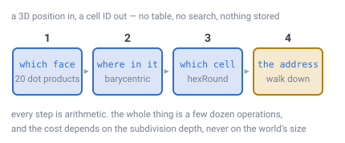
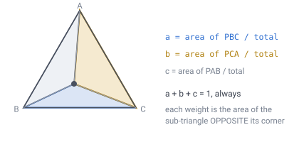
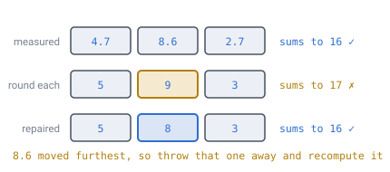
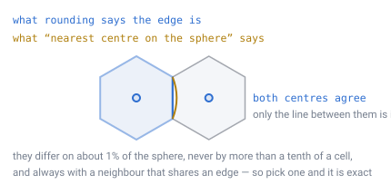

# 04 — Position lookup

## The question this answers

A player is standing at some 3D world position. **Which cell are they in?**

And the harder version: answer that without ever having enumerated or stored a
single cell.

## There is no chicken-and-egg

The thing that trips people up here is imagining that cells must exist before
they can be found. They do not.

**IDs are never generated or stored. They are computed from position, on the
spot.** The same way nobody maintains a registry of Earth's coordinates: the grid
is a rule, not a list.

Level 13 "has" 671 million cells the way a sheet of graph paper has infinite
coordinates — addressable, not allocated.

---

## The pipeline

Four steps, and each one is arithmetic.



*Narrow the answer down four times. Which of the twenty faces, then where inside
that face, then which cell that lands in, then the route to it. Nothing is looked
up and nothing is stored, so the cost is the same on a planet of any size.*

Here it is in full:

```
dir   = normalize(pos)
layer = floor((surfaceRadius - |pos|) / blockSize)

face  = argmax over the 20 face centroids of dot(dir, centroid)
(a,b,c) = barycentric of dir in that face's triangle
(i,j) = hexRound(a*n, b*n, c*n)          // n = 2^depth

// walk down, emitting one digit per level
for level in 0..chunkLevel:
    half = n/2
    if      i >= half:   digit = 1; i -= half
    else if j >= half:   digit = 2; j -= half
    else if i + j < half: digit = 0
    else:                digit = 3; i = half - i; j = half - j; flip ^= 1
    n = half
```

Cost is O(depth) — a few dozen operations, no data structure in memory. The
`flip` bit at the end is the middle-child **half turn** from
[doc 03](03-addressing.md), carried down the walk. It negates both axes, which
makes it a rotation — nothing in the world is ever mirrored.

---

## Step 1: which of the twenty faces

Twenty dot products, take the largest. That is the whole step, and it is
**exact, not an approximation**.

That surprises people, so here is why it holds. On an icosahedron, the
perpendicular bisector plane between two adjacent face centroids contains the
shared edge's two vertices. (There is a 2-fold rotation about the edge-midpoint
axis swapping the two faces, so the bisector must contain the edge.) The face
boundaries therefore *are* the Voronoi boundaries of the face centroids — and
"nearest centroid" is exactly "inside that face".

> **[verified]** `verification/lookup.js` compares `argmax` against a true
> barycentric containment test on 200,000 random directions: **0 mismatches**.

Twenty dot products is negligible, but a precomputed spatial lookup is possible
if this ever shows up in a profile.

---

## Step 2: where inside the face

Barycentric coordinates are **mixing ratios**. Instead of "3.2 cm right, 1.7 cm
up", you say "30% corner A, 55% corner B, 15% corner C". Three numbers that
always sum to 1.

| Position | Coordinates |
|---|---|
| Corner A | `(1, 0, 0)` |
| Midpoint of A and B | `(0.5, 0.5, 0)` |
| Dead centre | `(⅓, ⅓, ⅓)` |
| Outside the triangle | any coordinate negative |

Three numbers for a 2D position because one is redundant: `c = 1 − a − b`. You
only need to *store* two — but the third is essential while calculating, for a
reason that shows up in the next step.



*Each coordinate is an **area fraction**: `a` equals the area of triangle `PBC` —
the sub-triangle **opposite** corner A — divided by the total. Drag toward a
corner and the opposite sub-triangle shrinks to nothing.*

**Why this is the right tool here:** barycentric needs nothing but the triangle's
three corners — no origin, no axes, no per-face frame. Exactly what you want when
twenty faces each chose their own origin independently.

**Demo:** [`demos/barycentric.html`](../demos/barycentric.html) — drag a point and
watch the shaded areas, the weights, and the rounding table update together.

### Relation to `(i, j)`

On a triangle divided `n` per side, the lattice points **are** the barycentric
coordinates scaled to whole numbers:

```
(i, j, k)  with  i + j + k = n
```

`(i, j)` is that with `k` dropped, because `k = n − i − j`. And the
"am I inside the triangle?" test being `i + j ≤ n` is literally just `k ≥ 0`.

`(q, r)` is the identical idea at chunk scale, using the chunk's own three
corners as reference.

---

## Step 3: `hexRound`, and why the third number earns its keep

Converting a continuous position gives fractions, and rounding each one
independently breaks the sum:

```
(4.7, 8.6, 2.7)   sums to 16 ✓
round each      → (5, 9, 3)  sums to 17 ✗
```

A triple that does not sum to `n` is not a lattice point at all. The fix: find
which coordinate moved furthest (here `8.6 → 9`, a shift of 0.4) and recompute
*that one* from the other two:

```
(5, 8, 3)   sums to 16 ✓
```



*Round all three and the sum drifts off by one, which names a point that does not
exist. Only one of the three has to be given up — the one that moved furthest,
because it is the one you know least about.*

```js
function hexRound(k, i, j, n){
  let rk = Math.round(k), ri = Math.round(i), rj = Math.round(j);
  const dk = Math.abs(rk-k), di = Math.abs(ri-i), dj = Math.abs(rj-j);
  if      (dk > di && dk > dj) rk = n - ri - rj;
  else if (di > dj)            ri = n - rk - rj;
  else                         rj = n - rk - ri;
  return [rk, ri, rj];
}
```

**This is why the third coordinate earns its keep** — you could not detect or
repair the error with only two. Store `(i, j)` afterwards and forget `k`.

### What this step is exact *about* — the one thing to get straight

On a flat, uniform triangular lattice the Voronoi cell of a lattice point **is**
the hexagon, so "nearest lattice point" and "which cell am I in" are the same
question and rounding answers both. That is a theorem.

But the lattice is not flat. Its points get projected radially onto a sphere, and
gnomonic projection preserves straight lines — which is what
[doc 09](09-ray-traversal.md) leans on — without preserving *equidistance*. Two
points equally far from a lattice point in the face plane are not equally far
from it on the sphere. So "nearest planar lattice point" and "nearest cell centre
on the sphere" are genuinely different questions, and this was an open item until
it was measured.

> **[verified]** `verification/hexround.js` builds the real grid at levels 2–7,
> samples random directions, and compares `hexRound` against a brute-force search
> for the nearest cell centre on the sphere.
>
> | Level | Cells | Disagreement rate | Worst overshoot | Cells apart |
> |---|---|---|---|---|
> | 2 | 162 | 3.56% | 0.108 | 1.04 |
> | 3 | 642 | 2.06% | 0.088 | 1.08 |
> | 4 | 2,562 | 1.48% | 0.071 | 1.10 |
> | 5 | 10,242 | 1.14% | 0.071 | 1.08 |
> | 6 | 40,962 | 1.23% | 0.063 | 1.08 |
> | 7 | 163,842 | 1.40% | 0.051 | 1.09 |
>
> They disagree, on about **1%** of the sphere, and the rate **settles rather
> than falling to zero** — a face triangle's shape is scale-free, so refining
> shrinks the cells and the disagreement band together. The last three rows are
> sampling-limited to ±0.1–0.2 points; read them as a plateau, not a trend.

**So the answer is not "yes" or "no" — it is that the question was underspecified.**



*The two rules agree about where every cell centre is. They disagree only about
exactly where the line between two cells falls — and by about a tenth of a cell,
always between neighbours that share an edge. Nothing is ever badly misplaced;
there are simply two curves and the specification had not said which one it meant.*

Look at the last two columns. Every disagreement is with an **edge-adjacent**
cell, and `hexRound`'s answer is at most **0.11 of a cell spacing** further from
the point than the true nearest centre. A point is only ever handed to a
neighbour when it sits within about a tenth of a cell of the boundary between
them. Nothing is ever wildly misplaced.

And `hexRound` is a pure function of position, so it **already defines a
partition** of the sphere: exact, gap-free, overlap-free, edge-adjacent
everywhere. It is the radial projection of the planar Voronoi diagram. That
partition is not an approximation of anything — it is a perfectly good definition
of where the cells are, which happens to differ slightly from the other one.

### The decision: the projected planar diagram is normative

**A cell is the radial projection of its lattice point's planar Voronoi
hexagon** — that is, a cell is by definition the set of directions `hexRound`
maps to it.

Adopt that and this step is exact *by construction*, and so is
[doc 09](09-ray-traversal.md)'s straight-line ray walk, which steps across
exactly these boundaries. Adopt "nearest centre on the sphere" instead and both
become approximate by ~1%. Nothing is gained by switching. Both definitions are
equally easy to write down, and only one of them is exact.

The cells remain hexagons, still tile the sphere with no gaps, and still meet
edge-to-edge everywhere — projection is a homeomorphism, so it cannot change any
of that. Invariant 11 is untouched.

> **Reconciled by [doc 18](18-cell-boundary.md).** [Doc 14](14-meshing-and-lod.md)
> **Reconciled by [doc 18](18-cell-boundary.md).** The mesh draws this same
> curve. The two differ by **3.85e-5 of a cell** at level 11, and the gap
> **halves with every level**, so the picture a player clicks and the answer this
> page computes are the same curve by construction.

And one property of these cells that is easy to miss:

> **[verified]** `verification/boundary.js` — a cell's six corners are the same
> distance from its centre and the same distance apart, **to twelve decimal
> places**. Every cell is an **exactly regular hexagon in its own face plane**.

So the cells are not slightly irregular hexagons scattered over a sphere. They are
perfect hexagons, and every bit of the 1.99:1 area spread in
[doc 02](02-geometry-choice.md) is what radial projection does to them on the way
out.

Note the direction of travel throughout. This concerns **position → cell** only.
Anything starting from an ID and walking path digits to a position — the
pathfinding heuristic in [doc 10](10-pathfinding.md), the mesh geometry in
[doc 14](14-meshing-and-lod.md) — is untouched either way.

---

## The face-boundary test

A single sign check. If any barycentric coordinate goes negative, the position is
outside this face — apply the adjacency table ([doc 05](05-face-adjacency.md)) and
continue in the neighbour's frame.

That is the same test as `k ≥ 0` above, which is the same test as `i + j ≤ n`.
One inequality, wearing three hats.

---

## Layer

```
layer = floor((surfaceRadius - |pos|) / blockSize)
```

Independent of everything above — the radial axis never interacts with the
horizontal one, which is the recurring gift of the layout in
[doc 03](03-addressing.md). Note `surfaceRadius` here is the *planet reference
radius*, not the terrain height at this direction — see
[doc 08](08-terrain-generation.md).

---

## Still open

- **The middle-child flip was called a mirror** in earlier drafts. It negates
  both axes, so the determinant is `+1` and it is a half turn (`winding.js`).
- **Doc 14 meshed a different curve** — the dual polyhedron, with corners at
  subdivided-triangle centroids. [Doc 18](18-cell-boundary.md) moved the mesh
  onto this page's boundary; the two curves differed by `3.85e-5` of a cell at
  level 11.
- **A precomputed spatial lookup for step 1.** Twenty dot products is already
  negligible, so this waits for a profile.

---

## In one breath

- Cells are **computed, never stored**. The grid is a rule.
- **Nearest face centroid is the containing face**, exactly, for a reason about
  perpendicular bisectors — not as an approximation.
- Barycentric coordinates are **area fractions**, and they need no per-face frame,
  which is exactly why they suit twenty faces with unrelated origins.
- Rounding three coordinates independently breaks their sum; **repair the one
  that moved furthest**. The third coordinate exists to make that possible.
- Rounding and "nearest centre on the sphere" disagree on about **1%** of the
  sphere, always with an edge-adjacent cell and never by more than **0.11 of a
  cell**. The fix is a definition, not a correction: **a cell is what `hexRound`
  says it is**, which makes this step and doc 09's ray walk exact by
  construction.
- One sign check answers "have I left this face?", "is this inside the triangle?"
  and "is `k` negative?" — they are the same question.
