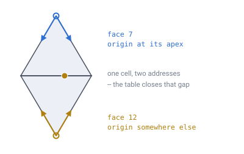
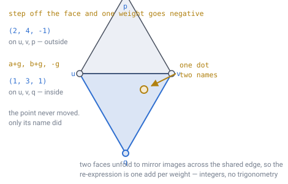

# 05 — Face adjacency

## The problem

Each of the 20 icosahedron faces has its own local `(i, j)` grid, with an origin
corner chosen independently. Nothing coordinates them — the origins come from
whatever order the icosahedron construction happened to list its vertices in.

So walking off one face and onto another means re-expressing your coordinates in
a frame that has no relationship to the one you came from.



*The two faces meet along a real edge, but their frames do not agree about
anything. The dot on the seam is **one physical cell** — and it has a different
`(i, j)` in each face. Closing that gap is the entire job of this document.*

---

## The table

60 entries — 20 faces × 3 edges — each answering: *if I walk off this edge, where
do I land, and which way is up now?*

```
struct EdgeLink {
    u8 neighbourFace;   // which of the 20 faces is over there
    u8 neighbourEdge;   // which of its 3 edges I arrive on
    u8 reversed;        // whether the shared edge runs the opposite way
}

EdgeLink table[20][3];
```

**180 bytes** at one byte per field. That is the entire cost of the sphere's
irregularity, and it never grows.

## Construction

Do not hand-author it. Compute it at startup: for each face, for each of its
three edges (a vertex pair), find the other face containing that same pair, and
record which of its edges it is and whether the pair appears in the same or
reversed order.

```js
const table = F.map((f, fi) => [0,1,2].map(e => {
  const a = f[e], b = f[(e+1) % 3];
  for (let g = 0; g < 20; g++){
    if (g === fi) continue;
    for (let e2 = 0; e2 < 3; e2++){
      const c = F[g][e2], d = F[g][(e2+1) % 3];
      if ((a === c && b === d) || (a === d && b === c))
        return { face: g, edge: e2, reversed: (a === d && b === c) ? 1 : 0 };
    }
  }
}));
```

> **[verified]** `verification/adj.js` builds the real table. All 60 edges match
> with no gaps, and **every entry comes out `reversed`** — the signature of
> consistent outward winding across all 20 faces, which is what you want. Sample
> rows:
>
> ```
> face  edge0            edge1            edge2
>   0 -> f 4 e2 rev  -> f 6 e0 rev  -> f 1 e0 rev
>   1 -> f 0 e2 rev  -> f 5 e0 rev  -> f 2 e0 rev
>   2 -> f 1 e2 rev  -> f 9 e0 rev  -> f 3 e0 rev
>   3 -> f 2 e2 rev  -> f 8 e0 rev  -> f 4 e0 rev
> ```

## Why the relationship is stored rather than computed

It differs for every face and edge. There is no closed-form rule, because the
face vertex ordering is arbitrary — it comes from whatever icosahedron
construction you used. Compute once, store, done.

---

## Why this matters more than its size suggests

**This single table is where all the sphere-ness of the world lives.**

Everywhere else — movement, building, pathfinding, terrain — code just walks a
flat hex grid. Only `neighbour(id, direction)` ever consults it, and only when a
step leaves a face.

Together with the twelve pentagon IDs, it is the complete set of constant data
the sphere requires. A few hundred bytes, fixed at build time, never growing no
matter how deep the subdivision goes.

That is worth sitting with, because it is the payoff for everything in
[doc 02](02-geometry-choice.md) and [doc 03](03-addressing.md): a planet's worth
of curvature, reduced to 180 bytes and one function.

---

## The table is not the function, and for a long time only the table existed

Everything above proves the table **complete**. Nothing above ever used it to
cross an edge, and neither did anything else in this repository — which
[doc 11](11-open-topics.md) records as the largest gap in the specification.

The reason it hid so well is that every verification script here gets a cell's
neighbours a different way: build all twenty faces, compute each lattice point's
position, round the coordinates, and key a hash map on the rounded triple. Two
faces that produce the same point collide in the map, so the shared edge welds
itself and adjacency falls out of the graph. That is a fine way to *measure* a
sphere. It is not available to an engine, which holds one integer and wants six
neighbours without a planet in memory.

So `neighbour(id, k)` had eight documents depending on it and no definition.
Here it is.

### Where direction index 0 points

[Invariant 9](../CLAUDE.md) says order the ring counter-clockwise as seen from
outside, and never from the sign of `(q, r)`. That fixes the order and leaves the
*start* open — and [doc 19](19-directional-blocks.md) puts three bits of rotation
on disk, so the start has to be nailed to something that never moves.

Use `(i, j)` running over the whole face, with the barycentric weights
`(n−i−j, i, j)` on the face's three vertices `A, B, C`. Then `d/di` is the
direction `B − A` and `d/dj` is `C − A`, and the six lattice steps come out
sixty degrees apart in that order:

```
k = 0   (+1,  0)      toward B
k = 1   ( 0, +1)
k = 2   (-1, +1)
k = 3   (-1,  0)
k = 4   ( 0, -1)
k = 5   (+1, -1)
```

**Index 0 is the step from the face's own vertex `A` toward its vertex `B`.** It
is a property of the cell's face, so it never depends on how the cell was
reached, and it is written down once in the face table that already exists.

> **[verified]** `verification/neighbour.js`, section 1. All **20** faces are
> wound counter-clockwise seen from outside — which is the same fact `adj.js`
> reports as every table entry coming out `reversed` — so one direction table
> means the same turn on every face.

One thing falls straight out of that: negating an offset is exactly `k → k+3`. That is
[doc 03](03-addressing.md)'s half turn, and it is why the flip is a rotation
rather than a mirror.

### Crossing an edge is a reflection, and it is integer arithmetic

Here is the part doc 05 used to stop one step short of.

A lattice point is not really a `(face, i, j)`. It is a set of **integer weights
attached to global vertex numbers** — `A` gets `n−i−j`, `B` gets `i`, `C` gets
`j` — and that description does not mention a face at all. Take the step, and if
you have left the face then exactly one weight has gone negative.



*Two adjacent faces unfold to mirror images across the edge they share, so the
point that face `f` describes with a negative weight is a point face `g`
describes with three positive ones. **It is the same dot.** Only the name
changed, and changing it costs one addition per weight.*

Say the negative weight `γ` sits on vertex `p`, leaving `u` and `v` as the shared
edge and `α, β` as their weights. The table gives the face across that edge; call
its third vertex `q`. Then:

```
(α on u, β on v, γ on p)   →   (α+γ on u, β+γ on v, −γ on q)
```

Three additions and a negation. No angles, no per-face frame, no accumulated
error — and the answer is exact because every quantity in it is an integer.

> **[verified]** `verification/neighbour.js`, section 2. Stepping off every one
> of the **60/60** `(face, edge)` pairs and straight back returns to the starting
> cell **900 / 900** times. Because the step out and the step back are `k` and
> `k+3`, that also checks the direction table survives the crossing: the opposite
> of a direction is still its opposite in the neighbour's frame.

And a small surprise worth recording, because it makes the table smaller than it
looks: **the `reversed` flag is never read.** Carrying weights on global vertex
numbers makes the edge's orientation carry itself. The flag is still the right
thing for `adj.js` to *check* — it is the signature of consistent winding — but
the crossing does not consult it.

### A pentagon's ring is five long, and `k = 5` does not exist

At an icosahedron vertex only five triangles meet, so the six steps above
over-run the cone by sixty degrees and the reflection has nowhere to land. The
five neighbours are one step along each of the five icosahedron edges at that
vertex, and the table rotates between them: from a face containing `p`, cross the
edge that starts at `p` and you arrive at the next face around it.

> **[verified]** `verification/neighbour.js`, section 3. That rotation closes
> after exactly five steps at **12 / 12** vertices, and every one of the twelve
> rings holds **5** distinct cells.

So the honest answer to "what does `neighbour(pentagon, 5)` return" is that the
**ring is short** — never a duplicate, never a null sitting in the middle of it.
Callers iterate the ring rather than counting to six, which is what
[doc 10](10-pathfinding.md)'s pathfinder, [doc 16](16-lighting.md)'s flood fill
and [doc 21](21-rivers-and-erosion.md)'s flow routing all already do. It is
[doc 13](13-gravity-and-orientation.md)'s missing sixty degrees, arriving as a
missing array entry.

### Does it agree with the sphere?

The whole point of building it from the table and integers is that it must not be
checked against itself.

> **[verified]** `verification/neighbour.js`, section 4. Against the geometric
> graph every other script builds, at three depths:
>
> | Depth | Cells | Neighbour set matches | Degree-5 cells | CCW order matches |
> |---|---|---|---|---|
> | 3 | 642 | 642 / 642 | 12 | 630 / 630 |
> | 4 | 2,562 | 2,562 / 2,562 | 12 | 2,550 / 2,550 |
> | 5 | 10,242 | 10,242 / 10,242 | 12 | 10,230 / 10,230 |
>
> Every cell, every level: the same neighbours **and the same direction round the
> ring**, with exactly twelve cells at degree 5.

> **[verified]** Section 5. And the half turn, arriving through this function
> rather than off the mesh: over 186,066 steps at `D` 8 / `C` 4, a direction index
> read off `(q, r)` differs from the true one by **+0 or +3 and nothing else** —
> `+0` in every unflipped chunk, `+3` in every flipped one, with no crossover.
> That is `winding.js`'s result reproduced from the other side.

**So the sphere really does fit in 180 bytes and one function.** Everything above
`neighbour()` walks a flat hex grid.

---

**Demo:** [`demos/adjacency-table-2d.html`](../demos/adjacency-table-2d.html) —
one face laid flat with its three neighbours folded out, the paper-model view.
Each ringed circle is a triangle's `0,0` origin with its `i` and `j` axes. The
gold dot is a single physical cell on the seam, with its address shown in *both*
frames — the gap between those two numbers is exactly what the table exists to
close. Step through faces to see the relationship change every time.

---

## In one breath

- The relationship between two faces' frames has no closed form, so **compute the
  table once at startup and store it**: 20 × 3 entries, **180 bytes**, and it
  never grows with subdivision depth.
- All **60** edges match with no gaps and every entry comes out `reversed`, which
  is the signature of consistent outward winding across all twenty faces.
- **The table is not the function.** For most of this specification's life only
  the table existed, and nothing had ever used it to cross an edge.
- A lattice point is **integer weights on global vertex numbers**, which is a
  description that never mentions a face. Step outside and exactly one weight goes
  negative.
- Crossing is then a **reflection in three additions** — `α+γ, β+γ, −γ` — and the
  point never moves, only its name changes. The `reversed` flag is not even read.
- **Direction index 0 is the step from the face's vertex `A` toward `B`**, so a
  stored rotation means the same thing everywhere, forever.
- **A pentagon's ring is five long.** `k = 5` is not a direction; it is doc 13's
  missing 60° arriving as a missing array entry.
- Checked against the geometric graph at three depths: every cell, the same
  neighbours **and the same direction round the ring**, 12 cells at degree 5.
