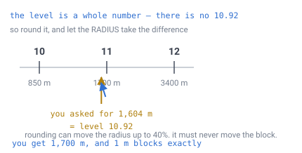
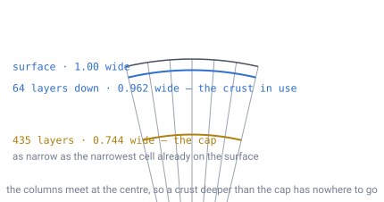
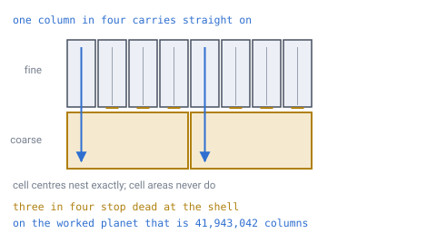
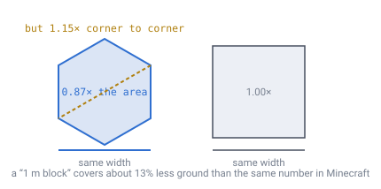

# 06 — World sizing

## What has to be decided

Three numbers: block size, planet radius, and subdivision level. They are locked
together — fix any two and the third is decided for you.

So the only real question is **which one you fix first**, and the usual instinct
gets it backwards.

## A warning before the numbers

**"Depth" means two unrelated things here**, and confusing them will cost you an
afternoon. Always qualify:

- **Subdivision depth** (`D`) — purely *horizontal*. How many times triangles are
  split, which sets how fine the hex grid is across the surface. Nothing to do
  with the core. `D` 13 versus 14 means smaller hexagons, not a deeper world.
- **Crust depth** — the *radial* one. How many layers run toward the core.

## The relationship

```
blockSize  ≈  K · radius / 2^level        where K = sqrt(8π / (10√3)) = 1.20459
cells      =  10 · 4^level + 2
```

`K` is not a magic number — it falls out in two lines. The sphere's surface is
`4πR²`, shared between `N` cells, so one cell covers `A = 4πR² / N`. A hexagon
whose centres sit `d` apart covers `(√3/2)d²`. Set those equal, solve for `d`:

```
d = sqrt(2A/√3)
```

and rearranging gives the constant above.

> **[verified]** `verification/calc.js` checks the closed form against exact
> cell-area maths at three radii: agreement to three decimals.

---

## Fix the block size, and let the radius move

**Block size is rigid.** It is the number the player actually feels — how tall a
door is, how thick a wall is, how many blocks a tree costs. Change it later and
every building, every recipe and the terrain generator all break at once. Decide
it first and freeze it.

**Radius is elastic**, and it has to be, because the level is a whole number.



*You ask for a planet and get a fractional level, which does not exist. Something
has to give. Round the level and the radius shifts by up to 40% — round the block
size instead and every door in the game changes width.*

So: **let the radius absorb the rounding, never the block size.** Snap the radius
to whatever the rounded level gives.

And the instinct that is usually backwards: **do not pick radius directly — pick
travel time.** That is the number players experience. Radius is just its unit
conversion.

## Worked example

```
1 m blocks, ~2 hours to circumnavigate on foot at 1.4 m/s
  → circumference 10.08 km  → target radius 1,604 m
  → level = log2(1.20459 × 1604 / 1) = 10.92  → round to 11
  → snapped radius = 1 × 2^11 / 1.20459 = 1,700 m
  → circumference 10.68 km, walk time 2.12 h
  → 41,943,042 surface cells
```

> **[verified]** `verification/calc.js` reproduces this example exactly.

This is the planet the rest of the specification uses whenever it needs a
concrete number.

## Scale reference

| Level | Cells | Block size on a 10 km planet |
|---|---|---|
| 10 | 10.5M | 11.8 m |
| 12 | 168M | 2.9 m |
| 13 | 671M | 1.5 m |
| 14 | 2.7B | 74 cm |

Level 13–14 lands at roughly the block scale of a cube world on a 10 km planet.

> **[verified]** `verification/scale.js` prints the full table, levels 0 to 20,
> for both an Earth-sized and a 10 km planet, alongside the bit budget and the
> storage figures below.

**Sanity check:** to match the playable area of a large flat cube world you
would need a planet radius around **17,000 km** — larger than Earth. A 10 km
planet is a *small* world.

**Tool:** [`demos/planet-size-calculator.html`](../demos/planet-size-calculator.html)
— block size and travel time in; level, snapped radius, cell count, total voxels
and rounding penalty out. Drag the time slider slowly to watch the level tick
over and the rounding penalty swing.

## The quadrupling

**Each level up doubles the radius but quadruples the cell count.** That is where
generation time and save-file growth live. Know which side of a level boundary
you are on before committing.

If the game has vehicles or flight, *that* speed decides world size, not walking
speed — the same trip duration at 15 m/s pushes you several levels up.

---

## Depth

The surface count is only half the story. Total voxels = `surface cells × layers`.

At the worked example above with a 64-block crust: 42M surface cells becomes
**2.7 billion voxels**. That multiplier sizes your storage and generation budget.

### Cells get narrower as you dig

Every column runs toward the planet's centre, and the columns are converging.
Same number of cells, less room to put them in — so a cell at depth `h` is
`(R − h) / R` as wide as it was at the surface.



*Dig far enough and the columns run into each other. The 64-layer crust the design
actually uses barely registers; the cap sits far below it, and the core is where
the width reaches zero.*

- 64 blocks into a 1,700 m planet → cells at the crust floor are **96%** of
  surface width. Imperceptible.
- If crust depth exceeds the radius, cells collapse to nothing before the bottom.

### How deep is too deep

The threshold has a measured anchor rather than a chosen one.

The trick is to stop asking "when does a cell look narrow?" and ask "when is it
narrower than cells the player has *already walked across*?" Because the surface
is **not uniform to begin with** ([doc 02](02-geometry-choice.md)): the narrowest
cell anywhere on it, next to a pentagon, is **0.744** of nominal spacing.

Taper down to that and you have produced nothing the surface does not already
have. That puts the budget at **25.6% of the radius** — and it confirms the old
85% guess was conservative, so nothing built on it was wrong.

In layers that is:

```
maxCrust = (1 − 0.744) · 2^D / K        layers
```

**The radius cancels.** Block size and radius scale together, so the crust cap
depends on subdivision depth alone — the same layer count on a 10 km planet as on
an Earth-sized one.

> **[verified]** `verification/taper.js`
>
> | `D` | Block @ R 1,700 m | Max crust | What binds first |
> |---|---|---|---|
> | 9 | 4 m | 109 layers | taper |
> | 10 | 2 m | 218 layers | taper |
> | 11 | 1 m | **435 layers** | taper |
> | 12 | 0.5 m | 870 layers | taper |
> | 13 | 0.25 m | 1,741 layers | the ID's 1,024-layer field |

The worked planet uses **64** layers against a cap of **435** — **6.8× of
headroom**. Capping is not a constraint on it; it is a ceiling nobody is near.

### Merging layers is declined, and now priced

There is an obvious alternative to capping: when cells get too narrow, drop the
horizontal resolution by one level and carry on down. **Merging layers.** It is
declined here on arithmetic.

**What it buys.** One merge doubles cell width, so the taper budget restarts:
reach goes from 25.6% of the radius to 62.8%. The ID gives the layer **10 bits**,
which addresses **1,024** layers ([doc 03](03-addressing.md)), against an unmerged
cap at `D` 11 of 435. So the first merge buys **589 addressable layers — 135%
more crust** — and every merge after it buys **nothing at all**, because the ID
cannot address the result.

**What it costs.** Here is the part that decides it.



*Cell centres nest exactly, so one fine column in four lines up with a coarse one
below and carries on. The other three stop against a cell they only partly
overlap. This happens to every column on the planet, at one depth, permanently.*

> **[verified]** `verification/taper.js` — cell *centres* nest exactly, since
> `oneShot(n/2, i, j)` equals `oneShot(n, 2i, 2j)`; cell *areas* do not, because a
> hexagon is not a union of four hexagons. So **one fine column in four continues
> through the shell and three in four terminate** against a cell they only partly
> overlap — and all **41,943,042** of the worked planet's columns cross it.

Compare [doc 14](14-meshing-and-lod.md)'s LOD seam, which costs 2.70 faces per rim
column and only at chunks bordering a different level. **This seam has no rim.**
It is the whole planet, at one depth, permanently.

And it breaks the invariant that the tessellation is identical at every layer,
which four separate results are built on:

| Result | Doc | Becomes |
|---|---|---|
| Vertical neighbour is `layer ± 1` | [03](03-addressing.md) | a full doc 04 lookup at the shell |
| Gravity and the three frames stay cheap | [13](13-gravity-and-orientation.md) | frames rebuilt across the shell |
| Vertical face merging is exact to 1.5e-16 | [14](14-meshing-and-lod.md) | stacked cells stop sharing a radial plane |
| Sky light stored per column, 32× smaller | [16](16-lighting.md) | columns stop running straight through |

**135% more crust against four broken results and an unrimmed planetary seam.
Cap the crust.** [Doc 11](11-open-topics.md) records this as closed rather than open.

The calculator reports the taper live.

---

## Bit and storage ceilings

Three separate ceilings on how deep you can go, and only one of them binds:

- **Bits** — the stored word is
  `[planet 12][face 5][path 2×D][corner 2][layer 10]`
  ([doc 03](03-addressing.md)), so `12 + 5 + 2D + 2 + 10 ≤ 64` and the ceiling is
  **`D` = 17**. That is **172 billion** cells a layer — a **1.6 cm** block on the
  worked planet above — so it is not the binding constraint. Two higher figures
  are reachable by counting fewer fields: **29 levels** from
  `(64 − 5) / 2`, counting the face and the path alone, and **24 levels**
  from `(64 − 5 − 10) / 2` once the layer joins them. Both are computed before
  anyone packed a real word, and neither paid for the planet field or the 2-bit
  corner that names a vertex.
- **Storage** — level 15 at one byte per cell is ~11 GB. This is what actually
  stops you.
- **Nothing, if you generate on demand.** A cell's terrain comes from a noise
  function of its position, so nothing exists until a player visits. Only
  modified cells are written. Under that model the level you pick costs nothing
  up front — it is a coordinate system, not an allocation.

That last point is the one that matters, and [doc 08](08-terrain-generation.md)
is where it is cashed in.

---

## Still open

Two things the numbers assume:


- **Cell area is not perfectly uniform.** Goldberg hexagons vary **1.99:1**
  across the sphere — **2.74:1** counting
  the twelve pentagons — so block size is genuinely an average
  ([doc 02](02-geometry-choice.md)). Real cells run from **0.744×** to **1.098×**
  the nominal spacing, which on the worked planet means 1 m blocks that are
  anywhere from 74 cm to 1.10 m wide. Cells near the twelve pentagons are the
  small ones.
- **Hexagons are not cubes**, so the same number buys less ground.



*Block size is measured flat-to-flat. A hexagon that wide covers **0.87×** the
footprint of a square block of the same size, and reaches **1.15×** as far corner
to corner. Everything is about 13% smaller than the same number would suggest in
a cube world — worth knowing before you promise players a "1 metre block".*

And two figures this page carried before they were measured:

- **The taper threshold was a guess** at roughly 85% of surface width, with no
  script behind it. Measured, a cell has gone too thin at **0.744×** nominal, so
  the budget is **25.6%** of the radius — more permissive than the guess, so
  nothing built on it was wrong (`taper.js`).
- **The layer field was described as holding 512 layers.** It is 10 bits, so it
  addresses **1,024**. That takes the first merge from 77 addressable layers to
  **589**, and moves `D` 12 from field-bound to taper-bound.

---

## In one breath

- Fix **block size** first and never move it; let the **radius** absorb the
  rounding, which can be up to 40%.
- Pick **travel time**, not radius — that is the number players actually feel.
- One level up **doubles the radius and quadruples the cells**.
- The worked planet is **1 m blocks, level 11, radius 1,700 m, 41,943,042
  cells** — used throughout the rest of the specification.
- Depth tapers cells by `(R − h)/R`. The budget is **25.6% of the radius** — the
  point where a cell gets narrower than the narrowest one already on the surface —
  which is `(1 − 0.744)·2^D/K` layers and **depends on `D` alone**, not on radius.
- **Cap the crust; do not merge layers.** Merging buys 135% more addressable
  crust and costs an unrimmed seam across every column on the planet.
- Storage is the real ceiling, and generating on demand removes even that.
