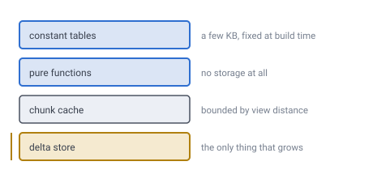

# 07 — Data structures

## Four layers, and only one of them grows

That sentence is the whole document. Everything a running world holds falls into
one of four places, and three of them have a ceiling you choose.



*Constant tables and pure functions never change size. The chunk cache is bounded
by view distance. Only the delta store grows, and it grows only with what players
actually changed.*

**Demo:** [`demos/data-structures.html`](../demos/data-structures.html) — three
tabbed diagrams: what lives where, inside a chunk, and the lookup path.

---

## 1. Constant tables — a few KB, never change

- 12 icosahedron vertices, 20 faces
- Face adjacency, 20 × 3 with edge rotations — 180 bytes ([doc 05](05-face-adjacency.md))
- The 12 pentagon cell IDs

Fixed at build time. **This is where all the spherical awkwardness lives, and the
only place it lives.** It does not grow with subdivision depth.

## 2. Pure functions — no storage

- `encode` / `decode`: ID ↔ face, path, q, r, layer
- `idToPosition(id)` → 3D position, by walking the path digits
- `neighbour(id, direction)` → ID

Face crossing and the pentagon cases are handled here, using the tables above,
so the rest of the codebase never learns the world is a sphere.

## 3. RAM — the chunk cache

```
HashMap<chunkId, Chunk>
LRU eviction list
per-chunk mesh + LOD handle
```

Bounded by view distance, so it has a ceiling you choose.

## 4. Disk — the delta store

```
sorted map: cellID → block state
side table:  cellID → a tagged blob, for chests and signs
```

**The only structure that grows.** It holds what players changed and nothing
else.

Two rules come from [doc 27](27-block-state.md), which defines the side table.
**Entities do not belong in it** — a mob has a position and moves
cell every 0.71 s, so keying one by cell is a rekey every 21 frames forever;
entities are held per chunk by containment. And **whether a cell has an entry is
the side table's question, not the block type's**: nothing on the frame path ever
asks it, so there is no marker anywhere and the rule is simply that writing a
block clears that cell's side data.

---

## Anatomy of a chunk

```
chunkId    the key — face + path bits, nothing else stored
palette    which block types appear in THIS chunk: [air, stone, dirt, grass]
blocks     packed indices into the palette, bit width = ceil(log2(paletteSize))
           index = rank(q, r) × layerCount + layer
```

**Chunks store no IDs.** Cells sit in canonical `q,r,layer` order, so an address
is implied by array position, the way any flat chunk array works.
Storing a 64-bit ID beside a one-byte block type would be 8× overhead for
something already known from where the byte sits.

**The order is column-major, and that is deliberate.** `layer` varies fastest, so
one cell's whole vertical column is a contiguous run of bytes. The alternative —
layer-major, all of layer 0 then all of layer 1 — makes a column a strided walk
across the entire array, and columns are what everything actually iterates:
the height field is evaluated once per column and reused down it
([doc 08](08-terrain-generation.md)), side faces are run-length merged down a
column ([doc 14](14-meshing-and-lod.md)), and seam ownership compares solidity
down a rim column. It also matches the ID layout, where
[doc 03](03-addressing.md) puts the layer bits at the bottom of the word for the
same reason. Array order and ID order agree, and both favour the column.

### `rank(q, r)`, which used to appear here and nowhere else

That one line above was, for the whole life of this specification, the only
mention of `rank` anywhere — and it was never defined.

It is not a plain triangular number either, because [doc 03](03-addressing.md)'s
border rule says **the lowest chunk ID wins**, so a chunk owns some of the cells
on its own edges and not others. Two questions were wearing one name: *how many
cells does a chunk hold*, and *which slot does a given `(q, r)` sit in*.

A chunk at chunk level `C` on a world of depth `D` is a triangle of side
`m = 2^(D−C)`, so it spans `(m+1)(m+2)/2` lattice points, of which `3m` sit on
its border.

> **[verified]** `verification/rank.js`, section 1.
>
> | `D` | `C` | `m` | Points | On the border | Interior |
> |---|---|---|---|---|---|
> | 11 | 4 | 128 | 8,385 | 384 = 4.6% | 8,001 |
> | 11 | 6 | 32 | **561** | 96 = **17.1%** | 465 |
> | 11 | 8 | 8 | 45 | 24 = 53.3% | 21 |
>
> The 561 is the same number [doc 14](14-meshing-and-lod.md) counts columns with.
> Note the last row: cut the chunk small enough and it is **more border than
> interior**, which is a reason to keep `C` well below `D` quite apart from file
> count.

**And the border rule really does partition the planet**, which nothing had ever
checked — the whole storage model rests on it.

> **[verified]** `verification/rank.js`, section 2. Every chunk on four different
> cuts (`D`/`C` of 4/1, 5/2, 6/2, 6/3), with each cell awarded to the lowest chunk
> ID holding it: the owned counts sum to **exactly `10·4^D + 2`** every time. Each
> cell has one home, no cell has none.

So a chunk's *owned* count is not one number. An edge is won or lost **whole**,
because every cell along it is shared with the same one neighbour:

```
owned = (m−1)(m−2)/2  +  e·(m−1)  +  c        e = edges won (0–3), c = corners won
```

> **[verified]** Section 3, at `m` = 16: the owned counts take exactly **8
> distinct values** — 105, 120, 135, 136, 150, 151, 152, 153 — and every one of
> them is that formula.

That leaves a real choice between two layouts.

**(A) Rank the whole triangle** and let the unowned border slots go unused:

```
rank(q, r) = q + r·(2m + 3 − r)/2            0 ≤ q + r ≤ m
```

**(B) Rank only the owned cells.** Dense, but the array length *and* the rank
function both depend on which of three edges and three corners this chunk won —
64 variants, and a per-chunk header to say which.

The waste under (A) needs no estimating, because section 2 forces it: every cell
is owned once, so the mean owned per chunk is just `N(D)` over the chunk count,
which is `m²/2`. Subtract that from the full triangle and

```
wasted slots = (3m + 2)/2        exactly
```

> **[verified]** Section 4. `rank(q, r)` above is a bijection onto
> `0 … (m+1)(m+2)/2 − 1` at every `m` tested, and the closed form matches the
> measured mean at every cut. On the worked planet — `D` 11, `C` 6, `m` 32 — that
> is **49 of 561 slots, 8.7%**: a chunk is 8,976 bytes at two bits and 64 layers,
> of which **784 are never used**.

**Take (A).** Not for the byte count — for the sentence at the top of this
section. `index = rank(q, r) × layerCount + layer` has no per-chunk case in it,
and (A) keeps that true for every chunk on the planet while (B) turns it into 64
sentences and puts a header in front of an array designed to have none. And
doc 03's rule is about **authority, not slots**: a border cell still has exactly
one home, so the unowned slot is never written and never read. Leave it as the
hole it is.

---

**The palette trick matters.** Most chunks contain three or four block types, so
two bits per cell beats sixteen:

| Encoding | 561 cells × 64 layers |
|---|---|
| 2-bit palette index | **8,976 bytes** |
| naive 16-bit type field | 71,808 bytes |

Widen the packing only when a chunk earns it.

*(A round 4,096 cells and 64 KB is the figure to avoid here: it is a power of
two, and a triangular chunk can never hold a power of
two.)*

---

## The lookup path

```
player position
   ↓
cellID                         (see doc 04)
   ↓
chunkID = cellID >> localBits  one shift
   ↓
chunk cache lookup
   ↓                     ↘
HIT                       MISS
use it, zero I/O          generate from seed,
                          then apply deltas for this ID range
                              ↓
                          chunk in RAM → mesh → render
```

**The whole point of the addressing scheme is the third step.** Finding the chunk
is one shift; loading its edits is one range query, because every cell inside it
shares the same prefix. No spatial index, no quadtree walk, no lookup table.

That is the payoff for the bit layout in [doc 03](03-addressing.md), collected
here.

---

## What is actually on disk

For a brand-new planet:

```
seed                            8 bytes
blockSize, subdivisionDepth,
chunkLevel, radius             ~16 bytes
delta log                       empty
```

Under a hundred bytes. A whole planet, before anyone has touched it.

---

## Multiplayer note

"Which players care about this chunk update" is an ID range comparison. Interest
management is the addressing scheme doing a second job.

---

## Still open

- **Entities were listed in this document's side table** and do not belong
  there. A mob changes cell every **0.71 s**, so keying one by cell is a rekey
  every 21 frames forever ([doc 27](27-block-state.md)).
- **The chunk table used a round 4,096 cells and 64 KB**, a placeholder from
  before anything had counted a chunk. The figure at `D` 11 / `C` 6 is **561**
  slots (`rank.js`).

---

## In one breath

- Four layers: **constant tables, pure functions, chunk cache, delta store**.
  Only the last one grows.
- All the sphere's irregularity lives in a few hundred bytes of constant table.
- A chunk stores **no IDs** — position in the array is the address, and that
  address is `rank(q, r) = q + r·(2m + 3 − r)/2` over the **whole** triangle of
  side `m = 2^(D−C)`: **561 slots** at `D` 11 / `C` 6, the same for every chunk.
- **Lowest chunk ID wins is an exact partition** — the owned counts sum to
  `10·4^D + 2` on every cut tested. A chunk owns `(m−1)(m−2)/2 + e(m−1) + c`, so
  the count varies; the **stride does not**, and that is worth `(3m+2)/2` wasted
  slots — **49 of 561, 784 bytes a chunk**.
- Finding a chunk is **one shift**; loading its edits is **one range query**.
- A fresh planet is **under a hundred bytes** on disk.
