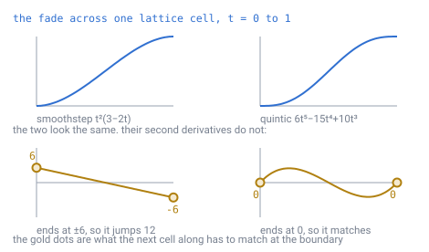
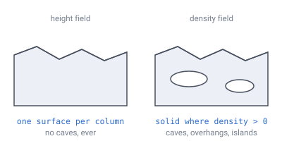

# 08 — Terrain generation

## Where it fits

Everything before this document is addressing — ways of naming a cell. This is
the only step that **invents content**, and it happens in exactly one place: the
cache miss.

```
chunkID
  → for each cell: ID → 3D position
  → density(seed, position)        → solid or not
  → material(seed, position, ...)  → stone / dirt / grass / water
  → apply deltas from disk         ← overrides all of the above
```

**Delta application is last and it wins.** That ordering is the whole persistence
model: the generator produces a pristine world, and the delta store records every
divergence from it.

---

## The one rule that matters on a sphere

**Sample noise in 3D world space, never in `(i, j)`.**

And one requirement on how the noise itself is written, which
[doc 23](23-determinism.md) makes load-bearing: **hash with integers, never with
`sin`.** Some implementations use a trigonometric function as a cheap hash. That
one choice makes terrain differ between machines, because no standard pins down
what `sin` returns.

This is where most spherical worlds go wrong. Feeding face-local coordinates into
2D noise produces visible discontinuities at all 30 face edges, because
neighbouring faces have unrelated coordinate frames — the same problem the
adjacency table in [doc 05](05-face-adjacency.md) exists to paper over.

3D noise takes a position vector, and a cell's position is a position regardless
of which face's bookkeeping found it. **Terrain generated from 3D noise has no
idea faces or pentagons exist.** All of that structure vanishes from the
generator entirely.

That is not a small convenience. It is also what makes level-of-detail possible
at all in [doc 14](14-meshing-and-lod.md), because a function of position can be
asked at any spacing, by any grid.

**Demo:** [`demos/planet-3d-noise.html`](../demos/planet-3d-noise.html) — spin it
and hunt for the twelve pentagons or the twenty face seams in the terrain. They
are geometrically present (raise resolution to 10K and the pentagons are findable
by shape) but no mountain range, coastline, or biome boundary lines up with them.

---

## Which noise function, exactly

The rule above says what not to do. It does not say what to *do*, and for the
whole life of this specification neither did anything else — which
[doc 11](11-open-topics.md) records as the third of the four things blocking the
first line of code. **Two implementations of "fBm" are two different planets**,
and the difference is not subtle: it is every coastline.

That was not hypothetical. This repository already contained **two** value hashes
that call themselves the same thing.

> **[verified]** `verification/noise.js`, section 1. `rivers.js`, `water.js` and
> `determinism.js` use a `Math.imul` step — a true 32-bit multiply. `volume.js`,
> `mesh.js` and `seam.js` use a plain float multiply. Over 8,000 lattice points
> the two **disagree on 98.2%** of them.

### Why the float one loses, and it is not the reason you would guess

The obvious guess is that a float multiply is fine while the coordinates stay
small and only breaks once `x · 374761393` runs past `2^53`. That is not what
happens. The **second** multiply takes a value already up to `2^32` and multiplies
it by `1.27e9` — a product of `2^62`, nine bits past what `float64` carries — and
then truncates it back to 32 bits.

> **[verified]** `verification/noise.js`, section 2. That second multiply loses
> bits on **99.1%** of inputs, at every coordinate. Truncating an out-of-range
> `double` is a defined operation in JavaScript and **undefined behaviour in C and
> C++**, so those low nine bits are whatever one language happens to round to.

The natural next thought is that a hash throwing away nine bits must mix badly,
and that this will show as a grid in the terrain. **Measured, it does not.**

> **[verified]** Section 3. Flip one input bit and count the output bits that
> move: both hashes sit within **0.0014** of the ideal 0.5, and the float one is
> marginally the closer of the two. Rounding a `2^62` product still scrambles bits
> perfectly well.

So the case against it is **portability alone** — it has no definition outside one
language. That is the whole argument, and it is not a quality argument.

### The pinned function

Normative. Every operation is either 32-bit wrapping integer arithmetic — exactly
specified in every language that has `uint32` — or `float64` `+ − × ÷`, which
IEEE 754 pins to the bit ([doc 23](23-determinism.md)). No transcendentals, no
float multiply past `2^53`, no reliance on any language's coercion rules.

```
hash3(x, y, z) -> [0, 1)          all steps uint32
    h = x·374761393 + y·668265263 + z·1274126177
    h = h XOR (h >> 13)
    h = h · 1274126177
    h = h XOR (h >> 16)
    return h / 2^32

fade(t)   = 6t⁵ − 15t⁴ + 10t³
value3(p) = trilinear blend of hash3 at the 8 surrounding lattice corners,
            weighted by fade on each axis, mapped to [−1, 1]

fbm(p, frequency, octaves)
    lacunarity 2, gain 0.5, LOW OCTAVE FIRST,
    divided by the summed amplitude
```

**Frequency and octave count are per-field tuning** and belong in the world file
beside the seed, because changing either changes the planet.

### Write the frequency as a size in metres

`frequency` counts features across the **whole sphere**, because the noise is
sampled from a unit direction. One feature is therefore `radius / frequency`
metres, and the same number grows a different hill on every planet.

That is not a unit inconvenience. Split the ground a standing player can see
into two parts — how far it **tilts** across the view, and how far it departs
from that tilt — and only the second reads as a landform. The first reads as
standing on a slope.

> **[verified]** `verification/noise.js`, section 8. One field, 200 m of
> amplitude, frequency 6, eye height 1.7 m. Only the planet grows:
>
> | Radius | Horizon | One feature | Features in view | Tilt | Landform |
> |---|---|---|---|---|---|
> | 1,700 m | 76 m | 283 m | 0.27 | 59.4 m | 39.8 m |
> | 3,400 m | 107 m | 567 m | 0.19 | 52.8 m | 25.7 m |
> | 6,800 m | 152 m | 1,133 m | 0.13 | 43.2 m | 15.0 m |
> | 13,600 m | 215 m | 2,267 m | 0.09 | 33.2 m | 8.2 m |

The horizon is `R·acos(R/(R+h))`, which goes as the **square root** of the
radius, while a feature goes as the radius. So every doubling of the planet puts
about **30% less landform** in view, on the same field with the same amplitude.

Amplitude cannot undo it. It multiplies the whole field, so tilt and landform
rise together and the ratio between them does not move. Hold the planet still
and ask for a feature size instead, and the ratio is the only thing that moves:

> **[verified]** `verification/noise.js`, section 8. R = 6,800 m:
>
> | Feature | Frequency | Tilt | Landform | Landform ÷ tilt |
> |---|---|---|---|---|
> | 1,133 m | 6.0 | 43.3 m | 15.0 m | 0.35 |
> | 567 m | 12.0 | 71.3 m | 39.9 m | 0.56 |
> | 283 m | 24.0 | 90.5 m | 84.1 m | 0.93 |
> | 142 m | 47.9 | 89.1 m | 129.1 m | 1.45 |

At a feature of 283 m — about twice the horizon — tilt and landform are equal.
Below that the ground reads as hills; above it, as a hillside.

So a world file carries **metres**, and `frequency = radius / metres` is applied
on the way in. [Doc 21](21-rivers-and-erosion.md) states the same rule for the
coarse map's resolution, for the same reason: a level and a frequency are both
properties of the grid, and what a person sees is a distance.

### Why the quintic fade rather than smoothstep

`t²(3 − 2t)` is the cheaper and more familiar curve, and it is smooth in the
first derivative — which is enough for the surface to have no visible kink. It is
*not* smooth in the second, and shading reads the second.



*The two curves are indistinguishable by eye. Their second derivatives are not:
smoothstep arrives at a lattice plane with a curvature of ±6 and the next cell
starts at the opposite sign, so curvature **jumps by 12** at every integer plane.
The quintic reaches zero at both ends, so it matches whatever is next door.*

> **[verified]** `verification/noise.js`, section 5. Worst jump in curvature
> across a lattice plane, over 40 planes: **7.05** for smoothstep against
> **0.08** for the quintic — two orders of magnitude, for two extra multiplies per
> axis, paid once per sample rather than once per octave.

A lit surface displays a curvature discontinuity as a faint regular grid. That is
exactly the artefact [doc 08](08-terrain-generation.md) exists to avoid, arriving
by a different route than the face seams.

### Two things that have to be written down or they will differ

**Accumulation order.** Float addition is not associative, so summing the same
octaves the other way round need not give the same number.

> **[verified]** Section 6. At 4 and 5 octaves the two orders differ by
> `1.4e-17`; at 6 and 8 they happen to agree exactly. **That is the trap** — an
> order dependence that shows up only sometimes is one nobody finds by testing.
> [Doc 23](23-determinism.md) is not about tolerances but about whether a
> difference is introduced at all, so pin it: **low octave first**.

**What the amplitude means.** Dividing by the summed amplitude keeps the output in
`[−1, 1]` whatever the octave count — but fBm does not *fill* that range.

> **[verified]** Section 4. Over 200,000 directions the standard deviation is
> **0.244** of the amplitude. So "60 m of relief" means a typical swing of about
> 15 m, with the full 60 m only where several octaves happen to align. Worth
> knowing before anyone tunes a mountain by eye.

### Every script measures the same planet

`volume.js`, `mesh.js` and `seam.js` run the hash and the fade pinned here, so
their figures describe the world the generator actually produces.

> **[verified]** Section 7. The float-multiply variant differs from the pinned
> hash by a mean of **1.28 m** and a worst of **5.85 m** over 50,000 directions
> at 60 m of relief. That is a different world, not a rounding difference, which
> is why a script measuring terrain has to run the pinned one.

Which hash a script runs decides the size of its counts and not the shape of
its argument. Every conclusion in [doc 14](14-meshing-and-lod.md) rests on a
ratio over hundreds of thousands of cells — face counts, span counts, seam holes
— and none of them turns on which world it measured. The counts themselves do
move, by a tenth or so, which is why they are quoted from a script that runs the
pinned function rather than from one that runs anything else.

---

## Two levels of ambition



*The height field asks one question per column and gets one answer. The density
field asks at every cell, and lets noise fight the radial bias — which is what
opens a void.*

### Height field

```
surfaceRadius = R * (1 + amplitude * fbm(direction * frequency))
solid         = |position| < surfaceRadius
```

One noise evaluation per column, shared by every layer beneath it. Cheap. **No
caves or overhangs, ever.**

### Density field

```
density(p) = (surfaceRadius - |p|) + noise3D(p) * strength
solid      = density > 0
```

The first term is a bias pulling toward a sphere; the noise carves into it. Caves,
overhangs, and floating islands all fall out.

Costs a 3D sample per cell, so run it only in a band near the surface and let
everything deeper be solid by default.

**Watch the balance:** as `strength` rises, the noise begins to overpower the
radial bias. Low values give pockets and tunnels; higher values give overhangs,
then detached floating chunks, then swiss cheese.

And watch it in the right units. The bias grows by 1 per metre of depth, so
**enclosed voids only appear when the noise gradient beats that** — amplitude
divided by feature size must exceed 1. Raising `strength` alone, without raising
frequency, buys a rougher surface and a much larger triangle bill while carving
nothing at all. [Doc 14](14-meshing-and-lod.md) measures both.

**Demo:** [`demos/planet-slice-noise.html`](../demos/planet-slice-noise.html) — a
cross-section through a planet with live sliders. The *Cave carving* slider is
literally the `strength` term; watching it lose the fight against the bias term
is the clearest way to feel what a density field is.

---

## Choosing the material

A second pass over cells already known to be solid, keyed on depth below the
surface:

```
depth 0                        → grass, sand, or snow
depth 1–4                      → dirt
deeper                         → stone
not solid, and |p| < seaRadius → water
otherwise                      → air
```

Surface material comes from two more low-frequency 3D fields — temperature and
humidity — sampled on the direction vector.

**Sea level is a radius, not a height.** And "up" is `normalize(position)`. Both
of these ripple far beyond terrain — see [doc 13](13-gravity-and-orientation.md).
The first also makes the sea the only exactly flat surface on the planet, which
[doc 25](25-water.md) cashes in.

Water written here is an ordinary block: translucent, no collision, and never
simulated afterwards ([doc 24](24-edits-and-global-processes.md)).

---

## On "destroyed"

This is where the delta store earns its existence. You must distinguish
**never touched** from **touched and now air**, or a mined-out cave regenerates on
reload.

An explicit delta entry saying "air" is meaningful and different from having no
entry. The same applies to placing a block in mid-air. The generator produces the
pristine world; the delta store records every divergence, in both directions.

---

## Performance

Noise dominates chunk generation. This is the part you will optimise, not the
addressing.

- Compute the surface radius **once per column** and reuse it down the whole
  column.
- Restrict 3D density sampling to the band where it can actually change the
  answer.
- Generate per chunk in a batch so it can be vectorised.

> **[verified]** `verification/volume.js` measures what those first two are
> worth. On one chunk at depth 11, chunk level 6, with a 64-layer crust: the
> density field costs **51×** the height field over the full crust, and **26×**
> when restricted to a band around the surface. [Doc 14](14-meshing-and-lod.md)
> takes this further — distant chunks can skip the density term altogether,
> because a coarse mesh cannot represent a cave in the first place.

---

## Do you need heightmaps?

The term means two different things, and the answer differs for each.

**As stored authoring data: no.** You do not need a painted texture. The
`surfaceRadius(direction)` function *is* the heightmap, evaluated lazily. That is
the whole point of the seed-based approach, and the reason a fresh planet is
under a hundred bytes ([doc 07](07-data-structures.md)).

**As a cached intermediate: yes, and you already have it.** Compute the surface
radius once per column and reuse it for layers, meshing, water, spawn placement,
and pathfinding costs. A pure optimisation on something derived, not new data.

### Where noise genuinely runs out

Three things fBm cannot produce, because all three are **global** processes and
therefore collide head-on with local on-demand generation:

- **Rivers.** Connected networks that flow consistently downhill to the sea.
  There is no local rule that gets you this.
- **Erosion.** Real mountains have V-shaped valleys carved by water. Raw fBm
  gives fractal lumps that look subtly wrong to everyone, even people who cannot
  articulate why.
- **Coherent continents.** Noise gives blobs. Plates, shelves, and mountain
  ranges running along collision boundaries need structure noise does not have.

### The two-tier fix

Generate a **coarse global heightmap once at world creation** — at, say, level 8 —
and store it. Run erosion, river tracing, and plate assignment on that offline,
when the whole planet is visible at once. Per-chunk noise then adds local detail
on top, interpolating between coarse samples.

| Coarse level | Cells | At 4 bytes |
|---|---|---|
| 7 | 164K | 640 KB |
| 8 | 655K | 2.6 MB |
| 9 | 2.6M | 10 MB |

Two megabytes buys rivers and erosion.

**And the lookup is a mask.** Truncating an ID's *path digits* gives the
containing triangle — a chunk — not a
coarse cell. What lines up is the lattice: a level-8 lattice point `(i, j)` and the
level-11 point `(8i, 8j)` are the **same point**, so a coarse sample is literally
one of the fine cells. Mask the low bits off `(i, j)` to find the three that
surround a cell, and the bits you masked off are the blend weights between them.
No second spatial structure and no interpolation scheme to invent.
See [doc 21](21-rivers-and-erosion.md).

This is the **only** stored terrain the design contemplates, and it is an *input*
to the height-field term rather than a mesh.

**Recommendation:** start with pure noise, ship something, and add the coarse tier
when the terrain starts looking like fractal lumps instead of a world.
[Doc 21](21-rivers-and-erosion.md) designs that tier, and finds that the three
problems above are **ordered rather than independent** — continents decide how long
rivers can be, so that is the one to build first.

---

## In one breath

- Terrain is invented at exactly one moment: the **cache miss**. Deltas are
  applied last and win.
- **Sample in 3D world space**, never in face coordinates — otherwise all 30 face
  seams show, and level-of-detail becomes impossible.
- **The noise function is pinned**, because doc 23 makes it bit-load-bearing:
  a `uint32` hash (three wrapping multiplies, two xor-shifts), trilinear value
  noise with the **quintic** fade, fBm at lacunarity 2 and gain 0.5, **low octave
  first**. The float-multiply hash this repository also contains is rejected for
  **portability alone** — it mixes just as well and has no meaning outside
  JavaScript.
- Smoothstep would leave a **curvature jump of 12** at every lattice plane, which
  shading shows as a grid; the quintic ends at **0** and costs two multiplies.
- **Height field** = one evaluation per column, no caves. **Density field** = one
  per cell, caves and overhangs, and **51×** the cost.
- Enclosed voids need the noise gradient to beat the bias; more `strength` alone
  gives roughness, not caves.
- **There is no stored heightmap** — the function is the heightmap. The one
  exception is a coarse level-8 map for rivers and erosion, at 2.6 MB.
