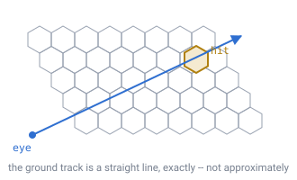

# 09 — Ray traversal

## The question

The player looks somewhere and clicks. **Which cell do they want to mutate?**

## It is a grid walk, not a physics query

No colliders, no broadphase, no physics engine involvement. The standard
technique is **voxel DDA** (Amanatides & Woo): step cell to cell along the ray,
checking occupancy as you go.

With a 5-block reach you touch about 5 cells. A physics raycast, by contrast,
needs collision meshes generated for every chunk — for a world where nothing is
meshed until it is seen, that is an enormous amount of work to answer a question
about five cells.

**Walk cost depends on reach, not on world size.** This is the whole argument.

---

## The property that makes it elegant here

You would expect that walking a straight line across a *sphere* means following a
curve, and re-projecting at every step. It does not, and the reason is worth
following.

Finding the face uses central projection from the planet's centre onto the flat
face plane — that is the **gnomonic projection**, and gnomonic projection maps
great circles to straight lines. Meanwhile, a straight 3D ray plus the origin
defines a plane, so the ray's radial shadow on the sphere is always a great
circle.

Put those together: **the ray's ground track is a perfectly straight line in face
barycentric coordinates.** Not approximately — exactly. No curve following, no
re-projection per step.

*The same straight-line walk a flat voxel game does, on a sphere, with no
correction term anywhere.*

---

## Four families of boundaries

- **3 horizontal.** Hexagon edges run perpendicular to the three barycentric
  axes, so each axis gives a family of parallel lines — structurally identical to
  a cube DDA. In cube coordinates the hexagon of an integer triple is exactly the
  intersection of `|x − x₀| ≤ ½`, `|y − y₀| ≤ ½`, `|z − z₀| ≤ ½`, so boundaries
  sit at half-integer values of each coordinate.
- **1 radial.** Layer boundaries are concentric spheres.
  `|P + t·d|² = r²` is a cheap quadratic, and you only ever need the next one.

Compute the parameter `t` at which each family is next crossed, step whichever is
smallest, repeat. Same loop shape as the classic algorithm.

---

## Two cases to handle

**Face crossings.** When a barycentric coordinate goes negative you have walked
off the face. Apply the adjacency table ([doc 05](05-face-adjacency.md)),
re-express the direction in the neighbour's frame, and continue. The line stays
straight, because it is still the same great circle — no restart, no
special-casing the geometry.

**Pentagons.** A cell with five edges instead of six. Rare, but the loop cannot
assume six.

---

## Free bonus

The DDA tells you **which boundary you crossed to enter the hit cell** — which is
precisely the face-you-are-looking-at needed for block *placement*. The new block
goes on that side. No extra work.

---

## Demo

[`demos/ray-traversal.html`](../demos/ray-traversal.html) — drag the eye or the
aim point across a hex field. Numbered cells show the walk in order; it stops the
instant it touches something solid.

- Compare *cells walked* against *cells in field* — single digits against 91, and
  the ratio only improves as the world grows.
- The white bar on the hit cell is the entry edge, ready for placement.
- Aim out through the triangle's edge: the walk reports a negative barycentric
  coordinate, which is where the adjacency table takes over.

The demo solves each boundary crossing analytically rather than sampling, which
is what makes it exact.

---

## Reuse

The same traversal is the line-of-sight test that any-angle pathfinding needs —
see [doc 10](10-pathfinding.md). Build it once.

---

## In one breath

- Block picking is a **grid walk**, not a physics query, and it costs about five
  cells whatever the planet's size.
- Gnomonic projection maps great circles to straight lines, so **the ground track
  is exactly straight** in face coordinates.
- Four boundary families: three horizontal, one radial. Step the nearest.
- Walking off a face is the adjacency table's job; the line does not bend.
- The entry boundary is the **placement face**, for free.
