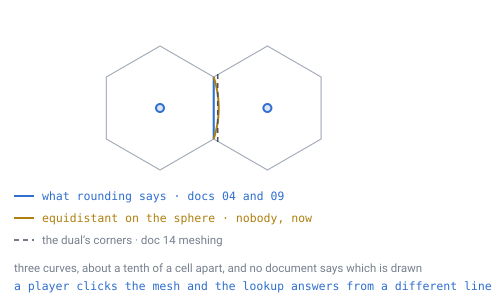

# 11 — Open topics

## What this is

The honest list of what is **not yet designed**. Each item needs its own document
before implementation, and they are ordered roughly by how much they force
changes elsewhere.

Twelve entries are struck through because they have since been closed. They are
kept rather than deleted, because what they turned out to be worth is the most
useful thing on this page.

**The page then refilled, and the new entries are a different kind of thing.**
The twelve in Part 3 were *design* questions — how should the world work. The four
in Part 1 are **specification** questions: things the design already relies on,
names that appear in eight documents, and which nobody ever wrote down. They were
found by [doc 26](26-implementation-readiness.md) asking what a programmer would
have to invent before the first line of code, and none of them was on any *Still
open* list, because a gap nobody noticed is a gap nobody files.

**All of them are closed** — `neighbour(id, k)`, `rank(q, r)` and the noise
function were built and measured; a fifth arrived when a scope change reopened
**the ID word**, and that closed too; and **the language** went last and the same
way, by writing the kernel in six of them and comparing the bits
([doc 28](28-language-and-runtime.md)). **Part 1 is empty.**

---

## The V1 line, and what it defers

This page has always tracked what was **undesigned**. It now has to track a second
thing, because the first scope decisions have been made: what is designed,
understood and **deliberately not being built yet**.

Those are different states and they were being written down the same way. An item
that is *open* needs thinking. An item that is *deferred* needs nothing — it has an
answer, a price, and a decision not to spend it yet.

### Decided for V1

| | Decided in |
|---|---|
| **TypeScript**, one source tree | [28](28-language-and-runtime.md) |
| **The browser is the primary client**, rendering with WebGPU | [28](28-language-and-runtime.md), [31](31-deployment.md) |
| **Local**: filesystem storage, the server in-process or on the same machine | [31](31-deployment.md) |
| **The server is a point of storage only** — it stores, it routes, it validates nothing | [30](30-authority-and-cheating.md) |
| **Inventory stays on the client** and is never synced | [30](30-authority-and-cheating.md) |
| An edit message names **a cell and a resulting block state** | [30](30-authority-and-cheating.md) |
| The **rejection message ships in V1, unused** | [30](30-authority-and-cheating.md) |

### Deferred to V2 — priced, not open

Each of these has a document, a number and a decision to wait. **None of them
needs more design before it can be started**, which is exactly what makes them
different from anything under *Still open*.

| | Priced at | In |
|---|---|---|
| **Edit validation** — the point query on virgin ground | `0.06%` of a core at 1,000 players | [30](30-authority-and-cheating.md) |
| **Server-side simulation**: mobs, a tick loop, resident chunks | **158×** what player validation costs | [30](30-authority-and-cheating.md) |
| **Entity interest** — [doc 22](22-multiplayer-interest.md)'s own open item | load-bearing only once mobs are server-side | [30](30-authority-and-cheating.md) |
| **Hosting**: API Gateway, Lambda, DynamoDB, S3 | the cost is fan-out, not storage | [31](31-deployment.md) |
| **A native desktop client** — the same TypeScript in Tauri or Electron | no second renderer; WebGPU already abstracts Vulkan/Metal/D3D12 | [31](31-deployment.md) |
| **Moving a hot path to C or Rust for wasm** | 1.5–1.75× available; and a build trap if also compiled natively | [28](28-language-and-runtime.md) |

### Discussed, and in no document at all

Four things had been talked about and **never written down**. **Three now have a
document** — [doc 32](32-sky-clouds-and-moon.md) covers the **skybox**, the
**clouds** and the **moon**, and none of them turned out to be pure decoration:
the skybox has to be world-fixed because walking turns your `up` through 360°, a
wind field cannot be uniform because of the same theorem as invariant 8, and the
moon's angular size is an art decision while its distance is not.

One is left, and it is the big one:

- **Space travel to another planet.** [Doc 03](03-addressing.md)'s **12-bit planet
  field** — 4,096 worlds — was added for it and is still the only part that
  exists. Doc 32 deliberately stops at the sky: its moon is a painted disc and its
  sun is a *direction*, not a place.

The planet field is the pattern worth noticing: a cheap decision taken early
because it would have been expensive later.

### What this does to the rest of this page

Nothing below moves. **Part 1 is still empty and the design still blocks no code.**
What changes is how to read a *Still open* bullet elsewhere in `docs/`: check this
table first, because several of them are now answered by *"V2"* rather than by
thinking harder.

---

## Part 1 — the four that block the first line of code

Four items. Close these and the kernel can be written; everything else in this
specification is either already closed or waiting for code to exist. **Three are
now closed**, and all three closed the way everything in Part 3 closed — by being
built and measured rather than argued about.

**A fifth entry then arrived**, which is the honest way to record it: wanting more
than one planet forced the ID word to be laid out concretely for the first time,
and it did not survive the packing. The list is not a burn-down chart.

---

## ~~`neighbour(id, k)`~~ — built, see [doc 05](05-face-adjacency.md)

Closed by `verification/neighbour.js`, which builds the function from doc 05's
table and integer arithmetic alone and checks it against the geometric graph
every other script here constructs: **every cell at depths 3, 4 and 5, the same
neighbours and the same direction round the ring, with exactly 12 cells at
degree 5.**

The three decisions it was hiding all came out smaller than the entry feared, and
one of them made the table *smaller*:

- **Index 0** is the step from the face's own vertex `A` toward `B`. It is a
  property of the cell's face, so it never depends on how the cell was reached —
  which is what [doc 19](19-directional-blocks.md)'s three stored bits needed.
- **Crossing an edge is a reflection in three additions.** A lattice point is
  integer weights on *global vertex numbers*, a description that never mentions a
  face; step outside and exactly one weight goes negative, and
  `(α, β, γ) → (α+γ, β+γ, −γ)` re-expresses it. The point does not move — only its
  name changes. **60/60 face edges round-trip, 900/900 steps.** And the table's
  `reversed` field is **never read**: carrying weights on global vertices makes
  the edge orientation carry itself.
- **A pentagon's ring is five long.** `k = 5` is not a direction that exists — the
  honest return is a short ring, never a duplicate and never a null in the middle
  of one. That is [doc 13](13-gravity-and-orientation.md)'s missing 60° arriving
  as a missing array entry.

And the half turn arrives from the other side: over 186,066 steps, a `(q, r)`-derived
index differs from the true one by **+0 or +3 and nothing else**, `+0` in every
unflipped chunk and `+3` in every flipped one, with no crossover. `winding.js`
found that off the mesh; this finds it inside the function.

The entry below is kept as written, because what it was worth is the useful part.

---

**The original entry.** It is the function that hides the sphere from the rest of
the engine, and it did not exist anywhere in this repository — not as a
definition, not as pseudocode, not as a script.

Count the callers. [Doc 03](03-addressing.md) fixes how its ring must be ordered.
[Doc 05](05-face-adjacency.md) says "only `neighbour(id, direction)` ever consults
[the adjacency table]". [Doc 07](07-data-structures.md) lists it as one of four
pure functions. [Doc 10](10-pathfinding.md) says "seams live inside `neighbour()`
— the pathfinder never learns the world is a sphere".
[Doc 13](13-gravity-and-orientation.md) says it "already returns exactly this".
[Doc 16](16-lighting.md) adds two radial cases to it.
[Doc 19](19-directional-blocks.md) stores its output on disk.
[Doc 21](21-rivers-and-erosion.md) routes water through it. Eight documents, and
every one of them delegates.

*Every arrow is a document that delegates its hardest case to this function. The
hexagon is drawn empty because that is the accurate picture — the specification
has a shape where its most-depended-on function should be, and the shape is what
the callers assume rather than anything anyone wrote.*

**And no verification script has ever called one.** That is the part that hid it.
`rivers.js`, `water.js`, `light.js`, `pentagon.js` and the rest all need a cell's
neighbours, and every one of them gets them the same way: build all 20 faces,
compute each lattice point's position, round the coordinates, and key a hash map
on that rounded triple. Two faces that produce the same point collide in the map,
so the shared edge closes itself and adjacency falls out of the resulting graph.

That is a fine way to *measure* a sphere and it is why those scripts are
trustworthy. It is not available to an engine, which holds one integer and needs
six neighbours without a planet in memory and without a hash map keyed on floats.
So [doc 05](05-face-adjacency.md)'s 180-byte table is in the strange position of
being **proved complete and never once used to cross an edge**.

**Three decisions are hiding inside it**, and each is load-bearing somewhere else:

- **Where direction index 0 is anchored.** [Invariant 9](../CLAUDE.md) says order
  the ring counter-clockwise as seen from outside, never from the sign of
  `(q, r)`. That fixes the *order* and says nothing about the *start*.
  `pentagon.js` uses whichever neighbour the graph happened to list first, which
  is fine for counting a ring and useless as a stored value — and
  [doc 19](19-directional-blocks.md) puts **3 bits of rotation on disk** that must
  mean the same thing in every chunk of every world, forever.
- **How `(i, j)` re-expresses across a face edge.** Doc 05's table gives the
  destination face, the arrival edge, and that the shared edge runs the other way.
  It does not give the map from your `(i, j)` to theirs — which that document
  itself calls "the entire job".
- **What a pentagon returns for `k = 5`.** [Doc 17](17-pentagons.md) protects the
  twelve columns from *placement*, and [doc 19](19-directional-blocks.md) spends
  that to let machinery assume degree 6. Neither helps the three systems that
  still walk *through* a pentagon: the pathfinder, the light flood fill, and flow
  routing.

**How to close it:** the way everything on this page closed. A neighbour script
that builds `neighbour(id, k)` from the table and integer arithmetic **alone**,
then checks it cell by cell against the geometric graph the other scripts already
construct. Three things it should report: that all **60** face edges round-trip,
that flipped chunks come out **+3** and not reversed
([`winding.js`](../verification/winding.js) says +3), and that exactly **12** cells
come back degree 5.

---

## ~~`rank(q, r)`~~ — defined, see [doc 07](07-data-structures.md)

Closed by `verification/rank.js`, and it turned up a result nobody had asked for:
**doc 03's border rule had never been checked, and it holds.** Awarding every cell
to the lowest chunk ID that contains it sums to exactly `10·4^D + 2` on four
different `D`/`C` cuts — one home per cell, no cell without one. The whole storage
model rests on that and nothing had tested it.

`rank(q, r) = q + r·(2m + 3 − r)/2` over the **whole** triangle of side
`m = 2^(D−C)` — verified a bijection onto `0 … (m+1)(m+2)/2 − 1`. A chunk is
**561 slots** at `D` 11 / `C` 6, the same for every chunk on the planet, and it
*owns* `(m−1)(m−2)/2 + e(m−1) + c` of them for `e` edges and `c` corners won. An
edge is won or lost whole, because every cell along it is shared with the same one
neighbour.

The choice was between that and a dense rank over owned cells only. The dense one
loses: the waste under the simple rank is exactly `(3m+2)/2` slots — **49 of 561,
8.7%, 784 bytes a chunk** — and buying it back costs the uniform stride that made
`index = rank(q,r) × layerCount + layer` a single sentence with no per-chunk case
in it.

The entry below is kept as written.

---

**The original entry.** [Doc 07](07-data-structures.md) gives a chunk's storage
layout as
`index = rank(q, r) × layerCount + layer`. That is the only time `rank` appears in
the specification, and it is never defined.

It is not a plain triangular number, either. [Doc 03](03-addressing.md)'s border
rule — **the lowest chunk ID wins** — means a chunk owns some of the cells on its
own edges and not others, so both the cell **count** and the **index** depend on
which of the three edges this particular chunk owns. Doc 03 puts the share of
affected cells at "around 6% at depth 3 with chunk level 0" and says plainly that
the figure is read off a demo rather than produced by a script.

So this is two questions wearing one name: how many cells does a chunk hold, and
which slot does a given `(q, r)` occupy. Both fall out of the ownership rule, and
neither has been written down or counted.

---

## ~~No document names a noise function~~ — pinned, see [doc 08](08-terrain-generation.md)

Closed by `verification/noise.js`. The function is now written down exactly: a
`uint32` hash — three wrapping multiplies and two xor-shifts — trilinear value
noise with the **quintic** fade `6t⁵ − 15t⁴ + 10t³`, fBm at lacunarity 2 and gain
0.5, accumulated **low octave first** and divided by the summed amplitude. Every
operation is `uint32` or IEEE-754 `+ − × ÷`, so [doc 23](23-determinism.md)'s rule
holds with nothing left to check.

Three results, and the first is the one this page keeps being taught:

- **The expected reason was the wrong reason.** The float-multiply hash was
  supposed to lose because it throws away nine bits and would therefore mix badly.
  Measured, it mixes *marginally better* — both sit within **0.0014** of a perfect
  avalanche. The case against it is **portability alone**: its second multiply
  produces a `2^62` product and truncating that is defined in JavaScript and
  **undefined behaviour in C**. That is decisive on its own, and dressing it up as
  a quality argument would have been wrong.
- **Smoothstep would have left a grid.** `t²(3−2t)` is smooth in the first
  derivative and kinked in the second, so curvature **jumps by 12** at every
  lattice plane — 7.05 measured against 0.08 for the quintic — and shading reads
  the second derivative. Two extra multiplies per axis removes it.
- **Accumulation order differs only sometimes**, which is the trap. Low-first and
  high-first agree exactly at 6 and 8 octaves and differ by `1.4e-17` at 4 and 5.
  An order dependence nobody can find by testing is exactly the kind doc 23's
  rule exists to forbid.

`volume.js`, `mesh.js` and `seam.js` run the pinned hash and the pinned fade,
so every script here measures the world the generator produces. That matters
because the float-multiply variant gives **1.28 m mean, 5.85 m worst** over 60 m
of relief — a different planet, not a rounding difference.

---

**The original entry.** [Doc 08](08-terrain-generation.md) is precise about
*where* to sample (3D world space, never `(i, j)`) and about one thing to avoid
(hash with integers, never with `sin`). [Doc 23](23-determinism.md) then makes the
exact choice **load-bearing to the bit**, because a joining client regenerates
[doc 21](21-rivers-and-erosion.md)'s coarse map instead of downloading it.

Neither names an algorithm. Two implementations of "fBm" are two different
planets, and that is not hypothetical here:

Six verification scripts carry their own value-noise hash, and they are not all
the same hash. `rivers.js`, `water.js` and `determinism.js` use a `Math.imul`
step — a true 32-bit integer multiply. `volume.js`, `mesh.js` and `seam.js` use a
plain `*` whose product runs past `2^53`. Run the two side by side over 8,000
lattice points and they **disagree on 98.2%** of them, by up to `2.7e-5`.

That figure comes from comparing the two functions directly, as they appear in
those files, and **no verification script stands behind it** — it is quoted to
show the shape of the problem, not as a number to size anything against. The two
implementations are three lines each and the disagreement is visible by reading
them.

The size of the disagreement is not the point — it is small, and
[doc 23](23-determinism.md) measured thirteen orders of margin before flow routing
notices anything. The point is the *shape* of it. The two are different functions,
each written by someone reaching for "a value hash", inside one repository, by one
author, in one language. And the float-multiply version leans on JavaScript's
`ToInt32` coercion of an out-of-range double, which is well defined in JavaScript
and **undefined behaviour in C and C++** — so it is the version that does not
survive the entry below.

What has to be pinned: the hash, the interpolation, the octave count, the lacunarity
and gain, and the order of accumulation. All of it, exactly, once.

---

## ~~The ID word itself~~ — reopened, then closed, see [doc 03](03-addressing.md)

**Closed by option C**, verified in `verification/id.js`: name the depth-`D`
triangle with `D` quaternary digits, then **2 bits for which of its three
corners**, canonicalised by lowest packed ID. Every cell is named exactly once at
depths 3, 4 and 5 — the counts land on `10·4^D + 2` — and truncating a name agrees
with doc 03's *lowest chunk ID wins* rule at **61,452 of 61,452** checks.

The pleasing part is that the canonical rule turned out not to be a new rule at
all. The chunk prefix is in the high bits, so the smallest full name carries the
smallest prefix: **"lowest ID" and "lowest chunk ID" are the same instruction.**

The address is **`5 + 2D + 2`** bits and the word is
`[planet 12][face 5][path 2×D][corner 2][layer 11]` — 52 of 64 at `D` 11.

The entry below is kept as written.

---

**The original entry.**

**This is new, and it moved `encode`/`decode` out of the ready column.** Doc 26's
table listed those as specified and verified by `qr.js`. They are — as a
*re-encoding* of `(i, j)`. What had never been done is packing the result into a
real word and checking the properties the specification claims for it.

> **[verified]** `verification/id.js`. Of 2,145 cells at `D` 6, **2,144 change
> value** when the chunk level moves, so `C` would be baked into every stored ID;
> descending to full depth still leaves **three** possible corners, because path
> digits name triangles and a cell is a vertex; and `q`, `r` need `(D−C)+1` bits
> rather than `(D−C)`, so the address is **`5 + 2D + 2`**.

See [doc 03](03-addressing.md) for the three encodings and their prices. The
recommendation is **C** — path to depth `D` plus a 2-bit corner, canonicalised by
lowest ID — which costs the same bits as storing `(i, j)` and keeps every property
the specification asks for. **It is not yet verified**, and it should be before
anyone writes `encode`.

Two things about how this surfaced. It came from a **scope change**
rather than from review — wanting more than one planet forced the word to be laid
out concretely for the first time. And two of the three problems are consequences
of [invariant 3](../CLAUDE.md), which has been on the front page throughout:
*cells are vertices, not triangles.* The specification had been addressing
triangles and calling them cells.

---

## ~~Which language and runtime~~ — decided, see [doc 28](28-language-and-runtime.md)

Closed. **Rust** — and the argument this entry made turned out to be wrong in a
way worth keeping on the page.

The entry said the runtime is bit-identical "**provided the language makes the
same promises**", that "most languages are similar and none is identical", and
that the choice therefore had to be made carefully around determinism. So the
test was to write the pinned pipeline — noise hash, quintic fade, fBm, barycentric
blend, `normalize` — in six languages and compare the raw bits.

> **[verified]** `verification/language.js`, section 1. JavaScript, C, Rust, Java,
> Go and Python, over 20,000 samples and 80,000 `float64`s folded into one digest:
> **6 of 6 identical**. They are not "similar". They are the same.

**Determinism eliminated nobody**, so the decision was made on the requirements
nobody had been weighing: no garbage collector inside
[doc 14](14-meshing-and-lod.md)'s remesh, and **one source compiling to both
native and WebAssembly**, which is what
[doc 22](22-multiplayer-interest.md)'s client regenerating the coarse map actually
requires.

The one real hazard turned out to be the throwaway line about
`-ffp-contract=off`. That flag is the only thing in the whole experiment that
changes the answer — one C source gives **four distinct digests** — and on
`aarch64` the contracting build is the **default**, because FMA is in that
baseline. It is also necessary rather than sufficient: `-Ofast` undoes it. Rust
does not contract implicitly at any optimisation level, so the guarantee lives in
the language instead of the makefile.

---

## Part 2 — free now, expensive forever after

## ~~Which pentagon pair carries the polar axis~~ — decided, see [doc 20](20-player-coordinates.md)

Closed, and worth reading as a template for the four above, because it is the
cheapest decision in the specification and it had been sitting unmade precisely
*because* it was cheap.

[Doc 20](20-player-coordinates.md) had it as arbitrary. It is — and measuring how
arbitrary was still worth doing. `coords.js` runs the axis through each of the six
antipodal pentagon pairs in turn and gets **one distinct latitude signature**: a
pentagon at each pole and five at `atan(1/2)` either side, every time. They are one
world seen from six angles, so **no measurement can prefer one**.

The tie broke on the only thing that is not symmetric — the face table, which was
written vertex-0-first. Pair `0-3` is the **only** one whose polar caps are
contiguous runs of face indices: north is faces `0–4`, south is faces `10–14`.

And the entry was hiding two further choices it never named: **which end is
north**, and **where longitude 0 runs**. The second has real content — the ten ring
pentagons sit at exact multiples of 36°, so anchoring the meridian on one of them
lands all twelve on round numbers.

**Decided: axis through vertices 0 and 3, north at vertex 0, prime meridian
through vertex 11.** Never change any of the three; they fix where the equator
falls in every world this game will ever generate.

---

## Part 3 — the twelve that closed

The original page. Everything below is struck through, and kept because what each
claim turned out to be worth is the most useful thing here.

---

## ~~Gravity and "up"~~ — designed, see [doc 13](13-gravity-and-orientation.md)

Closed. Three frames rather than one: an axis frame for coordinates, a
transported quaternion for the camera, and a discrete grid frame for directional
machinery. Gravity itself is one `normalize`; the hard half was the horizontal
frame, and there is provably no global one.

The finding that reaches furthest back into the rest of the design: the 720°
appears **twice**, and the two behave oppositely under refinement. The geometric
defect at a pentagon shrinks ~4× per level; the combinatorial deficit is
**60° at every level, forever**. Raising subdivision depth hides pentagons from
walkers and terrain, and does nothing at all for rails, pipes and roads. That
should be read before deciding the pentagon question below.

---

## ~~Meshing~~ — designed, see [doc 14](14-meshing-and-lod.md)

Closed, and the pessimism above was overstated. An unmerged hex surface costs
**2 vertices and 4 triangles per cell** — exactly twice a cube surface, a flat
factor, not a blow-up. What does not transfer is the rectangle-growing half of
greedy meshing; run-length merging down a column is exact and free.

The scheme is: naive mesher, altitude-driven LOD by resampling the terrain
function, and **two** different fixes at chunk boundaries because there are two
different holes. Cap merging is optional and bounded to a 37 m patch by curvature
rather than by the algorithm.

The boundary rule is the part worth carrying away, because the obvious answer was
wrong. A **skirt** — a vertical apron one coarse cell deep — closes the surface
step where two LOD levels meet, and that is all it closes. With caves on **81%**
of columns hold more than one slab of rock, and a skirt cannot reach the
cave mouths: it hangs *downward*, and a cave mouth is a *horizontal* hole. Doc 14
measures 1,060 holes left over 385 rim columns with skirts alone. The fix is
**seam ownership** — the finer chunk emits a face wherever its solidity differs
from the coarse neighbour's, in both directions — which leaves **zero**, for 2.99
faces per rim column. Keep the skirt too, as cover for the frames after a
neighbour changes level.

The reason it lands so cheaply is the horizon from
[doc 13](13-gravity-and-orientation.md): a standing player sees about **21,000
cells**, 84,000 triangles. The 76 m horizon is the greedy mesher.

---

## ~~Is `hexRound` exact on the sphere?~~ — measured, see [doc 04](04-position-lookup.md)

Closed, and the answer was neither of the two everyone expected.

`hexRound` and "nearest cell centre on the sphere" **do** disagree, on about
**1%** of the sphere, and the rate **settles rather than falling to zero** as the
grid refines — a face triangle's shape is scale-free, so refinement shrinks the
cells and the disagreement band together. Depth is not a fix.

But every disagreement is with an **edge-adjacent** cell and never further than
**0.11 of a cell spacing**. A point is handed to a neighbour only when it sits
within about a tenth of a cell of the boundary between them.

Which reframed the question. `hexRound` is a pure function of position, so it
already defines a partition of the sphere — exact, gap-free, overlap-free,
edge-adjacent everywhere. It is not an approximation *of* spherical Voronoi; it
is a different and equally valid definition of where a cell is. So the design
adopts it: **a cell is the radial projection of its lattice point's planar
Voronoi hexagon.** Doc 04's rounding becomes exact by construction, and so does
doc 09's straight-line ray walk, which steps across exactly those boundaries.
The alternative would have made both approximate by ~1% and bought nothing.

Same shape as doc 15's finding, one document later: the specification had not
said precisely enough what it meant, and measuring is what exposed it.

---

## ~~Which boundary does the mesh draw?~~ — closed, see [doc 18](18-cell-boundary.md)

Closed, and it was the smallest item on this page by a wide margin — which only
became clear once it was measured, because **both numbers this entry carried were
wrong**.

*All three run between the same two cell centres and none of them is wrong. They
simply are not the same line, and the specification had never said which one a
player is clicking on.*

**The guess was wrong.** This entry proposed that the gap was circumcentre versus
centroid — those coincide on an equilateral triangle and separate on a lopsided
one. But an icosahedron face *is* equilateral, and so is every triangle of the
lattice drawn inside it, so the two coincide exactly and the proposed mechanism
does not exist. The real difference is that **projection does not commute with
averaging**: the lookup averages the flat lattice points and then projects, the
mesh projected first and then averaged. The same distinction that produced doc
15's two-different-spheres finding.

**The size was wrong too.** This entry said all three definitions agree "to within
about 0.1 of a cell". That figure belongs to one pair — the lookup against
spherical Voronoi, from `hexround.js`, and it plateaus. For the pair that actually
mattered it is out by a factor of **2,600**: the mesh and the lookup sit
**3.85e-5 of a cell** apart at level 11, about **0.038 mm** on the worked planet,
and the gap **halves with every level** rather than settling.

The decision went the way this entry expected even so. The mesh now draws the
projected planar diagram, because a corner turns out to be a **lattice point of
the same construction at `3n`**, so the exact version costs one blend and one
normalise from integers — and doc 14's **2 vertices and 4 triangles per cell**
does not move, because the corner count never depended on where the corner sat.

Two things that were expected to hurt did not: no reflex corners anywhere, and
**no seam along the 30 face edges**, where the per-face construction turns out to
agree with itself exactly. And one result nobody was looking for: every cell is an
**exactly regular hexagon in its own face plane**, so the whole 1.99:1 area spread
is projection and none of it is irregularity.

---

## ~~Layer merging~~ — struck, see [doc 06](06-world-sizing.md)

Closed by pricing it. It had never been more than a sentence, and the sentence
was not worth what it cost.

The taper it was meant to solve is smaller than the guess it was based on. Doc 06
put the visibility threshold at 85% of surface width and admitted there was no
script behind it; the measured anchor is **0.744** — the narrowest cell already on
the surface, next to a pentagon — which puts the budget at **25.6% of the radius**
rather than 15%. In layers that is `(1 − 0.744)·2^D/K`, and **the radius cancels**:
the crust cap depends on subdivision depth alone, the same on a 10 km planet as on
an Earth-sized one. At `D` 11 it is **435 layers** against the **64** the worked
planet uses — 6.8× of headroom.

So the thing merging was for barely exists. And what it would buy is capped by
something else entirely: the ID gives its layer **11 bits**, addressing
**2,048** layers, against an unmerged cap of 435 — so **the first merge buys
1,613 addressable layers, 371%, and every merge after it buys nothing**, because
the ID cannot address the result.

Against that, the cost is an interior LOD seam wrapping the entire planet. The
finding that makes it concrete: **cell centres nest exactly and cell areas do
not.** `oneShot(n/2, i, j)` equals `oneShot(n, 2i, 2j)`, so every coarse centre is
also a fine centre — but a hexagon is not a union of four hexagons, so **one fine
column in four continues through the shell and three in four terminate** against a
cell they only partly overlap. All 41,943,042 of the worked planet's columns cross
it. [Doc 14](14-meshing-and-lod.md)'s LOD seam is a *rim*, 2.70 faces per rim
column at chunks bordering a different level; this one has no rim.

Plus the four results that invariant 10 pays for, all broken at that shell: free
vertical neighbours ([doc 03](03-addressing.md)), tractable gravity
([doc 13](13-gravity-and-orientation.md)), exact vertical face merging
([doc 14](14-meshing-and-lod.md)), and sky light stored per column at 32× smaller
([doc 16](16-lighting.md)).

**Cap the crust.** That is now doc 06's recommendation rather than its
provisional one, and this entry is a decision rather than a question.

---

## ~~Floating-point precision~~ — designed, see [doc 15](15-precision-and-origin.md)

Closed, and like the other two it was smaller than feared in the place everyone
looks and larger somewhere nobody was looking.

The fear was justified in the abstract: `float32` holds **500 mm** at Earth
radius, two representable positions per block, and 8 m at Jupiter. But the fix
was already built. **A cell ID is entirely integers**, so the world's ground
truth cannot drift at any scale, and floating point only enters when an ID is
turned into a position — which can be done relative to any origin. Entities carry
an anchor ID plus a bounded offset; rebasing is renormalising the two, per
entity, with no world-shift event to schedule. Velocities, orientations and mesh
buffers all survive a rebase untouched.

Two findings reach back into the rest of the design. **Directions are
precision-robust where positions are not** — `up` is accurate to 0.005″ at every
planet size, so gravity and all three frames of
[doc 13](13-gravity-and-orientation.md) need no special handling, and doc 04's
pipeline is already in the right shape because it works on a direction.

And the one that has nothing to do with precision: **the specification was
describing two different spheres.** One-shot barycentric and recursive
arc-midpoint subdivision are not two spellings of one construction; they differ
by a fixed **38.97 m** — 39 cells at level 11 — and the gap does not shrink with
depth. Docs 04 and 09 both require one-shot, so one-shot it is, and the wording
in doc 02, doc 03 and the glossary has been corrected. That was found by asking a
precision question, not a geometry one.

---

## ~~Lighting~~ — designed, see [doc 16](16-lighting.md)

Closed, and it is the one system where the sphere costs almost nothing.

All three predictions above held, and none of them hurt. **8 neighbours** costs a
flat **1.5×** a cube world, because a hex disc holds `3r²+3r+1` cells against
`2r²+2r+1`. **Radial sky light** turned out to be a distinction without a
difference: invariant 10 makes a column a straight line of cells sharing one
address, so the sky pass is exactly as cheap as it is in a flat world. And the
**terminator** is one dot product — `dot(sunDirection, up) > 0`, reusing the `up`
already computed for gravity, with no shadow map anywhere.

Two things that were not predicted. **The twelve pentagons cost nothing at all**
— a torch there lights 5/6 as many cells, but only because a ring holds `5k`
instead of `6k`, so there is one sixth less world within reach. Nothing is
dimmer. That is the same 60° that costs a direction index forever in
[doc 13](13-gravity-and-orientation.md), and the entire difference is that light
carries no direction.

And **storage is the real bill**: light costs **4×** the block data it lights,
35 KB against 9 KB per chunk. Half of it comes back by noticing sky light is
monotone down a column and storing the depth it reaches rather than a value per
cell — **32× smaller** — which needs columns to be straight, which is invariant
10 for the third time in one document.

---

## ~~Block rotation~~ — designed, see [doc 19](19-directional-blocks.md)

Closed, and it was mostly already paid for by two earlier documents.
[Doc 17](17-pentagons.md) had removed the degree-5 case by making the twelve
pentagon columns unbuildable, and [doc 13](13-gravity-and-orientation.md) had
fixed the ordering rule. What was left was smaller than "budget design time"
suggested.

**Six states in three bits**, inside the 4 rotation bits
[doc 03](03-addressing.md) already reserved beside a 41-bit address — so 4,096
block types, six orientations, and a spare bit, with no ID layout change at all.

**Placement follows the player's facing**, snapped to the nearest of the six. That
only works if the six stay evenly enough spread to aim at, and they do: the
tightest wedge anywhere on the planet is **54°**, never more than 11.53° from an
even 60°, giving **±27°** of slack. A tool can override or cycle it.

**Placement is refused on a pentagon** and the player routes around, for the
2–10 m doc 17 priced. A 200 m build contains a pentagon under **1%** of the time.

The finding worth carrying away is about the loop rule, which doc 17 established
for circuits drawn *around* a pentagon. Measured on **off-centre** loops, the slip
depends only on whether the pentagon is **inside** the loop — not on its width and
not on where it is centred. That is what makes "topological" more than a word, and
it is why the rule is stated as code discipline: **recompute a heading from the
grid at every step, never carry one round a loop.**

---

## ~~Pentagons as a gameplay problem~~ — decided, see [doc 17](17-pentagons.md)

Closed, and it is the only entry on this page that was a **game design** decision
rather than a mathematical one.

**The twelve pentagon columns are protected terrain and are landmarks.** Nothing
is placed or removed on them, so every piece of directional machinery may assume
six neighbours rather than handling five — the special case is deleted rather than
managed. Two of the twelve carry the coordinate poles, per this document's own
note about antipodal pairs.

Burying them under ocean was rejected. It costs an affordable 1% of the surface,
but it fixes the macro geography of every world at positions no seed can move, and
it cannot be undone once baked into the generator.

The finding that reframed the choice: **the direction-index slip is topological.**
Measured at loop radii 1 through 16, it is one index every time — it counts the
pentagons a loop encloses, not the distance kept from them. So no option removes
it, ocean included, and heading-carrying code has to handle it regardless. That
turned the decision into a narrow one about the cell itself, and made the cheap
answer the right one.

## ~~Player-facing coordinates~~ — designed, see [doc 20](20-player-coordinates.md)

Closed, and it came out smaller and friendlier than expected.

The axis runs through an **antipodal pentagon pair**, so both poles land on
protected, standable landmarks and the other ten pentagons sit on two rings at
exactly **±26.57°** — identical in every world, because no seed can move them.
The coordinate singularity and the grid singularity become the same two places.

The number that decides usability went the good way. A cell on the worked planet
covers **0.0337°**, so **two decimal places** name one — where Earth would need
five. A small planet is the easy case, not the fiddly one, because the same block
covers more angle.

And one separation worth carrying: a rounded readout lands in the right cell
**87.5%** of the time and never more than **0.21 cells** out. That is enough to be
found by and not enough to be an identity. **Show** latitude, longitude and
altitude; **send** the cell ID, which is 29 bits plus a 10-bit layer — **eight**
base-36 characters — and exact by construction.

---

## ~~Rivers, erosion, and continents~~ — designed, see [doc 21](21-rivers-and-erosion.md)

Closed. One coarse map, **2.5 MB at level 8**, computed once at world creation and
read by the per-chunk generator as an input — so the runtime generator stays a
pure function of position and nothing about chunks, LOD or determinism moves.

Two findings worth carrying. **Flow routing needs no pentagon case and no face
case**, because the rule only ever compares a cell against its own neighbours —
0 of the 12 pentagons came out as pits. The work is not the routing but the
**pit filling**, and the trap inside that is a flat lake: fill a basin level and
every river reaching it stops dead. Fill with a tiny slope and there are 0 dead
ends.

And the one that reorders the work: **continents decide rivers.** The same routing
gives a 31-cell river on small noise blobs and an 86-cell river on a large
landmass. The three problems in this entry are not independent — build the
continent tier first and the rivers follow.

It also corrected doc 08's lookup: masking *path digits* gives a triangle, not a
coarse cell. Masking the low bits of `(i, j)` is what works, because a coarse
sample is literally one of the fine cells.

---

## ~~Multiplayer interest management~~ — designed, see [doc 22](22-multiplayer-interest.md)

Closed, and it really was the easy one — but not for the reason this entry gave
for the whole life of the specification.

This page said "which players care about this chunk update" is an **ID range
comparison**, and that the addressing scheme does the work. The first half is
wrong. A contiguous ID range *is* one compact patch of surface
([doc 03](03-addressing.md)), but the converse does not follow: a player's disc
does not line up with any subtree, so it breaks into **10.9 ranges at a 76 m
horizon** and **155.6 at a kilometre**. Changing the traversal order buys about
13% and no more, because `order.js` had already proved the four children of a
triangle cannot be walked edge-to-edge.

The conclusion survives anyway, because the question was pointed the wrong way.
Ask "which players is this update near" instead of "which IDs does this player
cover" and it is **one dot product per player** — comfortably over 100 million a
second on one thread, with no index and nothing to keep in sync.

The addressing scheme does earn its keep, on **disk** rather than on the wire:
five runs fetch **62%** of a player's region sequentially. Which is what doc 03
claimed for it in the first place. Reading a storage-locality result as a
networking mechanism is what produced the wrong plan.

---

## Suggested next step

**Part 1 is empty. Write the code.**

Every one of the five closed the same way — by being built rather than argued
about — and every one turned up a result nobody was looking for. The `reversed`
field is never read. The border rule had never been checked and holds. The float
hash mixes *better* and loses on portability alone. Packing the ID word for the
first time broke three claims at once. And the language, which was expected to be
a careful trade against determinism, was not a determinism question at all: six
languages produced **one digest**, and the only thing that broke it was a C
compiler flag that is on by default on ARM.

That is the page's own lesson landing on the page: **the pessimism was wrong in
kind every single time.** Not wrong about difficulty — wrong about *what* would
be difficult.

Everything left is waiting for code. Of the **46** open bullets across docs
13–25, [doc 26](26-implementation-readiness.md) found **one** that blocked the
first line — the language, now closed — **25** that cannot be answered until the
thing they ask about exists, and **20** that are game design and block nothing.
The three that reach furthest are all in the middle group:

- **Verifying determinism on real hardware** ([doc 23](23-determinism.md)). That
  document closes the question by auditing which operations each path uses, and
  the answer is good — the runtime is built from arithmetic IEEE 754 pins to the
  bit. It then said nobody could run the check until there was a generator to
  run. **Most of that has since been done**: doc 28 ran the pinned kernel in six
  languages and got one digest, which is a harder test than two machines running
  one binary. What is left is the literal version — the same script on an
  **`aarch64`** machine — and it is a five-minute job whenever one is to hand.
- **Terrain height at a mesh corner** ([doc 18](18-cell-boundary.md)). Three cells
  meet at a corner and may disagree about its height. It needs a mesher.
- **Light across a LOD seam** ([doc 16](16-lighting.md)).
  [Doc 14](14-meshing-and-lod.md)'s "the finer chunk owns the seam" was a rule
  about geometry, and a flood fill propagates *inward* rather than being drawn at
  the boundary. It needs a light.

**The geometric core is closed, the terrain is closed, and the systems are
closed. The kernel is not written, and four of the pieces it is made of have
never been specified.** That is a much better position than this page described
for most of its life — but it is not "nothing left", which is what it said before
anyone asked what the first line of code would need.

---

## What closing twelve of these taught

All twelve closed items came back with the same shape of answer:
expecting again:

- **The pessimistic estimate was wrong in kind, not degree.** Meshing was
  supposed to be a blow-up and turned out to be a flat 2×. Gravity was supposed
  to be hard everywhere and turned out to be one `normalize` plus a genuinely
  hard horizontal problem. Precision was supposed to need a floating origin bolted
  on, and turned out to have had one all along, because the ID is integers.
- **The real cost showed up somewhere nobody was looking.** Not in the triangle
  count, but in what a pentagon does to a *direction index* — which no amount of
  subdivision fixes. Not in the floats, but in the discovery that the
  specification had been describing two different spheres.
- **Measuring first changed the design, not just the confidence.** Every
  recommendation in docs 13, 14 and 15 came out of a number, and several reversed
  the intuition that preceded them.
- **Each closure moved work rather than removing it.** Doc 13 handed the pentagon
  question a price tag, doc 14 handed doc 08 a reason for the density band, doc 15
  handed the `hexRound` question the precondition that makes it answerable, and
  doc 16 handed doc 07 a storage line four times the size of the blocks. Expect
  the next one to do the same.
- **The same invariant keeps paying.** "The tessellation is identical at every
  layer" made vertical neighbours free (doc 03), gravity tractable (doc 13),
  vertical face merging exact (doc 14), and then in doc 16 it made the sky pass
  as cheap as a flat world's *and* shrank sky-light storage 32×. An invariant
  that has paid out five times is not a convenience — and when doc 06's
  suggestion to break it was finally priced, the bill was all five at once for
  18% more crust.
- **The last one closed by getting smaller, not bigger.** Doc 18 is the only
  entry on this page that turned out to be a non-problem: the mesh and the lookup
  were already drawing the same curve to **0.038 mm**, and the difference
  **halves with every level** instead of plateauing like everything else here.
  Both numbers this page carried about it were wrong — the proposed mechanism did
  not exist, and the size was out by 2,600×. Being wrong in the safe direction is
  still being wrong, and it took a script to find out which direction it was.
- **An unmeasured number stayed load-bearing longer than anyone noticed.** This
  one is the least comfortable. Closing layer merging needed a
  threshold for how uniform cells are, which sent someone to look at the 1.3:1
  area figure — the only load-bearing constant in the specification with no script
  behind it. It is **1.99:1**. It had been read off a level-2 picture, repeated
  into eight documents, and had already made [doc 10](10-pathfinding.md)'s A*
  heuristic **inadmissible by its own argument**: that document correctly insisted
  on dividing by maximum spacing, then computed the maximum from the wrong spread.
  Everything with a script attached held up. The one thing without a script did
  not. **Cite a script or do not state a number.**
- **And then the page refilled, which is the lesson this round added.** For a
  while this said "there is nothing left on this page", and it was true of every
  question anyone had asked. The four entries in Part 1 appeared the moment
  somebody asked a different question — not "what is undesigned?" but **"what
  would a programmer have to invent to write the first line?"** Every one of them
  had been sitting in plain sight, named in up to eight documents, delegated to by
  everything and specified by nothing. **A gap nobody has noticed is a gap nobody
  files**, so a *Still open* list is evidence about what was asked, never about
  what is missing. The check that found them is cheap and worth repeating: take
  the functions the design says it rests on, and try to write each one.
