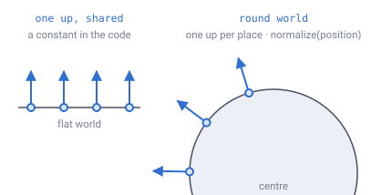
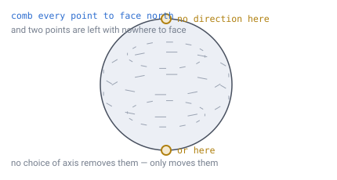
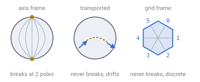
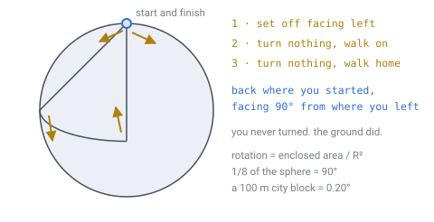
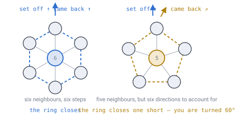
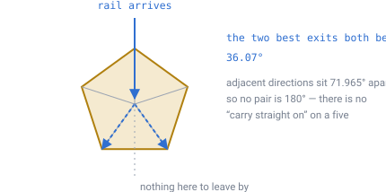
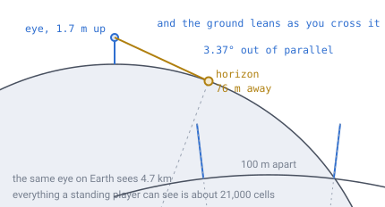

# 13 — Gravity and orientation

## The problem

In a flat world, "up" is a constant. You write it down once — `(0, 1, 0)` — and
every system in the engine shares it. The camera, the character controller, the
physics, the way a rail knows which way it is pointing, the little arrow on the
minimap. All of them read the same three numbers.

On a planet there is no such constant. Up depends on where you are standing.



*Four players, four different ups. On the flat world they agree and the value can
live in a global; on the round one they never agree, and any system holding a
shared up is holding one player's answer and using it for everybody.*

So every system that quietly assumed a fixed world axis has to be rebuilt.
[Doc 11](11-open-topics.md) flagged this as the highest-impact open topic. This
document closes it.

The good news arrives immediately, and it is bigger than it looks.

---

## Gravity is the easy half

Here is the whole model:

```
up      = normalize(position)
gravity = -g0 * up
```

`normalize(position)` means: keep the direction you are pointing from the
planet's centre, and set the length to 1. It is one square root and three
divisions. That is gravity.

**The direction varies, the strength does not**, and that is correct for anything
happening in the crust. Textbooks will tell you that inside a uniform sphere the
strength falls off linearly toward the centre — `|g| ∝ r`, reaching zero at the
core. True, and it does not matter here. Dig 64 blocks into the
[doc 06](06-world-sizing.md) worked planet and you are at `1 − 64/1700` = **96.2%**
of surface gravity. Nobody will feel 4%.

**Recommendation:** constant magnitude. Add the linear falloff only if the world
lets players dig to the centre — at which point it stops being a correction and
becomes a feature.

### Why the vertical direction never causes trouble

The radial axis costs one `normalize`, and that one fact is what makes the rest
of this document tractable.

From [doc 03](03-addressing.md): the cell above you is your own address with the
layer number increased by one. That is the entire operation. No face crossing, no
adjacency table, no pentagon case, ever — the twelve awkward cells are awkward
*horizontally*, and a column runs straight past them.

So: **gravity is easy, and the hard problem is horizontal.** Deciding what
"north" means is the part that fights back. Keep the two apart in your head.
Almost every mistake in spherical worlds comes from trying to solve them with one
mechanism.

---

## There is no global north, and that is a theorem

It would be convenient if you could pick a direction — call it north — and have
every cell on the planet agree on which way that is. You cannot. This is not a
gap in the design or a problem to be engineered around. It is impossible.

Try it yourself: take a sphere and comb every point on it flat, so each point has
a little arrow lying against the surface pointing "north". Wherever you start,
somewhere else has to give up.



*The hairs get shorter as they approach the top and bottom, and at the two marked
points there is no direction left to point in — every neighbouring hair disagrees.
Choosing a different axis moves those two points somewhere else. Nothing removes
them.*

That is the **hairy ball theorem**: every continuous field of tangent arrows on a
sphere has to vanish somewhere. Poincaré–Hopf sharpens it into a budget — the
zeros must add up to the sphere's Euler characteristic, χ = 2.

And that budget is the **720° from [doc 02](02-geometry-choice.md) wearing
different clothes**, because 4π steradians is χ · 2π. The impossibility of a
compass and the necessity of twelve pentagons are one fact stated twice. You
cannot dodge either, and a design that appears to has hidden its singularity
somewhere it has not looked yet.

So stop looking for the frame. There are **three**, they are good at different
jobs, and the discipline is to never convert between them casually.



*The axis frame is cheap and breaks at two points. The transported frame never
breaks but drifts, because it depends on the path you took. The grid frame never
breaks either — it sidesteps the theorem by not being a continuous field at all.*

| | Definition | Stateless | Singular | Continuous | Use it for |
|---|---|---|---|---|---|
| **Axis frame** | `east = normalize(cross(N, up))` | yes | at 2 poles | yes | lat/long, maps, sun position |
| **Transported frame** | quaternion carried and updated | no | nowhere | yes | camera, player controller |
| **Grid frame** | direction index into the cell's neighbour ring | yes | nowhere | **no** | blocks, rails, meshing, pathfinding |

Look at the last row. The grid frame escapes the hairy ball theorem by **not
being a continuous field at all** — it is a per-cell discrete label, and the
theorem has nothing to say about those. That is not a loophole. It is the reason
directional machinery should live on the grid and never on a vector.

---

## The frame the player carries

Hold the player's orientation as a **quaternion** and nudge it as they move. The
nudge is the *swing* rotation: the smallest, twist-free turn that carries the old
up onto the new up.

```js
function stepFrame(q, oldUp, newUp){        // call once per move, not per frame
  const axis = cross(oldUp, newUp), s = length(axis);
  if (s < 1e-12) return q;                  // no change in up: leave heading alone
  return mul(quatFromAxisAngle(axis / s, atan2(s, dot(oldUp, newUp))), q);
}
```

**Never re-derive the player's heading from a reference axis.** Recomputing
`cross(N, up)` every frame looks equivalent and is not — it injects the axis
frame's twist into the camera, which the player experiences as the world rolling
under their feet, then snapping hard as they pass a pole. Update incrementally
and the axis is never consulted.

Euler angles are unusable here, for the ordinary reason made worse: yaw and pitch
are measured against a fixed axis that does not exist. Gimbal lock stops being an
edge case and becomes a routine event, because "straight up" changes continuously
as you walk.

### Walk in a circle and you come back turned

This one is strange the first time. Walk through it rather than reading it.

Stand at the north pole facing your left. Walk straight down to the equator — no
turning. Walk a quarter of the way round the equator — still no turning. Walk
straight back up to the pole — still no turning. You are where you started, you
never once turned, and you are facing **90° from where you set off**.



*Three straight legs, no turns, and the heading comes home rotated a quarter of a
circle. The walker did nothing wrong — the ground curved underneath them. The
rotation is exactly the area the loop enclosed, divided by R².*

This is called **holonomy**, and it is not a bug or an accumulation of floating
point error. It is a property of the sphere.

> **[verified]** `verification/frame.js` carries a tangent vector around circles
> of colatitude 10° to 120° in 200,000 steps and compares the accumulated rotation
> against `2π(1 − cos θ)`. They agree to 1e-8 degrees or better at every radius.
> (Holonomy is an angle mod one full turn, so the comparison is mod 360°.)

Scaled to the worked planet, `rotation = enclosedArea / R²`:

| Loop | Enclosed area | Heading rotation |
|---|---|---|
| Around a 100 m city block | 10,000 m² | 0.20° |
| Around a 1 km² region | 1,000,000 m² | 19.8° |
| One octant of the planet | ⅛ sphere | 90° |
| The equator | ½ sphere | 360° ≡ 0° |

A fifth of a degree around a city block is invisible. Twenty degrees around a
region is not.

The design rule falls straight out: **the transported frame is camera state, not
a coordinate.** The player re-anchors it with their own input every frame, so its
drift never accumulates anywhere that matters. Persist it — as a saved facing, a
waypoint bearing, a rail direction — and you have stored a number whose meaning
depends on the route taken to reach it.

---

## The frame the machinery uses

For anything built into the world — rails, pipes, conveyors, hoppers — a direction
is not a vector at all. It is an **index into the cell's neighbour ring**, counted
counter-clockwise as seen from *outside* the sphere: `0…5` on a hexagon, `0…4` on
a pentagon. `neighbour(id, k)` from [doc 07](07-data-structures.md) already
returns exactly this.

**Order the ring geometrically, not by `(q, r)` sign.** About 46% of
chunks sit in a frame turned half a turn ([doc 03](03-addressing.md)) — a
rotation, not a mirror, so handedness never changes — and an index derived from
local coordinates inherits that half turn as a uniform **+3**. Every rail,
conveyor and hopper in those chunks would run back to front, reversing at chunk
borders. Ordering by outward-facing
counter-clockwise absorbs the flip inside `neighbour()`, which is where this
design already keeps all its sphere-ness.

### What a pentagon costs, exactly

Take a direction index for a walk. Start at one neighbour of a cell, go all the
way round the ring, and check what you are pointing at when you get back.



*Six neighbours means six steps and the ring closes. Five neighbours still have to
account for six directions, so the walk closes one short and you come back turned
by one index — 60°. This is the entire cost of a pentagon, and it is a whole
number, not a small error.*

> **[verified]** `verification/frame.js` builds the real level-4 grid (2,562
> cells) and walks the ring of every cell whose neighbours are all hexagons.
> Around all 2,490 pentagon-free hexagons the index slips by **0**. Around each of
> the 12 pentagons it slips by **exactly 1 index = 60°**. 12 × 60° = **720°**.

That is Gauss–Bonnet expressed in direction-index units, and it is the sharpest
available statement of what the twelve pentagons cost gameplay:

- **A loop enclosing no pentagon closes perfectly.** A conveyor or rail circuit
  returns to its start pointing the way it left.
- **A loop encircling a pentagon comes back rotated one direction.** Not
  approximately — one full index.
- **A straight line cannot pass through a pentagon.**

That last one deserves its own picture, because "you cannot go straight on" is
easy to read past.



*On a hexagon, whichever way you come in, there is a neighbour directly opposite —
you carry straight on. A pentagon has no opposite. Adjacent directions sit
**71.965°** apart, so the two least-bad exits each bend by **36.07°**, and going
straight is simply not on the menu.*

### Making the cells smaller does not help, and this is the part to remember

The obvious response to all of this is to raise the subdivision depth until
pentagons are too small to matter. That works for exactly half the problem.

> **[verified]** Same script, levels 1–5. The *geometric* defect at a pentagon
> falls roughly 4× per level — 15.69° → 3.34° → 0.74° → 0.17° → 0.042° — tracking
> the shrinking cell area, and settling at about 60% of the `720/N` sphere
> average because pentagon cells are smaller than average. The *combinatorial*
> deficit is 1 index at every level, forever. Both sum to 720.000°.

So the 720° turns up twice, and the two forms behave in opposite ways:

| | Felt by | Behaviour as cells get smaller |
|---|---|---|
| Geometric defect | walking players, terrain, camera | vanishes locally, ~4× per level |
| Combinatorial deficit | rails, pipes, roads, grid logic | **never shrinks** — 60° at every level |

Raising the depth is a real fix for the first and no fix at all for the second.
**You can make a pentagon too small for a player to notice and still not small
enough for a conveyor to ignore.**

> **Corrected by [doc 17](17-pentagons.md).** An earlier version of this section
> said that burying the pentagons under ocean is the only option that actually
> removes the problem, because it removes the machinery rather than the geometry.
> That is too strong. Measuring loops at radius 1 through 16 showed the slip is
> **topological** — one index at every radius — so it counts the pentagons a loop
> encloses and not the distance it kept from them. A loop drawn around an ocean
> still encircles the pentagon inside it. Burial removes the *local* problem
> only; nothing removes the loop. Doc 17 takes the decision on that basis.

---

## Player-facing coordinates

Show latitude, longitude and altitude. That is the axis frame, and it comes with
two singular poles — which is fine, because a compass spinning at the pole is
behaviour every player already expects from the real world.

But the axis is a free choice, and there is a better one available than an
arbitrary one.

> **[verified]** `verification/frame.js` — the icosahedron is centrally
> symmetric, so its 12 vertices form 6 antipodal pairs. The twelve pentagons
> therefore also form 6 antipodal pairs.

**Run the lat/long axis through one of those pairs.** The two coordinate poles
then land exactly on two pentagons, so the coordinate system's singularity and the
grid's singularity are the same two places. That gives you one class of weirdness
to model, explain and decorate, instead of two unrelated ones that players
discover separately and then have to be told are unconnected.

The other ten pentagons stay scattered, but their coordinate behaviour is
unremarkable — only the polar two ever show up in the readout.

---

## What a small planet actually looks like

This surprises people, and it belongs here because it falls directly out of
`up = normalize(position)`.

> **[verified]** `verification/frame.js`, `horizon = R · acos(R / (R + h))`.

| Eye height | Horizon on a 1,700 m planet | Horizon on Earth |
|---|---|---|
| 1.7 m | **76 m** | 4.7 km |
| 10 m | 184 m | 11.3 km |
| 50 m | 407 m | 25.2 km |
| 200 m | 787 m | 50.5 km |

A standing player can see **76 metres**. Not 76 metres of detail — 76 metres of
world, full stop. Past that the ground has curved out of sight.



*Angles are exaggerated about 8× — at true scale on a 1,700 m planet neither
effect is visible in a diagram this size, which is itself the point. Left: the
horizon at eye height. Right: two towers, each perfectly upright where it stands,
leaning 3.37° away from each other.*

Three consequences, all useful:

- **Render distance is bounded by geometry, not by taste.** Ground-level occlusion
  is total and needs no test: chunks past the horizon cannot be seen at all. The near-field
  LOD budget is far smaller than a flat world's.
- **LOD must be driven by altitude, not distance.** Climb 50 m and the visible area
  multiplies by 28×. A view-distance slider is the wrong control; the right one is
  a function of `|position| − surfaceRadius`.
- **The planet reveals itself by climbing.** Free, and worth designing toward
  rather than around.

And the tilt that [doc 11](11-open-topics.md) raised, quantified — two structures
`s` apart lean `s / R` away from each other:

| Separation | Relative tilt |
|---|---|
| 10 m | 0.34° |
| 50 m | 1.69° |
| 100 m | 3.37° |
| 500 m | 16.85° |

**A flat, grid-aligned build cannot exceed roughly 50 m** before the lean becomes
obvious. Past that you either accept visible faceting between districts, or you
build on the sphere and accept that "straight" means great circle. Tell players
this once, plainly, rather than letting them find it out by building a long wall.

---

## Chunk-local up

Meshing, lighting and LOD would all like a single up per chunk. Whether they can
have one depends entirely on where the chunk level is cut.

> **[verified]** `verification/frame.js`, D = 11 on the 1,700 m planet.

| Chunk level | Chunk spans | `up` varies across it |
|---|---|---|
| C = 4 | 128 cells | 4.31° |
| C = 6 | 32 cells | 1.08° |
| C = 8 | 8 cells | 0.27° |

**Recommendation:** compute up per *cell* for anything the player sees. It is one
`normalize` and it is never wrong. Keep chunk-local up for coarse LOD shells,
where 1° of error sits below the resolution being drawn anyway.

This pairs naturally with the floating-origin work in
[doc 15](15-precision-and-origin.md): if positions are already being rebased per
chunk, rebase orientation in the same place. One transform, one thing to get
right.

---

## What this forces elsewhere

- **Camera** — quaternion state, swing-updated. No Euler angles anywhere.
- **Controller** — movement is a direction in the local tangent plane, then
  re-projected to the sphere. `moveForward` is a rotation about the axis
  `cross(up, forward)`, not a translation.
- **Entity physics** — gravity is a per-entity vector. No shared constant.
- **Block rotation** — 6 states, indexed into the neighbour ring, geometric CCW
  ordering. Never derived from `(q, r)`.
- **Lighting** — sky light travels along `-up`, which is per-cell. The sun is a
  direction dotted against cell normals, which gives a real terminator sweeping
  the planet at no extra cost ([doc 16](16-lighting.md)).
- **Rails, pipes, conveyors** — grid frame only. Must handle a 36° deflection at
  pentagons, or refuse to be placed on one.
- **Minimap and waypoints** — axis frame, poles on a pentagon pair.

---

## Still open

- **Can players reach the core?** Decides whether the linear `|g| ∝ r` interior
  model is needed, and what happens to orientation as `up` becomes undefined at
  `r = 0`.
- **Which frame do vehicles use?** A rail-bound cart is grid-frame. A free-flying
  craft is transported-frame. Anything that switches between them needs a defined
  handover.
- **Is there an in-world "north" landmark?** If the poles sit on two pentagons,
  those two cells are the obvious candidates — which turns a mathematical
  artefact into a place, and feeds directly into the pentagon gameplay decision.

## In one breath

- **Up is `normalize(position)`**, and gravity is that times a constant. The
  radial axis never crosses a face or a pentagon, which is what makes it easy.
- There is **no global north** — the hairy ball theorem forbids it, and that is
  the same 720° as the twelve pentagons.
- Use **three frames**: axis for coordinates, a transported quaternion for the
  camera, a discrete index for machinery. Never interconvert casually.
- **Holonomy is real**: a closed walk returns your heading rotated by the area
  enclosed. So a carried heading is camera state, never a stored coordinate.
- A pentagon costs **one direction index, 60°, forever** — smaller cells hide them
  from walkers and do nothing for rails.
- The horizon on a 1,700 m planet is **76 m**, and two builds 100 m apart lean
  **3.37°** apart.

---

**Demo:** [`demos/local-frame.html`](../demos/local-frame.html) — drag a walker
across the planet and watch the three frames disagree: the axis frame spinning as
it passes a pole, the transported frame returning from a closed loop rotated by
the enclosed area, and the horizon circle shrinking to 76 m at ground level.
