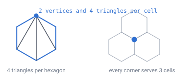
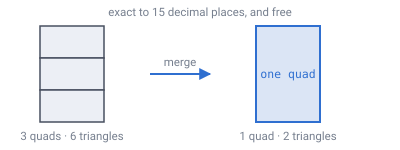
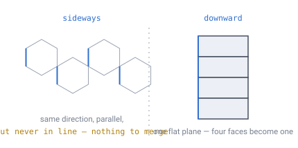
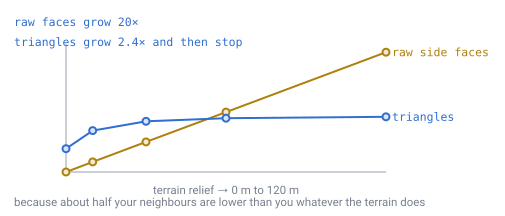
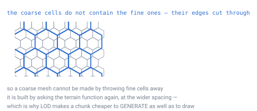
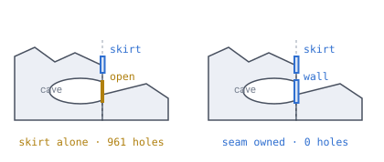

# 14 — Meshing and level of detail

## The problem

Turn a chunk of hexagonal prisms into triangles, cheaply enough to stream, with
a level-of-detail scheme that keys on **altitude** rather than distance
([doc 13](13-gravity-and-orientation.md)), and without cracks where two levels
meet.

## The received wisdom is half wrong

[Doc 11](11-open-topics.md) said hex prisms have 8 faces to a cube's 6, that
greedy meshing mostly does not apply, and to expect meaningfully more vertices.
The first is true, the second needs qualifying, and the third is smaller than it
sounds.

> **[verified]** `verification/mesh.js` builds the real dual mesh at levels 1–5
> and counts. A fully exposed hex surface costs **2 vertices and 4 triangles per
> cell** — converging to exactly that, since the dual of a triangulation with `V`
> cells has `2V − 4` vertices and a fan triangulation gives `4V − 12` triangles.
> An unmerged square grid costs 1 vertex and 2 triangles per cell.

*Four triangles per cap, and because every corner is shared by three cells, only
two vertices per cell are new.*

So an unmerged hex surface is **exactly 2× an unmerged cube surface**. Not a
disaster — a flat, predictable factor of two. The whole difference is about
*merging*, and even there the loss is narrower than expected.

---

## Three kinds of face, three different answers

**Caps** — the top and bottom of a prism. A hexagon fans into 4 triangles from
one of its own corners; a pentagon into 3. Do not add a centre vertex: it buys
nothing on a near-regular cell and costs a vertex per cell. Corners are shared
by three cells, which is where the 2-vertices-per-cell figure comes from.

**Side faces, vertically** — merge perfectly.

> **[verified]** `verification/mesh.js` — the side face of a prism lies in the
> radial plane through the shared edge, and stacked cells share that plane. Over
> three layers the four corners deviate from a single plane by **1.5e-16**
> radii. A run of exposed side faces down a column collapses to one quad,
> exactly, at no geometric cost.

*A run of exposed side faces down a column collapses into a single rectangle, and
the merge is exact — the faces genuinely lie in one plane.*

**Side faces, horizontally** — do not merge. In a hex lattice the faces of
neighbouring cells pointing the same way are parallel but offset; they zigzag
rather than lining up, so there is no run to collapse.

*Merging needs faces that lie in one plane. Going down a column they do, exactly.
Going sideways they never do — each neighbour's matching face is shifted half a
cell, so there is no run to collapse and no algorithm can invent one.*

That is the honest summary of what transfers: **run-length merging along the
radial axis is exact and costs one comparison per layer; the rectangle-growing
part of greedy meshing has no hex equivalent.** Which is the same shape as everything else in this design —
the radial axis is easy, the horizontal one is not ([doc 13](13-gravity-and-orientation.md)).

---

## It is a volume, not a surface

The 2-and-4 figure above is for a flat, fully exposed surface. A world with
mountains, cliffs, overhangs and caves is a **volume**, and it costs more. How
much more is the question, and the answer is: much less than the raw face count
suggests, because vertical merging absorbs almost all of it.

### Relief

A cell exposes one cap, plus — toward each of its six neighbours — one side face
per block of height difference. So raw side faces climb steeply with terrain
relief. But every one of those runs is unbroken, so each collapses to exactly one
quad.

> **[verified]** `verification/volume.js`, 1 m blocks on the doc-06 planet.
>
> | Relief | Raw side faces / cell | Side quads after merge | **Triangles / cell** |
> |---|---|---|---|
> | 0 m (flat) | 0.00 | 0.00 | **4.00** |
> | 10 m | 1.74 | 1.55 | **7.11** |
> | 30 m | 5.17 | 2.36 | **8.71** |
> | 60 m | 10.29 | 2.62 | **9.25** |
> | 120 m | 20.59 | 2.74 | **9.48** |

*The frightening curve is the one that does not matter. Raw faces climb 20× as the
terrain gets rougher; the triangles you actually draw rise 2.4× and then flatten,
because vertical merging absorbs the difference.*

Raw faces grow 20×; **triangles grow 2.4× and then saturate.** The merged quad
count cannot exceed six and settles near 2.7, because on average about half a
cell's neighbours are lower than it whatever the relief.

So the working number is **4 triangles per cell on flat ground, about 9 on
mountainous ground**. Vertical merging is not a nice-to-have — without it the raw
face column is the cost, and it is five times worse.

### Caves — and a warning about the density term

The density field from [doc 08](08-terrain-generation.md) is
`(surfaceRadius − |p|) + noise3D(p) × strength`. The bias term grows by 1 per
metre of depth, so **enclosed voids only form when the noise gradient beats
it** — amplitude divided by feature size must exceed 1. Turn the strength up
without raising the frequency and you do not get caves; you get a rougher
surface and a much larger bill for it.

> **[verified]** `verification/volume.js`, 64 layers under 30 m of relief.
> Feature size is `R / frequency`.
>
> | Freq | Strength | Feature | Gradient | Cave cells | Spans/column | Faces/column |
> |---|---|---|---|---|---|---|
> | 40 | 0 | 42.5 m | 0.00 | 0 | 1.000 | 1.0 |
> | 40 | 26 | 42.5 m | 0.31 | **0** | 1.000 | 10.1 |
> | 140 | 26 | 12.1 m | 1.07 | 64 | 1.084 | 12.0 |
> | 220 | 26 | 7.7 m | 1.68 | 186 | 1.243 | 11.6 |
> | 140 | 40 | 12.1 m | 1.65 | 185 | 1.242 | 17.5 |

Two things to take from that table.

**Most of the density term's cost is not caves.** Going from no carving to
strength 26 at low frequency multiplies faces **10×** while carving **zero**
voids — all of it is surface roughening, which section 2 already accounts for.
Real caves add only about another 20% on top.

**Caves are what create multi-span columns.** With genuine voids, 8% to 24% of
columns hold more than one separate slab of rock. On flat or merely rough
terrain every column is a single span. That distinction is what the chunk
boundary rules below have to cope with.

Cave surface is still **invisible** — enclosed by definition, nothing outside
the rock can see it until a player opens a way in. **Cull interior geometry by
enclosure, never by simplification.** It costs build time and memory, not draw
time, and it must never be handed to the LOD system.

---

## Merging caps is limited by curvature, not by the algorithm

You *can* merge coplanar same-material cells: take the union of a patch and
triangulate its boundary polygon. Nothing about hexagons forbids it. What
forbids it is the sphere.

Merging drops the interior vertices that were following the surface, so a flat
patch sags away from it by `s² / 8R`.

> **[verified]** `verification/mesh.js`, R = 1,700 m, 1 m blocks.

| Patch span | Sag | Cells across |
|---|---|---|
| 8 m | 0.005 m | 8 |
| 16 m | 0.019 m | 16 |
| 32 m | 0.075 m | 32 |
| 37 m | 0.101 m | 37 |
| 64 m | 0.301 m | 64 |
| 128 m | 1.205 m | 128 |

Allow a tenth of a block of sag and a patch may span **37 m**; allow a quarter
and it may span 58 m. A chunk at `C = 6` spans 32 cells — which lands just
inside the tighter budget, by coincidence rather than design.

**Rule: never merge across a chunk boundary.** Not for the usual bookkeeping
reasons, but because the chunk is already about the largest flat patch the
curvature permits.

---

## You probably should not merge at all in the near field

This is the part that changes the plan.

> **[verified]** `verification/mesh.js`, R = 1,700 m at full depth D = 11.

| Altitude | Horizon | Visible cells | Cap triangles |
|---|---|---|---|
| 1.7 m | 76 m | 20,951 | 0.08 M |
| 10 m | 184 m | 122,640 | 0.49 M |
| 50 m | 407 m | 599,186 | 2.40 M |
| 200 m | 787 m | 2,207,529 | 8.83 M |
| 1,700 m | 1.8 km | 10,485,761 | 41.9 M |

A standing player can see about **21,000 cells — 84,000 triangles**, at full
resolution, unmerged, with no cleverness whatsoever. That is a rounding error on
any GPU made this century.

**But that figure is a floor, not a budget.** It is the count for a perfectly
smooth sphere. Terrain sticks up, and anything tall is visible from much further
than the ground is — the range to a peak of height `h` is the ground horizon
*plus* `R·acos(R/(R+h))`.

> **[verified]** `verification/volume.js`, 1.7 m eye on the doc-06 planet.
>
> | Peak height | Visible from | Cells within that range | vs ground only |
> |---|---|---|---|
> | 0 m | 76 m | 20,951 | 1× |
> | 10 m | 260 m | 244,673 | 12× |
> | 30 m | 393 m | 558,028 | 27× |
> | 60 m | 521 m | 977,791 | 47× |
> | 120 m | 697 m | 1,736,972 | 83× |

A 60 m hill is visible from **seven times further** than flat ground. The
conclusion survives — the near field still needs no merging — but the render
budget has to be set from the relief-extended range, not from 76 m, and the
distant part of that range is exactly what LOD is for.

**The 76 m horizon is the greedy mesher.** It has already thrown away everything
a merge pass would have, and it did so before the mesher ran, at no cost in
code. Build the naive version, ship it, and spend the effort on altitude instead —
which is where the numbers actually go bad.

---

## Level of detail

Key on altitude, as [doc 13](13-gravity-and-orientation.md) establishes. Within a
2 M-triangle budget:

| Altitude | Finest level that fits |
|---|---|
| 1.7 m | 11 — full detail |
| 10 m | 11 — full detail |
| 50 m | 10 |
| 200 m | 9 |
| 850 m | 9 |
| 1,700 m | 8 |

Roughly **one level per doubling of altitude** above 50 m, and full detail below
it. A view-distance slider is the wrong control; the right one is a function of
`|position| − surfaceRadius`.

### LOD is resampling, not decimation

In a cube world, dropping to a coarser level of detail means throwing away every
other block. Here you cannot, and the reason is worth seeing rather than being
told.

*The coarse cells do not contain whole fine cells — their edges cut straight
through. The two levels are simply different sets of cells, so there is nothing to
discard your way from one to the other.*

Goldberg levels do not nest into each other at all — [doc 01](01-prior-art.md)
states this as the trade the design accepts. So a coarse mesh is **not** a subset
of the fine one, and you cannot drop every other cell.

Instead, evaluate the same terrain function on the coarser grid. This works
because terrain is a pure function of world position ([doc 08](08-terrain-generation.md)),
so any grid can sample it and no grid is privileged. The rule that keeps seams
out of terrain is the same rule that makes LOD possible at all — it earns its
keep twice.

---

## Terrain is generated, not stored — and that changes LOD

Every assumption in this document rests on one fact. **There is no heightmap.** [Doc 08](08-terrain-generation.md) makes terrain two
pure functions of position — a height-field term giving `surfaceRadius(direction)`,
and optionally a density term `(surfaceRadius − |p|) + noise3D(p) × strength`
that carves caves and overhangs into it. Nothing is on disk but the seed and the
player's edits.

Three consequences that a mesh-simplification mindset gets wrong.

### LOD is cheaper to generate, not just to draw

There is no fine mesh to decimate — there is no mesh at all until something asks
for one. A coarse chunk is the same function asked again on a wider grid, so a
LOD step cuts **generation** cost by 4× at the same time as it cuts drawing.
Distant terrain is cheaper twice over. Classical mesh LOD gets neither saving:
it decimates a mesh that has already been built.

### The two terms cost wildly different amounts

The height-field term is one fBm evaluation per *column*, reused down the whole
column. The density term is one evaluation per *cell* in the band where it could
change the answer.

> **[verified]** `verification/volume.js`, one chunk at D 11 / C 6, 64 layers,
> 5 octaves for height and 4 for density.
>
> | LOD | Columns | Height field | + density, full crust | + density, band only |
> |---|---|---|---|---|
> | −0 | 561 | 2,805 | 146,421 | 74,613 |
> | −1 | 153 | 765 | 39,933 | 20,349 |
> | −2 | 45 | 225 | 11,745 | 5,985 |
> | −3 | 15 | 75 | 3,915 | 1,995 |

The density term is **51× the height term** over a full crust, and **26×** when
restricted to a band around the surface. Doc 08 already recommends that band;
this is the number that justifies it.

### The LOD level should choose the generator

A coarse mesh cannot represent a feature narrower than about two of its cells.

> **[verified]** `verification/volume.js` — at level 10 (2 m cells) a 3 m cave is
> already gone; at level 8 (8 m cells) a 10 m canyon is gone; a 40 m valley
> survives to level 7.

That is not a defect to engineer around. **A cave you cannot see into does not
need geometry**, and by the time a chunk is far enough to drop a level, its caves
are sealed rock as far as the camera is concerned. So:

> **Near chunks run the density field. Far chunks run the height-field term
> alone.**

Which makes a LOD-2 chunk about **330× cheaper to generate** than a near one:
**12.5×** from having fewer columns (561 → 45; two levels would quarter twice
over to 16× but for the rim) and **26.6×** from skipping the density term
entirely. It also means the
expensive cave geometry from the section above is only ever built where a player
could actually reach it.

The one piece of stored terrain doc 08 contemplates — a coarse global heightmap
at level 8, for rivers and erosion — does not change any of this. It is an
*input* to the height-field term, not a mesh, and it is sampled by masking a cell
ID rather than by any second spatial structure.

---

## Cracks, and which cause actually matters

Two things could open a seam where levels meet. Only one of them does.

**The base sphere: almost nothing.**

> **[verified]** `verification/mesh.js` compares hexagon corners at level 3
> against level 4. Every coarse corner lands within **0.72% mean, 0.97% max** of
> a fine corner, as a fraction of coarse cell spacing. They are near-coincident
> because the middle child of a triangle split shares its parent's centroid —
> exactly so only when the triangle is equilateral, and subdivided triangles are
> not quite.

**Terrain sampled at two spacings: everything.**

> **[verified]** Same script, 60 m of relief on the doc-06 planet. The height
> difference between a level and the one above it:
>
> | Level | Spacing | Mean Δh | Max Δh | Covered by a one-cell skirt? |
> |---|---|---|---|---|
> | 11 | 1 m | 0.26 m | 1.52 m | yes |
> | 10 | 2 m | 0.53 m | 3.20 m | yes |
> | 9 | 4 m | 1.04 m | 6.76 m | yes |
> | 8 | 8 m | 2.00 m | 12.84 m | yes |
> | 7 | 16 m | 3.60 m | 19.89 m | yes |

**Fix: skirts, one coarse cell deep.** A vertical apron hanging from the chunk's
boundary cells, 2 triangles each. Verified to cover the worst case at every
level tested.

Skirts beat stitching here for a specific reason: with LOD driven by altitude
rather than distance, **neighbouring chunks can differ by more than one level**,
and a stitching scheme has to enumerate the cases. A skirt does not care what the
neighbour chose. It is also the only option that survives a chunk being remeshed
after an edit while its neighbour is not.

### But a skirt only closes the surface, and a volume has more than one

That covers a height field, where every rim column has exactly one slab of rock
and therefore one surface to hang from. Under a density field, 8–24% of columns
have several — and a skirt cannot reach the others, because **a skirt hangs
downward and a cave mouth is a horizontal hole in the boundary plane.**

The failure is specific. A cave in the fine chunk runs up to the rim. The coarse
neighbour ran the height-field term only, so it is solid rock at that depth — but
it does not know a cave is there, so it emits no face; and the fine chunk assumes
its own generator continues past the rim, so it emits none either. Nobody draws
the wall, and you can see through the rock into the void.

*The skirt covers the surface step in both. Only the right-hand chunk also walls
off the cave where it meets the coarser neighbour's rock.*

> **[verified]** `verification/seam.js` builds a real rim — full density field on
> the fine side, height field one level coarser on the other — and scores three
> policies over 385 rim columns:
>
> | Policy | Holes left |
> |---|---|
> | Each side trusts its own generator past the rim | 1,041 |
> | The same, plus a skirt one coarse cell deep | **961** |
> | The finer chunk owns the seam | **0** |
>
> The skirt closes every one of the 72 surface-slit layers and **8 of 969 cave
> mouths**. At a 2 m coarse cell, **99% of cave mouths sit deeper than the skirt
> reaches**; the deepest is 15 layers below the surface.

**More skirts are not the answer.** One skirt per span was the obvious guess and
it is wrong: extra skirts hang down into rock from ledges that were never the
problem, and still do not cover a horizontal hole.

### The finer chunk owns the seam

The rule that does work:

> At a boundary where the neighbour is coarser, the **finer** chunk emits a face
> wherever its own solidity differs from the coarse neighbour's — in both
> directions. Its rock facing the neighbour's air, *and* the neighbour's rock
> facing its own caves. The coarser chunk emits nothing at that rim.

It needs one height-field evaluation per rim column to learn where the coarse
neighbour put its surface, which is the cheapest query in the generator.

> **[verified]** `verification/seam.js` — **zero holes**, at every coarse cell
> size tested, for **2.70 boundary faces per rim column** plus that one
> evaluation. Against the ~12 faces per column the chunk already emits, it is
> noise.

At a boundary where both sides are at the *same* level the rule costs nothing at
all: both ran the same generator on the same grid, so there are no disagreements
to draw and it degenerates to emitting nothing.

**Keep the skirt as well.** Seam ownership is exact but needs the chunk to know
its neighbours' levels, so a chunk must be remeshed when a neighbour changes
level. The skirt needs no such knowledge, costs 2 triangles per rim column, and
covers the most visible failure — the surface slit — during the frames between a
neighbour changing level and this chunk catching up. One is correctness, the
other is insurance.

---

## Pentagons

A pentagon cap is 3 triangles rather than 4, and a pentagon column has 5 side
faces rather than 6. That is the entire impact.

Meshing is the one system in this design where the twelve pentagons cost nothing
beyond a loop bound — no special case, no deflection, no lost direction. Compare
[doc 13](13-gravity-and-orientation.md), where they cost a permanent 60°.

---

## The chunk-local frame

Mesh in chunk-local space with the chunk's centre as the origin. Two reasons,
both already on the table:

- `up` varies about **1.08°** across a `C = 6` chunk ([doc 13](13-gravity-and-orientation.md)),
  so a single chunk normal is wrong for lighting but fine for culling. Compute
  normals per cell — one `normalize`, and never wrong.
- It is the same rebasing that floating origin needs ([doc 11](11-open-topics.md)).
  One transform, applied once, in one place.

---

## What to build, in order

1. **Height field only.** `surfaceRadius(direction)`, one evaluation per column.
   4 triangles per cap, run-length merged side faces, no cap merging. This is a
   whole planet with mountains and no caves, and it is cheap.
2. **Skirts** at chunk boundaries, one coarse cell deep.
3. **Altitude-driven LOD** by re-evaluating the terrain function at a coarser
   level — with the render budget set from the relief-extended range, not the
   76 m ground horizon.
4. **The density term**, restricted to a band around the surface and to
   full-detail chunks only. This is where caves, overhangs and most of the
   triangle count arrive at once — and where **seam ownership** becomes
   necessary, because until there are caves there is nothing a skirt misses.
5. **Cap merging**, only for high-altitude shells, bounded to a 37 m patch.

Steps 1–3 are a working planet you can fly over. Step 4 is the one that turns it
into a volume, and it is deliberately last because it is the expensive half of
the generator and the easiest to get wrong.

---

## Still open

- ~~Which boundary this mesh actually draws~~ — **settled by
  [doc 18](18-cell-boundary.md)**, and it cost nothing. The corners here used to
  come from the centroids of the *projected* triangle vertices. Average the
  **flat** lattice points instead and then project, and the mesh draws exactly the
  boundary [doc 04](04-position-lookup.md)'s lookup uses. Equivalently, and more
  usefully: a corner is a lattice point of the same construction at `3n` —
  `(3i+2, 3j+1)` for an up-triangle, `(3i+1, 3j+2)` for a down-triangle. The
  **2 vertices and 4 triangles per cell** count is untouched, because each triangle
  still gives one corner and each corner still serves three cells; only where the
  corner sits moves, by 0.038 mm at level 11.
- **Texture coordinates.** Hexagons are near-regular but **not congruent** —
  area varies **1.99:1** ([doc 02](02-geometry-choice.md), measured; earlier
  drafts said 1.3:1) — so a tiled texture cannot be identical per cell, and the
  per-cell distortion to absorb is twice what this document used to assume. Either accept slight per-cell distortion, or use
  triplanar projection in world space and let the addressing scheme stay out of
  it, which is the same answer terrain generation reached.
- **Ambient occlusion** with 8 neighbours rather than 6, and what a corner even
  means when three hexagons meet.
- ~~Water and transparency~~ — closed by [doc 25](25-water.md). Water is a block
  type, the ocean culls to a **skin** (0.89% of the naive face count), and a
  player sees **one** body of water from 82.3% of viewpoints and two from 0.6%.
  So it is two draw passes and a sort of one thing. The sphere never made it
  harder: back-to-front is a distance comparison and never needed a global axis.
- **Remesh or store.** Whether a chunk's mesh is rebuilt on edit or cached, and
  what that costs when a player mines one cell. Sharpened by the generation
  numbers above: rebuilding a near chunk means re-running the density term over
  the band, which is the expensive path.
- **Where the density band should sit** when the surface itself is 60 m of
  relief — a band that follows `surfaceRadius` is not the same shape as a band
  at fixed depth, and floating islands sit outside both.
- **Culling by enclosure**, concretely. The claim that cave geometry costs no
  draw time assumes something detects that it is sealed. Which structure does
  that, and what does it cost to keep current when a player breaks through?

---

## In one breath

- An unmerged hex surface costs **2 vertices and 4 triangles per cell** — a flat
  2× a cube, not a blow-up.
- **Vertical merging is exact and free**; horizontal merging has no hex
  equivalent. Cap merging is bounded by curvature at **37 m**, not by the
  algorithm.
- A standing player sees about **21,000 cells** on smooth ground — but relief
  extends that far: a 60 m hill is visible from **521 m**, 47× the cells.
- Relief barely moves the triangle count (**4.0 → 9.5 per cell**, then it
  saturates). Caves multiply *faces* but stay invisible until opened.
- **LOD is resampling, not decimation**, because Goldberg levels do not nest.
  Drive it by **altitude**, not distance.
- Seams: a **skirt** closes the surface step; only the finer chunk **owning the
  seam** closes a cave mouth.

---

**Demo:** [`demos/mesh-lod.html`](../demos/mesh-lod.html) — the tiling at five
resolutions, reporting its own vertex and triangle counts so you can watch them
converge on 2 and 4 per cell. The altitude slider draws the true horizon ring and
colours the cells inside it: at eye height that is **one hexagon on the whole
planet**, 0.05% of the surface, and the readout gives the real figures for a
level-11 world.
