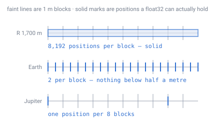
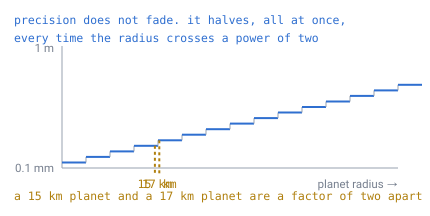
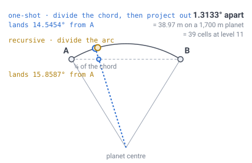
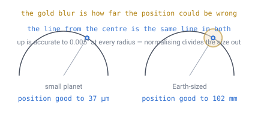
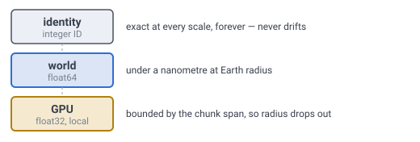
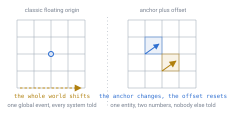

# 15 — Precision and the floating origin

## The problem

A position is a number, and numbers on a computer have a finite number of digits.
Far from the origin, the digits run out — the gaps between the positions a
computer can actually represent grow until they are wider than a block.

[Doc 11](11-open-topics.md) flagged this as the last item touching every system
that holds a position, and both closed documents lean on it:
[doc 13](13-gravity-and-orientation.md) wants orientation rebased wherever
position is, and [doc 14](14-meshing-and-lod.md) builds meshes in chunk-local
space. Neither can be finished until the rebasing rule exists. This document is
that rule.

It also turned up something that is not about precision at all, and matters more
than the precision does. That is section 3, and if you read only one section,
read that one.

---

## What "running out of digits" actually looks like

A `float32` carries about 7 significant digits. That sounds generous until you
notice the seven are counted from the *front* of the number, not from the decimal
point. A position 6,371 km from a planet's centre spends all seven just getting
down to the metres column, and has nothing left below it.

Here is where that comes from, because everything downstream rests on it. A
`float32` is 1 sign bit, 8 exponent bits and 23 stored mantissa bits. An implicit
leading 1 makes the significand **24 bits**, and `24 × log₁₀2 = 7.22` decimal
digits.

Now the shape that matters. Every float is `± 1.f × 2^e`, and the mantissa `1.f`
always sits between 1 and 2 — `[1, 2)`, including 1 and stopping just short of 2.
So a float is a **fixed ladder of rungs**, and the
exponent slides that ladder up and down the number line. The number of rungs never
changes. The gap between them doubles every time the exponent goes up by one:

```
for x in [2^e, 2^(e+1)):    gap = 2^(e − 23)
```

At Earth radius, 6,371,000 lies between `2²² = 4,194,304` and `2²³ = 8,388,608`,
so `e = 22` and the gap is `2^(22−23)` = **0.5 m**. The representable values
either side of it really are `6370999.5, 6371000, 6371000.5`. Counting digits
gives the same answer: `6371000` is exactly seven digits and lands on the metres
column, `6371000.5` would need eight, and 7.22 is what buys the half.

That formula is also why the thresholds below land on exact powers of two rather
than round decimal numbers — `gap ≥ t` means `e ≥ 23 + log₂ t`, and `e` is an
integer, so the crossing always snaps to a binade boundary.

> **[verified]** `verification/precision.js`, section 0 decomposes the bit
> pattern, predicts each gap from `2^(e−23)`, and checks it against the measured
> spacing. It also derives the binade thresholds from `e ≥ 23 + log₂ t` and gets
> the same radii the binary search in section 2 finds independently.

**One thing this does not say.** At 0.5 m a `float32` can still place something to
the nearest half metre — metres are representable, and the table below counts two
positions per 1 m block. What has gone is everything *below* a metre. That
distinction matters, because the failure at Earth scale is not "positions stop
working", it is "positions quantise to half-metre steps and every sub-block
detail disappears", which looks like jitter rather than like a crash.

> **[verified]** `verification/precision.js`, section 1. The gap between adjacent
> representable positions, at distance `R` from the origin.
>
> | Planet | `R` | float32 gap | float64 gap | positions per 1 m block |
> |---|---|---|---|---|
> | doc-06 worked example | 1,700 m | **122 µm** | 0.000 nm | 8,192 |
> | 10 km planet | 10,000 m | 977 µm | 0.002 nm | 1,024 |
> | 100 km moon | 100,000 m | 7.8 mm | 0.015 nm | 128 — visible jitter |
> | 1,000 km dwarf | 1,000,000 m | 62.5 mm | 0.116 nm | 16 — coarse |
> | Earth | 6,371,000 m | **500 mm** | 0.931 nm | **2** — no sub-block detail |
> | Jupiter | 69,911,000 m | 8.000 m | 14.9 nm | one position per **8 blocks** |

Read the Earth row again. At Earth radius a `float32` has exactly **two**
representable positions per block — a player's position quantises to half-metre
steps, and anything sub-block is gone. By Jupiter, eight whole blocks share one
representable position.



*The same stretch of ground on three planets. On the worked planet a position can
land essentially anywhere; at Earth radius it can only land on half-metre marks;
at Jupiter it cannot even tell eight blocks apart. Nothing about the block changed
— only how far it sits from the centre.*

And the thresholds, which are the numbers to design against:

> **[verified]** Same script, section 2. The radius at which `float32` position
> spacing first exceeds each threshold:
>
> | Spacing | First exceeded at |
> |---|---|
> | 0.1 mm | 1 km |
> | 1 mm | 16 km |
> | 1 cm | 131 km |
> | 10 cm | 1,049 km |
> | 1 m | 8,389 km |

Powers of two, exactly as the formula above predicts, and the practical
consequence is worth stating on its own: **precision does not decay smoothly as a
world grows — it halves, abruptly, every time the radius crosses a power of two.**



*Not a slope — a staircase. A 15 km planet and a 17 km planet are almost the same
size and a factor of two apart in position resolution, because a power of two
happens to fall between them. Growing a world by 1% can cost you half your
precision, or nothing at all.*

**`float32` holds sub-millimetre precision out to about a 16 km planet and has no
sub-block detail left at all by Earth radius.** The doc-06 worked example at
1,700 m sits so far inside the safe region
that a naive implementation would never notice — which is exactly the trap. The
scheme has to be right before anyone tries a bigger world, because the failure
does not degrade gracefully; it goes from invisible to total across about two
orders of magnitude.

`float64`, by contrast, resolves **under a nanometre at Earth radius**. There is
no scale at which a double is the problem.

---

## The finding that is not about precision

Asking "how exactly is a position computed from an ID?" turned up an ambiguity
in the specification that has nothing to do with floats and is much worse than
anything they do.

There are two ways to build the geodesic sphere, and this specification has been
describing both as though they were one.

**One-shot.** A lattice point `(i, j)` at depth `D` is a single barycentric blend
of the face's three corners, normalised onto the sphere once:
`normalize(A·a + B·b + C·c)`. The lattice is uniform *in the flat face plane*,
and gets projected outward.

**Recursive.** Split each triangle at the midpoints of its edges, normalise each
new midpoint onto the sphere, and repeat. Each new point is the *arc* midpoint of
its two parents.

These sound like the same construction described at different speeds. They are
not. They produce different point sets, and the difference is large.



*Dividing a **chord** into four and dividing an **arc** into four do not put the
mark in the same place. Everything downstream inherits that gap, and it never
gets smaller.*

> **[verified]** `verification/precision.js`, section 3, checked two independent
> ways — by building both lattices and comparing every point, and in closed form.
>
> | Level | Cells | Cell spacing | Max deviation | As % of a cell |
> |---|---|---|---|---|
> | 1 | 42 | 1,023.90 m | 0.000 nm | 0.0% |
> | 2 | 162 | 511.95 m | 38.966 m | 7.6% |
> | 3 | 642 | 255.98 m | 38.966 m | 15.2% |
> | 4 | 2,562 | 127.99 m | 38.966 m | 30.4% |
> | 5 | 10,242 | 63.99 m | 39.420 m | 61.6% |
> | 6 | 40,962 | 32.00 m | 39.420 m | 123.2% |
> | 7 | 163,842 | 16.00 m | 39.435 m | **246.5%** |
>
> Closed form for the worst point, the quarter point of a base edge: an
> icosahedron edge subtends 63.4349°, and at `t = ¼` the two rules place the
> point at **14.5454°** (one-shot, equal chord) versus **15.8587°** (recursive,
> equal arc) — **1.3133° apart**, which is **38.966 m** on the doc-06 planet.

**The gap is fixed in metres and does not shrink with subdivision.** The cells
shrink; the disagreement does not. So as a fraction of a cell it grows without
bound — at level 11 the two spheres disagree about where a given cell sits by
**39 cells**.

This is not a rounding error that a better float would fix. They are two
different tilings.

### Which one is the design

**One-shot.** Two documents already require it, and neither can be rewritten to
accept the alternative:

- [Doc 04](04-position-lookup.md) recovers `(i, j)` by scaling barycentric
  coordinates and rounding. That inverts the one-shot construction and nothing
  else — there is no closed form that inverts recursive subdivision.
- [Doc 09](09-ray-traversal.md) needs cell boundaries to be straight lines in the
  face plane, which follows from the lattice being uniform *in that plane*.
  Recursive subdivision is uniform along arcs instead, and the ray walk stops
  being a straight-line DDA.

So the wording elsewhere is what is wrong. [Doc 02](02-geometry-choice.md) and
the [glossary](12-glossary.md) describe a "recursively subdivided icosahedron",
and [doc 03](03-addressing.md)'s figures show midpoint splitting. Those are
correct as pictures of *the triangle hierarchy* — which really is built by
splitting at midpoints, in index space, exactly — and misleading as descriptions
of *where the vertices go*. The hierarchy subdivides; the positions do not
accumulate.

**The honest trade:** recursive subdivision gives more uniform cell areas, because
equal arcs beat equal chords on a sphere. One-shot gives exact addressing and an
exact ray walk. This design takes the addressing, which is what docs 03, 04 and 09
are all built on, and pays for it with the area variation recorded in
[doc 02](02-geometry-choice.md) — **1.99:1**, not the 1.3:1 that figure was
believed to be when this paragraph was first written.

That price is higher than it looked, and it is specifically *this* construction's
price: one-shot barycentric is the gnomonic projection of a flat triangle, and
`sec³(θᵥ) = 1.9928` is exactly the gnomonic area distortion across an icosahedron
face. The trade still goes the same way — approximate addressing would be far
worse than non-uniform cells — but it should be made with the real number.

---

## The good news: the ID is already a floating origin

Now back to precision, with the construction settled.

A cell ID is `face + path digits + (q, r) + layer`. Every one of those is an
**integer**. There is no floating-point number anywhere in an address, at any
planet size, at any subdivision depth.

That is the whole game, and this design got there without trying:

- **The world's ground truth is exact.** A cell's identity cannot drift, because
  it is not stored as a coordinate. Doc 04's "cells are computed, never stored"
  turns out to be a precision result as well as a memory one.
- **Floating point enters only on the way out**, when an ID is converted to a
  position for drawing or physics — and that conversion can be done relative to
  *any* origin you choose.
- **So the floating origin is not a retrofit.** Most engines bolt one on after
  discovering the problem. Here the addressing scheme already separates identity
  from coordinates; what is missing is only the rule for things that are not on
  a lattice point.

And the conversion itself does not accumulate error, because the path walk is
integer arithmetic:

> **[verified]** `verification/precision.js`, section 4. Worst error over 20,000
> sampled cells, converting ID → position.
>
> | Depth | float64, R = 1,700 m | float32, R = 1,700 m | float32, Earth-sized |
> |---|---|---|---|
> | 4 | 0.000 nm | 156 µm | 583 mm |
> | 11 | 0.000 nm | 206 µm | 773 mm |
> | 16 | 0.000 nm | 206 µm | 772 mm |
> | 23 | 0.000 nm | 193 µm | 722 mm |
>
> **Flat in depth.** The walk down the path digits is integers, so however deep
> the world goes the floating-point work is one barycentric blend and one
> normalise. Nothing accumulates.

A deeper world is not a less accurate world. That is worth saying plainly,
because in most spatial hierarchies it would be false.

---

## Directions survive what positions do not

`up = normalize(position)` ([doc 13](13-gravity-and-orientation.md)) looks like
it should be the first casualty of a collapsing position. It is not, and the
reason is that normalising divides the magnitude out.

> **[verified]** `verification/precision.js`, section 5.
>
> | Planet | float32 position error | float32 `up` error | as surface distance |
> |---|---|---|---|
> | doc-06 worked example | 37 µm | 0.004″ | 33 µm |
> | 100 km moon | 3.3 mm | 0.005″ | 2.4 mm |
> | Earth | 102 mm | 0.005″ | 142 mm |
> | Jupiter | 2.396 m | 0.006″ | 2.042 m |



*The blur is the position error, and it grows with the planet. The line from the
centre through it — which is all `up` ever asks for — does not move. Normalising
divides the magnitude out, and the magnitude was the entire problem.*

**The angle is flat across five orders of magnitude of radius.** Position error
grows linearly with `R`; direction error does not grow at all.

Two things follow, and both are load-bearing:

- **Doc 04's pipeline is already in the right shape.** Its first line is
  `dir = normalize(pos)`, and every subsequent step — the twenty dot products,
  the barycentric coordinates, `hexRound` — works on the *direction*. The face
  and cell lookup is therefore precision-robust even where the position feeding
  it is not. That was not designed in; it fell out of putting the sphere first.
- **Gravity and the local frame need no special handling.** `up`, the axis frame,
  the transported frame, and the sun direction are all directions.

The thing that breaks is representing *where you are*, not *which way is up*.

---

## The rule

Three tiers, and each one holds the kind of number it can hold exactly.



*Precision is only ever a property of the bottom two rows. The top row is exact
by construction, which is why the planet's size never reaches the ones below it.*

| Holds | Type | Why |
|---|---|---|
| **Identity** — which cell | integer ID | exact at every scale, forever |
| **World position** — entities between cells | `float64`, or integer + offset | sub-nanometre at Earth radius |
| **Anything handed to the GPU** | `float32`, chunk-local | bounded by chunk span, so always fine |

The third row is the one that forces the design, because vertex buffers are
`float32` and that is not negotiable. It is also the one this design already
satisfies: [doc 14](14-meshing-and-lod.md) meshes in chunk-local space with the
chunk centre as origin, for reasons that had nothing to do with precision.

> **[verified]** `verification/precision.js`, section 6. `float32` resolution
> *inside* a chunk, which depends only on the chunk's span and not on the planet:
>
> | Chunk level | Cells across | Span | float32 resolution |
> |---|---|---|---|
> | C = 4 | 128 | 128 m | 15.3 µm |
> | C = 6 | 32 | 32 m | 3.8 µm |
> | C = 8 | 8 | 8 m | 954 nm |
>
> The same spans on an Earth-sized world at `D = 23` give **identical** figures —
> 15.3 µm, 3.8 µm, 954 nm. A chunk-local coordinate does not know how big the
> planet is.

That last line is the payoff. Once coordinates are chunk-local, planet radius
stops appearing in the precision budget entirely.

### Entities that are not on a lattice point

A player, a mob, a projectile and a dropped item are all *between* cells, so an
ID alone will not hold them. Store an **anchor plus an offset**:

```
struct Position {
    u64  anchor;    // a cell or chunk ID — exact
    vec3 offset;    // metres from the anchor's centre, bounded by its span
}
```

The offset is bounded by construction, so `float32` is enough for it at any
planet size. **Rebasing is renormalising**: when the offset leaves the anchor's
extent, fold the excess into the anchor and subtract it from the offset.

That is the whole mechanism, and it is worth noticing what it is *not*.



*Classic floating origin waits until the player is far out, then shifts the entire
world back and re-expresses everything in it — one global event that has to be
scheduled and that every subsystem must be told about. On the right, nothing moves
but one entity's own two numbers, and no other system ever hears about it.*

Here there is no world to shift. Each entity carries its own anchor and
renormalises its own offset, independently, whenever it happens to cross a
boundary.

> **[verified]** `verification/precision.js`, section 7. How often a player
> walking at 1.4 m/s crosses a boundary:
>
> | Anchor | Span | One crossing every |
> |---|---|---|
> | cell (D = 11) | 1 m | 0.7 s |
> | chunk C = 8 | 8 m | 5.7 s |
> | chunk C = 6 | 32 m | 22.9 s |
> | chunk C = 4 | 128 m | 1.5 min |

Anchoring to the **chunk** rather than the cell is the right default: it is the
unit everything else already keys on, the offset stays well within `float32`, and
a crossing every 23 seconds is not an event worth optimising.

### What has to be re-expressed when the anchor moves

Less than you would expect, and this is the same shape of answer docs 13 and 14
kept producing.

| Quantity | Affected by a rebase? |
|---|---|
| Velocity, acceleration | **No** — differences of positions, and the origin cancels |
| Orientation (any of the three frames) | **No** — rotations are origin-independent |
| Mesh vertex buffers | **No** — already chunk-local ([doc 14](14-meshing-and-lod.md)) |
| Cell and chunk IDs | **No** — integers |
| The entity's own offset | **Yes** — by construction, that *is* the rebase |
| Cached world-space positions of other entities | **Yes** — so do not cache them |

The last row is the only real discipline the rule imposes: **never cache a
world-space position across a frame.** Recompute it from anchor plus offset,
which is one integer decode and one addition. A cached world position is a number
whose meaning depends on which anchor was current when it was taken — the same
mistake, in a different currency, as storing a heading as a world vector
([doc 13](13-gravity-and-orientation.md)).

---

## What this forces elsewhere

- **World positions are `float64`.** Anything that computes a position from an ID
  for gameplay, physics, or lookup does so in double precision. This is free on
  every platform the game would ship on.
- **GPU-facing data is `float32` and chunk-local, always.** Vertex positions,
  instance transforms, and the camera's own position are expressed relative to
  the chunk being drawn. Upload the chunk's origin as a uniform.
- **The camera is the origin for rendering.** Subtract the camera's world
  position from chunk origins on the CPU, in `float64`, and hand the GPU the
  difference. Standard practice, and it composes with the chunk-local rule
  without conflict.
- **Doc 04's pipeline is unchanged**, because it already works on directions.
- **Doc 14's chunk-local meshing is unchanged**, and is now justified twice.
- **The depth buffer is a non-problem.** The 76 m horizon
  ([doc 13](13-gravity-and-orientation.md)) — or about 700 m with relief — means
  the near-to-far range is tiny by the standards that make depth precision hard.
  A reverse-Z depth buffer is untroubled at these ranges.
- **Doc 02 and the glossary need their wording corrected**, per section 3.

---

## Still open

- ~~The `hexRound` question from [doc 11](11-open-topics.md)~~ — **measured, and
  then turned into a definition.** This entry used to say that settling on the
  one-shot construction made the question well-posed but left it unanswered, and
  that whether planar rounding finds the right cell was still unmeasured. It is
  measured. `verification/hexround.js` compares `hexRound` against
  nearest-centre-on-the-sphere at levels 2–7: they disagree on about **1%** of
  the sphere, the rate **plateaus** rather than shrinking with depth because a
  face triangle's shape is scale-free, and every disagreement is with an
  **edge-adjacent** cell no more than **0.11 of a spacing** further away. Read
  the other way up — which is what [doc 04](04-position-lookup.md) does — a cell
  **is** the set of directions `hexRound` maps to, so the lookup is exact by
  construction and there is nothing left to be approximate about.
- ~~Integer versus `float64` for the offset~~ — **decided: `float64`.** This entry
  rested on fixed-point making positions "exactly reproducible across machines".
  [Doc 23](23-determinism.md) has since answered that: `+ − × ÷ sqrt` are
  correctly rounded, so a `float64` position already **is** bit-identical
  everywhere. With the determinism argument gone the question fell to precision,
  and precision does not discriminate either — the offset is bounded by a chunk
  span, and *every* candidate resolves a 1 m block absurdly finely.
  > **[verified]** `verification/precision.js`, section 8. Over a 32 m chunk:
  > `float64` **7.1e-15 m**, millimetre fixed-point **1e-3 m**, a chunk-scoped
  > `int32` **1.5e-8 m**. The narrowest of those is still a thousand steps per
  > block.
  What fixed-point would still buy is protection against a **build** mistake
  rather than a hardware one — integers cannot be contracted into an FMA, which
  is the one residual risk [doc 23](23-determinism.md) names. But the compiler
  flag is a one-line defence, and fixed-point costs the operation this design
  leans on hardest: there is no integer `sqrt`, and `normalize` is the
  most-called function in the runtime. **Take `float64`, and set the flag.**
- ~~How far an anchor may be trusted~~ — **measured: nothing needs it in
  `float32`.** Two entities in distant chunks have anchors far apart, and the
  vector between them goes through world space.
  > **[verified]** `verification/precision.js`, section 9. `float32` spacing at
  > the separation: **7.6 µm** at the 76 m horizon, **0.12 mm** at the 1,700 m
  > antipode, **0.98 mm** at 10 km, and **0.5 m** at Earth radius. On the worked
  > planet the worst case on the whole world is a tenth of a millimetre.
  So `float32` would in fact survive every distance the doc-06 planet contains,
  and breaks only past about **16 km**. Keep the rule anyway: these vectors are
  **per-entity and rare**, while the `float32` budget exists for **per-vertex**
  data. Computing them in `float64` costs nothing and is right at every planet
  size.
- ~~Determinism across clients~~ — **closed** by [doc 23](23-determinism.md), and
  the worry about `normalize` is withdrawn: IEEE 754 requires `sqrt` to be
  correctly rounded, so `normalize` is bit-identical everywhere. The whole runtime
  turns out to be — position → cell, ID → position, gravity and the ray walk use
  only `+ − × ÷ sqrt` and comparisons. Transcendentals appear only in display
  code, where nothing compares them across machines.

---

## In one breath

- `float32` gives **122 µm** on the 1,700 m worked planet and **500 mm** at Earth
  radius — two representable positions per block, and no sub-block detail at all.
  `float64` gives **under a nanometre** at Earth radius and is never the problem.
- The specification described the sphere two ways that are **not the same
  sphere**. One-shot and recursive subdivision differ by a fixed **38.97 m**,
  which is **39 cells** at level 11 and does not shrink. **One-shot is the
  construction**, because docs 04 and 09 both require it.
- **The ID is already a floating origin** — every field is an integer, so
  identity never drifts and precision is a property only of the derived position.
- ID → position error is **flat in depth**: the path walk is integers, so a
  deeper world is not a less accurate one.
- **Directions survive what positions do not.** `up` is accurate to 0.005″ at
  every planet size, so gravity and all three frames need no special handling.
- Hold identity as an **integer**, world positions as **`float64`**, and anything
  GPU-facing as **`float32` relative to the chunk**. Then planet radius drops out
  of the precision budget completely.
- Rebasing is **renormalising an anchor and an offset**, per entity, about every
  23 seconds at `C = 6`. There is no world-shift event.

---

**Demo:** [`demos/precision-scale.html`](../demos/precision-scale.html) — a player
taking twenty-four 10 cm steps, on a planet you can resize. Drag the radius and
watch the steps collapse onto each other: all twenty-four land somewhere
different on the worked-example planet, on **six** positions at Earth radius, and
on a **single** position by Jupiter. The same twenty-four steps are drawn again
in chunk-local coordinates underneath, where nothing moves however far the slider
goes.
