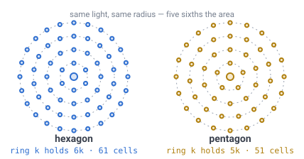
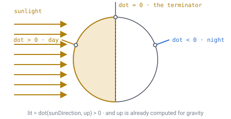

# 16 — Lighting

## The problem

Voxel lighting is a flood fill: every cell holds a light level, light
spreads to neighbours losing one level per step, and solid cells block it. There
are two independent channels — **sky light** from above and **block light** from
torches — and they are stored per cell and recomputed when a block changes.

[Doc 11](11-open-topics.md) listed three things that make this different on a
sphere: cells have **8 neighbours** rather than 6, sky light arrives along the
**radial** direction rather than straight down, and a sun direction dotted
against cell normals gives **a real terminator from one dot product**.

All three turn out to be true, and the document's shape is unusual for this
project: **this is the system where the sphere costs least.** Two of the three
cost nothing, one costs a flat 1.5×, and the twelve pentagons — expensive
everywhere else — cost nothing whatsoever.

---

## Why the sphere is nearly free here

Every other document has had to work around something the sphere does to
*direction*. [Doc 13](13-gravity-and-orientation.md) found that a heading carried
around a loop comes back rotated, and that a pentagon costs one direction index
forever. [Doc 05](05-face-adjacency.md) exists entirely to re-express directions
when you cross a face.

**Light is a scalar.** It has a level and nothing else — no heading, no frame, no
orientation to transport. So holonomy does not apply to it, the direction-index
deficit does not apply to it, and face crossings are handled by `neighbour()`
exactly as they are for everything else.

That leaves only one thing that changes: **the number of neighbours.**

> **[verified]** `verification/light.js`, level 4. 2,550 cells have six lateral
> neighbours and 12 have five, plus up and down always — the radial axis never
> branches. So a cell has **8 neighbours**, and exactly **12 cells in the entire
> world** have 7, at any subdivision depth.

---

## What the extra neighbours cost

A hexagonal disc holds more cells than a square one of the same radius, so a
torch reaches further into more world.

> **[verified]** `verification/light.js`, light level 15 dropping 1 per step, in
> open air.
>
> | Grid | Cells reached |
> |---|---|
> | Hex prism, 6 lateral + 2 vertical | **7,471** |
> | Cube, 6 neighbours | 4,991 |
> | Ratio | **1.497×** |
>
> A hex disc of radius `r` holds `3r² + 3r + 1` cells against `2r² + 2r + 1` on
> squares, so the ratio tends to **1.5** as the light range grows. Confirmed by
> breadth-first search on the real level-7 grid, starting at least 19 cells from
> any pentagon: **721 cells** within 15 steps, against a closed form of exactly
> 721.

So lighting costs a flat **1.5×** a cube world. That is the same *kind* of answer
[doc 14](14-meshing-and-lod.md) found for meshing — a small constant factor, not
a blow-up — and it is the entire price.

**The cheapest lever is the light range, because cost grows as its cube.**

> **[verified]** Same script.
>
> | Light range | Cells possibly touched | vs a cube world |
> |---|---|---|
> | 4 | 189 | 1.465× |
> | 8 | 1,241 | 1.490× |
> | 15 | 7,471 | 1.497× |
>
> Dropping the range from 15 to 8 costs **83% less** work per light.

---

## The pentagons cost nothing, and the reason is worth following

This is the one place in the specification where the twelve pentagons cost
nothing, and the measurement looks alarming until you read it correctly.

> **[verified]** `verification/light.js`, level 7, range 15.
>
> | Torch stands on | Cells lit | Closed form |
> |---|---|---|
> | a hexagon | **721** | `1 + 3r(r+1)` |
> | a pentagon | **601** | `1 + 5r(r+1)/2` |
>
> Identical at all twelve pentagons. The ratio is 0.8336 at range 15, tending to
> **5/6** as the range grows.

A torch on a pentagon lights **17% fewer cells**. The obvious reading is that
pentagons are dimmer and need a special case. That reading is wrong.

A ring at radius `k` around a hexagon holds `6k` cells; around a pentagon it
holds `5k`. **There is simply one sixth less world within reach.** Every cell
that exists gets exactly the light level it should. Nothing is dimmer, nothing is
missing, and no code needs to know.



*Same light, same radius, same rule. The pentagon's disc is smaller because the
sphere has less room there — which is the 720° again, showing up as area instead
of as a lost direction.*

This is Gauss–Bonnet for the fourth time in the specification, and it is
instructive to line the appearances up:

| Where | What the 60° costs | Shrinks with depth? |
|---|---|---|
| [Doc 02](02-geometry-choice.md) | twelve pentagons must exist | no |
| [Doc 13](13-gravity-and-orientation.md), geometry | a visible corner | yes, ~4× per level |
| [Doc 13](13-gravity-and-orientation.md), machinery | **one direction index, forever** | **no** |
| **This document** | **⅙ less area within reach — nothing** | **not applicable** |

The same 60° that permanently breaks a conveyor line is, for lighting, not a
defect at all. **The difference is entirely that light carries no direction.**

---

## Sky light is still one downward pass

The worry in [doc 11](11-open-topics.md) was that "sky light arrives along the
radial direction, not straight down" makes the sky pass harder. It does not, and
the reason is an invariant that keeps paying out.

The tessellation is **identical at every layer** — same face, same path, same
`(q, r)`, evaluated at a smaller radius ([doc 03](03-addressing.md), invariant
10). So a column of cells running toward the core is a **straight line of cells
sharing one address**, differing only in the layer index.

Sky light travels down that column. One downward pass, no face crossings, no
pentagon cases, no curvature — **exactly as cheap as it is in a flat world.**
"Radial rather than straight down" turns out to be a distinction without a
difference, because the grid was built radially in the first place.

Compare [doc 13](13-gravity-and-orientation.md), which found the same thing about
gravity, and [doc 14](14-meshing-and-lod.md), which found it about vertical face
merging. The radial axis is easy; it is always the horizontal one that costs.

---

## Storage is the real cost, and it is bigger than the blocks

Nobody flags this in advance, and it is the largest number in the document.

> **[verified]** `verification/light.js`, one chunk at `D = 11`, `C = 6`, 64
> layers — 561 columns, 35,904 voxels, matching `volume.js`.
>
> | Data | Per chunk |
> |---|---|
> | Light, 1 byte per cell (4 bits sky + 4 bits block) | **35 KB** |
> | Block data, 2-bit palette ([doc 07](07-data-structures.md)) | 9 KB |
>
> **Light costs 4× the blocks it lights.**

The palette trick that makes block storage cheap does not apply to light, because
light levels are genuinely varied — that is the whole point of them.

But half of it can be reclaimed, and the same invariant does it again:

> **[verified]** Sky light down a column is **monotone** — full strength until
> the first solid cell, then attenuating. So store the depth it reaches, one byte
> per column, instead of a value per cell.
>
> | Sky light stored as | Per chunk |
> |---|---|
> | a value per cell | 18 KB |
> | a depth per column | **0.5 KB** |
>
> **32× smaller**, and it needs columns to be straight — invariant 10, again.

**Recommendation:** store block light per cell and sky light per column. That
takes the chunk's light budget from 35 KB to about 18 KB, which is roughly twice
the block data rather than four times it.

---

## The terminator is one dot product

This is the part worth designing toward rather than around.

```
lit = dot(sunDirection, up) > 0        where up = normalize(position)
```

`up` is already computed per cell for gravity ([doc 13](13-gravity-and-orientation.md)).
So a **real terminator** — a day/night line sweeping across a globe, with dawn
arriving somewhere while dusk falls elsewhere — costs **one dot product per cell
and no shadow map at all**.



*The lit set is just the hemisphere facing the sun. On a flat world day and
night are a global clock value; here they are a place.*

A flat world cannot have this. Its day and night are a single global number,
because there is nowhere for a terminator to be. Here it falls out of the
geometry at no cost, and it is the most visible thing the sphere gives back.

### The terminator is not the shading, and using one for both gives ambient light

`dot(sunDirection, up)` answers one question: **is the sun over this place's
horizon?** It is a property of where you are standing, and it changes over
hundreds of metres as the planet curves away.

How bright a *surface* is asks something else: **how square is this face to the
sun?** That is `dot(sunDirection, faceNormal)`, and it changes from one side of
a block to the other.

The two are easy to conflate, because on a sphere the ground's normal *is* `up`
— for flat ground. For the wall of a block it is not, and a shader that uses
`up` for both gives every face of every block the same light. A north-facing
cliff and a south-facing cliff read identically. The sun then does nothing but
turn a global dimmer, which is ambient light with a day/night cycle attached.

There is a test that settles it in two frames. Take one picture with the sun in
the morning sky and one with it in the evening, from the same camera at the
same height of sun, and divide them pixel by pixel. Light that comes from a
direction moves *between* faces — one side of every block gains what the other
loses — so the ratios spread out. Light that does not is one number over the
whole picture.

> **[measured]** `tools/frame-diff.mjs`, 916,000 pixels of one view.
>
> | Normal used for the sun | Ratio, morning ÷ evening | Spread |
> |---|---|---|
> | `up` — the place's own | 1.198 | **0.6%** |
> | the face's own | 0.803 | **58.6%** |
>
> With `up`, every pixel moved by the same factor: the fifth percentile is
> 1.187 and the ninety-fifth 1.209. With the face's own normal the fifth is
> 0.394 and the ninety-fifth 1.533 — some faces went two and a half times
> darker while others went half again brighter.

**The face normal is not stored.** Every face in this world is flat — a cell's
cap is a planar hexagon and the wall between two cells is a planar quad — so
two neighbouring pixels of one face differ by a step along its plane, and the
cross product of the two steps *is* the normal, exactly. A graphics API gives
those steps directly, as the change of any value across one pixel. So the
mesher writes no normal, the vertex keeps its six floats, and nothing about the
mesh format changes.

### Sky exposure is a fact about a layer, not about a column

A cell at the bottom of a hollow has taller ground on several sides and takes
less of the sky than one on a ridge. That is a different scale from the
occlusion at a face's corners, which only ever sees the two cells touching that
corner, and it is what separates a hillside from a hollow. It is baked into the
vertex colour by the mesher, because the shader cannot see what stands around a
cell.

**It was read once per cell, at that cell's column's own top, and painted over
every face the column produced.** That is right for the cap sitting on the top
and wrong for everything under it — and a wall belongs to the *solid* side, so
the wall of a shaft took the exposure of the surface the shaft was dug from,
all the way down. A cave inside a hill took it too, because the column's top is
still the hillside standing over the cave.

> **[measured]** A flat world with one shaft dug twelve blocks into it, sky
> factor recovered per vertex by dividing the block's own registry colour out.
>
> | Blocks below the surface | Before | After |
> |---|---|---|
> | 1 — open ground | 1.000 | 1.000 |
> | 2 — the wall's top | **1.000** | 0.878 – 1.000 |
> | 5 — the wall's middle | **1.000** | 0.511 – 0.633 |
> | 13 — the floor | 0.350 – **1.000** | 0.120 – 0.267 |
>
> Before, only the floor cap darkened at all and every wall was at full
> daylight top to bottom.

Reading it at each face's **own layer** is the whole fix, and it costs a call
per face rather than one per cell. A wall takes its two ends — the top vertices
at the run's first layer, the bottom ones at its last — so one merged run
carries the gradient down itself for nothing. Ground under the open sky does not
move: a cap sitting on its column's top is read at that same layer, which is the
number it always had.

**What an enclosed cell keeps is a decision, not a measurement.** There is no
torch in this world yet, so the floor of the curve is the whole of what a cave
gets, and `0` would be pitch black. It is `0.12`, and a floor that low costs
almost nothing above ground:

> **[measured]** One eye-level view of open terrain, `0.35` against `0.12`:
> mean brightness **136.0 to 136.1** of 255, a mean per-pixel move of **3.08**,
> fifth percentile of the ratio 0.949 and ninety-fifth 1.051. The floor only
> reaches a cell that is shut in on every side, which is what a cave is and
> what open ground never is.

**Sky exposure** switches the whole term off, and every face then takes the
open-sky reading. With nothing to carry underground that is the only way to see
what you dug. It is baked, so it needs every chunk meshed again — which is what
puts it in the panel's remesh set beside the terrain knobs, and deliberately
*not* in the set a world's stored edits are named by, since it moves no block.

### Full light is two switches, because half the light is already in the mesh

There is no torch, so a hole is lit by whatever reaches it and nothing else —
and what reaches it is very little. The sun is 58% of the budget and the shadow
maps correctly refuse to let it down a shaft; what is left is the sky's 42%
times a wall's own `openness` of about 0.71, so a hole sits near **0.30** of
open ground before the sky exposure above has said anything. Multiply the
0.12 an enclosed cell is baked to and it is **0.036** — black, and rightly so.

**Full light** is the way to look into one anyway. It pins every surface to 1,
which takes the whole model out at once rather than turning its terms down one
at a time: the sun, the shadow, the sky's share, the moon and the night floor.

It cannot be a shader flag alone, and what stops it is the same thing twice
over in this document. **The sky exposure and the corner shading are multiplied
into the vertex colours by the mesher, and no light a shader computes
afterwards can divide a number back out of what it was handed.**
A shader-only switch would leave a cave at the 12% it was baked to however
bright the light was said to be. So turning it on also stops those two being
baked, which is what makes it need a rebuild rather than taking effect on the
next frame.

> **[measured]** One view of high-relief ground, air and clouds off. Full light
> moves the mean from **74.9 to 99.2** of 255, with the fifth percentile of the
> per-pixel ratio at exactly **1.000** and the ninety-fifth at **2.006** —
> ground already in full sun does not move at all and shaded faces double,
> which is what pinning a light to its own maximum should do.

### A step too small to see is a step that aliases

The same face normal that makes a block read as a block makes a distant
hillside strobe. A voxel slope is a staircase, and the flat top of each step
and the riser beside it take very different amounts of a low sun — at 8° the
one takes `sin(8°)` and the other `cos(8°)`, a factor of **seven** between two
surfaces a metre apart. Near the eye that is terracing, which is what the
world is made of. Far off, where a whole step lands inside one pixel, the
regular spacing beats against the pixel grid and draws moiré rings across the
hillside.

So the normal is turned toward the column's own up as a step stops fitting in
a pixel, which damps the alternation the rings are made of. **The measure is
metres of world per pixel, not distance**: a step is unresolvable when the
pixel covering it is wider than the step is tall, and that depends on the
resolution and the field of view as much as on how far away the ground is. It
is read off the derivative rather than guessed from a range in metres, and it
never turns the whole way — a hillside that reads as perfectly smooth is a
different lie from one that strobes.

None of this is something a post-processing pass can do. Bloom and the tone
curve run *after* the image is sampled, and moiré is information that is
already gone by then; the only cures are to sample more densely before it is
lost, or to damp the variation that is aliasing, which is this.

One catch, and it is a precision one. The change across a pixel has to be taken
on the **chunk-relative** position, never the world one. A world position here
is a number near 6,800, where `float32` steps by about a millimetre; the change
across one pixel of ground underfoot is a few millimetres, so the difference
between two of them is two or three representable steps and the normal it gives
is noise. Chunk-relative keeps the magnitude under a few hundred, where the
step is 60 micrometres.

### Damping the variation is not the same as sampling it, so there is a knob for both

Turning the normal toward the column's up removes the *cause* of the moiré and
leaves the sampling as coarse as it was. The other cure is to sample more
densely, and it is the one that helps everything at once — a hard edge between
two blocks, the rim of a cloud, the sun's own disc, the speckle a shadow map
leaves. Nothing here sets `multisample`, and multisampling would only have
helped the geometry edges anyway: most of what aliases on a voxel hillside is
the *shading* across its steps, and multisampling shades once per pixel.

So the world can be drawn into an image larger than the canvas and averaged
back down by the pass that was already going to read every pixel of it once —
the tone curve. **Supersample** is that scale. Measured over the distant band
of one eye-level view, the mean jump from one pixel to the next along a row
goes from **7.75 of 255 to 2.78** at a scale of 2 — 64% less high-frequency
contrast — while the mean brightness of the frame stays at **127.2 against
124.9**, which is what says it is the same picture more finely sampled rather
than a different one.

It costs the square of itself: a scale of 2 is four times the pixels through
every pass inside the frame, which on this project's software adapter is most
of the frame time. So it ships **off**, and off is exact — at a scale of 1 the
resolve is a `textureLoad` of one texel with no filtering of any kind, so a
world that never asks for this is drawn exactly as it was before it existed.

### Light comes from two places, and only one of them has a direction

Once the sun is directional, a wall facing away from it gets nothing, and
"nothing" is wrong: it is a wall on a planet with a sky over it. So the light
splits in two.

- **The sun**, one direction, `max(0, dot(faceNormal, sunDirection))`, switched
  off when the terminator says the sun is down.
- **The sky**, no direction at all. A face looking straight up sees all of it,
  one looking sideways sees half, and one looking down sees only what the
  ground throws back. That is `dot(faceNormal, up)` again — the same quantity
  the terminator uses, doing a different job.

The two shares sum to 1, so flat ground under a noon sun reads the same
whatever the balance, and only surfaces standing at an angle to the sun move
when it is changed.

The sky term takes the sky's **hue and not its brightness**. The color the sky
is drawn in already fades from day to night, so multiplying by it whole would
dim the ambient twice — once by that fade and once by the terminator — and
would turn a dim blue sky into a dim light rather than a blue one. Dividing out
its own luminance leaves a tint, and half of that tint is enough to read as sky
without turning grey stone blue.

Direct sunlight also carries a color of its own: a low sun is seen through more
air, and air scatters the blue out of it first. That height is measured against
the place's own up, so the light turns orange as the day runs **and** as a
player walks around the planet — which on a world you can walk around in 2.12
hours is the same motion.

### How hard the sun lands is the other half of a sky's brightness

The air has its own brightness — how much light the atmosphere throws back at
the eye — and turning it up brightens the sky and does nothing whatever to the
ground, because the ground's sun term never reads it. That leaves half of a
lighting balance with no control on it, and the half that decides whether a
world reads as an overcast afternoon or as a hard noon.

**Sunlight** is a plain multiplier on the direct term alone, on land and on the
sea's two highlights alike. It cannot be the same number as the share between
sun and sky: that share sums to 1 so that flat ground at noon does not move
when it is turned, which is exactly the property that makes it useless as a
brightness. Measured over one eye-level view with the air switched off, `2.5`
against `0.2` moves the mean brightness from **56.7 to 106.7**, and the shape
of the move is the whole point — the 95th percentile of the per-pixel ratio is
**3.425** and the 5th is **0.947**. Faces the sun reaches gain nearly all of
it; faces lit only by the sky do not move at all.

### The sky term reads a face's own angle, and that alone looks directional

Turning **Sunlight** to `0` removes the sun term outright, and a face
still comes out shaded differently from its neighbour — which reads as a
missed switch, because it looks exactly like what a sun does: one side of a
ridge darker than the other. It is not the sun. `openness`, the fraction of
the sky a face can see, is `dot(faceNormal, up)` — a face looking sideways
sees half the sky a face looking straight up does, and that is enough on its
own to shade two faces of one hexagon apart with no light in the scene at
all pointing anywhere in particular.

**Sky shading** blends that term toward the open-sky reading for every face
alike. At `1` it is the `dot(faceNormal, up)` above; at `0` every face reads
as though it saw the whole sky, whatever way it points, and the ambient term
stops depending on shape. It is not a brightness knob — turning it down does
not dim the world, it makes every face agree about how much sky is over it,
so what is left moving is `exposure` and each block's own colour.

> **[measured]** One eye-level view, sun off, air off, clouds and both ground
> shadows off. Over the terrain band the mean brightness moves **38.3 to
> 40.1** turning shading off, with the 95th percentile of the per-pixel ratio
> at **1.000** and the 5th at **0.727** — it only ever brightens a face,
> never darkens one, which is what removing a darkening term should do.

**At its natural strength, `1`, this reads as subtle almost everywhere** —
which is not a bug in the knob, it is a fact about the ground. `byAngle`
bottoms out at `0.42` only for a face pointing straight down; the steepest a
face on this terrain ever stands, a sheer vertical wall, only pushes it to
`0.71`, and the shipped ground runs **11.1°** of slope at the median
([doc 08](08-terrain-generation.md)) — close enough to flat that `byAngle`
has barely left `1` at all. So a view of ordinary ground moves little, and a
view of mostly cliff moves much more, which is exactly the asymmetry the
measurement above is taken over.

`mix` does not clamp to its own endpoints, so pushing the knob **past `1`**
extrapolates past `byAngle` in the same direction rather than stopping at
it — the final `clamp(..., 0.0, 1.0)` is what keeps the result inside `[0,
1]`. At `2` a sheer wall reaches `0` rather than `0.71`, a stronger effect
than the term's own physical derivation gives, for a view where the natural
range reads as too little of a change to be worth having. Flat ground is
untouched at any strength: a face looking straight up reads `1` in `byAngle`
regardless, and `mix(1.0, 1.0, t) = 1.0` for every `t`.

### The ambient term itself had no brightness knob at all

**Sunlight** at `0` and **Sky shading** at `0` together leave a flat,
uniform ambient light and nothing to turn it down with — the ambient term's
own brightness, `ambient` in `fromSky`, was a fixed share of the ground
shader's `SUN_SHARE` constant, not a knob at any point in the chain. That is
a different brightness from the atmosphere's own **Sky brightness** under
**The air**: that knob is how bright the marched sky dome reads, and the
ground's sun term never reads it either, which is the gap **Sunlight**
closed for the direct term.

**Ambient brightness** is the multiplier that was missing. `1` is the ambient
share as `SUN_SHARE` describes it; it scales `fromSky` alone, leaving the
floor a face keeps after dark and the sea untouched, so a world with the sun
and the sky both turned down goes dark rather than flat-and-lit.

> **[measured]** The same view as above, sun and air off. Over the terrain
> band, excluding near-black pixels, the mean brightness moves **113.6 to
> 87.8** taking **Ambient brightness** from `1` to `0.2` — a mean per-pixel move
> of **35.6**.

### Day length is a gameplay dial, and it has a natural anchor

The terminator sweeps at `circumference / dayLength`.

> **[verified]** `verification/light.js`, R = 1,700 m, circumference 10,681 m,
> walking speed 1.4 m/s.
>
> | Day length | Terminator speed | Against a walking player |
> |---|---|---|
> | 10 min | 17.80 m/s | 12.7× faster — dawn overtakes you |
> | 20 min | 8.90 m/s | 6.4× faster |
> | 1 hour | 2.97 m/s | 2.1× faster |
> | **2.12 h** | **1.40 m/s** | **exactly walking pace** |
> | 6 hours | 0.49 m/s | 2.8× slower — you can outrun it |
> | 24 hours | 0.12 m/s | 11.3× slower |

That 2.12 hours is [doc 06](06-world-sizing.md)'s circumnavigation time, and the
coincidence is not one — both are circumference divided by walking speed. Which
gives the design rule:

> **Choose the day length in units of "how long it takes to walk around".**
> Shorter than that and the sun always wins. Longer and a player can chase the
> sunset, or flee the dawn, for as long as they can keep walking.

That is a real gameplay decision with a real number attached, and it is only
askable because the world is small enough to walk around.

### Twilight does not depend on planet size

> **[verified]** Taking twilight as 12° of sun elevation: a band **356 m** wide
> on the doc-06 planet, which is **3.3%** of the circumference — and lasting 40 s
> with a 20-minute day, 4.2 min with a 2.12-hour day, 48 min with a 24-hour day.

**Twilight duration is a fixed fraction of the day and does not depend on the
planet's radius at all**, because it is an angle rather than a distance. A tiny
planet does not get shorter sunsets; it gets sunsets that sweep past faster in
metres while lasting exactly as long in minutes.

---

## Shadows run off the edge of the world

The terminator gives day and night. It does not give a mountain casting a shadow,
which needs real occlusion — and here the small planet bounds the problem the way
it bounded the render budget in [doc 14](14-meshing-and-lod.md).

> **[verified]** `verification/light.js`. Shadow length is `h / tan(elevation)`,
> against the **76 m** ground horizon from [doc 13](13-gravity-and-orientation.md).
>
> | Sun elevation | Shadow of a 10 m tower | Past the horizon? |
> |---|---|---|
> | 45° | 10 m | no |
> | 20° | 27 m | no |
> | 10° | 57 m | no |
> | 5° | 114 m | **yes** |
> | 2° | 286 m | yes |
> | 1° | 573 m | yes |

Below about 6° of elevation a 10 m tower's shadow is **longer than the visible
world**. So a shadow scheme never needs to reach further than the horizon —
beyond that, curvature has already hidden both the shadow and whatever cast it.

### A depth buffer from the sun, cut into cascades

The usual way to shadow terrain is to render it again from the sun's point of
view and compare depths — one buffer holding how far the nearest surface is
along the light, so reading it is one question: *is this point further along
the light than whatever the sun saw here?* If it is, something is in the way.
Anything that can draw itself can be in the buffer, which is what a walk over
the coarse map ([doc 08](08-terrain-generation.md)) cannot offer: that map is
one height per 32 m cell **of the generated world**, so a version of this
shadow tried against the map first could shadow terrain but never a placed
block, a mob, or anything moving, and cost a per-fragment march for it. The
sun's own picture reaches all of those and costs three more passes over the
world's geometry instead — a trade this project now takes. The map walk was
built, measured and then removed: it cost more per fragment than the
cascades below cost for the whole frame, and the cascades already cover
everything that draws itself, which the walk could never do.

One buffer covering everything in view spends its texels wrong. It holds a
fixed number of them however far it is stretched, so the ground underfoot and
the hillside at the edge of sight get the same share — and it is the ground
underfoot being looked at. **Cascades** fix that: cut the view into slices by
distance and give each slice its own buffer at the same size. Three of them
here, each covering four times the span of the one before, so the nearest is
the sharpest.

> At the shipped 260 m reach the splits fall at **16 m**, **65 m** and
> **260 m**. At 1,024 texels a side that is about **2 cm** per texel in the
> nearest cascade and **23 cm** in the furthest, against a 1 m block. Three
> `depth32float` layers of 1,024 come to **12.6 MB**.

Two things stop the shadows crawling, and both are about what the box is fitted
to rather than about how it is sampled.

- **Fit each cascade to a sphere, not to the slice.** A slice of a view frustum
  changes shape as the camera turns, so a box fitted to it grows and shrinks
  and every texel lands somewhere new each frame. A sphere around that slice is
  the same size whichever way the camera points.
- **Snap the sphere's centre to whole texels** along the light's own two
  lateral axes. Without it the box slides continuously as the player walks,
  each texel covers a slightly different patch of ground every frame, and the
  edge of every shadow shimmers.

A surface drawn into the buffer records its own depth, so reading the buffer at
that same surface asks whether a face is in front of itself — and the answer is
a coin toss, which comes out as stripes across everything lit. The sample is
therefore pushed off the surface along **its own normal** by rather more than
one texel of the cascade it is read from. Along the normal rather than deeper,
because moving it deeper detaches a shadow from the thing casting it.

The read is nine comparisons rather than nine depths. A comparison sampler
answers *nearer than this?* per texel and averages the answers, so the
hardware's own filtering softens the edge. Averaging the depths instead would
put a shadow halfway up a wall.

**The ground and the sea run the same read**, as one piece of shader source
both include. It declares its own bind group and takes the sun as an
argument, so it depends on nothing either shader has to hand it — and the sea
needs it most, being at sea level and therefore in the shade of anything at
all ([doc 25](25-water.md)).

### Ground shadows itself only where the terrain is steep enough

Ground shadows itself only where its own slope is steeper than the sun is
high. Since the shipped ground runs **11.1°** at the median and 38.1° at the
99th percentile ([doc 08](08-terrain-generation.md)), by the time the sun is a
third of the way up the sky there is almost nothing left standing steeply
enough to shade anything, which makes the shipped world's shadows mostly a
dawn and dusk feature.

That also explains why a shadow is easy to under-sell. The direct term is
`sin(elevation)` of what the sun would give overhead, so at 8° a shadow can
only take away 14% of the light that was there — and the light that was there
is the smaller half of a lit surface's total. The shadow is doing its job; what
makes it read is the exposure applied afterwards, not the shadow.

### The clouds are the only moving thing, so they get a second shadow

The cascades cannot put a cloud on the ground. They are fitted to a sphere
around what the camera sees and reach 260 m at the shipped settings, while the
low deck stands **3,000 m** over a planet **6,801 m** in radius
([doc 32](32-sky-clouds-and-moon.md)) — so no cascade box comes within a
kilometre of a cloud, and stretching one up the sun until it did would spend
every texel on empty air.

So the sun takes a third picture, and it is not a shadow map. **A shadow map
records how far the nearest surface is**, which answers *is something in the
way* with a yes or a no. That is the right question for a wall and the wrong
one for a cloud: a cloud is translucent, its rim is thinner than its middle,
and two of them stacked stop more light than one does. What is recorded here
is **how much cloud a sunbeam passes through**, accumulated, with nothing
tested for being nearest and no depth buffer at all. One puff composites over
the last — what is left is `1 − s` of what was left — so the total saturates at
all of the light rather than running past it.

One orthographic box along the sun, centred on the ground **under** the camera
rather than on the camera, because a player a kilometre up would otherwise
carry the box up with them and spend half of it on air. It is wide rather than
deep, and where the decks are says why:

> **[measured]** `tools/trial-cloud-shadow.ts`, the shipped world. A cloud on
> the low deck throws its shadow **1,092 m** along the ground at a 70° sun,
> **3,575 m** at 40° and **17,014 m** at 10°.

The default reach spans the planet's own diameter. The cull is a **cylinder
along the light and open at the far end**: a cloud that shadows ground inside
the box is up-sun of that ground, and up-sun means along the axis, so its
distance from the axis is the ground's own distance from the box centre and
nothing more. It is closed at the near end, because without that a cloud on the
night side of the planet — inside the cylinder, but behind the ground rather
than in front of it — would write its shape into the cover and shadow ground it
stands under.

The puff drawn into the cover is the **same puff, the same run of indices and
the same wind** as the one drawn into the picture, turned to face the sun
instead of the eye and writing its opacity instead of its colour. A cloud
floating off its own shade is then impossible rather than merely unlikely.

**A cloud shadow multiplies, where the cascades are a yes or a no.** A hill is
either in the way or it is not; a cloud is neither, so what it leaves is a
*fraction of the light still there* — and a cloud shadow falling inside a
hill's shadow takes its share of what the hill already left.

It also has its own darkness knob, because one number that read right on a
mountain would black the ground out under a cumulus.

How much it darkens is set by how much cloud there is, and the shipped sky
is thinner than it looks:

> **[measured]** `tools/trial-cloud-shadow.ts`, 40,000 directions straight out
> from the surface. The sky is **3.50%** cloud. Over a 4,000 m patch at
> 12°N 40°E the ground shaded runs **0.00%** at a 10° sun, **1.40%** at 40°,
> **3.24%** at 70° and 0.93% at 88°.
>
> Nothing is shaded below about 30° because the beam then leaves the deck
> **17 km** away, over a different sky entirely — which is the same reason a
> low sun moves a cloud's shadow off the ground the cloud is over.

That is the sky's property and not the shadow's: at a denser sky the same code
draws far more. Measured at 5,000 clusters against the shipped 1,200, a 72° sun
and the cascades off, the fifth percentile of the on-against-off ratio is
**0.915** — the most shadowed twentieth of the ground is 8.5% darker — over
916,000 pixels.

### After dark the moon is the only thing with a direction

Take the sun away and the two-term model has one term left, and that term has
no direction: every face of every block reads the same all night. A block
becomes a silhouette rather than a shape.

The moon fixes it and costs one more dot product. It is a directional source
like the sun, gated the same way — by whether it is over *this place's*
horizon, so it sets over a walking player as well as over a waiting one — and
faded out as the day comes up rather than switched. Its colour is a colder
white than the sun's.

One structural detail decides whether it reads at all. The light after dark
has a floor, so nothing is ever pure black, and the floor has to sit **under
the sky term alone**. Put it under the total and the moon has to beat it
before it shows, which at any believable moonlight it does not.

> **[measured]** `tools/frame-diff.mjs`, one night view of moonlit ground,
> 830,666 pixels. With the moon: mean 20.2. Without: **12.6**. The fifth
> percentile of the ratio is 0.455, so the faces turned toward the moon are
> more than twice as bright as they are without it.

### A picture is exposed, and that is why a shadow at sunrise is visible

The world is drawn in light rather than in colour, so ground at dawn is
genuinely a fraction as bright as ground at noon: the direct term carries
`sin(elevation)`, which at 8° is 0.14. Left alone, that is what reaches the
screen, and a dawn is a dark picture in which nothing can be seen — including
the shadow that is correctly being cast across it.

An eye does not work that way. It opens.

So the frame is drawn into a floating-point image and exposed on the way to
the screen. Two things happen there:

- **An exposure**, one plain multiplier a person sets and nothing else reads.
- **A roll-off**, because a surface can now be brighter than white and a
  screen has no such value. The ACES filmic curve (the Narkowicz fit) is
  identity near black and bends toward 1 as a value rises, never clipping —
  a surface at exactly white comes out at **0.804**, one three times over at
  **0.954**, and one six times over at **0.993**, so a cloud stays a cloud
  and sun on snow keeps its shape instead of clipping to a flat patch.

The curve runs per channel rather than on the brightness, which is what makes
a colour the exposure pushed past white lose its saturation as it goes — the
way a glint on water reads as a white highlight rather than a clipped
saturated blue.

### A screen has one white, so brightness has to be spent on glare

The roll-off above is also the limit of what a curve can do. A sun drawn at
six times white and a cloud drawn at one both arrive at the screen inside a
tenth of each other, and both arrive flat. **Nothing a tone curve does can
make a small bright disc read as a sun**, because the thing that says "sun"
to an eye is not the disc's own value — which the screen cannot show — but
what that value does to everything near it.

So the part of the frame over a threshold is blurred very wide and added
back, before the curve rather than after it: after the curve there is nothing
left to tell a sun from a cloud. The blur is taken at falling resolutions
rather than with a wide kernel — six halvings from a half-size base, each a
quarter the cost of the last — which reaches a radius no single pass would
pay for.

> **[measured]** `tools/frame-diff.mjs`, one view of a low sun over the limb,
> 303,414 pixels, glare on against off. Mean brightness **101.5** against
> **94.3**, and the ratio is **1.080 with a 50.7% spread** — the fifth
> percentile is **1.000** and the ninety-fifth **1.147**.
>
> That shape is the point: most of the frame is untouched, and what moves
> moves a long way. A glare that lifted every pixel would be a brightness
> knob wearing a costume.

Two details keep it from flickering. The threshold has a **soft knee**, so a
pixel wandering either side of it fades rather than popping the whole blur on
and off. And the first halving averages its thirteen taps in **four
overlapping groups** rather than one, so a single very bright pixel spreads
across four of them and what it contributes stops depending on which texel it
happened to land in — which is exactly what a sun does as a camera turns.

---

## What this forces elsewhere

- **`neighbour(id, k)` gains two radial cases**, up and down, which are `layer ±
  1` and need no table.
- **Light is a scalar everywhere.** Never store a light *direction* per cell; the
  sun direction is global and `up` is per-cell, and those two are enough.
- **Block light per cell, sky light per column** ([doc 07](07-data-structures.md)
  gains a per-column array alongside the palette).
- **A chunk's light depends on its neighbours**, so the same "who owns the seam"
  question [doc 14](14-meshing-and-lod.md) answered for geometry has to be
  answered again for light — see below.
- **The terminator wants `up` per cell, not per chunk.** Doc 13 measured `up`
  varying **1.08°** across a `C = 6` chunk; at the terminator that is a visible
  band of cells lit wrongly, so use the per-cell value there even if coarse LOD
  shells use the chunk value.

---

## Still open

- **Light across a LOD seam.** A coarse chunk's cells do not correspond to a fine
  chunk's, so light levels cannot simply be copied across the boundary. Doc 14
  solved the geometry version by making the finer chunk own the seam; whether the
  same rule works for a flood fill is unexamined, and a flood fill propagates
  *inward* from the boundary rather than just being drawn at it.
- **Ambient occlusion with 8 neighbours**, carried over from
  [doc 14](14-meshing-and-lod.md), including what a corner means where three
  hexagons meet rather than four squares.
- **Whether sky light should know the sun's angle.** The usual voxel approach
  makes sky light directionless and then modulates it globally by time of day. Here the modulation
  is per-cell and gives the terminator — but a cell in a deep valley still gets
  full sky light at noon and at dusk alike, which is wrong in a way players will
  see on a small planet where the sun visibly moves.
- **Colored light**, which triples the per-cell storage that is already 4× the
  blocks.
- **Whether the twelve pentagons need a gameplay note.** Mechanically they cost
  nothing here. But a torch at a pentagon lights 17% fewer cells, and a player
  who counts torches may notice.

---

## In one breath

- A cell has **8 neighbours**; exactly **12 cells in the world** have 7.
- Lighting costs a flat **1.5×** a cube world — `3r²+3r+1` against `2r²+2r+1` —
  and light range is the lever, because cost grows as its cube.
- **Pentagons cost nothing.** A torch there lights 5/6 as many cells because
  there is 1/6 less world within reach, not because anything is dimmer. Light
  carries no direction, so doc 13's permanent 60° penalty simply does not apply.
- **Sky light is one downward pass**, exactly as in a flat world, because
  invariant 10 makes a column a straight line of cells.
- **Light storage is 4× the block storage** — the largest hidden cost here — but
  sky light is monotone down a column, so storing a depth per column instead of a
  value per cell shrinks that part **32×**.
- **The terminator is one dot product**: `dot(sun, up) > 0`, reusing gravity's
  `up`, with no shadow map. A flat world cannot have one at all.
- **The terminator is not the shading.** `up` says whether the sun is over this
  place's horizon; the **face's own normal** says how square a surface is to
  it. Using `up` for both lights every face of a block the same, which is
  ambient light with a day/night dimmer on it: two frames with the sun on
  opposite sides of the sky divide out to one ratio with a **0.6%** spread,
  against **58.6%** once each face has its own normal.
- **No normal is stored.** Every face here is flat, so the change of position
  across one pixel gives the plane's normal exactly — taken on the
  chunk-relative position, because a world position on this planet steps by a
  millimetre in `float32` and a pixel of ground underfoot spans a few.
- **Light comes from two places and only one has a direction**: the sun, and a
  sky whose share a face takes from `dot(faceNormal, up)`. The two sum to 1, so
  flat ground at noon reads the same at any balance.
- **Full light is two switches**, because the sky exposure and the corner
  shading are baked into the vertex colours and no shader can divide them back
  out. It pins every surface to 1 and stops those two being baked: mean
  **74.9 to 99.2** of 255, fifth percentile of the ratio 1.000 and
  ninety-fifth 2.006 — sunlit ground unmoved, shaded faces doubled.
- **Sky exposure is a fact about a layer, not a column.** Read once at a
  column's top it painted the surface's own daylight over every face below it,
  so a twelve-block shaft's wall sat at **1.000** from top to bottom and only
  its floor cap darkened. Read at each face's own layer it runs 1.000 at the
  surface to **0.120–0.267** at the floor, and a merged wall carries the
  gradient down its own two ends for nothing.
- **How hard the sun lands is a knob of its own.** The share between sun and
  sky sums to 1, which is exactly what stops it being a brightness, so the
  direct term takes a plain multiplier beside it: `2.5` against `0.2` moves a
  frame's mean from **56.7 to 106.7**, with the 95th percentile of the ratio at
  **3.425** and the 5th at **0.947** — lit faces gain nearly all of it and
  sky-lit ones do not move.
- **The sky term alone still reads as directional**, because `openness` is
  `dot(faceNormal, up)` rather than a flat number -- a face looking sideways
  sees half the sky a face looking straight up does, with no sun involved.
  Sky shading blends it toward the open-sky reading for every face alike;
  turning it off moves a terrain band's mean **38.3 to 40.1** with the 95th
  percentile of the ratio at **1.000** and the 5th at **0.727** -- it only
  ever brightens a face.
- **The ambient term itself had no brightness knob**, which is a different
  gap from the one Sunlight closed. Ambient brightness is a plain multiplier on
  `fromSky` alone; taking it from `1` to `0.2` with the sun off moves a
  terrain band's mean **113.6 to 87.8**, and the floor a face keeps after
  dark is untouched.
- **Damping the moiré is not the same as sampling it**, so the world can be
  drawn larger than the canvas and averaged back by the tone pass. At a scale
  of 2 the mean jump from one pixel to the next across the distant band falls
  from **7.75 of 255 to 2.78** while the frame's mean brightness holds at 127.2
  against 124.9. It costs the square of itself, so it ships off — and off is a
  `textureLoad` of one texel, filtered by nothing.
- **The sun takes its own picture**, in **three cascades** splitting the near
  260 m at 16, 65 and 260 m — **2 cm** a texel in the nearest and **23 cm** in
  the furthest, **12.6 MB** in all. Fitted to a sphere and snapped to whole
  texels so nothing crawls. A cascade holds anything that draws itself, which
  is the only way a mob or a placed block ever casts one. A walk over the
  coarse map was tried first and removed: it cost more per fragment than the
  cascades cost for the whole frame, for a shadow that could only ever be
  generated terrain.
- **Shadows here are a dawn and dusk feature.** Ground shades itself only where
  its slope beats the sun's height, and the shipped ground runs 11.1° at the
  median: **22.7%** of a patch is in full shadow at a 5° sun, **4.6%** at 20°
  and **0.0%** at 60°.
- **After dark the moon is the only thing with a direction.** Without it every
  face reads the same all night. The floor under the light has to sit under the
  sky term alone, or the moon has to beat it before it shows: measured, moonlit
  ground reads **20.2** against **12.6** without, and the faces turned toward
  it are more than twice as bright.
- **The frame is exposed on its way to the screen**, one plain multiplier
  rather than a figure derived from the light there happened to be — which is
  why a shadow at sunrise is visible at all, since the shadow takes the same
  fraction either way and the fraction only reads once the picture is
  exposed. The ACES filmic curve bends anything over white toward 1 rather
  than clipping to a flat patch.
- **A screen has one white, so the sun is drawn as glare rather than as a
  disc.** What is over a threshold is blurred across six halvings and added
  back before the curve; measured on a low sun, that moves the frame's mean
  from 94.3 to **101.5** at a **50.7%** spread, with the fifth percentile at
  1.000 — most of the picture untouched, and what moves moving a long way.
- Set the day length in units of **how long it takes to walk around** — equal
  means the sun moves at exactly walking pace.
- **Twilight lasts a fixed fraction of the day** whatever the planet's size.

---

**Demo:** [`demos/lighting.html`](../demos/lighting.html) — two tabs. **Torch**
runs the same flood fill on a hex field and a square field side by side, light
levels drawn into every cell, with a range slider. The counts track `3r²+3r+1`
against `2r²+2r+1`, so the **1.5×** is visible rather than asserted, and the
readout carries the pentagon figure alongside — a sixth less area for the same
brightness.

**Terminator** spins a planet under a fixed sun with a day-length slider. A
walker stands still on the surface while the terminator sweeps over them, which
is the point: day and night are a *place* here, not a clock value. It opens on
the anchor — a 2.12-hour day, where the terminator moves at exactly walking
pace — and the readout says whether you could have outrun it.
