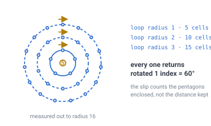
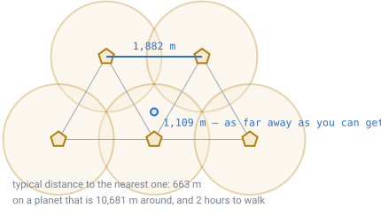
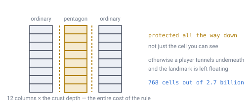
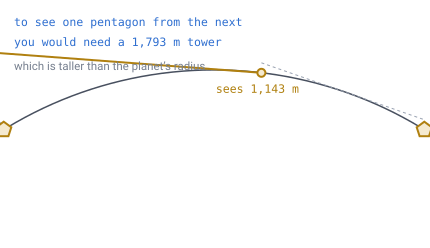
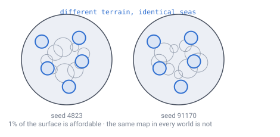

# 17 — Pentagons as a place

## The decision

**The twelve pentagon columns are protected terrain, and they are landmarks.**

Nothing can be placed or removed on them. In exchange, every piece of directional
machinery in the game may assume six neighbours, because it can never sit on a
cell that has five. And the twelve become deliberate world features rather than
holes in the map — twelve fixed, unique, unbuildable places, two of which carry
the coordinate poles.

This is the one decision in the specification that is a **game design** choice
rather than a mathematical one. [Doc 11](11-open-topics.md) flagged it as such and
asked that it be made explicitly rather than by default. This document makes it,
and records what it does and does not buy.

---

## First, the part that was never a choice

Before weighing any option, one measurement rules out the thing everyone reaches
for first — so it goes before the decision rather than after it.

[Doc 13](13-gravity-and-orientation.md) showed that a heading carried right around
a pentagon's own ring of neighbours comes back turned by one index, 60°. The
natural hope is that this is a *local* problem: keep your rails a few cells away
and it goes away.

It does not go away. It does not even get smaller.

> **[verified]** `verification/pentagon.js`. Walk a closed loop at graph distance
> `k` around one pentagon, carrying a direction index the way a rail carries
> "straight on":
>
> | Loop radius | Cells in the loop | Slip on return |
> |---|---|---|
> | 1 | 5 | **1 index = 60°** |
> | 2 | 10 | **1 index = 60°** |
> | 3 | 15 | **1 index = 60°** |
> | 5 | 25 | **1 index = 60°** |
> | 8 | 40 | **1 index = 60°** |
> | 12 | 60 | **1 index = 60°** |
> | 16 | 80 | **1 index = 60°** |



*Eighty cells out is the same as five cells out. Distance buys nothing at all —
the only thing that matters is whether the pentagon is inside your loop or outside
it.*

**The slip is topological.** It counts the pentagons a loop encloses, not the
distance the loop kept from them. [Doc 19](19-directional-blocks.md) pushes the
same measurement over 2,562 loops at every centre and radius, with **0
exceptions** — and [`demos/pentagon-loop.html`](../demos/pentagon-loop.html) lets
you drag the loop around and watch the slip switch off the instant the pentagon
falls outside it.

Which means **no option on the table removes this** — including burying the
pentagons under an ocean, because a loop drawn around the ocean still has the
pentagon inside it. So this stops being a design choice and becomes a rule the
code has to obey whatever else is decided:

> Any system that carries a heading along a path must not assume the heading
> closes when the path does. Recompute it from the grid at each step, or accept
> that a circuit enclosing an odd number of pentagons returns rotated.

[Doc 13](13-gravity-and-orientation.md) says burying them under ocean is "the only
listed option that actually removes the problem". That is too strong, and this
document corrects it: burial removes the *local* problem — five exits instead of
six, no straight line through the cell — and leaves the loop untouched. Every
option is a choice about the cell itself. Nothing is a choice about the loop.

---

## Twelve on a whole planet sounds rare. It isn't.

Twelve cells out of forty-two million reads like something a player will never
encounter. On a planet this small, that intuition is wrong, and the decision only
makes sense once you see by how much.

> **[verified]** `verification/pentagon.js`, on the [doc 06](06-world-sizing.md)
> worked planet: R = 1,700 m, 1 m cells, 10,681 m around.
>
> | | |
> |---|---|
> | Pentagon to nearest pentagon | **1,882 m** |
> | Furthest you can stand from all twelve | **1,109 m** |
> | Typical distance to the nearest one | **663 m** |



*Stand anywhere and pick the worst possible spot — the point equally far from three
pentagons — and you are still only 1,109 m from one. On a world you can walk
around in two hours, that makes them about as common as villages.*

**You are never more than about a kilometre from a pentagon**, and usually much
closer. Whatever is decided here will be visible to players, repeatedly.

But being *near* one and *landing on* one are very different things, because the
defect itself is a single cell:

> **[verified]** Random great-circle routes, with the closest approach solved
> exactly rather than sampled along the line.
>
> | Route length | Within 1 cell | Within 10 cells | Within 50 cells |
> |---|---|---|---|
> | 100 m | 0.005% | 0.08% | 0.60% |
> | 1,000 m | 0.083% | 0.70% | 3.56% |
> | 5,000 m | 0.328% | 3.24% | 15.91% |
> | 10,681 m (all the way round) | **0.378%** | 3.50% | **16.66%** |
>
> The last row also shows the antipodal pairing from doc 13 doing something. A
> great circle is *equidistant* from `v` and `−v`, so the twelve pentagons present
> only **six** independent chances, not twelve: `6 × sin(1/1700) = 0.353%`, against
> 0.378% measured. Twelve would predict twice the observed rate.

**Rare to hit, common to meet.** Lay a rail right around the planet and it lands
on a pentagon under half a percent of the time, while passing within fifty cells
of one about a sixth of the time.

And if you want to avoid them, you always can:

> **[verified]** Searching great circles for the one furthest from all twelve
> vertices: the best keeps **788 cells** of clearance the whole way round. Routing
> around a pentagon costs **2–10 m** of extra track.

Two metres. So the cost was never the detour.

**The cost is that an automated system has to contain the special case at all** —
one cell in forty-two million that every rail router, conveyor and pipe network
must nevertheless get right. That is what this decision removes.

---

## The rule

**A pentagon column is protected: no placement, no removal, at any layer.**

```
isProtected(id) = isPentagon(id)          // one predicate, no table
```

`isPentagon` is already free. The twelve pentagon cell IDs sit in the constant
table from [doc 07](07-data-structures.md), beside the 180-byte adjacency table,
in the few hundred bytes where all of the sphere's irregularity lives.

Note the word **column**. The rule protects the whole thing, top to bottom.



*Protect only the surface cell and a player tunnels underneath it, leaving the
landmark standing on nothing. Twelve columns at the full crust depth is 768 cells
out of 2.7 billion — the entire cost of the rule.*

Three consequences, and the second is the whole point:

- **The whole column, not just the surface cell**, for the reason above.
- **Directional machinery may now assume degree 6.** Not "handles degree 5
  gracefully" — *may assume it does not occur*. A rail, pipe or conveyor cannot be
  placed on a pentagon, so no directional block ever has five neighbours. The
  special case is deleted rather than handled, which is the same move
  [doc 05](05-face-adjacency.md) made with face crossings: push the irregularity
  into one place and let the rest of the codebase stay flat.
- **Nothing else changes.** Pathfinding still walks through a pentagon as a
  degree-5 node ([doc 10](10-pathfinding.md)), light still floods through it
  ([doc 16](16-lighting.md)), terrain still generates across it
  ([doc 08](08-terrain-generation.md)), and the mesher still draws a 3-triangle
  cap ([doc 14](14-meshing-and-lod.md)). Only *player placement* is refused.

A player discovers the rule the way they discover bedrock: they try, and it does
not go. No warning system, no tutorial, no error message needed.

---

## The twelve as places

Protection on its own would leave twelve inexplicable no-build zones. The decision
goes further and makes them intentional.

### What the geometry already guarantees

- There are **exactly twelve**, at every subdivision depth, at every world size,
  forever. That is Gauss–Bonnet, not a content budget.
- Their positions are **fixed by geometry and cannot be moved by a seed**. Every
  world has them in the same relative arrangement — the vertices of an
  icosahedron.
- They form **six antipodal pairs** ([doc 13](13-gravity-and-orientation.md)), so
  one pair can carry the lat/long poles. Two of the twelve are therefore already
  the most navigationally meaningful points on the planet.
- They are **unmodifiable**, which in multiplayer makes them the only locations
  that cannot be griefed, mined out, or built over.

### The tour

> **[verified]** `verification/pentagon.js`. Each pentagon has five nearest
> neighbours at 1,882 m — the icosahedron graph — and a closed tour visiting all
> twelve exists, for example `0→1→5→4→2→3→9→8→6→7→10→11→0`. It runs **22,586 m**,
> which is **2.11×** around the world, or about **4.5 hours** of walking.

So "visit all twelve" is a genuine world-scale objective: twice around the world,
an afternoon of travel, with twelve fixed destinations that every player's world
shares.

### And you cannot see one from the next

You might expect to navigate between them by eye — build something tall on each
and sight from one to the next. The planet is too small and too round for that.

> **[verified]** The eye horizon is 76 m ([doc 13](13-gravity-and-orientation.md)),
> so a tower of height `h` is visible from `76 + R·acos(R/(R+h))`.
>
> | Landmark height | Visible from | Reaches the next pentagon (1,882 m)? |
> |---|---|---|
> | 20 m | 335 m | no |
> | 60 m | 521 m | no |
> | 150 m | 765 m | no |
> | 400 m | 1,143 m | no |
>
> A landmark would have to be **1,793 m** tall to be seen from the next one —
> taller than the planet's radius.



*A 400 m tower — a quarter of the planet's radius — sees 1,143 m and still does not
reach. The ground curves away faster than any tower can climb.*

**The twelve are not inter-visible, and cannot be made so.** Travel between them
needs a coordinate readout rather than line of sight, which is exactly the
argument for putting the lat/long poles on a pentagon pair: the two most useful
navigation anchors become places you can actually stand on.

### What to build there

Deliberately left as a range rather than a specification, because it is content
rather than structure. What the geometry supports:

- **A forced terrain signature.** Terrain is a pure function of position
  ([doc 08](08-terrain-generation.md)), so a bias term near the twelve vertices
  gives each one a guaranteed shape — a spire, a crater, a monolith — without any
  stored data. The same mechanism [doc 08](08-terrain-generation.md) proposes for
  a coarse heightmap.
- **Two poles worth naming.** The antipodal pair carrying the coordinate axis are
  the natural "north" and "south" of the world, and the only places where the axis
  frame's singularity and the grid's singularity coincide — one piece of
  strangeness to explain instead of two.
- **Ten scattered others**, whose coordinate behaviour is unremarkable and which
  are therefore free to be whatever the game wants.

---

## What was rejected, and why

**Burying them under ocean**, as H3 does on Earth.

> **[verified]** `verification/pentagon.js`, measured by sampling rather than by
> the small-cap formula, which double-counts once the discs start overlapping.
>
> | Ocean radius | Surface given to water |
> |---|---|
> | 50 m | 0.26% |
> | 100 m | 1.03% |
> | 200 m | 4.17% |
> | 500 m | 25.81% |
> | 1,109 m | 100.00% |
>
> That last row is a useful check on the first section: 1,109 m is the covering
> radius, so discs that size necessarily cover everything.

At 1% of the surface the price in *land* is affordable, and it removes the local
problem thoroughly — nobody lays rail on a seabed. It was rejected for two other
reasons.

It **locks the macro map.** Twelve seas at fixed positions 1,882 m apart, which no
seed can move, means every world shares the same large-scale geography.



*Change the seed and the terrain changes completely — except for twelve seas that
sit in the same places in every world that will ever be generated. An archipelago
planet by construction, whether or not anyone wanted one.*

For a game whose entire persistence model is "a seed and a delta store"
([doc 07](07-data-structures.md)), giving up world variety to hide twelve cells is
a poor trade.

And it **is not reversible.** A placement rule can be relaxed later if it turns
out to be unnecessary. Twelve oceans baked into the terrain generator cannot be
removed without changing every existing world.

**Accepting the break** — pentagons as ordinary five-sided cells — was rejected
because it keeps the special case alive in every directional system forever, in
exchange for one cell a player meets rarely and can always route around for the
cost of 2 m of track. The measurements make that trade look worse the longer you
look at it: the thing being preserved is nearly worthless, and the thing being
paid is permanent.

---

## What this forces elsewhere

- **Block placement** gains one predicate. `isPentagon(id)` is already in the
  constant table.
- **Directional machinery may assume degree 6.** This is a guarantee to design
  against, not a hope — and it is the payoff for everything above.
- **Heading-carrying systems must still not assume loops close.** Unavoidable, per
  the first section, and unaffected by this decision.
- **Terrain generation** gains an optional bias term near the twelve vertices, if
  the landmarks are given a forced shape.
- **Player-facing coordinates** ([doc 11](11-open-topics.md)) should put the
  lat/long axis through an antipodal pentagon pair, which this decision makes more
  attractive: the poles become standable, protected, named places.
- **Multiplayer** gets twelve locations that cannot be modified, which is a
  natural anchor for shared infrastructure or spawn logic.

---

## Still open

- **Whether the protected zone should be one cell or a small ring.** One cell is
  enough for the machinery guarantee. A ring of one or two cells might read better
  as a landmark, and would cost 0.26% of the surface at fifty cells — but it also
  starts to feel arbitrary in a way a single strange cell does not.
- **What the twelve actually are**, as content. This document commits to them
  being deliberate and leaves what they contain open.
- **Whether players should be told.** The rule is discoverable by trying, but a
  world that never explains its twelve unbuildable spires is a world where players
  invent worse explanations.
- **What happens in creative or admin modes**, where protection is usually waived
  and the degree-6 guarantee would then be violated by the one player who can
  break it.

---

## In one breath

- **The twelve pentagon columns are protected and are landmarks.** Nothing is
  placed or removed there; directional machinery may therefore assume six
  neighbours everywhere.
- **The loop slip is topological** — one index at *any* radius, 5 cells or 80. No
  option removes it, including ocean. Heading-carrying code must handle it
  regardless, and doc 13's claim that burial "removes the problem" is corrected
  here.
- You are **never more than 1,109 m** from a pentagon and typically **663 m**.
  They are common enough that players will meet them.
- A route right around the planet **hits one 0.38%** of the time and passes within
  fifty cells **16.7%** of the time; the best route keeps **788 cells** clear, and
  detouring costs **2–10 m**.
- **Ocean burial was rejected**: 1% of the surface is affordable, but it fixes the
  macro map of every world and cannot be undone.
- Visiting all twelve is a **22.6 km, 4.5-hour** tour — twice around the world —
  and they are **not inter-visible**, so navigation between them needs coordinates.
