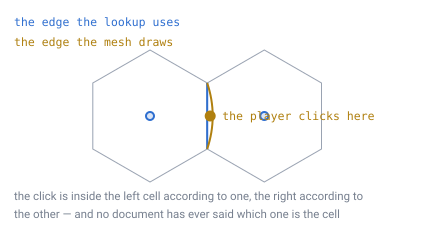
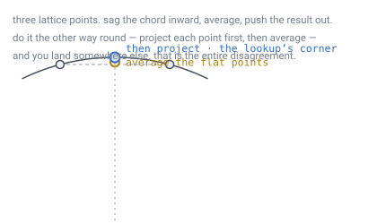
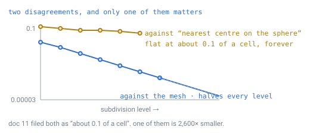
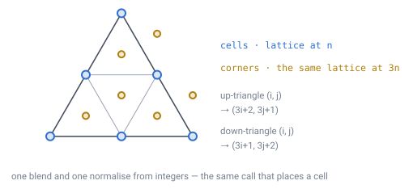

# 18 — The cell boundary

## The problem

A player looks at a hexagon on screen, puts the cursor near its edge, and clicks.
Something has to decide which cell they meant.

Two parts of the engine answer that question, and they have never been asked
whether they agree. The **mesh** draws an outline. The **lookup**
([doc 04](04-position-lookup.md)) takes the position under the cursor and computes
a cell ID. If those two are working from different ideas of where the edge is,
then near an edge the player clicks one hexagon and mines the one next door.



*The dot is inside the left cell by one rule and inside the right cell by the
other. Nobody has ever written down which rule is the cell — the two were built by
different documents and never compared.*

[Doc 11](11-open-topics.md) has carried this as the last structural gap, on the
grounds that it should not be discovered during implementation. This document
closes it.

The answer turned out to be much smaller than the question, and one of the two
guesses doc 11 made about it was simply wrong. Both are worth keeping.

---

## Three candidates

There are three places the specification implies an edge, and they are not the
same curve.

| Where | The rule | Used by |
|---|---|---|
| **Projected planar Voronoi** | the ground `hexRound` maps to this cell | [doc 04](04-position-lookup.md) lookup, [doc 09](09-ray-traversal.md) ray walk |
| **Spherical Voronoi** | everywhere equidistant between two centres, measured on the sphere | the intuitive reading — nothing, formally |
| **Dual polyhedron** | corners at the centroids of the subdivided triangles | [doc 14](14-meshing-and-lod.md) meshing |

The middle one was already dealt with. [Doc 04](04-position-lookup.md) measured it
against the first, found they disagree on about 1% of the sphere, and adopted the
first as normative — because `hexRound` is a pure function of position, so it
already carves the sphere into exact, gap-free pieces, and choosing it makes the
lookup and the ray walk exact by construction.

So the live question is the first against the third. **What separates the curve
the lookup uses from the curve the mesh draws?**

---

## It is not what doc 11 thought, and the wrong guess is instructive

Doc 11 proposed an answer: the corners of a planar Voronoi diagram sit at the
**circumcentres** of the triangles, and doc 14 meshes **centroids**. Those two
points coincide on an equilateral triangle and separate on a lopsided one, so if
the subdivided triangles are slightly lopsided, there is the gap.

The reasoning is sound. The premise is false.

> **[verified]** `verification/boundary.js`, section 1. Every triangle in the
> lattice **inside a face**, measured in that face's own plane: longest edge ÷
> shortest edge = **1.000000000000**, and `|circumcentre − centroid|` = **0**.

An icosahedron face is equilateral, and a uniform barycentric lattice drawn on an
equilateral triangle is made of equilateral triangles. All of them. So in the face
plane the circumcentre *is* the centroid, exactly, and the distinction doc 11
reached for does not exist.

Which is worth keeping on the page, because it points at where the real answer
lives. **The lattice is only lopsided after it has been projected onto the
sphere** — and that is a clue about *when* the projection happens, not about which
centre is used.

---

## What actually differs is the order of two operations

Here is the whole thing.

Both rules build a corner from the same three lattice points. Both average them.
Both project the result onto the sphere. They do it in the opposite order.

- **The lookup's corner.** Average the three lattice points while they are still
  flat — sitting in the face plane, inside the sphere — and then push that average
  outward onto the surface.
- **The mesh's corner.** Push each of the three points out onto the surface first,
  then average the three points that lands on, then push the average out again.



*Averaging first puts the mark on the sagging chord, and the ray then carries it
out to the surface. Averaging last starts from three points already on the surface.
The two land in slightly different places, and that is the entire disagreement
between the mesh and the lookup.*

This is the same distinction that bit [doc 15](15-precision-and-origin.md), which
found the specification describing two different spheres because it had not said
whether subdivision happens before or after projection. **Projection does not
commute with averaging.** That fact has now produced two separate findings in this
specification, which is enough to call it a pattern rather than a coincidence.

---

## How big is it

Small, and — uniquely in this specification — **getting smaller**.

> **[verified]** `verification/boundary.js`, section 2. Greatest distance between
> the two corners, in units of cell spacing.
>
> | Level | Cells | Max gap | Mean gap | Ratio to previous |
> |---|---|---|---|---|
> | 2 | 162 | 1.82e-2 | 1.46e-2 | — |
> | 3 | 642 | 1.01e-2 | 7.62e-3 | 0.556 |
> | 4 | 2,562 | 4.98e-3 | 3.84e-3 | 0.494 |
> | 5 | 10,242 | 2.48e-3 | 1.93e-3 | 0.497 |
> | 6 | 40,962 | 1.23e-3 | 9.63e-4 | 0.498 |
> | 7 | 163,842 | 6.16e-4 | 4.82e-4 | 0.499 |
> | 8 | 655,362 | 3.08e-4 | 2.41e-4 | **0.500** |

**It halves with every level.** Everything else in this design that looked like it
might shrink with refinement turned out to plateau — `hexRound` against spherical
Voronoi ([doc 04](04-position-lookup.md)), the gnomonic area spread
([doc 02](02-geometry-choice.md)), the pentagon direction deficit
([doc 13](13-gravity-and-orientation.md)). This one genuinely vanishes.

Carried to the level the design actually runs at:

```
level 8   3.08e-4 of a cell spacing     measured
level 11  3.85e-5 of a cell spacing     halving three more times
          = 0.038 mm on the doc-06 planet's 1 m cells
```

Four hundredths of a millimetre. On a metre-wide hexagon.

### Doc 11's other number was wrong too, and by more

Doc 11 recorded all three definitions as agreeing "to within about **0.1 of a
cell**". For this pair that is out by a factor of about **2,600**.

The 0.1 is a real number that belongs to a different pair. `hexround.js` measured
the lookup against *nearest centre on the sphere* and found 0.11 of a spacing.
Doc 11 collected three definitions into one sentence and gave all of them the
worst number of the set.



*The flat line is the lookup against spherical Voronoi — the disagreement doc 04
already settled by choosing a definition. The falling line is the lookup against
the mesh. Filing them under one number hid the fact that one of them was never
really a problem.*

> **[verified]** `verification/boundary.js`, section 4. The sliver of ground
> between the two outlines, as a share of one cell: **0.44%** at level 4, halving
> to **0.047%** at level 7, and about **0.003%** at level 11.

A click that lands in the disputed strip is a click within a twentieth of a
millimetre of the edge — closer than a player can aim, and finer than the mesh's
own `float32` vertices resolve.

---

## The decision: the mesh draws the lookup's curve

**A cell's boundary is the projected planar Voronoi diagram, and the mesh is
changed to draw it.**

Not because 0.038 mm is a problem. It is not. The reason is that the alternative
leaves a permanent "these two are nearly the same" in the specification, and this
one can be deleted instead — for no cost at all.

Here is why it costs nothing to change.



*The corners are not a new kind of point. They are lattice points of the same
construction, at three times the resolution — so the mesh computes a corner with
exactly the call it already uses for a cell centre.*

> **[verified]** `verification/boundary.js`, section 5. The exact corner of an
> up-triangle at `(i, j)` is the lattice point `(3i+2, 3j+1)` evaluated at `3n`;
> for a down-triangle it is `(3i+1, 3j+2)`. Checked against the averaged
> construction over every triangle at level 5: agreement to **3e-8 radians**,
> which is floating-point noise.

So the change to [doc 14](14-meshing-and-lod.md) is a formula, not a scheme:

```
was    corner = normalize( mean of the three normalized vertices )
now    corner = normalize( barycentric blend at (3i+2, 3j+1) over 3n )
```

One barycentric blend and one normalise, from integer indices — the same cost as
placing a cell centre, and the same shape as everything else in
[doc 04](04-position-lookup.md)'s pipeline.

**Nothing in doc 14's cost model moves.** The corner *position* shifts by a
fraction of a millimetre; the corner *count* does not change at all, because each
triangle still contributes exactly one corner and each corner is still shared by
three cells. The **2 vertices and 4 triangles per cell** figure is untouched, and
so is every number built on it.

---

## Two things that could have gone wrong, and did not

Both were flagged in advance as the places a hidden cost would show up. Neither
paid out, and saying so is worth as much as the finding.

**Non-convex cells.** The worry: if a corner ever landed outside its triangle, the
hexagon could fold in on itself and the mesh would render inside out.

> **[verified]** `verification/boundary.js`, section 7. 351 interior cells at
> level 5, every corner of every one: **0 reflex corners**, smallest normalised
> turn 0.79.

**A seam along the 30 face edges.** The worry was more serious. The planar Voronoi
diagram is defined *per face*, in that face's own plane. A cell sitting on the
boundary between two faces has half its neighbours in one plane and half in
another, so the two halves of its outline are computed by different arithmetic.
If they did not meet, the normative definition would have a crack running around
all thirty edges of the icosahedron — and that would have made this document much
larger.

> **[verified]** Same section. Walking the shared edge of two adjacent faces from
> both sides: the lattice points agree to **0**, and the point where a cell
> boundary crosses the face edge agrees to **2e-8 radians** computed in either
> face's plane.

They meet exactly, and for a reason that is easy to see once stated: the boundary
between two cells whose centres both lie on the face edge is the perpendicular
bisector of those two centres, which crosses the edge at their midpoint. Both
planes contain that edge, so both compute the same midpoint. **No seam.**

---

## What the lookup cell actually is

One more result, which is a nicer statement than anything above and was not being
looked for.

> **[verified]** `verification/boundary.js`, section 6. A cell's six corners,
> measured in its own face plane: corner-to-centre distance and edge length are
> **identical to twelve decimal places**.

**Every cell is an exactly regular hexagon in its face plane.** Not
near-regular — regular, to the last digit the arithmetic carries.

Which finally puts [doc 02](02-geometry-choice.md)'s 1.99:1 area spread in its
proper place. The polygons are not slightly irregular hexagons scattered over a
sphere. They are perfect hexagons, and **all of the variation is what radial
projection does to them on the way out.** That is the same one sentence that
explains the area spread, the `sec³(θᵥ)` closed form, and the corner gap this
document just closed. One cause, three consequences.

---

## What this forces elsewhere

- **[Doc 14](14-meshing-and-lod.md)** changes one formula for a hexagon corner and
  nothing else. Cost model, merge rules, LOD and seam ownership are all untouched.
- **[Doc 04](04-position-lookup.md)** gains the regular-hexagon result and loses
  its "still to reconcile" note.
- **[Doc 09](09-ray-traversal.md)** is confirmed rather than changed: the
  boundaries its ray walk crosses are the ones the player now also sees.
- **[Doc 11](11-open-topics.md)** loses its last structural entry.
- **Picking and highlighting agree by construction.** A hover outline drawn from
  the mesh and a cell ID computed from the cursor are the same cell, always, with
  no tolerance to tune.

---

## Still open

- **Where the corner goes once terrain has an opinion.** This document places
  corners on the reference sphere. A meshed corner sits at a terrain height, and
  three cells meeting at one corner may disagree about what that height is — which
  is a shading and cracking question doc 14 handles by fanning from a cell's own
  corners, and which nothing has measured.
- **Whether the ray walk should use the 3n lattice too.**
  [Doc 09](09-ray-traversal.md) crosses boundaries analytically rather than by
  hitting corners, so it does not need them — but if it ever wants a corner, it now
  has an integer address for one.

---

## In one breath

- Three definitions of a cell edge were in play. The one that matters is the
  **projected planar Voronoi diagram**, and the mesh now draws it.
- Doc 11 guessed **circumcentre versus centroid**. Wrong: a face is equilateral,
  so inside it those coincide **exactly**. The real difference is that projection
  does not commute with averaging — **average the flat points, then project**.
- The gap is **3.85e-5 of a cell at level 11 — 0.038 mm** — and it **halves with
  every level**, the only discrepancy in this specification that does.
- Doc 11's "all three agree to about 0.1 of a cell" was out by **2,600×** for this
  pair; the 0.1 belongs to spherical Voronoi, which is the one that plateaus.
- The fix costs nothing: a corner is a **lattice point at `3n`** — `(3i+2, 3j+1)`
  for an up-triangle — so doc 14's **2 vertices and 4 triangles per cell** does
  not move.
- **No seam at the 30 face edges** and **no reflex corners**, both of which were
  the places a hidden cost was expected.
- Every cell is an **exactly regular hexagon in its face plane**. All the
  variation is projection.
