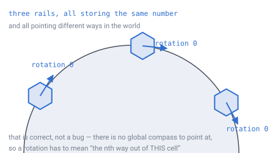
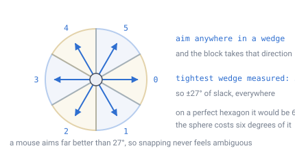
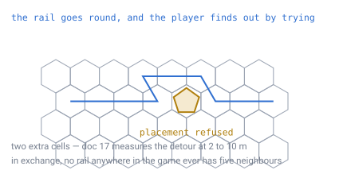
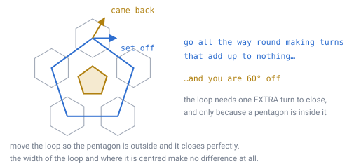

# 19 — Directional blocks

## The problem

A rail points somewhere. So does a conveyor, a pipe, a hopper, a furnace with a
front. In a flat world you store that as one of four compass directions, the value
means the same thing in every chunk, and you never think about it again.

Here you cannot, and the reason is [doc 13](13-gravity-and-orientation.md): there
is no global compass to point at. No direction you could write down is the same
direction anywhere else on the planet.

*Three rails storing the same number and pointing three different ways. That is
not a bug to fix — it is what "no global north" means. A rotation has to be read
as "the nth way out of **this** cell", never as a direction in the world.*

That single sentence is most of the design. The rest of this document is what
falls out of it: how many states there are, how a player chooses one, what happens
at the twelve pentagons, and the one rule that no design choice can remove.

---

## Six states, and where they live

A hexagon has six neighbours, so a directional block has **six orientations**, not
four. Every recipe, tutorial and mental model a player brings from a cube game is
off by two.

The value stored is a **direction index**: `0…5` into the cell's neighbour ring,
counted counter-clockwise as seen from outside the sphere. That is the grid frame
from [doc 13](13-gravity-and-orientation.md), and `neighbour(id, k)` from
[doc 07](07-data-structures.md) already returns exactly this.

Six states need three bits, and there is room already.

> **[verified]** `verification/rotation.js`, section 4.
> [Doc 03](03-addressing.md) packs block state as 16 bits beside a 41-bit address:
> **12 bits of type + 4 bits of rotation**. Six orientations use three of those
> four, leaving one spare for a flag like *powered* or *reversed*, and 4,096 block
> types. **No change to the ID layout is needed.**

---

## Placing one: the player points, the block snaps

**A block takes its rotation from the player's facing.** Take the direction the
player is looking, flatten it into the cell's own ground plane, and pick whichever
of the six neighbours it is closest to.

That works only if the six are spread evenly enough that aiming is comfortable. On
a perfect hexagon they sit 60° apart. On this sphere they do not, because cells
are not congruent ([doc 02](02-geometry-choice.md)).

*Each wedge is one direction. Aim anywhere inside a wedge and you get that
direction, so what matters is not how wide the wedges are on average but how
narrow the narrowest one ever gets.*

> **[verified]** `verification/rotation.js`, section 1. Over all 40,950 hexagons
> at level 6, the gap between neighbouring directions runs from **54.00°** to
> **71.53°** — never more than **11.53°** away from an even 60°.

So the tightest wedge anywhere on the planet is 54° wide, giving **±27° of slack**
around its centre. A mouse aims far better than that. **Snapping never becomes
ambiguous**, and no tolerance needs tuning per region.

**And a tool can override it.** Placing by facing is the default because it is
what a player expects; a wrench-style tool that cycles the rotation through its
six states covers the cases where facing is awkward — placing behind yourself,
building at a distance, or correcting a block already down. Cycling is `k = (k+1) % 6`
on the stored index, which is well-defined without any reference to the world.

---

## At a pentagon, placement is refused

[Doc 17](17-pentagons.md) makes the twelve pentagon columns protected: nothing is
placed or removed on them, at any layer. For this document that decides the
question outright — **a directional block can never sit on a cell with five
neighbours**, so the degree-5 case is not handled gracefully, it is deleted.

The player finds out the way they find out about bedrock. They try, and it does
not go.

*The rail goes round. Two extra cells, and the player learns the rule by bumping
into it once — no warning system, no tutorial, no error message.*

The cost is small enough to be beneath notice. [Doc 17](17-pentagons.md) measures
a detour around a pentagon at **2–10 m** of extra track, and a route right around
the planet meets one **0.38%** of the time.

And most builds never meet one at all:

> **[verified]** `verification/rotation.js`, section 2. The chance that a build of
> a given radius contains a pentagon anywhere inside it, on the doc-06 planet:
>
> | Build radius | Cells covered | Chance it holds a pentagon |
> |---|---|---|
> | 10 cells | 331 | 0.009% |
> | 25 cells | 1,951 | 0.056% |
> | 50 cells | 7,651 | 0.219% |
> | 100 cells | 30,301 | 0.867% |
> | 250 cells | 188,251 | 5.39% |
> | 500 cells | 751,501 | 21.5% |

A 100-cell radius is a 200 m factory, and fewer than one in a hundred of those
contains a pentagon. **What this buys is worth far more than what it costs:** every
rail router, pipe network and conveyor in the game may assume six neighbours,
unconditionally, forever.

---

## The rule that no decision removes: a loop does not have to close

This is the part that survives every design choice, so it is stated as a code
invariant rather than a recommendation.

Build a closed circuit. Go all the way round it making turns that add up to
nothing — as many lefts as rights. On a flat grid you arrive back facing exactly
the way you set off. Here, you might not.

*Set off along the loop, come back turned by one direction — 60°. The circuit needs
one **extra** turn to close, and it needs it only because a pentagon is sitting
inside it.*

> **[verified]** `verification/rotation.js`, section 3. A heading carried around a
> closed ring of cells, at several radii and several offsets:
>
> | Loop | Encloses a pentagon? | Slip on return |
> |---|---|---|
> | radius 2–5, centred on a pentagon | yes | **1 index** |
> | radius 3, centre 1 cell away | yes | **1 index** |
> | radius 3, centre 2 cells away | yes | **1 index** |
> | radius 3, centre 5 cells away | no | **0** |
> | radius 4, centre 2 cells away | yes | **1 index** |
> | radius 4, centre 9 cells away | no | **0** |

Read the third and fourth rows together. **The slip does not care where the loop
is centred or how wide it is — only whether the pentagon is inside it.**
[Doc 17](17-pentagons.md) established this for loops drawn *around* a pentagon;
these off-centre loops are what make "topological" more than a word. Move the loop
so the pentagon falls outside and it closes perfectly, at any radius.

Those are six sampled cases. The same script now checks it exhaustively:

> **[verified]** `verification/rotation.js`, section 3. Every centre within 12
> cells of a pentagon, at every radius from 2 to 8 that forms a single closed
> ring — **2,562 loops**:
>
> | | |
> |---|---|
> | Loops enclosing the pentagon → slip **1** | 427 |
> | Loops not enclosing it → slip **0** | 2,135 |
> | Exceptions | **0** |

**Try it yourself:** [`demos/pentagon-loop.html`](../demos/pentagon-loop.html)
draws the loop on the real grid and lets you drag it around. Watch the slip flip
from 1 to 0 at the moment the pentagon leaves the loop — and notice the loop is a
*pentagon* when it wraps the defect and a *hexagon* when it does not.

One thing that looks like a problem and is not. A loop drawn on a sphere cuts it
into two pieces, so "inside" ought to be ambiguous — and the far piece holds the
*other eleven* pentagons. Walking the loop the other way therefore counts 11
indices, or 660°, which is the same rotation as −1. **The two answers agree**,
because all twelve together come to 720° — a whole turn, twice over. The 720° that
forces the pentagons to exist is the same 720° that keeps this consistent.

### What that means for code

> **Never carry a heading around a path and assume it closes.** Recompute the
> direction from the grid at every step.

Concretely, the things that break if you ignore it:

- A **build tool** that lays track by walking and carrying "keep going the same
  way" — it will fail to meet its own start.
- A **minecart or item** that stores a facing and updates it incrementally
  instead of reading the rotation of the rail it is standing on.
- A **conveyor** whose output side is computed as "opposite of the input side",
  applied repeatedly around a circuit.

All three are fixed the same way, and the fix costs nothing: the rail's rotation
is already stored per block. Read it. The stored value is ground truth; a
transported heading is a guess about it.

### What it means for a player

Almost nothing, and that is worth saying plainly rather than engineering around.
A loop that encloses a pentagon needs one more turn than a builder expects. They
will place it, see it not line up, add a turn, and move on — the same as
discovering any other one-cell mistake. It is not a failure state, and by the
table above it is a case most players will never construct.

---

## What must never be stored

**A rotation must be frame-independent**, and this is the one way to get the
design wrong that survives a restart.

[Doc 03](03-addressing.md) shows that about **46%** of chunks sit in a frame turned
half a turn from their parent's. A direction index derived from the sign of
`(q, r)` inherits that half turn as a uniform **+3** — so the same stored byte
means the opposite direction in a flipped chunk. Write that to disk and the save
file is wrong, not just the renderer.

The rule is [doc 13](13-gravity-and-orientation.md)'s, and it is enough on its
own: **order the neighbour ring geometrically, counter-clockwise as seen from
outside, inside `neighbour()`.** Then a stored index means the same thing
everywhere, and nothing above `neighbour()` ever learns the world is a sphere.

Two things that follow:

- **Never serialise a rotation as a vector.** A world-space direction is
  meaningless in another cell — that is the whole of this document's first
  section, and the same mistake [doc 13](13-gravity-and-orientation.md) warns
  about for player headings.
- **Never derive a rotation from local coordinates.** Not as an optimisation, not
  as a convenience. The bug it creates reverses machinery in half the world and
  appears at chunk borders the player cannot see, which makes it about as hard to
  diagnose as a bug can be.

---

## What this forces elsewhere

- **Block placement** gains one refusal test, `isPentagon(id)`, already in the
  constant table from [doc 07](07-data-structures.md).
- **Block state** uses 3 of its 4 rotation bits. No ID layout change.
- **`neighbour()`** is the only place that knows about the half-turn flip, and it
  already is.
- **Item and cart movement** reads the rotation of the block beneath it each step,
  rather than carrying a facing.
- **Meshing** picks a block model by rotation index, which is per-cell and needs no
  world direction ([doc 14](14-meshing-and-lod.md)).
- **The wrench-style tool** needs one verb: cycle. `k = (k+1) % 6`.

---

## Still open

- **Two-ended blocks.** A pipe with an input and an output has two direction
  indices, or one index plus a shape. Whether that fits in the spare rotation bit
  or needs a side table is not decided.
- **What a rail does when its neighbour is refused.** This document says the
  player routes around. Whether a rail should *auto-curve* around a pentagon —
  convenient, but it hides the rule — is a game design question left open.
- **Whether the loop rule should ever be surfaced.** A player who builds a circuit
  round a pentagon sees it not close. Telling them why is a tutorial question, and
  saying nothing risks them concluding the game is broken.
- **Non-block machinery.** Anything that carries a heading over a distance without
  being made of placed blocks — a guided projectile, a boat's autopilot — has no
  per-block ground truth to read back, and needs its own answer.

---

## In one breath

- A rotation is an **index into the cell's neighbour ring**, never a direction in
  the world. The same number means different bearings in different places, and
  that is correct.
- **Six states, three bits**, inside the 4 rotation bits doc 03 already reserved.
  No layout change.
- **Placement follows the player's facing**, snapped to the nearest of six. The
  tightest wedge on the planet is **54°**, so there is always **±27°** of slack —
  a tool can override or cycle it.
- **Placement is refused on the twelve pentagons**, so directional machinery may
  assume six neighbours everywhere. A 200 m build meets one under **1%** of the
  time, and a detour costs 2–10 m.
- **A circuit enclosing a pentagon comes back one index over**, and the slip
  depends only on what is inside the loop — not its width or its centre. Recompute
  headings from the grid; never carry one round a loop.
- **Never derive a rotation from `(q, r)` sign.** 46% of chunks are turned half a
  turn, so the stored value would mean the opposite direction in half the world.
