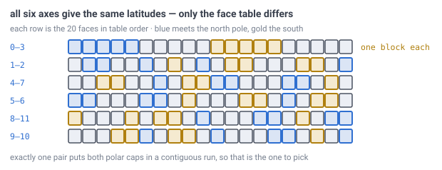

# 20 — Player-facing coordinates

## The problem

A player presses the key that shows their position and reads `x: 412, y: 68,
z: -190`.

In a flat world those three numbers answer real questions. Which way is north?
Increasing `z`. How far is home? Subtract and measure. Am I above ground? Compare
`y` to the surface. The origin is somewhere sensible, the axes point somewhere
consistent, and the numbers are useful.

On a planet, all three of those break at once.


*The origin is the planet's centre, which is a place no player will ever stand.
The axes point at nothing the player can see. And "up" is different for every
person on the planet, so `y` does not mean height for anybody.*

So the readout has to be **latitude, longitude and altitude** instead. That much
is obvious. What is not obvious — and is what this document decides — is where the
axis goes, how many digits to print, and what a player should send someone else
when they want to be found.

---

## Where the axis goes

Latitude and longitude need an axis, and any axis will do mathematically. That
makes it a free choice, and there is a much better one available than an arbitrary
direction.

[Doc 13](13-gravity-and-orientation.md) found that the twelve pentagons form six
antipodal pairs — for every pentagon there is another exactly opposite it. And
[doc 17](17-pentagons.md) made all twelve protected, standable landmarks.

**Run the axis through one of those pairs.**

> **[verified]** `verification/coords.js`. With the axis through an antipodal
> pentagon pair, all twelve pentagons land at just four latitudes:
>
> | Latitude | Pentagons |
> |---|---|
> | +90.000° | 1 — the north pole |
> | +26.565° | 5 |
> | −26.565° | 5 |
> | −90.000° | 1 — the south pole |


*Two poles and two rings of five. Because pentagon positions are fixed by geometry
and no seed can move them, this is the map of **every** world the game will ever
generate — which makes it something players can learn once and use forever.*

Three things fall out, and none of them cost anything:

- **The poles are places.** A player can walk to 90° north and stand on it. It is
  a protected pentagon, so it will still be there, unmined, in a multiplayer world
  a year later.
- **One singularity, not two.** The coordinate system fails at the poles, and so
  does the grid. Putting them in the same two spots means one piece of strangeness
  to explain instead of two unrelated ones players discover separately.
- **A compass failing at the pole is expected behaviour.** Every player already
  knows this from the real world. It is the one place a spherical world's
  weirdness matches intuition.

---

## Which pair: you cannot decide this on merit, so decide it on the face table

"Which of the six pairs" looks arbitrary, and *how* arbitrary is measurable —
"arbitrary" is a claim like any other.

Take each of the six pairs in turn as the axis and ask where the twelve pentagons
land:

> **[verified]** `verification/coords.js`, section 1(b). All six give the same
> answer — one pentagon at each pole, five at `+26.565°`, five at `−26.565°`.
> **One distinct latitude signature among all six.** The ring latitude is
> `atan(1/2)` exactly.

That is the icosahedron being **vertex-transitive**: a rotation carries any pair
onto any other, so the six worlds you could build are one world seen from six
angles. No measurement will ever prefer one. The choice genuinely cannot be made
on merit — it can only be made once and written down.

**See it yourself:** [`demos/lat-long-on-a-ball.html`](../demos/lat-long-on-a-ball.html)
marks the twelve pentagons and holds them at ±90° and ±26.565° however you spin
the planet. Turning the globe *is* changing which pair you picked, and the
readout does not care. That is the measurement above, by hand.

So make it on the only thing that is *not* symmetric: the face table. The twenty
faces are listed in a fixed order, and that order was written vertex-0-first.

> **[verified]** `verification/coords.js`, section 1(b). Of the six pairs,
> **exactly one has both polar caps as contiguous runs of face indices** — the
> pair `0-3`, whose north cap is faces `0,1,2,3,4` and whose south cap is faces
> `10,11,12,13,14`. The other five scatter across the table.



*Each row is the twenty faces in table order, for one choice of axis. The five
faces touching the north pole are blue and the five touching the south are gold —
and since every choice gives the same latitudes, this picture is the **only** way
the six differ. Read down the rows: five of them scatter, and `0-3` puts each cap
in one solid block, which is the whole of the argument for picking it.*

That is a property of the list, not of the sphere, and it is a weak reason. It is
also the only reason available, and a weak written reason beats a coin flip: it
turns "am I in a polar cap" into a range check, and it can be explained to
whoever asks why later.

### The decision doc 20 used to hide

"Which pair" is one of **three** free choices, and only naming the first leaves
two of them to be made by accident:

1. **Which pair** — the axis.
2. **Which end is north** — a sign. Both ends are pentagons; nothing distinguishes
   them.
3. **Where longitude 0 runs** — the prime meridian. Picking a pair fixes the axis
   and the equator. It says nothing about where longitude starts.

The third is the one with visible content, and again the pentagons answer it. Once
the axis is fixed, the ten ring pentagons sit at **exact multiples of 36°** of
longitude. Anchor the prime meridian on one of them and every one of the twelve
lands on a round number.

> **[verified]** `verification/coords.js`, section 1(c). With the meridian
> anchored on `v11` — the second vertex of face 0, and so the first ring pentagon
> the face table names after the north pole — the northern five sit at `0°`,
> `±72°` and `±144°`, and the southern five at `±36°`, `±108°` and `180°`. Every
> ring longitude is an exact multiple of 36°.

**The decision, in three lines:**

```
axis            through the antipodal pentagon pair at icosahedron vertices 0 and 3
north           vertex 0        (north polar cap = faces 0-4)
prime meridian  through vertex 11, the second vertex of face 0
```

Nothing about the world changes if a later reader disagrees with the reasoning —
all six pairs really are equivalent. What must not change is the answer, because
it fixes where the equator falls in every world, and a player who wrote down
"43.2° N" expects it to still mean the same hillside next year.

[Doc 17](17-pentagons.md) leaves what the twelve pentagons *are* as content open.
This narrows it usefully: they are now the only places on the planet with round
coordinates, which makes them nameable, findable and easy to spot in a bug report.

---

## How many digits to print

This is the number that decides whether the readout is usable, and the answer is
better than it would be on Earth.

A cell covers `blockSize / R` radians, so **the smaller the planet, the more angle
one block covers** — and the fewer digits you need to name it. That is backwards
from the intuition that a small world is fiddly.

> **[verified]** `verification/coords.js`, section 2.
>
> | Planet | Block | One cell, in degrees | Decimals to resolve a cell |
> |---|---|---|---|
> | doc-06 worked, R 1,700 m | 1.00 m | 0.0337° | **2** |
> | 10 km | 1.47 m | 0.00843° | 3 |
> | 100 km moon | 1.84 m | 0.00105° | 3 |
> | Earth-sized | 1.83 m | 0.0000165° | 5 |


*At two decimal places one step is 0.30 m, so three steps fit across a 1 m cell.
The same block on Earth would need five decimals — the small planet is the easy
case.*

**Show latitude and longitude to two decimal places, plus altitude in metres.**

```
lat  41.02°   lon -78.55°   alt 63 m
```

Short enough to read at a glance, and fine enough to tell one cell from the next.

### Altitude means height above the reference radius

Not height above the terrain, and not the layer index.
[Doc 06](06-world-sizing.md)'s `surfaceRadius` is a fixed number for the planet,
so `altitude = |position| − surfaceRadius` is stable, comparable between players,
and negative underground. That last part is what a player wants when they are in a
cave: **−40 m** reads as "forty metres below sea level", which is a sentence
people already understand.

The layer index from [doc 03](03-addressing.md) is the engine's number, counted
downward from the crust top. Do not show it. It moves if the crust depth ever
changes, and it means nothing to a player.

---

## Longitude gets cheap near the poles, as it always does

> **[verified]** `verification/coords.js`, section 4. What one degree of longitude
> is worth on the worked planet:
>
> | Latitude | 1° of longitude | Cells across |
> |---|---|---|
> | 0° | 29.67 m | 30 |
> | 26.57° | 26.54 m | 27 |
> | 45° | 20.98 m | 21 |
> | 60° | 14.84 m | 15 |
> | 80° | 5.15 m | 5 |
> | 89° | 0.52 m | 1 |

By 89° a whole degree of longitude is one cell wide, and at the pole itself it
means nothing at all. This is not a defect and needs no handling — it is the axis
frame's singularity from [doc 13](13-gravity-and-orientation.md), arriving exactly
where the player expects it and on a landmark they can see.

---

## What to show, and what to send

Here is the part worth separating, because the obvious answer is wrong.

A player who wants a friend to find them reads their coordinates aloud. Two
decimals is enough to *describe* where they are — but is it enough to *identify*
the cell they are standing in?

> **[verified]** `verification/coords.js`, section 3. Twenty thousand random
> positions, converted to latitude and longitude, rounded, and converted back:
>
> | Decimals | Lands in the same cell | Worst miss |
> |---|---|---|
> | 1 | 13.6% | 2.04 cells |
> | 2 | **87.5%** | **0.21 cells** |
> | 3 | 98.8% | 0.02 cells |
> | 4 | 99.9% | 0.00 cells |

Two decimals lands in the right cell seven times in eight, and the worst case is a
fifth of a cell away — so it is always you or the cell next door. **Good enough to
be found by. Not good enough to be an identity.**

**Spin it yourself:** [`demos/lat-long-on-a-ball.html`](../demos/lat-long-on-a-ball.html)
puts a crosshair on a globe and reads out the latitude, the longitude and the
cell, then says whether the *rounded* readout names that same cell — it flickers
between "same cell" and "a neighbour" as you move, which is this table one sample
at a time. The twelve pentagons are marked, so you can watch them sit at ±90° and
±26.565° however you turn the planet.

And the ID is already exactly that identity:

> **[verified]** Same script, section 5. A cell address at `D` 11 is **29 bits**;
> with the layer that is 39, which is **eight characters in base 36**, and with
> [doc 03](03-addressing.md)'s planet field 51, which is **ten**. At `D` 13:
> nine and eleven.

Eight is the number a player reads aloud. Ten only when the code has to cross planets, which
is [doc 03](03-addressing.md)'s planet field and not something a single-world
save ever needs to print.

So the rule is:

- **Show** latitude, longitude and altitude. It is what a human reads.
- **Send** the cell ID as a short code. It is exact, it is integer
  ([doc 15](15-precision-and-origin.md)), it never needs a decimal point, and it
  cannot drift.

A waypoint, a shared location, a map pin and a `/tp` command should all carry the
ID. The lat/long readout is a display format, in the same way the transported
frame in [doc 13](13-gravity-and-orientation.md) is camera state — useful to look
at, never the thing you store.

---

## Distance and bearing between two points

Both are one-liners on a sphere, and both are exact.

```
distance = R · acos(dot(dirA, dirB))          great circle, along the ground
bearing  = angle of dirB in A's axis frame     which way to set off
```

The distance is the real walking distance, which a flat world's Pythagoras never
gives you once the world curves. And the bearing is a **starting** direction, not
a constant heading — walk a great circle and your compass reading changes
continuously, which is holonomy from [doc 13](13-gravity-and-orientation.md)
showing up in the navigation UI.

**So a waypoint arrow must be recomputed every frame**, from the player's current
position. Caching a bearing has the same failure mode as caching a heading: it is
a number whose meaning depended on where you were standing when you took it.

---

## What this forces elsewhere

- **The HUD** shows `lat`, `lon` to two decimals and `alt` in metres, all three
  computed from the position each frame. No storage.
- **Waypoints and shared locations** store a cell ID, never a coordinate string.
- **The map** uses the axis frame, with the poles on icosahedron vertices 0 and 3.
- **The compass** is the axis frame's east vector
  ([doc 13](13-gravity-and-orientation.md)), and it is allowed to spin at the
  poles.
- **Terrain generation** is untouched. It samples 3D world position
  ([doc 08](08-terrain-generation.md)) and never sees latitude, which is what
  keeps the poles from becoming visible seams in the ground.
- **Three constants join the twelve pentagon IDs** in
  [doc 07](07-data-structures.md)'s table: the axis vertices `0` and `3`, north at
  `0`, and the meridian vertex `11`. Together they are the whole of the coordinate
  system's configuration, and none of them may ever change.

---

## Still open

- **The share code was six base-36 characters** in earlier drafts, costing the
  address at `5 + 2D` and leaving the layer out. The address is `5 + 2D + 2`
  ([doc 03](03-addressing.md)), and a location without a layer is a column
  rather than a place, so the code is **eight**.


- ~~Which of the six pairs~~ — **decided above: the pair at vertices 0 and 3,
  north at vertex 0, prime meridian through vertex 11.** This entry used to say
  only that any of them works and the choice is arbitrary. Both halves turned out
  to be worth measuring. *How* arbitrary: `coords.js` puts the axis through each
  of the six in turn and gets **one distinct latitude signature** — they are one
  world seen from six angles, so no measurement can prefer one. And the entry was
  hiding two further choices it never named — which end is north, and where
  longitude 0 runs — either of which would otherwise have been made by accident
  by whoever wrote the code first.
- **Whether to show a grid reference instead.** Two decimals of latitude is
  precise but not memorable; a short alphanumeric code derived from the cell ID
  might be friendlier for speaking aloud. This document commits to the ID as the
  transport format and leaves its presentation open.
- **What altitude means over deep terrain.** Height above the reference radius is
  stable and comparable, but a player standing on a 120 m mountain reads 120 m
  while feeling like they are at ground level. A second "height above ground"
  number may be worth showing, and costs one height-field evaluation.
- **Naming the poles and the other ten.** Doc 17 leaves what the twelve pentagons
  *are* open; two of them are now the most navigationally significant points on
  the planet, which sharpens that question rather than answering it.

---

## In one breath

- `x, y, z` answers no question a player actually asks on a sphere. Show
  **latitude, longitude and altitude**.
- **Run the axis through an antipodal pentagon pair.** Both poles land on
  protected, standable landmarks, the coordinate singularity and the grid
  singularity coincide, and the other ten pentagons sit on two rings at
  **±26.57°** — the same in every world.
- **Which pair cannot be decided on merit** — all six give **one distinct
  latitude signature**, the same world rotated. Decided on the face table
  instead: `0-3` is the only pair whose polar caps are **contiguous runs** of
  face indices. North is vertex 0, the prime meridian runs through vertex 11,
  and that puts all twelve pentagons on **exact multiples of 36°**.
- **Two decimal places** name a cell on the worked planet, because one cell is
  **0.0337°** across. A small planet needs fewer digits than Earth, not more.
- **Altitude is height above the reference radius**, so it goes negative
  underground. Never show the layer index.
- Two decimals lands in the right cell **87.5%** of the time and never more than
  **0.21 cells** out — so **show** lat/long, and **send** the cell ID, which is
  **eight base-36 characters** with its layer and exact.
- A bearing is a **starting** direction and changes as you walk. Recompute the
  waypoint arrow every frame; never store one.
