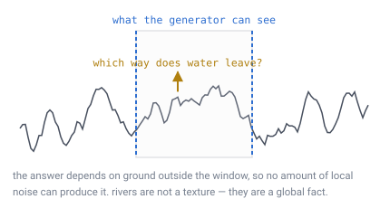
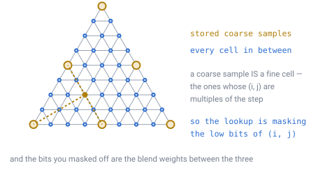
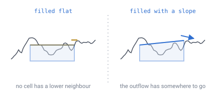
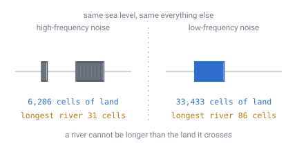

# 21 — Rivers, erosion and continents

## The problem

Everything the generator has done so far is a **pure function of position**. Hand
it a point, it hands back terrain, and it never needs to look at anything else.
That is what makes chunks independent, level-of-detail possible
([doc 14](14-meshing-and-lod.md)), and a fresh planet a hundred bytes on disk
([doc 07](07-data-structures.md)).

A river cannot be written that way, and it is worth seeing exactly why.



*The generator only ever sees the window. Where the water on that hilltop ends up
depends on ground outside it — possibly kilometres outside it. No amount of local
noise can answer the question, because the answer is not local.*

The same is true of the other two. **Erosion** carves a valley in proportion to
how much water passes through it, which means knowing everything upstream.
**Continents** are shaped by plates colliding across the whole planet. All three
are global, and local generation is exactly the thing that cannot do global.

[Doc 08](08-terrain-generation.md) named the three and sketched a fix in a
paragraph. This document designs it.

---

## The two-tier fix

**Compute a coarse map of the whole planet once, at world creation, and store it.**
Then let the per-chunk generator read it as an input, exactly as it reads the
seed.

That is the only stored terrain in the design, and it does not break the pure-
function property — it moves the global work to a moment when the whole planet is
in memory, and leaves the runtime generator local.

> **[verified]** `verification/rivers.js`, section 2.
>
> | Coarse level | Cells | At 4 bytes | One coarse cell, R = 1,700 m |
> |---|---|---|---|
> | 6 | 40,962 | 0.16 MB | 32.0 m |
> | 7 | 163,842 | 0.63 MB | 16.0 m |
> | **8** | **655,362** | **2.50 MB** | **8.0 m** |
> | 9 | 2,621,442 | 10.0 MB | 4.0 m |
> | 10 | 10,485,762 | 40.0 MB | 2.0 m |

**Level 8 is the recommendation**, at 2.5 MB. A coarse cell is 8 m across, so a
river channel is about one coarse cell wide before the fine generator adds detail
to its banks. That is the right scale: the coarse map should carry *where the
river is*, not what it looks like.

### The lookup, and a correction to doc 08

[Doc 08](08-terrain-generation.md) says the coarse map is found by "masking its
ID". That is nearly right and worth stating precisely, because the obvious reading
is wrong: truncating an ID's **path digits** gives the containing *triangle* — a
chunk — not a coarse *cell*.

What actually lines up is the lattice.

> **[verified]** `verification/rivers.js`, section 1. A level-8 lattice point
> `(i, j)` and the level-11 point `(8i, 8j)` are the **same point** — separation
> `0.00e+0` over every sample tested. This is the nesting `taper.js` found: cell
> *centres* nest exactly even though cell *areas* never do.



*A coarse sample is not a different kind of thing — it is one of the fine cells,
the ones whose `(i, j)` are multiples of the step. So finding the three that
surround any cell is masking the low bits off `(i, j)`, and the bits you masked
off are the blend weights between them.*

So the lookup is: **mask the low bits of `(i, j)` to get the three surrounding
coarse samples, and use the remainder as barycentric weights.** No second spatial
structure, no interpolation scheme to invent, and it costs a shift and a blend.

---

## Routing water downhill

Give every coarse cell one rule: **flow to your lowest neighbour.** That is the
whole of flow routing, and on this grid it comes out unusually clean.

> **[verified]** `verification/rivers.js`, section 3. Level 7, 163,842 cells, sea
> level set so 30% of the surface is land as on Earth.
>
> Of the twelve pentagons, **0 are pits** — against 0.2 expected if they behaved
> like any other cell.

**A pentagon picks the lowest of five instead of six. That is the entire
difference.** No special case, no correction, nothing to write. This is the same
result [doc 16](16-lighting.md) got for light, and for the same reason: the rule
only ever compares a cell against its own neighbours, so it never has to know how
many there are. Face crossings are equally invisible, because `neighbour()`
already absorbs them ([doc 05](05-face-adjacency.md)).

### The real algorithm is filling the holes

Routing is trivial. What is not trivial is that **1.39% of land cells have no
lower neighbour at all** — noise makes dips, and water arriving in one has nowhere
to go. Leave them and most of the planet drains into a hole rather than the sea,
and there is no connected network to speak of.

The fix is standard and worth naming: **priority-flood**. Start from the ocean and
grow inward, raising each cell to the lowest level that still lets it drain. A
raised region is a lake.

But there is a trap inside it that is easy to leave out and fatal to leave out.



*Fill a basin to a perfectly flat level and no cell in it has a lower neighbour —
so every river that reaches the lake stops dead in it. Add a tiny slope while
filling and the water has somewhere to go. The slope is far too small to see; it
exists only so the "flow to your lowest neighbour" rule keeps working.*

> **[verified]** `verification/rivers.js`, section 4. After a priority-flood with
> that slope: **2,369 cells raised into lakes** (4.8% of land), largest single
> raise 0.10 of the height range, and **0 cells left with nowhere to go.**

Without the slope, every one of those 2,369 lake cells is a dead end. With it,
the network is connected from every hilltop to the sea.

### Drainage, and what counts as a river

Once every cell has a downhill neighbour, sort by height and accumulate: each cell
passes its own area plus everything above it to the cell below. One pass.

> **[verified]** `verification/rivers.js`, section 5. Cells whose upstream area
> exceeds a threshold, as a share of land:
>
> | Upstream cells | Qualifying cells | Share of land |
> |---|---|---|
> | 20 | 3,703 | 7.53% |
> | 100 | 563 | 1.15% |
> | 500 | 29 | 0.06% |

The threshold is the design knob: it decides what is a stream and what is a river,
and it costs nothing to change because the drainage number is already computed for
every cell.

The whole pass — noise, routing, filling, accumulation — took **1.2 seconds for
163,842 cells**. Level 8 is four times that, so a few seconds, once, at world
creation. **This is not a runtime cost.**

---

## The finding: continents decide rivers

The first run produced rivers that were far too short — a longest flow path of 46
cells, 0.74 km, on a planet 10.68 km around. That looked like a bug and was not.

> **[verified]** `verification/rivers.js`, section 6. Same sea level, same
> everything, only the noise frequency changed:
>
> | Noise frequency | Biggest landmass | Longest river |
> |---|---|---|
> | 6.0 | 6,206 cells | 31 cells = 0.50 km |
> | 3.0 | 15,352 cells | 46 cells = 0.74 km |
> | 1.5 | 31,615 cells | 85 cells = 1.36 km |
> | 0.8 | 33,433 cells | 86 cells = 1.38 km |



*Lower the frequency, the continents grow, and the rivers grow with them. A river
cannot be longer than the land it crosses, so the length of your rivers is decided
before any water is routed.*

**So the three problems doc 08 lists are not independent — they are ordered.**
Plain fBm makes many small blobs, and small blobs give streams no matter how good
the routing is. Fix the continents first, and the rivers come along for free.

That reorders the work, and it is the most useful thing this document found.

---

## Continents, and where they come from

The tier that has to exist before the others are worth building. Two approaches,
and this document recommends the second.

**Low-frequency noise.** Cheap: turn the frequency down until the landmasses are
large. The table above shows it works — 0.8 gives a 33,433-cell landmass. What it
does not give is *structure*: no shelves, no mountain ranges along collision
boundaries, no reason for anything to be where it is.

**Plates.** Scatter a few dozen seed points, assign each cell to its nearest seed
— which is a Voronoi diagram on the sphere, and the nearest-seed test is the same
`argmax` of dot products doc 04 uses for faces. Give each plate a drift direction
and an elevation bias. Where two plates push together, raise a range along the
boundary; where they pull apart, drop a rift.

Plates cost one extra field on the coarse map and buy the thing noise cannot
fake: **geography that has a reason.** They also compose with everything above —
the plate field raises the coarse heights, and routing, filling and accumulation
run on the result unchanged.

**Recommendation:** plates set the coarse heights, erosion carves them, rivers
follow. In that order, because each stage needs the one before it.

---

## Erosion

With drainage in hand, erosion is one line applied repeatedly to the coarse map:

```
lower each cell by  k · (upstream area)^m · (local slope)^n
```

That is the **stream-power law**, and it is the reason real mountains have
V-shaped valleys instead of fractal lumps. A cell with a lot of water passing
through it cuts down faster, so valleys deepen where rivers already are, which
makes more water flow there. The feedback is the whole point.

Two practical notes, both about it being an offline pass:

- **Re-route between iterations.** Erosion changes the heights, which changes
  which neighbour is lowest, which changes the drainage. Running the flow routing
  once and then eroding many times gives valleys that ignore their own carving.
- **Re-fill between iterations too.** Erosion creates new dips, and a new dip is a
  new pit.

Both are cheap at 2.5 MB and neither happens at runtime.

---

## What the fine generator does with it

The per-chunk generator changes in one place. `surfaceRadius(direction)` from
[doc 08](08-terrain-generation.md) becomes:

```
coarse = blend of the three surrounding coarse samples     ← masked (i,j)
surfaceRadius = R · (1 + coarse + detail · fbm(direction · highFrequency))
```

The coarse term carries continents, erosion and river channels. The detail term
carries everything smaller than 8 m. **Both are still pure functions of
position** — the coarse map is an input, like the seed, so nothing about chunk
independence, level-of-detail or determinism changes.

A river is then a channel already cut into the coarse heights, plus a material
rule: below the channel floor, water instead of air. The fine generator does not
need to know it is drawing a river.

---

## What this forces elsewhere

- **[Doc 07](07-data-structures.md)** gains one stored artefact: a 2.5 MB coarse
  map, written once at world creation and read-only thereafter. It is the only
  terrain on disk that is not a player delta.
- **[Doc 08](08-terrain-generation.md)**'s height-field term gains the coarse
  blend, and its "masking its ID" sentence needs the correction above.
- **World creation** gains a step measured in seconds, which did not exist before.
- **[Doc 14](14-meshing-and-lod.md)** is unaffected: a coarse chunk reads the same
  coarse map at the same place, so LOD still works by re-evaluating a function.
- **Sea level** becomes a parameter of the coarse pass rather than a constant,
  since it decides how much land there is and therefore how long the rivers get.

---

## Still open

- **How many plates, and how they drift.** This document argues for plates and
  does not size them. Too few gives a world of continents the size of oceans; too
  many gives noise with extra steps.
- **What the stream-power exponents should be.** `m` and `n` are the shape of
  every valley on the planet and are usually tuned by eye. Nothing here measures
  what they should be.
- **Whether lakes should survive.** The fill turns 4.8% of land into lakes, which
  is a lot of lakes. Some of them are real features and some are artefacts of the
  noise; nothing distinguishes them yet.
- **Rivers below the coarse resolution.** At level 8 a channel is 8 m wide. A
  stream narrower than that has nowhere to live in the coarse map, so either the
  fine generator invents small tributaries locally — with no guarantee they
  connect — or small streams simply do not exist.
- **What happens where a river meets a player's edits.** A dammed river has no
  representation: the coarse map is read-only, so the delta store would have to
  carry the change, and the flow field would not know about it.

---

## In one breath

- Rivers, erosion and continents are **global**, and local generation cannot do
  global. The fix is one **coarse map, computed once and stored** — **2.5 MB at
  level 8**, where a coarse cell is 8 m.
- The lookup is masking the **low bits of `(i, j)`**, not the path digits, because
  a coarse sample is literally one of the fine cells and the bits you mask off are
  the blend weights.
- **Flow routing needs no pentagon case and no face case** — 0 of the 12 pentagons
  were pits, because the rule only compares a cell to its own neighbours.
- The real algorithm is **filling the pits**, and the trap inside it is that a
  perfectly flat lake stops every river that reaches it. Fill **with a tiny
  slope**: 2,369 lake cells and **0 dead ends**.
- **Continents decide rivers.** The same routing gives a 31-cell river on small
  blobs and an 86-cell river on a large landmass, so build the continent tier
  first — the three problems are ordered, not independent.
- All of it is **world-creation cost**, seconds once, and the runtime generator
  stays a pure function of position.
