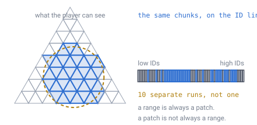
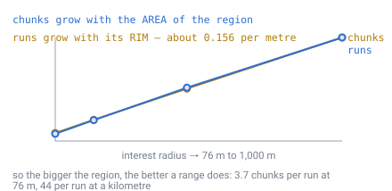
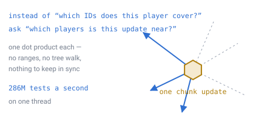

# 22 — Multiplayer interest management

## The problem

A player mines a block. The server has to work out who should be told.

Send it to everyone and a hundred-player world spends its bandwidth describing
edits nobody can see. Send it to nobody and blocks change behind people's backs.
So the server needs a cheap answer to one question, thousands of times a second:
**which players care about this chunk?**

[Doc 11](11-open-topics.md) has always listed this as the easy one — "an **ID
range comparison**; the addressing scheme does the work" — and filed it as
specifying rather than inventing.

The conclusion is right. The reason given for it is not, and the difference
matters, because building the thing doc 11 describes would be building the wrong
thing.

---

## A range is a patch. A patch is not a range.

[Doc 03](03-addressing.md) proves something real: a contiguous run of IDs is
exactly one subtree, which is exactly one compact patch of surface. Truncate the
low bits and you have the containing chunk. That is true and load-bearing, and it
is what makes streaming-by-proximity and disk layout work.

The temptation is to read it backwards — if a range is a patch, surely a patch is
a range? It is not, and a picture settles it faster than an argument.



*The player sees a disc. The tree stores triangles. A disc does not line up with
any subtree, so the chunks a player can see land on the ID line in several
separate pieces — and the pieces have other players' chunks in between them.*

> **[verified]** `verification/interest.js`, on the [doc 06](06-world-sizing.md)
> planet at `D` 11 and chunk level 6 — 81,920 chunks, each about 32 m across.
>
> | Interest radius | Chunks in range | Contiguous ID runs | Chunks per run |
> |---|---|---|---|
> | 76 m | 41 | **10.9** | 3.73 |
> | 200 m | 289 | **31.4** | 9.22 |
> | 500 m | 1,765 | **80.2** | 22.00 |
> | 1,000 m | 6,884 | **155.6** | 44.24 |

At a standing player's horizon it is **eleven** ranges, not one. At a kilometre it
is a hundred and fifty.

**See it break up:** [`demos/patch-vs-range.html`](../demos/patch-vs-range.html)
draws one face split into 4,096 chunks and colours a player's disc by ID run —
one colour per unbroken range. Drag the circle and it is never one colour. Widen
it and the two numbers pull apart in front of you, which is the whole finding:
chunks grow with the **area** you can see and runs only with its **rim**, so the
demo goes from 2.4 chunks per run at close range to 26 at long range.

### Changing the walk order does not rescue it

The obvious next move is to blame the traversal order and go looking for a better
space-filling curve.

> **[verified]** Same script, section 2, at a 300 m radius:
>
> | Child order | Chunks | Runs | Chunks per run |
> |---|---|---|---|
> | naive `[0,1,2,3]` | 650 | 55.7 | 11.67 |
> | doc 03's `[0,3,1,2]` | 632 | 48.6 | 12.99 |

About 13% better, and that is all there is to win.
[Doc 03](03-addressing.md) already explains why: `order.js` proved the four
children of a triangle **cannot** be walked edge-to-edge — the adjacency graph is
a star, so the best any order achieves is 2 of 3 steps adjacent. The curve has to
jump. **Fragmentation is a property of the tree, not of the walk**, and no
cleverer ordering is waiting to be found.

### What the numbers do say

Look at the two columns again. Chunks grow as the **area** of the region, runs
grow as its **rim**.



*Runs come out at about 0.156 per metre of radius across the whole range — a
straight line — while chunks go as the square. So ranges get **better** the bigger
the region: 3.7 chunks per run at the horizon, 44 per run at a kilometre.*

That is the useful shape of the result, and it points at what ranges are actually
for.

---

## Ask the other question instead

The fix is not a better index. It is noticing that the question was pointed the
wrong way.

Doc 11 asks: *given a player, which IDs do they cover?* That is the expensive
direction, because it means turning a disc into a set of ranges. Turn it round and
ask: *given an update, which players are near it?*



*One comparison per player. No ranges to compute, no tree to walk, and no derived
structure that has to be kept in step with players as they move.*

Both the update and the player are directions on a sphere, so "near" is one dot
product against a cosine threshold — the same test [doc 04](04-position-lookup.md)
uses to pick a face.

```
if (dot(updateDirection, playerDirection) > cos(interestRadius / R))
    send it
```

> **[verified]** `verification/interest.js`, section 3. 20,000 updates against 200
> players — 4.0M tests — clears **100 million tests per second** on one thread.
> The script reports the rate it actually saw as well, but that is a wall-clock
> timing: it moves 30% between runs on the same machine, so the order of
> magnitude is the claim and the reading is not.

A busy server does not produce twenty thousand chunk updates a second. **The whole
problem is smaller than the machinery doc 11 imagined for it**, and it needs no
addressing tricks at all.

Two things follow:

- **Interest is per entity, not per chunk.** It uses the same anchor-and-offset
  position [doc 15](15-precision-and-origin.md) already stores, and needs nothing
  new on disk or in RAM.
- **It degrades the right way.** Fifty times the players is fifty times the work,
  and at that point you bucket players by coarse chunk and test buckets instead —
  the standard fix, reached only when the numbers say so.

---

## Where the ID ordering does earn its keep

The ranges are not useless. They are just answering a different question.

> **[verified]** `verification/interest.js`, section 4. One player at 300 m:
> **583 chunks in 37 runs**, and the **five largest runs cover 364 of them — 62%**.

That is a **disk** result, not a networking one. When a player logs in or walks
into new territory, the server has to fetch their region from storage. A handful
of long sequential reads gets most of it, and the tail is singletons. On spinning
storage that is the difference between a stutter and none; on any storage it is
better than 583 random seeks.

So the addressing scheme does do the work doc 11 credits it with — for
**streaming and storage layout**, which is exactly what
[doc 03](03-addressing.md) claimed for it in the first place. It was never a
networking mechanism, and reading it as one is what produced the wrong plan.

---

## What to send, and when

Interest answers *who*. Two smaller questions finish the design, and both are
already decided elsewhere.

**What travels.** A block edit is a delta ([doc 08](08-terrain-generation.md)):
a cell ID and a new block state. [Doc 03](03-addressing.md) packs both into one
57-bit word — 41 bits of address plus 16 of state. **One edit is one word on the
wire**, which is small enough that batching matters more than compression.

**What a joining player gets.** Not the world — the world is a seed
([doc 07](07-data-structures.md)). They get the seed, the coarse map from
[doc 21](21-rivers-and-erosion.md), and the deltas for the chunks in range. A
pristine region costs nothing to send because there is nothing to send.

**When interest changes.** A player crossing into a new chunk gains and loses
chunks at the rim. That is the same boundary crossing
[doc 15](15-precision-and-origin.md) measured for rebasing — about every 23
seconds at `C` 6 walking pace — so the interest set is recomputed on a timescale
of tens of seconds, not per frame.

---

## What this forces elsewhere

- **Nothing structural.** This is the only document in the specification that
  adds no invariant, no stored data and no constant.
- **[Doc 03](03-addressing.md)**'s traversal order keeps its justification, but it
  is a storage-locality justification and should not be quoted as a networking
  one.
- **[Doc 11](11-open-topics.md)**'s "ID range comparison" wording is corrected
  here.
- **The server needs a player position per client**, which it has anyway, and
  nothing else.

---

## Still open

- **Interest radius versus render distance.** They are not the same number — a
  player should probably be told about edits slightly beyond what they can see, so
  the world is correct the moment it comes over the horizon. How much slack is a
  tuning question nothing here measures.
- **Entities, not blocks.** This document is about chunk updates. Moving entities
  need interest too, and they move continuously rather than in chunk steps, so the
  crossing rate above does not apply to them.
- **Authority and conflict.** Two players editing the same cell is a
  consistency question this document does not touch.
- ~~Whether the coarse map is sent or regenerated~~ — **answered** by
  [doc 23](23-determinism.md): **regenerate it.** The generator is built from
  operations IEEE 754 pins to the bit, so a client reproduces the map exactly,
  provided the noise uses an integer hash and the erosion exponents come from the
  exact set. The 2.5 MB never goes on the wire.

---

## In one breath

- The question is **which players care about this update**, thousands of times a
  second.
- Doc 11 said an **ID range comparison**. A range is a patch, but **a patch is not
  a range**: a player's disc breaks into **10.9 runs at 76 m** and **155.6 at a
  kilometre**.
- **The walk order cannot fix it** — `order.js` already proved the four children
  cannot be walked edge-to-edge, so the curve jumps whatever you choose. Doc 03's
  order wins about 13%.
- Runs scale with the region's **rim**, chunks with its **area**, so ranges get
  better as regions get bigger — 3.7 chunks per run at the horizon, 44 at a
  kilometre.
- **Turn the question round.** Test each player against each update: one dot
  product, comfortably over **100M per second**, no index and nothing to keep in
  sync.
- The ID ordering earns its keep on **disk** instead — five runs fetch **62%** of
  a player's region sequentially.
