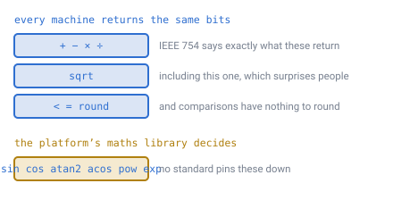
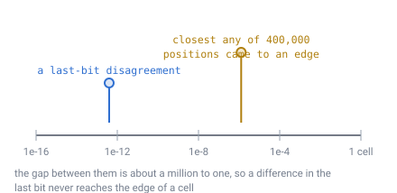
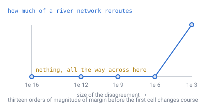

# 23 — Determinism across machines

## The problem

Two computers run the same generator on the same seed. Do they get the same
world?

If they do not, the consequences are not subtle. A client draws ground the server
thinks is air. A player mines a block that is not there. A river runs through a
village on one machine and around it on another. And none of it shows up in
testing, because two machines in the same office usually agree — it is the player
on different hardware, months later, who finds it.

[Doc 15](15-precision-and-origin.md) raised this and left it open, noting only
that `float64` "is not bit-identical across platforms for transcendental
functions, and `normalize` uses a square root".
[Doc 22](22-multiplayer-interest.md) then leaned on the answer: a joining client
can skip downloading [doc 21](21-rivers-and-erosion.md)'s 2.5 MB coarse map only
if it can regenerate it exactly.

This document closes it, and the answer is better than doc 15's phrasing
suggested — one of the two things it worried about is not a worry at all.

---

## Floating point comes in two kinds

The word "floating point" hides a distinction that decides everything here.

**IEEE 754 pins some operations down exactly.** Addition, subtraction,
multiplication, division and **square root** are all required to be *correctly
rounded*: compute the exact mathematical result, then round it to the nearest
representable value. There is only one right answer, and every conforming machine
returns it, bit for bit.

**It says nothing about the rest.** `sin`, `cos`, `atan2`, `acos`, `exp` and `pow`
come from whatever maths library the platform ships. They are usually accurate to
within a bit or two, and *which* bit they land on differs between implementations,
between versions, and sometimes between compiler flags.

*The surprise for most people is `sqrt` sitting in the top group. It is exactly
specified, which matters here because `normalize` — the operation under gravity,
every frame and every position lookup — is a square root and three divisions.*

So `normalize` is safe. Doc 15 named it as a worry and it is not one.

That reframes the whole question. It is not "how much do machines drift apart?"
It is **"does this code path call a transcendental at all?"**

---

## Auditing the paths

> **[verified]** `verification/determinism.js`, section 1.
>
> | Path | Built from | Same bits everywhere? |
> |---|---|---|
> | position → cell ([doc 04](04-position-lookup.md)) | `+ − × ÷` compare round | **yes** |
> | ID → position ([doc 15](15-precision-and-origin.md)) | `+ − × ÷ sqrt` | **yes** |
> | `up = normalize(pos)` ([doc 13](13-gravity-and-orientation.md)) | `+ − × ÷ sqrt` | **yes** |
> | value / gradient noise ([doc 08](08-terrain-generation.md)) | `+ − × ÷` integer hash | **yes** |
> | ray walk ([doc 09](09-ray-traversal.md)) | `+ − × ÷` compare | **yes** |
> | lat / long readout ([doc 20](20-player-coordinates.md)) | `asin` `atan2` | no — display only |
> | horizon and distances ([doc 13](13-gravity-and-orientation.md)) | `acos` | no — display only |
> | stream power ([doc 21](21-rivers-and-erosion.md)) | `pow` | no — see below |

**The entire runtime is in the top group.** Finding a cell, placing a block,
walking a ray, generating terrain, computing gravity — all of it is arithmetic the
standard pins to the bit.

The two display rows do not matter, and the reason is precise. A latitude
readout that differs in the twelfth decimal
between two players is a difference nobody can observe and nothing acts on. It is
printed, not stored and not compared.

**Noise gets a condition attached**, which is the one thing to be careful about:
"if written without trig". Value and gradient noise need only an integer hash and
polynomial blending. Some implementations reach for `sin` as a cheap hash — that
one choice would move terrain generation from the top group to the bottom.

---

## How much room is there, anyway?

Suppose two machines *did* differ somewhere. How close to the edge does a position
have to be for that to change which cell it is in?

> **[verified]** `verification/determinism.js`, section 2. 400,000 random
> positions, measuring how far each sits from the boundary where `hexRound` would
> pick a different cell:
>
> | Within | Share of positions |
> |---|---|
> | 1e−3 of a cell | 1.72e−2 |
> | 1e−4 | 3.04e−3 |
> | 1e−5 | 3.80e−4 |
> | closest seen | **1.21e−6 of a cell** |

The share falls in step with the threshold, which is what a uniform spread across
the cell produces — so it extrapolates downward safely.

Now the other number. One ULP of a unit direction is **2.22e−16 radians**, and a
cell at `D` 11 is **5.88e−4 radians** across. A last-bit disagreement is therefore
**3.8e−13 of a cell.**

*A million to one, and that is against the closest approach in four hundred
thousand samples, not the typical one. Extrapolating the table, a last-bit
disagreement would change the answer about once in 2.6e12 positions.*

> **[verified]** Section 3. The disagreement **does** amplify through the pipeline
> — by up to **286×** — and it still does not matter: the worst displacement
> measured was **5.76e−13 of a cell**, under a millionth of the closest any
> sampled position came to an edge.

---

## The fear that turned out to be misplaced

Flow routing ([doc 21](21-rivers-and-erosion.md)) looks like the dangerous case,
and I expected it to be. It is a chain of **comparisons** — "is my neighbour
lower?" — and a comparison has no tolerance in it. A difference far below any
threshold you would name can still flip the branch, and everything downstream
follows the other way.

That reasoning is sound. The measurement says it does not happen.

> **[verified]** `verification/determinism.js`, section 4. Perturbing every cell's
> height independently by one ULP, up or down at random, changed the downhill
> neighbour of **0 of 40,962 cells**.
>
> | Disagreement | Cells that reroute |
> |---|---|
> | 2e−16 (one ULP) | 0 |
> | 1e−12 | 0 |
> | 1e−9 | 0 |
> | 1e−6 | 0 |
> | 1e−3 | 971 (2.37%) |

*Nothing moves until 1e−3 — about thirteen orders of magnitude above a last-bit
disagreement. Two neighbours on a continuous height field are essentially never
within a last bit of each other, so the comparison has an enormous margin.*

**So the risk was never that small differences get amplified. It is only whether a
difference is introduced at all.** That is a much easier problem, because it is a
rule about which functions you call rather than a tolerance to manage.

---

## Which makes erosion a choice, not a constraint

That leaves one real exposure: the stream-power law from
[doc 21](21-rivers-and-erosion.md) raises drainage area to a power, and `pow` is
exactly the operation the standard leaves open.

But the exponent is ours to pick.

> **[verified]** `verification/determinism.js`, section 5.
>
> | Exponent | Written as | Deterministic? |
> |---|---|---|
> | `m = 0.5` | `sqrt(x)` | **yes** |
> | `m = 1` | `x` | **yes** |
> | `m = 1.5` | `x · sqrt(x)` | **yes** |
> | `m = 2` | `x · x` | **yes** |
> | `m = 0.45` | `pow(x, 0.45)` | **no** |

Half-integer exponents are products of `sqrt` and multiplication, both exactly
specified. Only an arbitrary real exponent needs `pow`.

Stream-power exponents are tuned by eye anyway — nothing measures what they should
be ([doc 21](21-rivers-and-erosion.md) says so). **So take them from
`{0.5, 1, 1.5, 2}` and the offline pass becomes bit-identical too**, at no cost to
the terrain.

Which settles doc 22's question: **the client may regenerate the coarse map, and
the 2.5 MB does not need sending.**

---

## The rule

**Never call a transcendental where its result feeds a stored or shared value.**

That is the whole discipline, and it is checkable by reading code rather than by
measuring output. Three places it bites:

- **Noise must use an integer hash**, never `sin` as a cheap substitute.
- **Erosion exponents come from the exact set.**
- **Anything that becomes a cell ID, a block state or a stored height** stays in
  the top group.

The freedoms it grants are broader than the restriction:

- **Display code may use anything.** Latitude, distances, the horizon, the compass
  — all transcendental, all fine, because nothing compares them across machines.
- **`normalize` is safe**, so gravity, all three frames of
  [doc 13](13-gravity-and-orientation.md), and doc 04's whole pipeline need no
  special handling — **provided it is written as `sqrt(x*x + y*y + z*z)`**.
  `hypot` is a library routine rather than an IEEE operation, and
  [doc 28](28-language-and-runtime.md) measured it **one ULP apart** between
  runtimes on a single machine. So is `pow`. The rule below is about which
  *function is called*, and `hypot` is on the wrong side of it.
- **No fixed-point arithmetic is needed**, which is the usual heavy-handed answer
  to this problem and would have cost the design its `float64` world positions.

### Two things this does not cover

- **Compiler contraction.** A compiler may fuse `a*b + c` into a single
  fused-multiply-add, which is *more* accurate and therefore *different*. It is
  usually controlled by a flag (`-ffp-contract=off`, or the language's strict-float
  mode). This is a build-configuration question, not a design one, but it has to be
  set deliberately.

  > This paragraph was written as a caveat and turned out to be the whole story.
  > [Doc 28](28-language-and-runtime.md) measured it: contraction is the **only**
  > thing that breaks bit-identity in the entire experiment, one C source gives
  > **four different digests** under different flags, and on `aarch64` the
  > contracting build is the **default** because FMA is in that baseline. It also
  > found the flag is *necessary but not sufficient* — `-Ofast` undoes it. That is
  > what chose the language.
- **Reduction order.** Summing the same numbers in a different order gives
  different results, so anything parallelised over cells must accumulate in a fixed
  order. The drainage accumulation in [doc 21](21-rivers-and-erosion.md) sorts by
  height first, which already fixes it.

---

## What this forces elsewhere

- **[Doc 08](08-terrain-generation.md)**'s noise gains a requirement: integer hash,
  no trigonometry.
- **[Doc 21](21-rivers-and-erosion.md)**'s exponents are restricted to the exact
  set, and its open "what should `m` and `n` be" question narrows accordingly.
- **[Doc 22](22-multiplayer-interest.md)**'s open question is answered: regenerate
  the coarse map client-side rather than sending it.
- **[Doc 15](15-precision-and-origin.md)**'s "determinism across clients" entry is
  closed, and its worry about `normalize` withdrawn.
- **The build configuration** must disable floating-point contraction, which is the
  one thing here that lives outside the source code.

---

## Still open

- ~~Nothing verifies the rule.~~ — **mostly closed** by
  [doc 28](28-language-and-runtime.md). This document said a real check "would run
  the generator on two genuinely different platforms and compare hashes, which
  cannot be done from inside one script". It can be done one level down: run the
  kernel in **six languages** on one machine, and six different compilers, six
  optimisers and six runtimes all land on **one digest** over 80,000 `float64`s.
  What remains open is the original wording — two different *platforms*, which
  still needs an ARM machine and a diff.
- **GPU determinism is a separate question and mostly a non-question.** Vertex
  positions are `float32` and chunk-local ([doc 15](15-precision-and-origin.md)),
  and nothing computed on the GPU feeds back into world state — so it may differ
  freely. That holds only as long as it stays true.
- ~~Which language and runtime.~~ — **closed**: **Rust**, see
  [doc 28](28-language-and-runtime.md). This document guessed that languages are
  "similar but not identical" and that the choice should be made knowing it. They
  turned out to be *identical*, all six of them, and the decision was made on
  garbage collection and on compiling to WebAssembly instead.

---

## In one breath

- Floating point comes in **two kinds**: `+ − × ÷ sqrt` and comparisons are
  **exactly specified** and identical on every conforming machine; `sin`, `cos`,
  `acos`, `pow` are whatever the platform's library does.
- **`sqrt` is in the safe group**, so `normalize` is safe — which withdraws doc
  15's stated worry.
- **The whole runtime is in the safe group**: position → cell, ID → position,
  gravity, the ray walk, and integer-hashed noise.
- A last-bit disagreement is **3.8e−13 of a cell**, against **1.21e−6** for the
  closest any of 400,000 positions came to an edge — a **million to one**, even
  after the pipeline's 286× amplification.
- **Flow routing is not the hair trigger it looks like.** One ULP reroutes **0 of
  40,962 cells**, and nothing moves until 1e−3 — thirteen orders of margin.
- So the rule is about **function calls, not tolerances**: never call a
  transcendental where the result is stored or shared. Take erosion exponents from
  `{0.5, 1, 1.5, 2}` and even the offline pass is bit-identical, so doc 22's
  client can regenerate the coarse map instead of downloading it.
