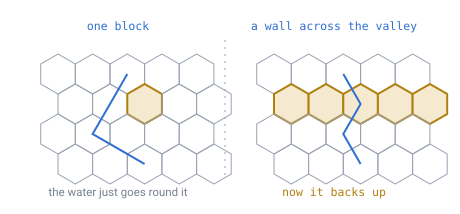
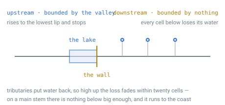
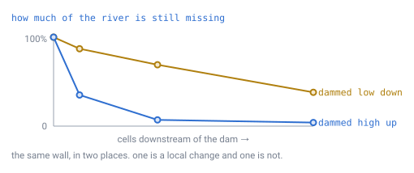

# 24 — Player edits and global processes

## The problem

A player builds a wall across a river.

Everything about the design says that should work. Blocks are player-owned: the
delta store records every divergence from the generated world and wins over it
([doc 08](08-terrain-generation.md)). Put a block anywhere and it stays.

But the river is not blocks. It comes from the coarse map in
[doc 21](21-rivers-and-erosion.md) — computed once at world creation, stored, and
**read only**. That map still says the river runs through the wall, and it will
say so forever.

So the two halves of the persistence model look like they disagree, and this is
the only place they do. Everything else a player can touch is local: mine a block,
place a block, light a torch. Water looks like the first thing where the
consequence of an edit is not where the edit is.

It turns out not to be, and the way out is simpler than the problem. But the
measurements come first, because they are what rules out the alternative.

---

## First: one block dams nothing

The obvious mental model — a player drops a block in the river and the water stops
— does not survive contact with the grid.

> **[verified]** `verification/edits.js`, section 2. A site carrying 354 upstream
> cells, walled to 2% of the world's height range:
>
> | Wall spans | Cells raised | Cells flooded | Lake reaches |
> |---|---|---|---|
> | 1 cell | 1 | **0** | 0 m |
> | 3 cells | 7 | 1 | 16 m |
> | 5 cells | 19 | **29** | 144 m |
> | 7 cells | 37 | 32 | 128 m |

*A cell has six ways out, so blocking one leaves five. The water goes round, and
nothing backs up at all. Damming a river means building a wall that spans the
channel — which is what damming a river means in real life too.*

That is worth knowing before designing anything, because it changes who is
affected. Not "any player who places a block near water" but "a player who
deliberately built a structure across a valley". **The case is rarer than it
sounds**, and rarer still because most of the land is not river:

> **[verified]** Same script, section 1. Cells carrying at least 200 upstream
> cells are **1.62% of land**; at least 1,000, **0.08%**.

---

## Then: the two directions are not alike

Once a wall does span the channel, the consequences run two ways — and only one of
them is bounded.

*Upstream, the water rises until it finds the lowest way out of the valley and
stops. That limit comes from the terrain and has nothing to do with how big the
river was. Downstream, every cell below the wall has lost its water, and nothing
in the geometry says where that stops.*

**Upstream would be bounded by terrain.** Water rises to the lowest lip and stops
— 29 cells and 144 m in the measurement above. That is a patch, and a patch is the
kind of thing a bounded job could own.

**Downstream would be bounded by nothing obvious.** Every cell below has lost the
flow the wall holds back, and what that costs depends entirely on what joins the
river underneath — which is why the next measurement is the one that matters.

---

## Where you dam decides whether the change is local

This is the result the document turns on, and it is not what I expected before
measuring it.

> **[verified]** `verification/edits.js`, section 3. The longest flow path on this
> world is 84 cells — 1,344 m. "Deficit" is the share of the flow still missing.
>
> | Dam position | Held back | After 5 | After 20 | After 50 | Reaches the sea? |
> |---|---|---|---|---|---|
> | 74 cells from the sea | 31 | 35% | 7% | **4%** | **no** |
> | 50 from the sea | 499 | 87% | 69% | 38% | yes |
> | 25 from the sea | 64 | 86% | 25% | — | yes |
> | 8 from the sea | 234 | 93% | — | — | yes |

*Dam a headwater and the tributaries below refill the river — the loss is down to
4% within twenty cells and the coast never hears about it. Dam a main stem and
there is nothing below big enough to make up the difference, so it runs all the
way down.*

**The same wall is a local change in one place and a global one in another.**
That is why no single rule covers it, and it is the thing to design around rather
than legislate away.

---

## The decision: the coarse map stays read-only

**The coarse map is never modified by a player edit.** It keeps the status the
seed has — an input, computed once, identical for everyone, and the thing a client
regenerates rather than downloads ([doc 23](23-determinism.md)).

Three reasons, and the third is the one that settles it.

**It would break determinism's payoff.** [Doc 23](23-determinism.md) closed by
showing a client can regenerate the 2.5 MB coarse map exactly instead of
downloading it. That holds only while the map is a pure function of the seed. Make
it writable and every client must be sent the diffs, and the map becomes a second
save file to version, merge and repair.

**The write is cheap and the consequence is not.** An override layer is small — a
100 m pond is **1.9 KB**, 0.07% of the map. Storage was never the obstacle. The
obstacle is that changing one coarse cell invalidates the drainage of everything
downstream of it, and re-running the global pass on every dam is not a runtime
operation ([doc 21](21-rivers-and-erosion.md) measures it in seconds).

**And a partial recompute has no natural boundary.** The table above is the
argument: sometimes the affected region is twenty cells and sometimes it is the
whole river. You cannot pick a radius, because the right radius depends on the
topology of the network above and below the edit.

---

## What happens instead: water is blocks, and blocks do not move

Everything above assumed water is a *process* that a wall interferes with. It is
not. Water in this design is a **material**, placed once and then as inert as
stone.

**This is a construction toy, not a planetary simulator.** The nearest thing to
it is a box of hexagonal Lego. Erosion and flow routing exist to *shape the world
at creation* — they carve valleys, cut channels, and decide where lakes sit. Once
that is done they are finished, and what they leave behind is blocks.

So the rule is one sentence:

> **Water is a block type: translucent, placeable, and with no collision. It is
> written by the generator at world creation and never moves again.**

Which answers the dam immediately, and not the way the sections above were
heading. **Nothing happens.** The player gets a wall standing in a river. The
water blocks upstream of it stay exactly where they were; so do the ones
downstream. Nothing fills, nothing drains, nothing is recomputed.

That is not a compromise reached under protest. It is the same rule every other
block already obeys:

- Mine the base of a mountain and the mountain does not collapse.
- Remove a supporting beam and the roof stays up.
- Wall a river and the water stays put.

**The consistency is the feature.** A player who has understood one block has
understood all of them, and there is no special material with its own physics to
learn, explain, or be surprised by.

---

## What the measurements are worth now

They price the option not taken, which is worth keeping rather than deleting.

If water *were* simulated, the numbers above say what that would cost. Upstream a
local flood fill would be bounded and affordable — 29 cells, 144 m, a patch a
chunk-sized job could own. Downstream it would be unbounded and, worse,
**unboundable**: a headwater dam settles within twenty cells while a main-stem dam
runs to the coast, so there is no radius to pick.

| | Water as blocks | Water simulated |
|---|---|---|
| Client regenerates the coarse map | **yes** ([doc 23](23-determinism.md)) | only if the sim is deterministic too |
| Cost per dam | **nothing** | a flood fill, then an unbounded re-route |
| Bounded work | **yes** | no natural radius |
| Rules a player must learn | **one, shared with every block** | a second physics |
| Dam holds back water | no | yes |

One row is wrong on the left, and it is the row a player is least likely to have
strong expectations about in a game made of blocks. Four are wrong on the right,
and "no natural radius" is a design problem rather than a performance one — there
is no correct answer to *how much* to recompute.

---

## The general rule

Rivers are the first case, not the only one. The same shape appears wherever a
global precomputed fact meets a local edit, so it is worth stating once:

> **A precomputed global map is a statement about the generated world, never about
> the current one.** Player edits are recorded in the delta store and interpreted
> on top of it. The map is never rewritten.

Two more cases it already covers:

- **Erosion.** A player who flattens a mountain does not get the valleys re-cut
  below it. The coarse heights still describe the mountain that was generated;
  the delta store says the blocks are gone. Nothing needs to reconcile them.
- **Continents and plates.** Terrain-scale structure is generated, and no amount
  of digging moves a plate boundary. Nobody expects otherwise, which is a useful
  check that the rule matches intuition in the easy cases before being applied to
  the hard one.

---

## What this forces elsewhere

- **[Doc 21](21-rivers-and-erosion.md)** gains a boundary on what it promises: the
  coarse map is where water would flow across generated terrain, and its
  read-only status is now a decision rather than an accident of implementation.
- **[Doc 08](08-terrain-generation.md)**'s delta store is unchanged, and is
  confirmed as the only writable terrain in the design.
- **[Doc 23](23-determinism.md)**'s regenerate-don't-send conclusion survives,
  because it depends on the map staying a pure function of the seed.
- **Water becomes a block type** — translucent, non-colliding, written by the
  generator and never simulated. What that costs to draw is
  [doc 25](25-water.md), and it closes [doc 14](14-meshing-and-lod.md)'s open
  question about transparency and sorting.
- **[Doc 22](22-multiplayer-interest.md)** is unaffected: editing water is editing
  a block, and travels the way every other edit does.

---

## Still open

- ~~Whether a player can place water at all~~ — **decided: they can**, in
  [doc 25](25-water.md). A bucket exists and a placed water block stays where it
  was put. Which is the same rule as above read forwards instead of backwards:
  if walling a river changes nothing, then placing water changes nothing either.
- **Whether players should be told.** A wall in a river that changes nothing is
  the sort of thing players explain to themselves, usually wrongly. Saying it
  once — water is a material, not a fluid — costs a sentence.
- **Erosion from player structures.** Nothing erodes after world creation. Real
  water would eventually cut round a wall, and the design has no mechanism for
  terrain changing later. That is a deliberate omission, not an oversight.

---

## In one breath

- The delta store is local and writable; the coarse map is global and read-only.
  **A dammed river is the one place they disagree.**
- **One block dams nothing** — a cell has six ways out and the water goes round.
  A wall must span the channel: 1 cell floods **0**, 5 cells floods **29**.
- **Upstream would be bounded by terrain** — 144 m in the measurement — and
  **downstream would be bounded by nothing.** Those price the simulation that is
  not being built.
- **Where you dam decides whether the change is local at all.** A headwater dam is
  down to a **4%** deficit within twenty cells; a main-stem dam is felt to the
  coast. Same wall, different answer.
- **The coarse map stays read-only.** It is a statement about the **generated**
  world, not the current one — which keeps it a pure function of the seed, so
  [doc 23](23-determinism.md)'s client can still regenerate it.
- **Water is a block type** — translucent, no collision, written once by the
  generator and never simulated. So a dam does **nothing**: the water on both
  sides stays exactly where it was. That is the same rule every other block
  obeys, and the consistency is the point.
