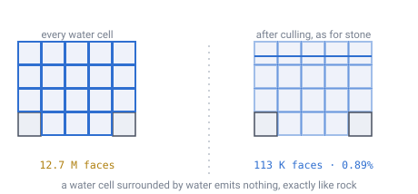
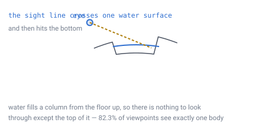
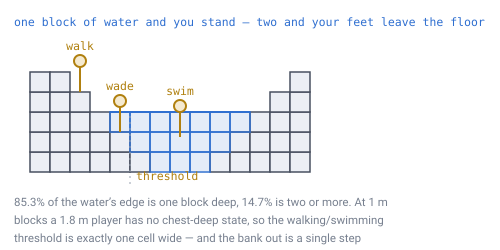

# 25 — Water

## What water is

**Two things, and the split is between the ocean and everything else.**

The **ocean is a surface**: one translucent shell at the sea-level radius,
drawn around the camera, with waves on it. It is not made of anything. Below it
the world is bare sea floor and air, and there is no water block anywhere in a
generated world.

**Water is also a block type** — translucent, placeable, with no collision,
written once and never simulated. That is the material a bucket carries, an
aquarium is built from, and a lake or a river will be made of when
[doc 21](21-rivers-and-erosion.md) grows them. It is not what the sea is made
of.

There is no flow, no pressure, no spreading, no level-seeking, in either.
**This is a construction toy, not a planetary simulator** — the nearest thing
to it is a box of hexagonal Lego, and water is one of the pieces. A translucent
one you can swim in.

[Doc 21](21-rivers-and-erosion.md)'s erosion still runs. It runs **once**, at
world creation, to decide where valleys go. After that it is finished and what
it leaves behind is ground.
[Doc 24](24-edits-and-global-processes.md) takes that decision and says why.

Three things follow, and they are the three parts of this document.

The first is **why the ocean is not blocks**, which is not the answer the
measurements first suggested.

The second is what a world 69% covered in translucent blocks *would have* cost
to **draw** — because transparency is the one thing a renderer genuinely finds
hard, [doc 14](14-meshing-and-lod.md) has carried it as an open question since
it was written, and the answer still governs every lake and every aquarium.

The third is what it means to **move** through a block that does not collide.
No collision sounds like water should not be there at all — but you do not fall
through water, you float in it. That turns out to be a different question from
collision, asked of a different thing, and answered by machinery the design
already has.

---

## The ocean is not blocks, and the faces were never why

Everything in the next four sections prices the ocean as blocks and finds it
**cheap**. Interior faces cull, so 1.6 million water cells draw 113,455 faces —
0.89% of the naive count. Nothing about that argument is wrong, and none of it
saved the block ocean.

What decides it is that the two do not scale the same way. A sea built out of
blocks is drawn out of columns, and columns quadruple with every level of
subdivision. A sea drawn as a shell is one fixed mesh, at every planet size and
every altitude.

> **[verified]** `verification/water.js`, section 6. Level 7, 60 m of relief,
> 1 m blocks, sea level set for 30% land; the shell is the disc the engine
> actually draws, 96 rings by 128 sectors:
>
> | | |
> |---|---|
> | Water cells | 1,589,689 |
> | Block slots in a 64-layer crust | 10,485,888 |
> | Share of the world that was water | **15.2%** |
> | Sea faces as blocks, level 7 | 113,455 |
> | Sea faces as blocks, level 11 | **29,044,127** |
> | One shell, any planet | **24,448 triangles** |
> | Ratio at the shipped depth | **1,188×** |

The 15.2% is memory a chunk holds rather than work a frame does, and the 0.89%
is genuinely small. **The last row is the whole argument.**

And there is a second reason that no amount of block work reaches. **A shell
can carry a wave, a sun sitting on it, and a colour that deepens with how much
water the look passes through. A block is one flat quad of one colour.** Sea
level is a radius, so the shell is a sphere, and a sphere seen from a point on
it is a disc reaching to the horizon — which is why the mesh is a disc, built
once in its own flat unit circle and carried onto the planet in the vertex
shader. Walking moves the sea without touching a buffer.

Three consequences:

- **The sea floor is bare.** Ground below sea level is sand and stone with air
  above it. Anything drawn there is drawn through the shell.
- **A player cannot remove the ocean**, and nothing had to be written to refuse
  it. There is no block there to break.
- **Being in water is a radius test**, not a block read: below the sea surface
  radius and not inside something solid is in the sea. The surface radius is
  snapped to the layer grid the ground is built on, or flat ground at sea level
  measures a block under water and a player swims on the beach.

---

## A body of water is a skin, not a solid

**This section and the four after it measure a body of water made of blocks**,
which is what a lake, a river and a player-built aquarium are. A body of water
is a body of water; the ocean's size is the only thing that put it on the other
side of the scaling line above.

A block that is completely surrounded by other blocks emits no faces. That rule
already exists for stone ([doc 14](14-meshing-and-lod.md)), and nothing about
being transparent changes it: a water cell with water on all sides is invisible
from everywhere, so it is not drawn.

*Left is what people picture when they hear "the ocean is made of blocks". Right is
what actually gets drawn. The interior of the sea is enclosed by more sea, so it
emits nothing at all.*

> **[verified]** `verification/water.js`, section 1. Level 7, 60 m of relief, 1 m
> blocks, sea level set for 30% land:
>
> | | |
> |---|---|
> | Columns holding water | **69.2%** |
> | Water cells in the world | 1,589,689 |
> | Faces if every prism were drawn | 12,717,512 |
> | Faces actually drawn | **113,455** |
> | Ratio | **0.89%** |

A hundred and thirteen thousand faces for every drop of water on the planet, and
they are all in one layer.

**And the side count is zero**, which is worth a sentence of its own. Generated
water never has an exposed vertical face: it is always held in by land at or above
its own level, or by more water. A wall of water standing in open air exists only
where **a player built one** — an aquarium, or a trench dug beside a lake.

---

## The sea is the flattest surface in the world

Sea level is a **radius**, not a height ([doc 08](08-terrain-generation.md)). So
the ocean surface is not approximately flat — it is exactly a sphere, and it is
the only surface on the planet that is.

That matters because [doc 14](14-meshing-and-lod.md) bounds flat-patch merging by
curvature rather than by the algorithm: a merged patch sags `s²/8R` away from the
surface, so at 0.1 m of tolerable sag a patch may span **37 m**.

> **[verified]** `verification/water.js`, section 2. On the worked planet that is
> **37 cells across, merged into one quad.**

Terrain never gets close to that, because terrain has relief and merging stops at
the first bump. The ocean has none anywhere. **The largest single surface in the
world is also the cheapest one to draw**, which is a pleasant inversion of what
you would expect from covering two thirds of a planet in water.

---

## You almost never look through more than one

This is the question that decides whether transparency is a problem. Translucent
surfaces cannot be drawn in an arbitrary order — they have to go back to front —
and the cost of sorting is driven by how many of them overlap in one view.

Water fills a column from the floor upward. So a sight line entering water leaves
it through the bottom, into rock. There is nothing behind it to sort against.

*The line crosses one surface and hits the floor. To cross two, a player would
have to see one body of water past another — which needs a lake at one level and
the sea beyond it, both inside the same 76 m horizon.*

> **[verified]** `verification/water.js`, section 3. Distinct bodies of water
> within a standing player's 76 m horizon ([doc 13](13-gravity-and-orientation.md)),
> over 3,000 viewpoints, on a world with lakes above sea level as
> [doc 21](21-rivers-and-erosion.md) produces them:
>
> | Bodies in view | Share of viewpoints |
> |---|---|
> | 0 | 17.1% |
> | **1** | **82.3%** |
> | 2 | 0.6% |
> | 3 | 0.0% |
>
> 58 separate bodies of water on the planet. Worst case seen in one view: **3**.

**So the sort is of one thing, almost always.** Four in five viewpoints see a
single body of water; fewer than one in a hundred sees two.

That reduces [doc 14](14-meshing-and-lod.md)'s open transparency question to
something ordinary:

- **Draw all opaque geometry first**, depth buffer on, in any order.
- **Then draw water back to front.** With one surface in view that is not a sort
  at all; with two or three it is a comparison of chunk distances.
- **No per-triangle sorting is needed**, because the surfaces do not
  interpenetrate — they sit at distinct radii.

The sphere makes none of this harder. Sorting is per camera and always was, and
"back to front" is a distance comparison that never needed a global axis.

---

## You float in it, and you can always get out

No collision does not mean nothing happens. **You do not fall through water** —
you float in it and move freely, in any direction, which is the one place water
behaves unlike every other block in the world.

That is a rule about the *mover*, not about the terrain, and the distinction is
worth being precise about because they are two different queries:

- **Collision asks about a face.** Can I pass through the boundary between these
  two cells? For water the answer is always yes.
- **Buoyancy asks about a cell.** What am I inside right now? That is
  [doc 04](04-position-lookup.md)'s position → cell lookup, which is exact and
  already written, plus one block-type read.

So swimming needs no new system. It needs the lookup that already exists,
answering a question the collision pass never asks.

### The shore is a ramp, not a wall

For "float and swim" to be playable rather than annoying, two things have to be
true of the world the generator makes: shallow water has to exist, or every
shoreline is a plunge, and the bank has to be climbable, or a swimmer is trapped.

Neither was designed. Both fall out of water filling a valley, because a valley
has sides.

*The wading band is the single ring of columns where the water is one block deep.
Step one cell further out and the floor is 2 m down, past a 1.8 m player's feet.
That is the whole transition — there is no chest-deep state to model, because a
1 m block cannot represent one.*

> **[verified]** `verification/water.js`, section 4. Over the 4,189 shore columns
> — wet columns with dry land next to them — on the same world:
>
> | | |
> |---|---|
> | One block deep at the edge | **85.3%** |
> | Two blocks | 13.9% |
> | Three or more | 0.7% |
> | Shore columns you can step out at (bank ≤ 1 m) | **99.9%** |
> | Bodies of water with at least one exit | **58 of 58** |
> | Worst bank anywhere | 1.23 m |

**Nothing traps a swimmer.** Every one of the 58 bodies of water on the planet
has a bank you can step out at, and almost every column of its shore is one.

### The threshold is one cell wide

Look again at the depth table. At 1 m blocks a 1.8 m player stands in one block
of water and swims in two — there is no depth in between, because there is no
block in between.

**So walking and swimming is a threshold, not a gradient.** The mover reads the
cell it is in, and gets one of two answers. No partial buoyancy, no waterline
fraction, no blending between two movement models.

**Walk into it yourself:** [`demos/wade-or-swim.html`](../demos/wade-or-swim.html)
draws a shoreline at block scale and lets you drag a player across it. Dry land,
one block standing, two blocks swimming — and no third state on any shoreline it
generates, because the band's width is a fact about block size against player
height rather than about any particular coast.

### Test the step, not the end of it

One bug follows directly: a block with no collision is exactly a block a fast
mover can pass straight through.

> **[verified]** `verification/water.js`, section 4. A player falling at roughly
> terminal velocity, 50 m/s:
>
> | Frame rate | Distance per frame |
> |---|---|
> | 144 Hz | 0.35 m |
> | 60 Hz | 0.83 m |
> | 30 Hz | **1.67 m — skips a cell** |
> | 20 Hz | **2.50 m — skips two** |

Sample only where the player *ends up* and a diver at 30 Hz lands on the bottom
of a shallow pond having never been in the water. **Walk the swept segment
instead** — which is [doc 09](09-ray-traversal.md)'s ray traversal, cell by cell,
with the block test changed from solid to water. The machinery is already there.

---

## Water is placeable

A bucket exists. Players can place water as well as remove it, and a placed water
block stays exactly where it was put — floating in mid-air if that is where it was
put, because nothing spreads and nothing falls.

This is the same rule as every other block, and it is the rule
[doc 24](24-edits-and-global-processes.md) already argued for. **A world of
translucent Lego is one where a wall of water is as buildable as a wall of stone.**

It costs two of the measurements above their generality. Exactly which:

- **"Zero exposed sides" describes the generated world only.** It was always
  stated that way — generated water is held in by land at or above its own level
  — and placement is precisely the thing that creates the other kind. An aquarium
  has four sides, and the mesher draws them the same way it draws any other
  water face.
- **"One surface in view" is a measurement of generated water too.** Build an
  aquarium in front of a lake and a sight line crosses two. That is fine: the
  draw order is back to front either way, and it is a per-chunk distance sort.
  **No measurement of the generated world can bound what someone chooses to
  build** — but the sort was never the expensive part, and a player who builds a
  hall of glass tanks has chosen that cost knowingly.

Neither changes the renderer's design. They change how tight the numbers in it
are, which is a different thing, and only where a player has been.

---

## What an edit costs

Nothing beyond the edit itself, which is the point of
[doc 24](24-edits-and-global-processes.md)'s decision.

> **[verified]** `verification/water.js`, section 5.
>
> | Action | Cost |
> |---|---|
> | Remove one water block | one delta, 57 bits ([doc 03](03-addressing.md)) |
> | Place one water block | one delta, and it stays where it was put |
> | Wall across a river | one delta per block placed, and nothing else |
> | Drain a lake by hand | one delta per block removed, no propagation |

Because water never moves, editing it costs exactly what editing stone costs.
**No flood fill, no re-route, no cascade, and no second system to keep
consistent** — and no risk that a player's edit triggers work proportional to
anything but the edit.

The one place it shows is meshing: removing a water block exposes the faces around
it, so the chunk is remeshed. That is the same remesh mining a stone block already
triggers ([doc 14](14-meshing-and-lod.md)), at the same cost.

---

## What this forces elsewhere

- **[Doc 08](08-terrain-generation.md)**'s material pass places **nothing**
  below sea level: above the ground is air, whichever side of the sea it is on.
  The water line still decides the shore's material, so a beach is sand.
- **[Doc 14](14-meshing-and-lod.md)**'s open "water and transparency" question is
  closed: two draw passes, and a sort of one thing.
- **The sea is one draw call, and it is the layer after the opaque terrain.**
  It writes no depth and tests against the terrain's, so ground standing above
  the water hides it without anything being sorted.
- **The mesher needs two vertex streams per chunk** — opaque and translucent —
  which is standard and costs one extra buffer.
- **Physics gains two rules, and they are separate.** Water blocks do not
  collide — that is the face test. And a body inside one floats rather than
  falling — that is a cell test, [doc 04](04-position-lookup.md)'s lookup plus a
  block-type read. Neither needs a new system.
- **[Doc 09](09-ray-traversal.md)'s ray walk gains a second caller.** The mover
  has to walk its swept step to find the water it entered part-way through, with
  the same traversal and a different block test.
- **[Doc 07](07-data-structures.md)**'s delta store gains nothing at all. A placed
  water block is a delta like any other, and it never moves afterwards.
- **[Doc 16](16-lighting.md)** is unaffected in structure, but water should
  attenuate sky light with depth if it is to look like water at all — which is a
  per-block multiplier in the existing downward pass, not a new mechanism.

---

## Still open

- **How light behaves in water.** Doc 16's sky pass runs down a column; making
  water dim it is one multiplier, but nothing measures what that costs or how it
  interacts with the depth-per-column storage trick.
- **What a player sees from underwater.** Looking up through the surface crosses
  one water face from the other side. Nothing here measures whether the same
  one-surface result holds looking outward rather than inward.
- ~~Whether water is placeable~~ — **decided: it is.** A bucket exists, and a
  placed block stays where it was put. Earlier drafts of this document left it
  open on the grounds that placement is the only way an exposed vertical water
  face is ever created. That is still true; it is simply now a face the mesher
  has to draw, which it does the same way it draws every other one.
- **How a swimmer moves, as opposed to whether they do.** Speed, drag, how fast
  you sink or rise, whether there is a breath limit. All game design, none of it
  constrained by the geometry here.
- **Water you can build against gravity.** Placement allows a column of water
  with nothing under it. That is the consistent answer and it is the one every
  other block gives, but nothing here asks whether it is the *fun* one.
- **Shorelines at a LOD seam.** A coarse chunk and a fine one both put the sea at
  the same radius, so the surfaces agree exactly — but where the *shore* falls
  depends on the terrain height, which is resampled. Doc 14's seam ownership
  should cover it; nothing has checked.
- **Rivers narrower than a cell.** [Doc 21](21-rivers-and-erosion.md) carves
  channels about one coarse cell wide. A stream narrower than a block cannot be
  represented as blocks at all, so small watercourses either widen to one cell or
  do not exist.
- **The shell reads its water depth from the wrong quantity.** How opaque the
  sea is, and which of its two colours it takes, both come from how far the
  fragment is from the camera. What decides both in every stylized water shader
  is the **thickness of water the look passes through** — the depth of what is
  behind the surface, minus the surface's own, through Beer-Lambert absorption.
  The two agree standing on a beach and part company from the air, where a
  metre of water over a sandbar draws as opaque as a kilometre of ocean. It
  also blocks refraction, caustics and shoreline foam, which all want the same
  number. The obstacle is structural: the sea draws inside the terrain's own
  pass, and a pass cannot sample the depth it is testing against. Filed as
  F-049 with what the two ways out cost.
- **What a lake and a river are drawn as.** Neither exists yet. The scaling
  argument that took the ocean out of blocks does not reach them — a lake is a
  bounded thing whose face count does not grow with the planet — but nothing
  has measured whether one shell per body is cheaper than the blocks, or how
  two water surfaces at different radii meet where a river runs into the sea.

---

## In one breath

- **The ocean is a surface**, one translucent shell at the sea-level radius with
  waves on it. Below it is bare sea floor and air. Water is **also a block
  type** — translucent, no collision, never simulated — and that is what a
  bucket carries and what a lake will be. There is no fluid system in this
  design.
- **The faces were never why.** As blocks the ocean drew **113,455 faces —
  0.89%** of the naive count, and held **15.2%** of the crust's block slots.
  What decided it is that block faces quadruple per level while a shell does
  not: **29,044,127 against 24,448** at the shipped depth, a factor of
  **1,188×**. And a shell carries a wave and a sun; a block is one flat quad.
- **A player cannot remove the sea**, and nothing was written to refuse it.
  There is no block there.
- **A body of water is a skin.** Interior faces cull like any other material —
  which is what governs every lake, river and aquarium.
- **Generated water has no exposed sides at all.** A vertical face of water only
  exists where a player built one.
- **The sea surface is the only exactly flat surface on the planet**, because sea
  level is a radius — so it merges to doc 14's full curvature limit, **37 cells
  into one quad**.
- **You look through one surface, almost always**: **82.3%** of viewpoints see one
  body of water and 0.6% see two. Transparency sorting is a sort of one thing.
- **You do not fall through it.** No collision is a face test; floating is a cell
  test, and the cell test is doc 04's lookup that already exists.
- **The shore is a ramp.** **85.3%** of the water's edge is one block deep, you
  can step out at **99.9%** of it, and all **58** bodies of water have an exit.
  Nothing traps a swimmer, and nobody designed that — a valley has sides.
- **Walking and swimming is a threshold, not a gradient**, one cell wide: at 1 m
  blocks a 1.8 m player stands in one block of water and swims in two.
- **Water is placeable.** Which is what creates the only exposed vertical water
  faces in the world, and the only views through two surfaces — both of those
  numbers describe the **generated** world and cannot bound what a player builds.
- Editing water costs **exactly what editing stone costs**, because nothing
  propagates.
