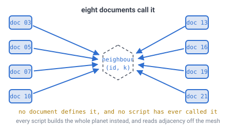
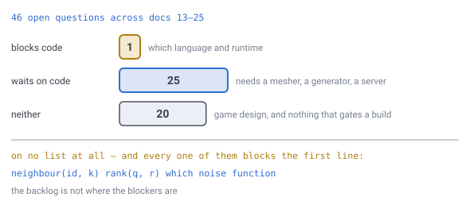

# 26 — What is left before the first line of code

## The problem

Someone wants to open an editor and start the engine, and needs to know what to
type first — and whether anything in the twenty-six documents before this one will
stop them three days in.

This document is the answer. It is not new design. It reads every **Still open**
section in the specification, sorts what is there by what it actually blocks, and
then names the things that block code and are on **no list at all**.

---

## The design is closed. The kernel is not written.

[Doc 11](11-open-topics.md)'s original twelve entries are all struck through —
every structural question it ever raised has been answered, and each answer has a
script behind it. There are twenty-seven documents and thirty verification
scripts, and [`REFERENCE.md`](REFERENCE.md) is every one of those scripts' output,
regenerated on each push.

So the honest summary is: **the arguing is done and the typing has not started.**
That is a good place to be, and it is not the same as being ready. A
specification is ready for code when someone can implement its core functions
without making a design decision. **Four things stopped that when this document
was written, and only one of them appeared on any open-topics list.**

**All four are now closed.** Three went by building the function and measuring it;
the fourth — the language — went the same way, by running the kernel in six
languages and comparing the bits ([doc 28](28-language-and-runtime.md)). What
follows keeps the original diagnosis, because the reason those gaps went unnoticed
is more useful than the fix.

---

## Four functions carry everything, and one of them does not exist

[Doc 07](07-data-structures.md) lists the pure functions the whole engine rests
on. Take them one at a time and ask what a programmer would have to invent:

| Function | Specified in | Verified by | Ready? |
|---|---|---|---|
| `encode` / `decode` — ID ↔ planet, face, path, corner, layer | [doc 03](03-addressing.md) | `qr.js`, `id.js` | yes |
| `idToPosition(id)` | [doc 04](04-position-lookup.md), [doc 15](15-precision-and-origin.md) | `precision.js` | yes |
| `positionToId(p)` | [doc 04](04-position-lookup.md) | `lookup.js`, `hexround.js` | yes |
| `neighbour(id, k)` | [doc 05](05-face-adjacency.md) | `neighbour.js` | **now yes** |

Three of the four were specified down to the arithmetic. `qr.js` round-trips
`(i, j)` against path digits and `(q, r)` exactly — though that is the
*re-encoding* and not the stored word. Packing the actual bits, which adding a
planet field finally forced, reopened `encode`/`decode` and then closed it again:
the address is **`5 + 2D + 2`**, because path digits name triangles and a cell is
a vertex, so two bits always remain to say which corner
([doc 03](03-addressing.md), `id.js`). `hexround.js` states what a
cell *is* and measures the one place the definition could have gone wrong.
`precision.js` shows `idToPosition` does not accumulate error at any depth.

**The fourth had nothing at all, and now does** — `neighbour.js` builds it from
doc 05's table and integer arithmetic alone and agrees with the geometric graph at
every cell of every depth tested. The figure below is kept as the picture of what
was missing, because the reason it went unnoticed for so long is more useful than
the fix.



*Docs 03, 05, 07, 10, 13, 16, 19 and 21 all delegate to `neighbour(id, k)` — it
is where face crossings live, where the half-turn flip is absorbed, where
pentagons become a degree-5 case, and what the pathfinder and the flood fill
walk. The hexagon was drawn empty because that was the accurate picture at the
time: eight callers, and nothing in the repository saying what it returned.*

---

## Why it hid: `neighbour(id, k)` had never been called, not even by the scripts

That is the part worth sitting with, because it is easy to miss and it is the
reason a gap this central survived twenty-six documents. The specification did not
merely lack a written definition — **no verification script had ever used one.**

Look at how `rivers.js`, `water.js`, `light.js` and `pentagon.js` find a cell's
neighbours. Every one of them builds the entire planet first: it walks all 20
faces, computes each lattice point's position, rounds the coordinates, and stores
them in a hash map keyed on that rounded triple. Two faces that produce the same
point land on the same key, so the map merges them, and the shared edge closes
itself. Adjacency is then read off the resulting graph.

That is a perfectly good way to *measure* a sphere, and it is the reason those
scripts are trustworthy. It is not something an engine can do. An engine holds
one ID and needs its six neighbours in a few nanoseconds, without a planet in
memory and without a hash map keyed on floating-point coordinates.

So the 180-byte adjacency table from [doc 05](05-face-adjacency.md) sat in an odd
position. `adj.js` proves it is **complete and consistent** — all 60 edges match,
every entry comes out `reversed`, which is the signature of consistent outward
winding. Nobody had ever used it to cross an edge.

### Three decisions hid inside that one function — all now settled

`neighbour.js` closed all three, and [doc 05](05-face-adjacency.md) records the
answers: **index 0 is the step from the face's vertex `A` toward `B`**, **crossing
is a reflection in three integer additions** (`α+γ, β+γ, −γ`, and the table's
`reversed` field turns out never to be read), and **a pentagon's ring is five
long** — `k = 5` is not a direction that exists. What each one was, before it had
an answer:

**Where the neighbour ring starts.** [Invariant 9](../CLAUDE.md) says order the
six directions counter-clockwise as seen from outside, never from the sign of
`(q, r)`. That fixes the *order*. It does not fix the *start*. `pentagon.js`
takes whichever neighbour the graph happened to list first as its reference and
measures angles from there — fine for counting a ring, useless as a stored value.
[Doc 19](19-directional-blocks.md) puts a **3-bit rotation on disk** and requires
that byte to mean the same thing forever, in every chunk, in every world. Index 0
has to be anchored to something every cell has and nothing can change. Nothing
here says what.

**How `(i, j)` re-expresses across a face edge.** Doc 05's table says which face
you land on, which of its three edges you arrive at, and that the shared edge runs
the other way. It does not give the map from your `(i, j)` to theirs. Doc 05 says
"re-expressing your coordinates in a frame that has no relationship to the one
you came from" is the entire job of the table — and then stops one step short of
the formula that does it.

**What a pentagon returns for `k = 5`.** [Doc 17](17-pentagons.md) protects the
twelve columns from placement, and in exchange [doc 19](19-directional-blocks.md)
lets directional machinery assume degree 6. That is a rule about *building*. The
pathfinder ([doc 10](10-pathfinding.md)) still walks through pentagons, the light
flood fill ([doc 16](16-lighting.md)) still spreads through them, and flow routing
([doc 21](21-rivers-and-erosion.md)) still drains them. All three need an answer
for the direction that is not there.

---

## Two more things code needs that no document names

**`rank(q, r)`** — **now counted**, in [doc 07](07-data-structures.md). It gave a
chunk's storage layout as `index = rank(q, r) × layerCount + layer` and that was
the only appearance of `rank` in the specification. `rank.js` settles it at
`q + r·(2m + 3 − r)/2` over the whole triangle, and finds on the way that
[doc 03](03-addressing.md)'s border rule — *the lowest chunk ID wins* — **had
never been checked**. It holds: the owned counts sum to exactly `10·4^D + 2` on
four different cuts.

**Which noise function** — **now pinned**, in [doc 08](08-terrain-generation.md):
a `uint32` hash, trilinear value noise with the quintic fade, fBm at lacunarity 2
and gain 0.5 accumulated low octave first. The float-multiply variant lost on
portability rather than quality — both hashes avalanche equally well, but one has
no definition outside JavaScript. Before that,
[doc 08](08-terrain-generation.md) was precise about
*where* to sample — 3D world space, never `(i, j)` — and about one thing to avoid:
hash with integers, never with `sin`. [Doc 23](23-determinism.md) then makes the
choice load-bearing to the bit, because the client regenerates the coarse map
rather than downloading it. But no document names an algorithm. Two
implementations of "fBm" are two different planets, and the difference is not
subtle: it is every coastline.

---

## Forty-four open questions, and exactly one of them blocks you

Docs 13 through 25 carry **44** open bullets between them, plus 11 already struck
through. Sorted by what
they actually block:



*The backlog is not where the blockers are. One open bullet in the whole
specification stops you writing code — the language choice. Twenty-three are
waiting for code to exist before they can be answered at all. The three items
that genuinely gate the kernel appear on no Still open list, because nobody
noticed they were missing.*

**Blocks the first line — 1**, and it was the *only* thing left in
[doc 11](11-open-topics.md) Part 1 as well: [doc 23](23-determinism.md)'s "which
language and runtime". **It is now closed, and the reasoning in this paragraph
was wrong.** The paragraph said languages "differ in exactly how much of that
they guarantee", so the choice had to be made carefully around determinism.

> **[verified]** `verification/language.js`, section 1. The pinned pipeline,
> written in **six languages** and run on one machine: JavaScript, C, Rust, Java,
> Go and Python produce **one identical 64-bit digest** over 80,000 `float64`s.
> They do not differ. The only thing in the whole experiment that breaks
> bit-identity is a **C build with FMA contraction enabled** — which is the
> *default* on `aarch64`.

So determinism eliminated nobody, and [doc 28](28-language-and-runtime.md) decided
on the other four requirements instead — no GC inside a remesh, and one source
compiling to both native and WebAssembly, which is what
[doc 22](22-multiplayer-interest.md)'s client regenerating the coarse map actually
needs. **Rust.**

**Waits on code — 23.** These cannot be closed by another document, because the
thing they ask about does not exist yet:

- **Generator (6)** — how many plates and how they drift, the stream-power
  exponents `m` and `n`, whether lakes survive the fill, rivers below the coarse
  resolution ([doc 21](21-rivers-and-erosion.md), [doc 25](25-water.md)), where
  the density band sits under 60 m of relief ([doc 14](14-meshing-and-lod.md)).
- **Mesher and renderer (9)** — terrain height at a mesh corner and whether the
  ray walk wants the `3n` lattice ([doc 18](18-cell-boundary.md)); texture
  coordinates, ambient occlusion, remesh-or-store, culling by enclosure
  ([doc 14](14-meshing-and-lod.md)); ambient occlusion again and light across a
  LOD seam ([doc 16](16-lighting.md)); shorelines at a LOD seam
  ([doc 25](25-water.md)).
- **Water detail (2)** — how light behaves in water, what a player sees from
  underwater ([doc 25](25-water.md)).
- **Determinism (2)** — nothing verifies the rule on two real platforms, and GPU
  determinism ([doc 23](23-determinism.md)).
- **Server (3)** — interest radius versus render distance, entities rather than
  blocks, authority and conflict ([doc 22](22-multiplayer-interest.md)).
- **Block format (1)** — two-ended blocks, and whether they fit the spare rotation
  bit ([doc 19](19-directional-blocks.md)).

**Neither — 20.** Game design, all of it. What the twelve pentagons contain,
whether players are told about the loop rule, how fast a swimmer sinks, whether
light is coloured, what happens in creative mode. All real questions. None of
them is between anyone and a working planet, and none needs a decision before the
first commit.

### The one free decision, now taken

A fourth category holds one member: **which of the
six antipodal pentagon pairs is the polar axis** ([doc 20](20-player-coordinates.md)).
Free today, unfixable after the first world ships, and on nobody's critical path —
exactly the kind of thing that gets decided by accident.

It has since been decided, and measuring it was worth doing. All six pairs give
**one distinct latitude signature** — they are the same world seen from six
angles, so the choice provably cannot be made on merit. What broke the tie was
the face table: `0-3` is the only pair whose polar caps are **contiguous runs** of
face indices. North is vertex 0, the prime meridian runs through vertex 11, and
that lands all twelve pentagons on **exact multiples of 36°**.

The lesson generalises to the rest of this list. "Arbitrary" is a claim like any
other, and the two decisions doc 20 was hiding behind it — which end is north,
and where longitude 0 runs — would otherwise have been made by whoever typed the
code first.

---

## One entry the triage overtakes

[Doc 15](15-precision-and-origin.md)'s Still open list says the `hexRound`
question is "sharper, not answered" and that whether planar rounding finds the
right cell is "still unmeasured". That was true when it was written and has not
been true since `hexround.js` ran.

It **is** measured. `hexRound` and nearest-centre-on-the-sphere disagree on about
**1%** of the sphere; the rate **plateaus** rather than shrinking with depth,
because a face triangle's shape is scale-free; every disagreement is with an
**edge-adjacent** cell and never more than **0.11 of a spacing**. And
[doc 04](04-position-lookup.md) turned the measurement into a definition — a cell
**is** the set of directions `hexRound` maps to, which makes the lookup exact by
construction rather than approximate. [Doc 18](18-cell-boundary.md) then showed
the mesh draws that same curve to 0.038 mm at level 11. That bullet is struck as
of this document.

---

## The triage now has a second axis: V1

This document sorted 44 open questions by whether they **block code**. That was
the only axis available at the time, because no scope line existed. One does now
([doc 11](11-open-topics.md) holds it in full), and it cuts across the triage
rather than along it.

The two axes answer different questions:

```
blocks code?   can this be started without more design?
in V1?         is it being started now?
```

An item can block nothing and still be V1 — most of the engine is exactly that.
An item can be fully designed, fully priced and **not V1**, which is a state this
document had no way to express and was filing under "waits on code".

**Three of the deferrals come from this document's own subject matter**, and each
removes work from the first build rather than adding it:

- **Edit validation** — the point query on virgin ground.
  [Doc 30](30-authority-and-cheating.md) prices it at `0.06%` of a core at a
  thousand players and defers it. V1's server checks nothing.
- **Server-side simulation** — mobs, a tick loop, chunks resident on the server.
  **158×** what validation costs, and the only thing that turns the server into a
  simulator. V2.
- **Hosting** — [doc 31](31-deployment.md) sketches it and marks itself *plan, not
  decision*. V1 is the filesystem.

So the honest restatement of this page's headline is: **nothing blocks the first
line of code, and the first build is smaller than this document assumed.** Step 4
below used to end with "and the server". It now ends with a file.

---

## Build it in four steps, and each one settles something no document can

**1. The kernel.** Constant tables, `encode`/`decode`, `idToPosition`,
`positionToId`, `neighbour(id, k)`. Nothing else. **Its two unlisted gaps are now
closed**, both by the method every question in this repository closed with:
`neighbour.js` implements `neighbour(id, k)` from the table and integer arithmetic
alone and checks it against the geometric graph the other scripts already build —
60/60 face edges round-tripping, `+0` or `+3` and nothing between, 12 cells at
degree 5, and the same direction round every ring. `rank.js` does the same for the
chunk index, and finds that doc 03's border rule is an exact partition. So step 1 needs a language and a noise function, and then it is
transcription rather than design.

**2. A chunk, and a height field.** `rank(q, r)`, the palette, column-major order,
the height-field generator only — no caves, no water, no deltas. The first thing
anyone can look at. It settles where the density band goes by making the
alternative visible.

**3. The mesher.** 2 vertices and 4 triangles per cell, run-length merging down a
column, corners at the `3n` lattice points. This is the step that answers *terrain
height at a mesh corner*, which is currently the furthest-reaching open item in
the specification and cannot be answered any other way.

**4. Everything else, in any order.** LOD and seam ownership, lighting, water,
and the delta store. Each one has a document, a script and a number waiting for
it.

**"The server" on that list is a file.**
[Doc 30](30-authority-and-cheating.md) scopes V1's server to a point of storage —
it stores edits, routes them, and validates nothing — and
[doc 31](31-deployment.md) puts V1 on the local filesystem. So step 4's last item
is a delta store that persists, not a service. The two rules that keep the
upgrade cheap cost nothing to obey now: **an edit names a cell and a resulting
block state**, and **inventory never travels client → server**.

**Do not build the coarse map before step 2.** [Doc 21](21-rivers-and-erosion.md)
already priced the ordering the other way round: continents decide rivers, and
rivers are 2.5 MB computed once. It is a world-creation step, not a runtime one,
and it needs terrain to sit on.

---

## Honest caveat

**The triage above is a judgement, not a measurement.** The count of 44 is exact
and reproducible — it is the number of un-struck bullets under a *Still open*
heading in `docs/`. Which bucket each one goes in is an opinion about what
"blocks" means, and a reasonable person could move several items between the last
two columns. The claims to hold this document to are the narrow ones: `neighbour`
is defined in no document and called by no script, `rank` appears exactly once and
is defined nowhere, and no document names a noise algorithm. Those are checkable
by grep, and they are the ones that matter.

**And the sample size for "how ready is a document" is one.** Every prediction in
this repository about how hard something would be has been wrong — usually in the
optimistic direction for design and the pessimistic direction for cost
([doc 11](11-open-topics.md) collects the pattern). Expect step 1 to surface a
question nobody on this list has thought of. That is what steps are for.

---

## Still open

- **Whether the kernel is one module or four.** The four functions share the
  constant tables and nothing else. Splitting them is tidier; keeping them
  together means `neighbour` can inline the path walk.
- **Whether to write the neighbour script before the engine or as part of it.**
  Writing it first follows this repository's method and produces a number.
  Writing it as a test of real engine code produces the same number and a working
  function, and risks the design decisions being made by whoever is typing.
- **What "done" means for step 1.** A kernel that passes against the geometric
  graph is correct. Whether it is *fast enough* is a different measurement, and
  nothing here has a target for it.

---

## In one breath

- **The design is closed and the kernel is not written.** 30 scripts back the
  numbers, and no engine source exists.
- **All four core functions are now specified and verified.** `neighbour(id, k)`
  was **defined in no document and called by no script** — every script built the
  whole planet and read adjacency off the mesh instead — and is now built from
  doc 05's table and integers alone, agreeing with that mesh at every cell.
- **`rank(q, r)` is counted**, and closing it checked doc 03's border rule for the
  first time: **lowest chunk ID wins is an exact partition**, `10·4^D + 2` on
  every cut.
- **The noise function is pinned** — and the float hash it replaced lost on
  **portability, not quality**, which is the opposite of what was expected.
- **Nothing now stands between this specification and code.** The language was
  the last of the four, and it closed the same way the others did — by building
  the thing. Six languages, one kernel, **one digest**; determinism eliminated
  nobody, and the decision landed on **TypeScript**, browser-first
  ([doc 28](28-language-and-runtime.md)) — after first landing on Rust, on a
  weighing that a stated browser requirement reversed.
- **And the triage now has a second axis.** *Blocks code* and *in V1* are
  different questions, and this document only had the first. The first build is
  **smaller** than this page assumed: V1's server stores and routes and validates
  nothing, hosting is a filesystem, and mobs are V2. See
  [doc 11](11-open-topics.md) for the line and [doc 30](30-authority-and-cheating.md)
  for what it costs to keep the door open.
- **Of 44 open questions, one blocked code** (which language), 23 are waiting for
  code to exist, and 20 block nothing at all.
- **The one free-but-unfixable decision is taken**: the polar axis runs through
  vertices 0 and 3, north at 0, meridian at 11 — and all six pairs were measured
  identical first, so the tie was broken on the face table rather than a coin.
- **The gaps that block code are never the ones on the open lists.** All four were
  found by asking what a programmer would have to type, not by asking what was
  undesigned — and the two that have been closed since both turned up a result
  nobody was looking for.
