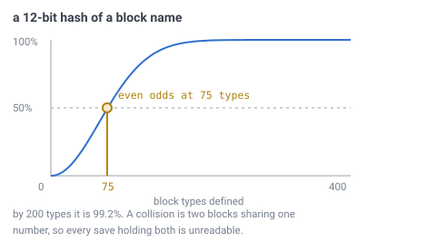

# 27 — Block state

## The problem

A player mines a block and puts a different one back. Something has to write down
*what is there now* — and that number has to still mean the same thing when the
save is opened next year, by a build with more block types in it.

Everything before this document is about **where** a block is. This one is about
**what** it is, which is the only part of the world a player can change.

---

## What was already decided, and where

This is the first document about block state, but it is not the first mention of
it. Four documents had a piece:

| Piece | From |
|---|---|
| An edit is **16 bits**: 12 of type, 4 of rotation | [doc 03](03-addressing.md) |
| 3 of those 4 rotation bits carry 6 directions; one is spare | [doc 19](19-directional-blocks.md) |
| Richer contents — chests, signs — go in a **side table** keyed by the same address | [doc 03](03-addressing.md), [doc 07](07-data-structures.md) |
| A loaded chunk holds a **palette** and packed indices, not full states | [doc 07](07-data-structures.md) |
| An explicit **air** entry is meaningful: *never touched* and *mined out* differ | [invariant 6](../CLAUDE.md) |
| Water is an ordinary block type, nothing special | [doc 25](25-water.md) |

What none of them says is **what the 12 bits mean** — how a block type gets its
number, and what happens when the list of types changes. That is the question
this document exists for, and the obvious answer to it is wrong.

---

## The numbers, first

> **[verified]** `verification/blockstate.js`, section 1.
>
> | Field | Bits | Buys |
> |---|---|---|
> | type | 12 | **4,096** block types |
> | rotation | 4 | **16** variants of each |
> | together | 16 | **65,536** distinct block states |

For scale: Minecraft ships on the order of a thousand block types. **4,096 is
about four times a full game** — comfortable, not unlimited, and worth knowing
before anyone plans a thousand kinds of stone.

---

## A type number cannot be a hash of the block's name

Here is the tempting answer, and it is the one to name before taking it away.

Give every block a permanent name — `chamfer:oak_planks` — and hash that name
into the 12-bit field. Then two builds always agree on the number without either
of them keeping a list, saves are portable by construction, and nobody has to
maintain anything.

It fails immediately, and the reason is the birthday problem.



*4,096 slots sounds like plenty until you count **pairs** rather than names. With
75 types defined it is already even odds that two of them want the same number,
and by 200 it is a near certainty. The curve is the birthday probability, and it
is far steeper than intuition expects.*

> **[verified]** `verification/blockstate.js`, section 2. Chance that some two
> names collide in a 12-bit field: **25.8%** at 50 types, **70.1%** at 100,
> **99.2%** at 200. Even odds at about **75**.

And a collision here is not a cosmetic glitch. It is **two different blocks
holding the same number**, so every save containing both is unreadable — and it
appears the moment someone adds the unlucky block, long after the saves exist.

Widening the field does not rescue the idea either:

> **[verified]** Same section, 1,000 types: a **16-bit** hash collides **99.95%**
> of the time, a **20-bit** hash **37.9%**, a **24-bit** hash **2.93%**. You would
> need **32 bits** to make it merely unlikely.

"Unlikely" is the wrong standard for something that corrupts a save file. Hashing
is out.

---

## The save carries a registry, and that is the whole mechanism

**The world file holds a list of block names, in order. The number stored in a
block is that name's position in the list.**

```
registry:  0  chamfer:air
           1  chamfer:stone
           2  chamfer:dirt
           3  chamfer:grass
           ...
```

Three rules, and they are the entire specification:

- **Append only.** A new block type takes the next free number.
- **Never reuse a slot.** A removed type leaves a tombstone, so its number stays
  dead forever rather than silently becoming something else.
- **The save is self-describing.** A file written by an older build still carries
  its own registry, so it still says what its own numbers meant.

> **[verified]** `verification/blockstate.js`, section 3. A full 4,096-entry
> registry at ~24 bytes a name is **96 KB** — next to nothing beside a save, and
> it makes the numbering **exact** rather than probabilistic.

That last point is the trade in one line: a few kilobytes of list buys certainty
where a hash offers only good odds.

---

## Two representations, and only one of them is on disk

It is worth being explicit that "block state" appears in two different shapes,
because [doc 07](07-data-structures.md) introduces both and never says they are
the same thing seen twice.

**In a loaded chunk** it is a **palette** — the handful of states this chunk
actually contains — plus a packed index per cell. The width is decided by that
chunk's variety, not by the world's.

> **[verified]** `verification/blockstate.js`, section 4. A chunk at `D` 11 /
> `C` 6 is 561 slots × 64 layers = **35,904 cells**. At 4 distinct states that is
> **2 bits a cell and 8.8 KB**, against **70.1 KB** for a flat 16-bit field —
> **12.5%**. A chunk of solid stone costs **1 bit** a cell however many types the
> world defines.

**On disk** it is the delta store: one record per edited cell, holding the
address and the new state.

> **[verified]** Same script, section 5.
> `[ address 29 ][ layer 10 ][ block state 16 ]` = **55 bits**, with **9 spare**
> in a 64-bit word. Ten million player edits cost **76 MB** raw, before any
> compression, and runs of identical edits compress hard.

**The planet is not in the record.** The file already belongs to one planet, so
repeating it a few million times buys nothing — the same argument
[doc 07](07-data-structures.md) makes for keeping no cell IDs inside a chunk.

And the 9 spare bits are not padding. They are room to widen block state later
**without changing the record size**, which is what a version number in the
header is for.

---

## Rotation stays a field, not part of the number

There is one genuine design choice here, and it is worth stating both sides.

**A flat index** would make the 16 bits one number into a table of every state
the world defines, the way a modern block-state registry works. Variants per type
become unlimited. The cost: reading a rotation becomes a **lookup** in a 128 KB
table rather than a mask.

**A fixed split** — 12 type, 4 rotation, as [doc 03](03-addressing.md) drew it —
keeps rotation a mask, and caps variants at 16 per type.

The deciding argument is [doc 19](19-directional-blocks.md). A rail reads the
facing of its neighbours constantly; that is the one block-state read that
happens per block per frame, and it should not be a table lookup. The cap is the
thing to check, and it turns out not to bind:

> **[verified]** `verification/blockstate.js`, section 6. A stair-like block with
> 4 facings × 2 halves × 5 join shapes is 40 states, so **3 type slots** each.
> Sixty such materials spend **180 of 4,096 slots — 4.4%**.

**Take the fixed split.** A block needing more than 16 variants spends extra type
numbers, and the type space is nowhere near tight enough for that to matter.

---

## What this forces elsewhere

- **[Doc 03](03-addressing.md)**'s delta record loses its planet field — the file
  supplies it — which is what makes 55 bits fit in one word.
- **[Doc 19](19-directional-blocks.md)** is confirmed rather than changed: 3 bits
  of rotation inside a 4-bit field, one spare, readable by a mask.
- **[Doc 07](07-data-structures.md)** gains the registry as a fifth constant —
  except that unlike the others it is **per world** and lives in the save, not in
  the build.
- **World creation** writes a registry with whatever types the build knows about.
  Loading a save uses **the registry in the file**, never the build's own list.

---

## Still open

- **The side table.** Chests, signs, entities — named in three documents and
  defined in none, including this one. It needs a format, and it needs one before
  the first container exists.
- **What happens when a save names a type this build does not have.** Keep the
  number and render a placeholder, or refuse to load? Minecraft's answer is a
  placeholder, which preserves the world if a mod comes back later.
- **Whether the registry is per planet or per save.** A save holding several
  planets ([doc 03](03-addressing.md)'s planet field) probably wants one shared
  registry, but nothing here has checked what that costs.
- **Compression.** The 76 MB figure is raw. Runs of identical edits are the
  obvious win and nothing has measured how much.
- **The spare rotation bit.** Doc 19 suggests *powered* or *reversed* and leaves
  it; it is still unspent.

---

## In one breath

- **12 bits of type, 4 of rotation**: **4,096** block types, **16** variants each,
  **65,536** states — about four times the size of a full Minecraft.
- **A type number cannot be a hash of its name.** In 12 bits it is even odds on a
  collision by **75 types** and near-certain by 200, and a collision makes every
  save holding both blocks unreadable. Widening to 24 bits still leaves 2.9%.
- **The save carries a registry**: names in order, index is the number, append
  only, never reuse a slot. A full one is **96 KB** and buys certainty.
- **Two shapes, one meaning.** In memory it is a per-chunk palette — **2 bits a
  cell** for a typical chunk, 12.5% of a flat field. On disk it is one **55-bit**
  record per edit, 9 bits spare to grow into.
- **The planet is not in the record**, because the file already knows which planet
  it is.
- **Rotation stays a mask, not a lookup**, because doc 19 reads it per block per
  frame — and the 16-variant cap costs only **4.4%** of the type space even for
  sixty stair-like materials.
