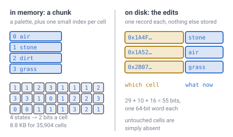
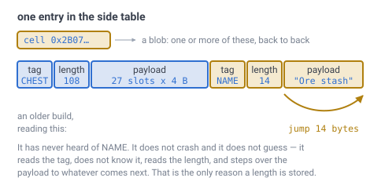
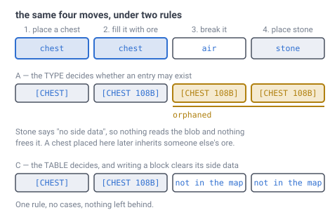

# 27 — Block state

## The problem

A player mines a block and puts a different one back. Something has to write down
*what is there now* — and that number has to still mean the same thing when the
save is opened next year, by a build with more block types in it.

Everything before this document is about **where** a block is. This one is about
**what** it is, which is the only part of the world a player can change.

---

## What was already decided, and where

This is the first document about block state, but it is not the first mention of
it. Four documents had a piece:

| Piece | From |
|---|---|
| An edit is **16 bits**: 12 of type, 4 of rotation | [doc 03](03-addressing.md) |
| 3 of those 4 rotation bits carry 6 directions; one is spare | [doc 19](19-directional-blocks.md) |
| Richer contents — chests, signs — go in a **side table** keyed by the same address | [doc 03](03-addressing.md), [doc 07](07-data-structures.md) |
| A loaded chunk holds a **palette** and packed indices, not full states | [doc 07](07-data-structures.md) |
| An explicit **air** entry is meaningful: *never touched* and *mined out* differ | [invariant 6](../CLAUDE.md) |
| Water is an ordinary block type, nothing special | [doc 25](25-water.md) |

What none of them says is **what the 12 bits mean** — how a block type gets its
number, and what happens when the list of types changes. That is the question
this document exists for, and the obvious answer to it is wrong.

---

## The numbers, first

> **[verified]** `verification/blockstate.js`, section 1.
>
> | Field | Bits | Buys |
> |---|---|---|
> | type | 12 | **4,096** block types |
> | rotation | 4 | **16** variants of each |
> | together | 16 | **65,536** distinct block states |

For scale, take the largest published cube-world block registry as the
yardstick. It carries **1,159 block types**, so 4,096 is **3.5× a full game** —
comfortable, not unlimited.

But the same game ships **roughly 26,000 block states**, which is **22 variants per
type on average** — *above* the 16 a type gets here. That number is the one to
watch, and it is priced below rather than waved at.

*(Both figures are quoted from that game's published block list, not produced by
a script here. The type count is exact; the state total is its "tens of
thousands", taken as 26,000. They give a sense of scale and are not something to
size against.)*

---

## A type number cannot be a hash of the block's name

Here is the tempting answer, and it is the one to name before taking it away.

Give every block a permanent name — `chamfer:oak_planks` — and hash that name
into the 12-bit field. Then two builds always agree on the number without either
of them keeping a list, saves are portable by construction, and nobody has to
maintain anything.

It fails immediately, and the reason is the birthday problem.


*4,096 slots sounds like plenty until you count **pairs** rather than names. With
75 types defined it is already even odds that two of them want the same number,
and by 200 it is a near certainty. The curve is the birthday probability, and it
is far steeper than intuition expects.*

> **[verified]** `verification/blockstate.js`, section 2. Chance that some two
> names collide in a 12-bit field: **25.8%** at 50 types, **70.1%** at 100,
> **99.2%** at 200. Even odds at about **75**.

And a collision here is not a cosmetic glitch. It is **two different blocks
holding the same number**, so every save containing both is unreadable — and it
appears the moment someone adds the unlucky block, long after the saves exist.

Widening the field does not rescue the idea either:

> **[verified]** Same section, 1,000 types: a **16-bit** hash collides **99.95%**
> of the time, a **20-bit** hash **37.9%**, a **24-bit** hash **2.93%**. You would
> need **32 bits** to make it merely unlikely.

"Unlikely" is the wrong standard for something that corrupts a save file. Hashing
is out.

---

## The save carries a registry, and that is the whole mechanism

**The world file holds a list of block names, in order. The number stored in a
block is that name's position in the list.**

```
registry:  0  chamfer:air
           1  chamfer:stone
           2  chamfer:dirt
           3  chamfer:grass
           ...
```

Three rules, and they are the entire specification:

- **Append only.** A new block type takes the next free number.
- **Never reuse a slot.** A removed type leaves a tombstone, so its number stays
  dead forever rather than silently becoming something else.
- **The save is self-describing.** A file written by an older build still carries
  its own registry, so it still says what its own numbers meant.

> **[verified]** `verification/blockstate.js`, section 3. A full 4,096-entry
> registry at ~24 bytes a name is **96 KB** — next to nothing beside a save, and
> it makes the numbering **exact** rather than probabilistic.

That last point is the trade in one line: a few kilobytes of list buys certainty
where a hash offers only good odds.

### Why a name at all — why not just number them?

This is the obvious next question, and the honest answer is that **you already
are**. The registry *is* `1: stone, 2: dirt, 3: grass`. Nothing is hashed and
nothing is computed; the number is a position in a list, exactly as it would be
if you wrote a plain enum in the source and never thought about it again.

**The name is not how the number is made. It is how you check the number still
means what you think.**

A plain numbered list works perfectly right up until one of these:

- **A type is deleted.** Everything after it shifts down one, and every existing
  save now reads dirt where it meant stone.
- **A type is inserted in the middle**, for tidiness. Same thing.
- **Two people add a block on separate branches.** Both take 48. The merge is
  clean and one of the saves is now wrong.
- **Mods, later.** If load order decides numbers, the same save opens differently
  depending on what is installed.

The **append only, never reuse** rule above already prevents all four. The names
are what catches it when somebody breaks that rule anyway, which eventually
somebody does. What they buy:

1. **A save that explains itself.** Open an old file and it says
   `47 = chamfer:oak_planks`. Without that, 47 is just 47.
2. **A migration path.** If the list does get reordered, old save and new build
   can be matched **by name** and the numbers rewritten. Without names that is
   unrecoverable.
3. **A refusal instead of corruption.** A registry that disagrees with the build
   can be detected and the load refused, rather than silently turning someone's
   house into dirt.

So: write the enum in code, exactly as you would anyway. Write the names into the
save beside it. They are never read during play — the numbers do all the work.
They sit there for the day something goes wrong. **It is insurance, not
machinery.**

---

## Two representations, and only one of them is on disk

"Block state" appears in two different shapes.
[Doc 07](07-data-structures.md) introduces both without saying they are the same
thing seen twice.



*Left, in memory: the chunk names the four states it actually contains, and every
cell is a 2-bit index into that list. Right, on disk: nothing but the cells a
player changed, one 64-bit record each. **The left one is bounded by view
distance and the right one is the only thing that grows.***

**In a loaded chunk** it is a **palette** — the handful of states this chunk
actually contains — plus a packed index per cell. The width is decided by that
chunk's variety, not by the world's.

> **[verified]** `verification/blockstate.js`, section 4. A chunk at `D` 11 /
> `C` 6 is 561 slots × 64 layers = **35,904 cells**. At 4 distinct states that is
> **2 bits a cell and 8.8 KB**, against **70.1 KB** for a flat 16-bit field —
> **12.5%**. A chunk of solid stone costs **1 bit** a cell however many types the
> world defines.

**On disk** it is the delta store: one record per edited cell, holding the
address and the new state.

> **[verified]** Same script, section 5.
> `[ address 29 ][ layer 11 ][ block state 16 ]` = **56 bits**, with **8 spare**
> in a 64-bit word. Ten million player edits cost **76 MB** raw, before any
> compression, and runs of identical edits compress hard.

**The planet is not in the record.** The file already belongs to one planet, so
repeating it a few million times buys nothing — the same argument
[doc 07](07-data-structures.md) makes for keeping no cell IDs inside a chunk.

And the 9 spare bits are not padding. They are room to widen block state later
**without changing the record size**, which is what a version number in the
header is for.

### The same argument reaches one field further

The planet leaves the record because the file supplies it. **The chunk leaves it
for the same reason**, because the store is a row per chunk and the row is
keyed by one — so an address that names the whole planet is repeating what the
key already said. What is left is the slot inside the chunk, the layer and the
state.

> **[verified]** `verification/delta.js`, section 1. A 64-cell chunk holds
> 2,145 slots, so `[ slot 12 ][ layer 11 ][ state 16 ]` is **39 bits** —
> a `uint32` and a `uint16`, **6 bytes** against the whole word's 8. A million
> edits is **5.7 MB** rather than 7.6 MB.

**The saving is not the argument.** A million edits is a couple of megabytes
either way. What decides it is that a slot is what the mesher wants: it reads
every record on every chunk build and lays it straight into the chunk's own
array, where a whole-word record has to be taken apart first.

**A slot means nothing on its own, and that is the cost.** It is a rank inside
a triangle whose side the chunk level sets, and the chunk level is a knob —
`chunkCells`, 8 to 64 — that **moves no block**: the terrain is
`columnAt(face, i, j)` and never sees where the address is cut. So a drawing
decision must not be able to lose a build, and the store carries **one header**
naming the depth and the chunk level its slots were counted against. Depth and
chunk level are properties of the world rather than of any chunk in it, so
writing them per row would repeat two numbers a few thousand times over — the
very thing this section is about.

> **[verified]** `verification/delta.js`, section 2. Every cell of a planet
> converted between every pair of chunk cuts, at depths 4, 5 and 6:
> **1,666,320 records, 0 landed on a different cell.** The header is the whole
> of what makes that possible — without it there is nothing to convert from.

---

## The side table, and the word in it that does not belong

A chest has contents. A sign has text. Neither fits in 16 bits, and
[doc 03](03-addressing.md) and [doc 07](07-data-structures.md) both say they go
in a "side table keyed by the same cell ID" without either of them defining one.

**The side table is a map from cell ID to a variable-length blob**, stored beside
the delta store and keyed the same way. Cell ID in, a run of bytes out.

Those bytes are not free-form. They are a sequence of **entries**, and each entry
is three things in a row: a **tag** saying what it is, a **length** saying how
many bytes it takes, and then that many bytes of **payload**.



*Read the picture left to right, the way the code does. The length is the whole
trick: without it, a build that meets a tag it has never heard of has no idea
where that entry ends, so it cannot get to the next one and has to give up on the
file. With it, an unknown tag costs three bytes of reading and a jump. That is
what makes a save from a newer build openable by an older one — which is the only
reason the length is there at all.*

A cell can hold more than one entry, and they do not have to come from the same
system. In the picture, `CHEST` is the inventory and `NAME` is a label a player
typed. Two features, one blob, neither knowing the other exists.

It does not need to be clever, because it is never big:

> **[verified]** `verification/blockstate.js`, section 7. A 27-slot chest is
> about **108 bytes**, a four-line sign about **240**. A chunk holds
> **35,904 cells**; a thousand containers in one chunk is an absurd build and
> still costs **117 KB**. Design it for clarity, not density.

### How does a cell know it has side data? It asks the table

One obvious answer is **the type says so**. A chest always has contents, stone
never does, and the registry already carries a line per type, so no bit is spent.
It is cheap, and it is the wrong shape of answer. It decides
a per-**cell** question from a per-**type** fact, which quietly forbids ever
putting a note, an owner or a marker on a block of stone.

There are four ways to answer it, and they are worth pricing rather than
asserting:

| | Answer | Costs |
|---|---|---|
| **A** | the **type** says so | a registry line per type; no per-cell storage |
| **B** | a **flag bit** in the block state — [doc 19](19-directional-blocks.md)'s spare one | nothing in width; splits palette entries |
| **C** | **ask the table** — no marker anywhere | one probe, whenever anyone asks |
| **D** | a per-chunk **bitmap**, one bit per cell | 4.4 KB resident per chunk, always |

The whole argument turns on **who asks and how often**, so measure that first.

> **[verified]** `verification/blockstate.js`, section 8. **Nothing on the frame
> path asks.** The mesher does not — a chest's *model* is its type, and its
> contents are not drawn. The renderer does not: the palette index is the entire
> draw input. Lighting, the ray walk and physics all read **solidity**, which is
> the type. Chunk save and load iterate the **table**, never the 35,904 cells.
> The only asker is **a player opening or breaking one block** — about **twice a
> second**, about **one cell**.

That kills B and D on the spot, because both buy resident storage to shortcut a
question nobody asks in a hot loop.

> **[verified]** Same section. **B** costs nothing in *width* — the bit really is
> spare — but a flag is part of the block-state **value**, so every type carrying
> data splits into two palette entries. Three such types push a typical chunk
> from 4 distinct states to 7, which crosses a power of two: **2 bits a cell
> becomes 3**, and the chunk goes **8.8 KB → 13.1 KB**. **D** is
> **4.4 KB per chunk** whether it holds a thousand chests or **none** — and
> almost every chunk on a planet holds none, because nobody has been there.

Between A and C the storage is a tie: both store nothing per cell. What separates
them is what happens when a block is replaced.



*Place a chest, fill it, break it, put stone there. Under **A** the blob is still
in the map, and it is now **invisible**: stone's registry line says "no side
data", so nothing ever reads it and nothing ever frees it. Put a chest back on
that cell and it opens full of someone else's ore. Under **C** the entry went when
the block did, because there is only one rule and it has no cases.*

**C is the decision.** Existence is a property of the **cell**, so the structure
holding the data is the thing that answers for it, and the rule is one line:

```
writing a block clears that cell's side data
```

The type keeps two real jobs — it says what a freshly placed block is **born**
with, and it says what a tag **means**. It does not gate whether an entry may
exist. So a stone block *can* carry a name, and nothing in the design has to
be widened to allow it. [Doc 19](19-directional-blocks.md)'s spare rotation bit
stays spare, which was the only thing A was protecting.

**Honest caveat:** C makes the probe the only way to find out, so a system that
genuinely does want to scan — "highlight every container in this chunk" — must
walk the table, not the cells. That is the right direction anyway: the table has a
thousand entries at its absurd worst and the chunk has 35,904 cells.

### Entities are not side-table data, and doc 07 says they are

[Doc 07](07-data-structures.md) lists the side table as "chests, signs,
**entities**, keyed by the same cellID". The first two belong. The third does not,
and the reason is that an entity **moves**.

A chest is attached to a cell and stays there for the life of the world. A mob has
a *position*. Key it by cell and the key is wrong as soon as it takes a step:

> **[verified]** Same section. A mob at 1.4 m/s across 1 m cells changes cell
> every **0.71 s** — at 30 Hz that is a rekey every **21 frames**, per entity,
> forever.

That is a hash table nobody could keep still, and it would have been built from
one word in a list. **Entities are a separate store, held per chunk by
containment rather than keyed by cell.** Which cell a mob happens to be standing
in is a query, not its address.

---

## Rotation stays a field, not part of the number

One genuine design choice remains, and both sides of it are real.

**A flat index** would make the 16 bits one number into a table of every state
the world defines, the way a modern block-state registry works. Variants per type
become unlimited. The cost: reading a rotation becomes a **lookup** in a 128 KB
table rather than a mask.

**A fixed split** — 12 type, 4 rotation, as [doc 03](03-addressing.md) drew it —
keeps rotation a mask, and caps variants at 16 per type.

The deciding argument is [doc 19](19-directional-blocks.md). A rail reads the
facing of its neighbours constantly; that is the one block-state read that
happens per block per frame, and it should not be a table lookup.

The 16-variant cap is the thing to check, and a flattering example makes it look
better than it is. Price a stair-like block — 4 facings × 2 halves × 5 join
shapes, 40 states, 3 type slots — and sixty such materials spend **4.4%** of the
type space. True, and not representative.

Price it against the yardstick instead:

> **[verified]** `verification/blockstate.js`, section 6. Roughly 26,000 states
> over 1,159 types needs at least `ceil(26000/16)` = **1,625 slots**, and every
> type needs one of its own, so realistically **1,625–2,784 of 4,096 — 40% to
> 68% of the type space**. A flat index would use 26,000 of 65,536 = **40%**, so
> the split's waste is exactly what rounding each type up to a multiple of 16
> costs.

**So the fixed split is not nearly free. At that catalogue size it spends
about half the type space.** It still fits, with headroom for a game larger than
the yardstick — and the deciding argument was never the space. It is that a rail
reading its neighbour's facing should be a mask.

**Take the fixed split, knowing the price.** If a game ever outgrows it, the nine
spare bits in the edit record are where the extra type bits come from.

---

## What this forces elsewhere

- **[Doc 03](03-addressing.md)**'s delta record loses its planet field — the file
  supplies it — which is what makes 55 bits fit in one word.
- **[Doc 19](19-directional-blocks.md)** is confirmed rather than changed: 3 bits
  of rotation inside a 4-bit field, one spare, readable by a mask.
- **[Doc 07](07-data-structures.md)** gains the registry as a fifth constant —
  except that unlike the others it is **per world** and lives in the save, not in
  the build.
- **World creation** writes a registry with whatever types the build knows about.
  Loading a save uses **the registry in the file**, never the build's own list.

---

## Still open

- **This document answered the side-data question with the type.** A chest always
  has contents, stone never does. It settles a per-**cell** question from a
  per-**type** fact, so a stone block could never carry a name, and replacing a
  chest with stone orphans the blob. The rule is **the table answers**, and
  writing a block clears that cell's side data.
- **What a slot in a chest actually is.** The side table has a shape now — tag,
  length, payload — but the payload for an inventory needs an item format, and
  items are a bigger question than blocks: they stack, they carry durability, and
  they are not addressed by cell at all.
- **What happens when a save names a type this build does not have.** Keep the
  number and render a placeholder, or refuse to load? A placeholder preserves the
  world if the missing content comes back later, which is the usual answer.
- **Whether the registry is per planet or per save.** A save holding several
  planets ([doc 03](03-addressing.md)'s planet field) probably wants one shared
  registry, but nothing here has checked what that costs.
- **Compression.** The 76 MB figure is raw. Runs of identical edits are the
  obvious win and nothing has measured how much.
- **The spare rotation bit.** Doc 19 suggests *powered* or *reversed* and leaves
  it; it is still unspent.
- **What the side table actually is, as a data structure.** Now that the probe is
  the answer to "does this cell have side data", the probe's shape matters a
  little more than it did — a hash map, or a sorted array of `(cellID, offset)`
  binary-searched. Nothing here has measured them, and at a thousand entries and
  two queries a second it is hard to believe either loses. Worth checking once
  there is code, not before.

---

## In one breath

- **12 bits of type, 4 of rotation**: **4,096** block types, **16** variants each,
  **65,536** states — **3.5×** the yardstick's 1,159 block types.
- **A type number cannot be a hash of its name.** In 12 bits it is even odds on a
  collision by **75 types** and near-certain by 200, and a collision makes every
  save holding both blocks unreadable. Widening to 24 bits still leaves 2.9%.
- **The save carries a registry**: names in order, index is the number, append
  only, never reuse a slot. A full one is **96 KB** and buys certainty.
- **Two shapes, one meaning.** In memory it is a per-chunk palette — **2 bits a
  cell** for a typical chunk, 12.5% of a flat field. On disk it is one **55-bit**
  record per edit, 9 bits spare to grow into.
- **The planet is not in the record**, because the file already knows which planet
  it is.
- **A name is insurance, not machinery.** The registry *is* `1: stone, 2: dirt`;
  the names are never read during play. They exist so an old save can still say
  what its own numbers meant, and so a mismatch is a refusal rather than turning
  someone's house into dirt.
- **The side table is a cell ID to a tagged blob** — tag, length, payload, and
  the length is there so an unknown tag can be **stepped over** instead of
  crashing an older build. A chest is ~108 bytes, a sign ~240, a thousand of them
  in one chunk 117 KB.
- **Whether a cell has side data is answered by the table, not by the type.**
  Nothing on the frame path asks the question — only a player opening or breaking
  a block, twice a second — so a flag bit (+4.4 KB a chunk in palette width) and a
  bitmap (4.4 KB a chunk, resident, usually all zeroes) both buy nothing. Gating
  on the type instead **orphans the blob** when the block is replaced. One rule:
  **writing a block clears its side data.** So stone can carry a name, and doc
  19's spare rotation bit stays spare either way.
- **Entities are not side-table data.** Doc 07 says they are. A mob moves cell
  every **0.71 s**, so keying it by cell is a rekey every 21 frames forever —
  entities are held per chunk by containment, and the cell a mob stands in is a
  query, not its address.
- **Rotation stays a mask, not a lookup**, because doc 19 reads it per block per
  frame. The 16-variant cap is **not** cheap, though: at the yardstick's ~26,000
  states it spends **40–68%** of the type space against a flat index's 40%. It
  fits; it is not free; and the space was never the deciding argument.
