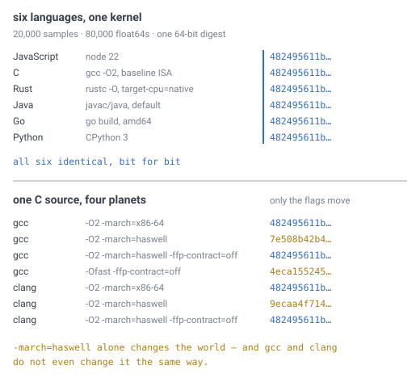
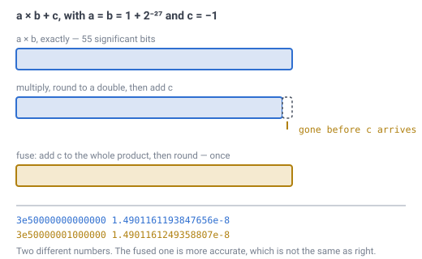

# 28 — The language and the runtime

## The problem

Someone has to type the first line, and nobody has said what in.

Twenty-seven documents decide the geometry, the addressing, the noise, the
meshing, the lighting and the file format. [Doc 26](26-implementation-readiness.md)
went through every open question in all of them and found four that genuinely
blocked code. Three have since been closed by building the thing and measuring
it. This is the fourth, and it is the only one left.

It is also the one that looked hardest, because [doc 23](23-determinism.md) had
already made a demand that sounded exotic: two machines running the same seed
must produce **the same bits**, or a client draws ground the server thinks is air.
Doc 23 argued from the IEEE 754 standard that this is achievable, and then said
so plainly:

> Nothing verifies the rule. This document argues from the standard and from a
> single machine's arithmetic. A real check would run the generator on two
> genuinely different platforms and compare hashes, which cannot be done from
> inside one script.

That turned out to be true and beside the point. The check *can* be run from
inside one script — one level down.

---

## What the specification actually asks a language for

Eight things, gathered from seven documents. They are not all the same kind of
requirement, and separating them is most of the work:

| | Requirement | From | Why |
|---|---|---|---|
| 1 | wrapping **`uint32`** arithmetic | [08](08-terrain-generation.md) | the noise hash is 3 wrapping multiplies and 2 xor-shifts |
| 2 | IEEE 754 **`+ − × ÷ sqrt`** | [23](23-determinism.md) | position → cell, ID → position, gravity and the ray walk are all in that set |
| 3 | **no implicit contraction** | [23](23-determinism.md) | `a*b + c` fused into one rounding is a *different* number |
| 4 | a **fixed reduction order** | [08](08-terrain-generation.md) | fBm at 4 and 5 octaves moves by `1.4e-17` if the order changes |
| 5 | **`float64` that stays `float64`** | [15](15-precision-and-origin.md) | an 80-bit intermediate is not the number that was stored |
| 6 | **`float32`** for GPU-facing data | [15](15-precision-and-origin.md) | per-vertex, chunk-relative — `122 µm` at radius 1,700 m |
| 7 | **a remesh fits in a frame** | [14](14-meshing-and-lod.md) | a chunk change rebuilds ~21,000 cells and 84,000 triangles |
| 8 | **one source, two targets** | [22](22-multiplayer-interest.md) | the client *regenerates* the coarse map, so it runs the server's generator |

> Requirement 8 is **weaker than this document originally claimed**, and
> [doc 29](29-what-runs-where.md) is the correction. Doc 22 says a *client*
> regenerates the coarse map — a statement about determinism, not about
> deployment. **No document in this specification requires a browser client.**
> A native client satisfies doc 22 completely and needs no WebAssembly. Whether
> there is a browser client is an open product decision, and Rust holds either
> way with a thinner margin if the answer is no.

> Requirement 7 said **"no GC pause inside a frame"** in the first draft of this
> document, and it was used below to push Java and TypeScript down the list. That
> was asserted rather than measured, and it does not survive being measured —
> Minecraft ships in a language with a garbage collector. The
> [section on what actually separates them](#a-garbage-collector-is-the-wrong-test)
> replaces it. The requirement is about the **frame**, not about the collector.

**The first four are properties of the language and its optimiser.** Nobody can
write around them: if the compiler is free to rewrite `a*b + c`, no amount of
careful code stops it. Those are testable, and the next three sections test them.

**The last four are engineering.** They are about what the runtime costs and what
it can be pointed at, and they get weighed rather than measured.

Everyone expected the decision to be made on the first four. It is not.

---

## The test: write the kernel six times and compare the bits

Take the pipeline this specification actually pins — not a benchmark, the real
thing:

```
the noise hash          3 wrapping uint32 multiplies, 2 xor-shifts   (doc 08)
the quintic fade        6t⁵ − 15t⁴ + 10t³                            (doc 08)
trilinear value noise   8 corners, weighted                          (doc 08)
fBm                     6 octaves, low octave first, ÷ summed amp    (doc 08)
the barycentric blend   A·a + B·b + C·c                              (doc 04)
normalize               sqrt(x² + y² + z²)                           (doc 04)
```

Run it over 20,000 sample points. Take the raw bits of every `float64` that comes
out — 80,000 of them — and fold them into one 64-bit digest. Then write that
same kernel, line for line, in six languages, and compare the digests.

This is not two platforms. It is better than two platforms for this particular
question, because six languages means **six different compilers, six different
optimisers and six different runtimes** all pointed at one machine's arithmetic.
If anything in that stack is free to rewrite the maths, it shows up as a
different digest.

---

## Six languages, one digest — so determinism decided nothing



*The top half is the result nobody expected: JavaScript, C, Rust, Java, Go and
Python land on the same 64 bits over the whole pipeline. The bottom half is the
only failure in the experiment, and it is not a language — it is the same C file,
on the same machine, compiled seven ways. Four of those seven agree with everyone
else. Three do not, and two of them do not even agree with each other.*

> **[verified]** `verification/language.js`, section 1. Six languages, six
> compilers, six runtimes, 20,000 samples, 80,000 `float64`s folded into one
> digest: **6 of 6 identical**, bit for bit.

**The requirement that looked like the deciding constraint eliminates nobody.**
Doc 23 was right, and more comfortably right than it dared claim: `+ − × ÷ sqrt`
really are specified to the bit, every mainstream language really does implement
them that way, and the pipeline really does stay inside that set.

That is worth sitting with, because it inverts the question. The job is no longer
"find a language that can be made deterministic". It is "notice that one candidate
can be made *non*-deterministic by accident, and then decide on everything else".

---

## The one thing that breaks it is a compiler flag

Here is the mechanism, and it needs teaching, because it is the only piece of
floating-point behaviour in this specification that a working programmer has
probably never met.

Multiply two `float64`s. The exact answer usually needs more bits than a `float64`
holds — up to twice as many — so the machine rounds it. Now add a third number.
That is two roundings.

A **fused multiply-add** does it in one. The chip computes `a×b` to full width,
adds `c` to *that*, and rounds once at the end. Modern CPUs have a single
instruction for it, and it is both faster and more accurate.

More accurate is not the same as the same.



*Worked on the smallest tidy case. `a = b = 1 + 2⁻²⁷`, so `a × b` is
`1 + 2⁻²⁶ + 2⁻⁵⁴` — 55 significant bits, and a `float64` keeps 53. Multiply-then-add
loses the tail before `c` arrives and gives exactly `2⁻²⁶`. Fusing keeps it and
gives `2⁻²⁶ + 2⁻⁵⁴`. The two differ in the last bit, and this figure computes both
with exact integer arithmetic rather than quoting them — they match what the
compiler emits, hex digit for hex digit.*

A compiler is **allowed** to make that substitution silently, and both of the ones
tested here do it, given the chance:

> **[verified]** `verification/language.js`, section 2. The same C source on the
> same machine, with only the flags moving, produces **four distinct digests**.
> `-march=haswell` alone changes the answer, because it makes the FMA instruction
> available and both compilers immediately fuse `sum += amp * value3(...)`.
> `-ffp-contract=off` restores it. And **gcc and clang do not fuse the same way**,
> so they disagree with each other as well as with everyone else.

### This is the default build on every ARM machine

That result is easy to misread as an obscure flag doing an obscure thing. It is
the opposite.

Plain `x86-64` has no FMA instruction, so a default build on an x86 machine
happens to be safe — which is exactly why this has never bitten anyone here.
**`aarch64` has FMA in the baseline.** Every Apple Silicon Mac, every phone, every
ARM server. On those targets there is no flag to forget, because the *default*
build is the contracting one.

So an x86 server and an ARM client, compiled in C from one source with no flags
at all, generate **two different planets**. That is doc 23's nightmare arriving
not from exotic hardware but from a laptop.

### And the flag is necessary, not sufficient

`-ffp-contract=off` is the documented repair and it works — at `-O2`, at `-O3`,
with fat LTO. It does not survive company:

> **[verified]** Same section. `-Ofast -ffp-contract=off` produces a **different
> digest again**, because `-Ofast` implies `-ffast-math`, which re-associates
> arithmetic regardless of what the contraction flag says.

The rule is therefore not "set one flag". It is "set one flag **and** never let
anyone add a member of a family of others, for the life of the project". No flag
can enforce that. A comment in a build file is the entire defence.

---

## `sqrt` is safe. `hypot` is not, and that is a trap

Doc 23 divided floating point into two groups: `+ − × ÷ sqrt` and comparisons are
exactly specified; `sin`, `cos`, `pow` are whatever the platform's library does.
That division is correct, and testing it turned up a name that is on the wrong
side of it:

> **[verified]** `verification/language.js`, section 3. The same inputs, four
> runtimes, one machine and one libm underneath. `sin`, `cos` and `exp` agree.
> **`pow` disagrees by one ULP** — node against the other three. **`hypot`
> disagrees by one ULP** — Java against the other three. And
> `sqrt(x*x + y*y + z*z)` **agrees everywhere**, exactly as IEEE 754 requires.

`hypot(x, y, z)` is the obvious way to write "how long is this vector". It reads
better, it is one call, and every language has it. It is also a **library
routine**, not an IEEE operation — nothing requires it to be correctly rounded,
and here it is not. So:

```
length = sqrt(x*x + y*y + z*z)     pinned, every platform, forever
length = hypot(x, y, z)            the obvious call, and wrong for this
```

**`normalize` must be written the long way.** This is a small rule with a large
blast radius, because `normalize(position)` is
[invariant 8](../CLAUDE.md) and the runtime's most-called function.

**Honest note on this repository:** its own verification scripts call `Math.hypot`
in 24 places. They are *measuring*, not specifying, and `determinism.js` priced a
one-ULP disagreement at `3.8e-13` of a cell against `1.21e-6` for the closest
sampled position — so no number anywhere in `docs/` moves. The engine may not do
it.

**Honest note on the rest of the table:** `sin`, `cos` and `exp` agreeing across
four runtimes is a *did-not-reproduce*, not a clearance. All four sit on one
machine's glibc. A Windows or macOS libm is a different implementation — and
`pow` already fails here, on the easy case.

The languages themselves say as much in writing. ECMAScript pins `+ − × ÷` and
`Math.sqrt` to IEEE 754 and then says of `Math.sin` that the result is
*implementation-approximated* — it is allowed to be whatever the engine's library
returns. That sentence is why doc 23 wrote the rule as a restriction on which
function you call rather than as an error budget, and nothing measured here
changes it: **never call a transcendental where the result is stored or shared.**

---

## A garbage collector is the wrong test

Requirement 7 was written as "no GC pause inside a frame" and then used as if
*having* a collector were the disqualifier. Two timings say it is not.

**The generator never allocates.** The kernel in section 1 — hash, fade, noise,
fBm, blend, `normalize` — is scalar arithmetic end to end, in every one of the six
languages. A collector cannot run in a loop that never asks for memory. And on
that loop, which is the hottest path this specification has:

> **[verified]** `verification/language.js`, section 5(a). 400,000 samples, best
> of five, process startup subtracted. C **69 ms**, Rust **79 ms** (1.14×), Go
> **89 ms** (1.29×), Java **111 ms** (1.60×), **JavaScript 121 ms (1.75×)**.

Under 2×, for the two garbage-collected runtimes, on the work that dominates
chunk generation. That is not an order of magnitude and it is not a reason to
eliminate anybody.

**The mesher does allocate**, and that is where the claim was really being made.
[Doc 14](14-meshing-and-lod.md) rebuilds ~21,000 cells into 84,000 triangles on a
chunk change. Building that buffer, per rebuild:

> **[verified]** Same section, 5(b). Rust with a `Vec` **0.18 ms**. JavaScript
> with typed arrays **0.27 ms — 1.5×**. JavaScript with one object per vertex
> **4.13 ms — 23×**.

**The language gap is 1.5×. The layout gap is 15×.** Which data layout you choose
matters about an order of magnitude more than which language you choose — and the
slow version is the one that allocates 42,000 objects per rebuild, which is the
garbage-collection case. The fast version allocates nothing and never collects.

So the real difference is not the collector. It is **which layout you get by
writing the obvious thing.** In Rust the obvious thing — a `Vec` of a `struct` —
is already contiguous. In JavaScript the obvious thing is an array of objects, and
the fast path means hand-packing into `ArrayBuffer`s, which is writing C in
JavaScript. That is a real difference. It is a much smaller one than "no GC".

**Honest caveat:** 5(b) builds a buffer; it does not mesh anything. There is no
mesher, no physics step and no engine, so nothing here measures a whole frame.
These two timings narrow the gap between the candidates. They do not close it,
and they are wall-clock numbers that move run to run.

---

## The decision: Rust

**Rust, and the reason is not determinism.**

Determinism turned out to be nearly free. What is left is requirements 5 through
8, which is where the decision should have been made all along:

1. **It is bit-identical with no build flag at all**, at every optimisation level
   tested, including `target-cpu=native` and fat LTO. Rust does not contract
   implicitly; `mul_add` is a function you call on purpose. The guarantee lives in
   the language rather than in a makefile, so it cannot be lost three years from
   now by someone adding `-Ofast` to speed up a build.
2. **`wrapping_mul` is spelled out.** Requirement 1 is a language feature, not a
   convention about which integer types happen to be safe to overflow.
3. **The fast data layout is the obvious one.** A `Vec` of a `struct` is
   contiguous without anyone deciding it should be, so requirement 7 is met by
   writing ordinary code rather than by remembering to. The measured gap to
   disciplined JavaScript is only **1.5×** — this is a margin, not a wall.
4. **One source compiles to native and to WebAssembly** — *if* a browser client
   is wanted, which no document actually requires (see
   [doc 29](29-what-runs-where.md)). Where it applies it is real and measured: the
   same Rust source compiled to `wasm32` produces the **identical digest** as the
   native build, at about **1.2×** native speed, so a browser regenerating
   [doc 21](21-rivers-and-erosion.md)'s coarse map gets the same map to the bit as
   the server that never sent it. What does not port is the platform edge —
   sockets, storage, threads — and doc 29 prices that.
5. **`wgpu` is one GPU story** across desktop and browser, which keeps point 4
   from being true of the generator and false of everything around it.

### The runner-up is Java, and it is closer than it looks

Java is **exactly as deterministic** — `strictfp` has been the default since
Java 17, so there is not even a keyword to remember — its `int` wraps, and
Minecraft is a rather emphatic existence proof that this genre ships in it.

It loses on **one** of the four, not two. The first draft said "a garbage
collector inside a frame budget, and no credible story for one codebase running
natively and in a browser" — but section 5 withdraws the first half of that: Java
is **1.60× C** on the allocation-free generator, ahead of JavaScript, and the
collector never runs there at all. What is left is the browser, and that is a real
gap rather than a decisive one.

### TypeScript is the strongest case against this decision

It deserves better than the line the first draft of this document gave it, which
scored it "browser only" and moved on. That is simply wrong: Node, Deno and Bun
are server runtimes, and TypeScript is the **only** candidate here that satisfies
requirement 8 with *no work at all*. Rust needs a `wasm32` target, a bindings
layer and two build profiles. TypeScript needs nothing — the same file runs on
the server and in the tab.

**So TypeScript wins one of the two requirements this decision turned on**, and
it is within **1.5–1.75×** on the other. The determinism table it sits in has it
agreeing bit for bit with everyone else. It is a genuinely good answer, and the
honest summary of the margin is:

| | Rust | TypeScript |
|---|---|---|
| bit-identical (§1) | yes | yes |
| generator throughput (§5a) | 1.14× C | **1.75× C** |
| mesher buffer (§5b) | 1.00× | **1.5×**, and 23× if written the obvious way |
| the fast layout is the default | **yes** | no — hand-packed `ArrayBuffer`s |
| native **and** browser from one source | yes, via `wasm32` | **yes, for free** |
| `wrapping_mul` | in the language | `Math.imul`, and easy to forget `>>> 0` |

Rust is chosen on rows 4 and 6 — the fast path being what you get by default, and
integer wrapping being a type rather than a discipline. **Those are preferences
about where mistakes get caught, not performance cliffs**, and this table is the
honest size of the gap.

If the goal were a playable prototype this year rather than an engine, TypeScript
would be the better call, and nothing measured here argues otherwise. That is
worth writing down, because the reasons above are not strong enough to pretend
the decision was forced.

### C++ is the only candidate this test caught being wrong

It has the highest performance ceiling and the largest ecosystem, and it is
genuinely the incumbent for this kind of engine. It is also the one that produced
four different planets from one file, that gets the *dangerous* default on ARM,
and whose repair is a flag rather than a property.

That is not a reason to forbid it. It is a reason not to choose it when a
candidate in the same performance class does not need the flag at all.

### Go, for the record

Go matched here, on `amd64`. But the Go specification **explicitly permits**
fusing `x*y + z` into an FMA, and on `arm64` the compiler does emit it. This
script runs on `amd64` and cannot test that, so Go is a *did-not-reproduce* —
the same standard applied to `sin` and `cos` above, and it should be applied
consistently.

---

## What follows for the build

Three lines, and they are the whole of what this decision imposes:

- **Rust, stable channel**, native for the server and the desktop client,
  `wasm32` for the browser client, from one source tree.
- **`normalize` is `sqrt(x*x + y*y + z*z)`.** Never `hypot`.
- **No `mul_add` anywhere in the generator.** It is the one call that can
  reintroduce the entire problem, and unlike C's flags it is visible in a diff.

---

## Still open

- **Two genuinely different platforms have still not been compared.** Everything
  here ran on one x86-64 Linux box. The `aarch64` claim is read off the
  instruction set, not measured. Running `verification/language.js` on an ARM
  machine and diffing the digest is the one experiment left — and it is now a
  five-minute job rather than the impossible one doc 23 described.
- **The kernel is the generator, not the engine.** It covers noise, the
  barycentric blend and `normalize`. It does not cover the mesher, the physics
  step or anything that will eventually be threaded, and requirement 4 — fixed
  reduction order — becomes a live question the moment work is split across
  cores. Nothing here tests that, because there is nothing to test yet.
- **Performance is measured on two loops and nothing else.** Section 5 times the
  generator kernel and a mesher buffer build. It does not time a mesher, a physics
  step, a lighting pass or a frame, because none of those exist. The claim that
  Rust and C++ are in the same class is still received wisdom — C is 1.00× and
  Rust 1.14× on the one loop that was measured, which is consistent with it and
  does not establish it.
- **Whether the layout argument survives contact with a real mesher.** Section 5
  shows a 15× gap between disciplined and naive JavaScript, and asserts that Rust
  gets the disciplined layout by default. That is true of a `Vec<Vertex>`. Whether
  it stays true across a whole engine is exactly the kind of claim this repository
  is supposed to measure rather than believe, and it cannot be measured yet.
- **`wgpu` is named and not evaluated.** Point 5 above is the weakest line in this
  document.

---

## In one breath

- **Six languages, one kernel, one digest.** JavaScript, C, Rust, Java, Go and
  Python agree bit for bit over 80,000 `float64`s of the real pipeline — so doc
  23's unrun check is now run, one level down, and it passes.
- **Determinism decided nothing**, because every candidate has it. The question
  was never "which language can be made deterministic".
- **One C source gives four planets.** `-march=haswell` alone changes the world,
  because the compiler fuses `a*b + c` into one rounding — and gcc and clang do
  not even fuse it the same way.
- **On ARM that is the default build.** No flag to forget: `aarch64` has FMA in
  the baseline, so an x86 server and an ARM client from one source disagree out
  of the box.
- **`-ffp-contract=off` is necessary and not sufficient** — `-Ofast` undoes it —
  so the rule is a prohibition no flag can enforce.
- **`sqrt` is pinned and `hypot` is not**, measured one ULP apart between runtimes
  on one machine. `normalize` is written the long way.
- **A garbage collector is the wrong test.** The generator allocates nothing, so
  nothing collects; JavaScript is **1.75×** C there and Java **1.60×**. On the
  mesher buffer the **language gap is 1.5× and the layout gap is 15×** — what you
  choose matters ten times less than how you lay the data out.
- **Rust**, chosen on the requirements that were left: no flag needed,
  `wrapping_mul` in the language, the fast layout being the *default* one, and one
  source compiling to native and WebAssembly. **The margin is thin and stated as
  such** — TypeScript satisfies that last requirement for free and is within
  1.5–1.75×, and would be the better call for a prototype.
- **And "Rust" needs a scope**, which this document did not give it.
  [Doc 29](29-what-runs-where.md) supplies one: the determinism argument above
  constrains **the core only**, the layout argument constrains **the mesher**, and
  nothing here constrains the world-state layer at all.
