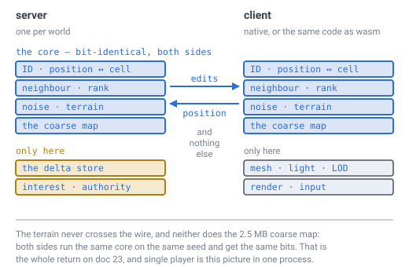

# 29 — What runs where

## The problem

[Doc 28](28-language-and-runtime.md) said **Rust** and never said Rust for *what*.

That is not a small omission. "The engine is written in Rust" and "the shared
deterministic core is written in Rust" are different projects with different
costs, and the argument doc 28 actually ran only supports one of them. This
document says which parts exist, which parts must be identical on two machines,
and what "compiles to WebAssembly" buys once you are specific about it.

---

## First, a correction: nothing in this specification asks for a browser

Doc 28 gave five reasons for Rust, and leaned hardest on the fourth:

> **One source compiles to native and to WebAssembly**, which is requirement 8
> and is the sharpest of the four. […] a browser client and a native server only
> agree if they are **the same code**.

**No document requires a browser client.** The word does not appear anywhere in
docs 00–27 except in a note about opening the demos. What
[doc 22](22-multiplayer-interest.md) actually says is:

> a **client** reproduces the map exactly, provided the noise uses an integer
> hash and the erosion exponents come from the exact set. The 2.5 MB never goes
> on the wire.

That is a statement about **determinism**, not about deployment. A native client
regenerating the coarse map satisfies doc 22 completely and needs no WebAssembly
at all. Doc 28 read "client", inferred "browser client", and then promoted the
inference to the deciding argument. Earlier drafts of this document would have
repeated it; it is corrected here instead, and doc 28 now points at this page.

**Whether there is a browser client is a product decision nobody has made.** It
is listed as open at the bottom. Rust survives either way — it just has two
reasons rather than four if the answer is no.

---

## The server never generates terrain, and that is doc 22's own claim

Earlier drafts of this document drew the server and the client each holding the
same core, terrain generation included. That is wrong, and
[doc 22](22-multiplayer-interest.md) says so in one line of its own summary:

> **The server needs a player position per client**, which it has anyway, **and
> nothing else.**

Nothing else. The server stores what players changed and works out who to tell.
It never has an opinion about what the ground looks like, because
[doc 08](08-terrain-generation.md) means what it says — **terrain is generated,
not stored** — and a server that generated it would be doing work whose only
possible consumer is a screen it does not have.

*The gold arrow is the one that matters and **no data flows along it**. Two
clients must agree about the terrain to the bit — one sees a hill where the other
sees a valley, otherwise — and they never exchange a byte about it. The server
sits above them routing edits and never joins that conversation at all.*

**So determinism is a client-to-client rule, not a client-to-server one.** Doc 23
opened with "two computers run the same generator on the same seed" and it turns
out both of those computers are clients. That makes the requirement *stronger*
rather than weaker: it holds whatever shape the server takes, because the server
is not a party to it.

---

## Four parts, not three — and the split is not where it looked

The mistake in the earlier draft was lumping two different things together as
"the core". They have different homes.

### Addressing — both sides, and unavoidably so

| What | Owned by |
|---|---|
| the ID: encode, decode, truncate to a chunk | [03](03-addressing.md), `id.js` |
| position → cell, and ID → position | [04](04-position-lookup.md), `hexround.js` |
| `neighbour(id, k)` and face crossing | [05](05-face-adjacency.md), `neighbour.js` |
| `rank(q, r)` and chunk ownership | [07](07-data-structures.md), `rank.js` |

The server cannot avoid this, and the reason is small and absolute: **the delta
store is keyed by cell ID**, and interest is one dot product against a *chunk's*
direction. You cannot store an edit or route it without doing the arithmetic that
turns a position into an address.

But notice how little this is. It is integer bit-shuffling plus one barycentric
blend and one `normalize`. **No noise, no height field, no terrain.**

### Generation — the client, and this is the part that must be bit-identical

| What | Owned by |
|---|---|
| the noise function | [08](08-terrain-generation.md), `noise.js` |
| terrain: the height field and the density term | [08](08-terrain-generation.md), `volume.js` |
| continents, flow routing, erosion — the coarse map | [21](21-rivers-and-erosion.md), `rivers.js` |
| the ray walk | [09](09-ray-traversal.md) |

Pure functions of the seed and a position. No I/O, no allocation, no GPU, no
clock — which is why `language.js`'s kernel allocates nothing in any of seven
targets.

This is the layer [doc 28](28-language-and-runtime.md)'s determinism argument was
about, and it is the whole of it. It is also, as you put it, **part of the client
and not part of the presentation**: it is deterministic where presentation is
free, and it produces data rather than pixels.

### Presentation — the client, and deliberately free

| What | Owned by |
|---|---|
| meshing, merging, LOD selection, seam ownership | [14](14-meshing-and-lod.md), `mesh.js`, `seam.js` |
| lighting | [16](16-lighting.md), `light.js` |
| the three local frames, camera, input | [13](13-gravity-and-orientation.md), `frame.js` |
| the anchor-and-offset rebase | [15](15-precision-and-origin.md), `precision.js` |
| drawing water back to front | [25](25-water.md), `water.js` |
| lat/long readout, the horizon, bearings | [20](20-player-coordinates.md), `coords.js` |

Doc 23 grants the GPU freedom to differ; the same freedom covers this whole
layer, because none of it is ever compared between machines. **It is also where
every transcendental in the design lives** — the lat/long readout, the horizon,
the compass — which is exactly why doc 23's rule *"never call a transcendental
where the result is stored or shared"* costs nothing. The calls are all in the
layer that shares nothing.

### World state — the server, and the only thing that grows

| What | Owned by |
|---|---|
| the delta store: cell ID → block state | [07](07-data-structures.md), [27](27-block-state.md) |
| the side table: cell ID → a tagged blob | [27](27-block-state.md) |
| the block registry, in the save | [27](27-block-state.md) |
| entities, per chunk by containment | [27](27-block-state.md) |
| interest: who to tell about an edit | [22](22-multiplayer-interest.md), `interest.js` |

Doc 07 calls the delta store "the only structure that grows", and ten million
player edits are [76 MB](07-data-structures.md) before compression. A client
keeps a copy of the part it can see; the server keeps all of it and owns it.

---

## The one thing this leaves genuinely open

The picture above is a server that **stores and routes and nothing more**. That
is what doc 22 describes and it is the cheapest thing that works. It also means
the server takes a client's word for everything: a client that claims to have
broken a block inside solid rock a kilometre away cannot be contradicted, because
the server does not know what the rock looks like.

**That is a trade nobody in this specification had made** —
[doc 30](30-authority-and-cheating.md) now makes it, and finds the question was
posed wrongly here. It is not a binary. Validating edits needs a **point query
per edit**, not a chunk: `0.06%` of a core at a thousand players. Only **mobs**
need resident chunks, and that is a gameplay decision rather than an honesty one.
The table below is kept because the framing it gets wrong is instructive.

| | Server stores and routes | Server also generates |
|---|---|---|
| what it runs | addressing only | addressing **and** generation |
| edit validation | trusts the client | can check reach and solidity |
| mobs and pathfinding ([doc 10](10-pathfinding.md)) | client-side, or absent | server-authoritative |
| cost | matches doc 22 exactly | the generator runs twice per world |
| suits | co-op with people you know | a public server |

Nothing in docs 00–27 chooses. Doc 22 assumes the first without arguing for it,
and doc 10's pathfinding never says whose CPU it runs on. **Doc 29 records the
first as the working assumption** — it is what doc 22 says, and it is the one you
can start building — and files the choice as open. The good news is that the
switch is cheap: the server would link the same generation crate the client
already has, and change nothing else in this document.

---

## So: how much of the engine is Rust?

**All of it, and doc 28's reasoning covers about a fifth of it.** Those are both
worth saying.

- The **determinism** argument (§1–3 of doc 28) constrains **generation only** —
  which is client-side, and is the smallest of the four parts.
- The **layout and allocation** argument (§5) is about **presentation**, the
  mesher — also client-side.
- **Addressing** needs wrapping `uint32` and IEEE arithmetic and nothing else.
- **World state** — the server — is ordinary data structures with no exotic
  requirement at all. On the working assumption above, **the server is the part
  of this system with the weakest claim on Rust.**

Writing the whole engine in one language is a practical choice, not a derived
one. The alternative — a Rust core with a client in something else — is a real
option, and it costs a foreign-function boundary on the hottest path in the
design plus two build systems. It buys nothing this specification asks for.

What the layering *does* give you is the honest scope of the risk: **if the
language choice turns out to be wrong, generation is the part that is expensive to
move**, because it is the part that may not change behaviour by a single bit.
Everything else is ordinary code and can be rewritten in anything, any time —
including the server, which on the working assumption above touches no floating
point at all beyond one dot product.

---

## Rust → WebAssembly, concretely

If there *is* a browser client, this is what the phrase means.

### What compiles to both targets unchanged

**Addressing and generation both do, and it is measured, not assumed.**

> **[verified]** `verification/language.js`, section 1. The same Rust source
> compiled to `wasm32-unknown-unknown` and run inside node produces
> **the identical 64-bit digest** as native Rust, native C, Java, Go, Python and
> JavaScript. **7 of 7.**

That is the row doc 22 actually needs: a browser regenerating the coarse map gets
the same map, to the bit, as the server that never sent it. And it is not slow —
on the generator kernel the wasm build runs at about **1.2× native Rust**, which
is still faster than the same algorithm written in JavaScript.

**Presentation mostly does too.** The mesher is buffer building and is pure
computation. Rendering goes through `wgpu`, which targets WebGPU in the browser
and Vulkan, Metal or DX12 natively from one source.

### What does not: the platform edge

This is the part "one source, two targets" quietly hides, and it is the honest
cost of the decision:

| | Native | Browser |
|---|---|---|
| networking | TCP / UDP sockets | WebSocket or WebTransport |
| storage | the filesystem | IndexedDB or OPFS |
| threads | OS threads | wasm threads — needs `SharedArrayBuffer`, which needs specific HTTP headers |
| windowing and input | `winit` | `winit` on canvas |
| binary size | irrelevant | a download, and `wgpu` is not small |

So the shape is a **core crate that knows nothing about the platform**, and a thin
trait with two implementations for everything at the edge. That is a normal
amount of work, and it is not free, and doc 28 implied it was.

### Single player is the same picture in one process

The client already generates the whole world, so a single-player game is the
delta store and interest running in the same process with the network replaced by
a function call. This falls out; nobody has to design it. It is also the reason to
keep the boundary between generation and world state sharp before multiplayer
exists — single player is the case where forgetting it costs nothing until the day
it costs everything.

---

## Still open

- **Whether there is a browser client at all.** This is a product decision and
  nobody has made it. Doc 28's fourth reason for Rust evaporates if the answer is
  no — the decision still holds on the other reasons, with a thinner margin.
- **The protocol.** Doc 22 decides *who* to tell about an edit and says nothing
  about the format, the transport, or the tick rate.
- **Authority and conflict.** Doc 22 lists this as open and it still is: two
  players editing one cell, and what the client is allowed to predict.
- **Where the coarse map is computed for a joining client.** It is 2.5 MB and
  computed once at world creation ([doc 21](21-rivers-and-erosion.md)); a client
  regenerating it pays that cost on join, and nobody has measured how long it
  takes. If it is slow, "regenerate rather than download" is still right but needs
  a loading screen.
- ~~Whether the server validates edits, or trusts the client.~~ — **closed** by
  [doc 30](30-authority-and-cheating.md): it validates, with a point query per
  edit, because that costs `0.06%` of a core at a thousand players and closes the
  only blind spot the server has.
- **Whether mobs run server-side** ([doc 10](10-pathfinding.md), doc 30). Still
  open, but no longer an architecture question — doc 30 prices it at **158×** what
  player validation costs and shows it is the only thing that makes the server a
  simulator.
- **Whether generation should be `no_std`.** It has no reason to allocate, and a
  `no_std` core compiles to a 1.6 KB wasm module against 1.35 MB with the standard
  library linked in. That is a build-shape question, not a design one, but it is
  the kind that gets much harder to change later.

---

## In one breath

- **Doc 28 said Rust and did not say Rust for what.** This page says: all of it,
  while noting that doc 28's argument only ever constrained the core.
- **Nothing in docs 00–27 requires a browser.** Doc 22 says a *client*
  regenerates the coarse map, which is a claim about determinism, not deployment.
  Doc 28 read that as a browser and made it the deciding reason; that is
  corrected.
- **The server never generates terrain.** Doc 22 already said it — "a player
  position per client, and nothing else" — and this page had it wrong first time.
  A server that generated the world would be computing something only a screen
  could use.
- **Four parts, not three.** **Addressing** is on both sides and unavoidably so,
  because the delta store is keyed by cell ID. **Generation** is client-side and
  is the only part that must be bit-identical. **Presentation** is client-side and
  deliberately free — which is where every transcendental lives, and why doc 23's
  rule costs nothing. **World state** is the server, and the only thing that grows.
- **Determinism is a client-to-client rule**, not a client-to-server one. The two
  machines that must agree are two players, and they never exchange a byte about
  the terrain.
- **The wire carries edits and positions.** No terrain, and not the 2.5 MB coarse
  map, because every client rebuilds it from the seed.
- **Rust → wasm is real and measured**: the same source gives the **identical
  digest**, at about **1.2×** native. What does not port is the platform edge —
  sockets, storage, threads — and that needs a trait with two implementations.
- **Single player is this diagram in one process**, with the network replaced by
  a function call.
