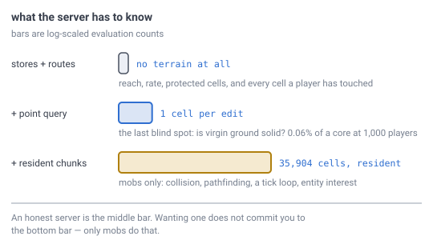

# 30 — Authority, mobs and cheating

## The problem

A client sends a packet saying it broke a block. Why should the server believe it?

[Doc 29](29-what-runs-where.md) drew a server that stores edits and routes them
and knows nothing about terrain, noted that such a server takes the client's word
for everything, and filed the trade as open. This document opens it — and the
first thing to say is that **"does the server generate?" is the wrong shape of
question.** It has three answers, not two, and they differ by four orders of
magnitude.

---

## Most cheating is refused with what the server already has

[Doc 29](29-what-runs-where.md) established that the server holds two things:
**addressing**, because the delta store is keyed by cell ID, and **the delta
store itself**. Almost everything crude is answerable from those alone.

> **[verified]** `verification/authority.js`, section 1. Seven checks, and the
> server pays **nothing new** for any of them:
>
> | Refused by | Needs | How |
> |---|---|---|
> | the cell is a kilometre away | addressing | ID → position, one distance |
> | 400 blocks in one second | nothing | a counter per player |
> | moving faster than a player can | nothing | positions over time |
> | editing a protected pentagon column | addressing | [doc 17](17-pentagons.md): is it one of the 12? |
> | a cell ID that does not exist | addressing | decode and range-check |
> | a block type not in the registry | the save | [doc 27](27-block-state.md) |
> | an action a **known** cell contradicts | delta store | breaking a cell the store says is air; placing into one it says is solid |

### Two things that last row is not

The delta store is sometimes described as putting "the built world under
authority", and griefing as the thing it prevents. Both readings are wrong, and
wrong in the way that sounds reassuring.

**Griefing is not cheating.** Breaking a block someone else placed is a *legal
move*. The server cannot tell it from ordinary mining, and no amount of terrain
knowledge would help — telling them apart needs land claims or permissions, which
this specification does not have and this document does not design. Nothing here
protects anyone's house.

**What the delta store actually buys is consistency, not authority.** It knows the
*current state* of every cell a player has changed, so it can refuse an action
that contradicts it: you cannot break a cell it knows is already air, and you
cannot place into one it knows is solid. That catches a desynced client and a lazy
cheat. It is a modest thing, stated modestly.

**So the honest summary is: the crude cheats are refused with what the server
already holds, and those checks are all about where and how fast — never about
what.** Everything to do
with what is actually in the ground needs the next section.

---

## The blind spot is virgin ground, and it matters because of the drop

The server cannot say what is in an **unmodified** cell, because
[doc 08](08-terrain-generation.md) generates terrain and does not store it. That
is the only gap. *Why anyone should care* is the part that needs explaining, so
here it is.

**It is not mainly about legality.** It is about what the block gives you when you
break it.

Doc 08's generator does not return "solid or air" — it returns a **material**:

```
material(seed, position, ...) → stone / dirt / grass / water
```

Now put that next to the rule from
[the farming section](#the-farming-cheat-is-not-about-terrain-and-no-amount-of-server-cpu-fixes-it)
below: the client sends **intents**, and the **server** decides what the broken
block drops. To do that, the server has to know **what was there**.

| The player breaks… | The server knows the type? |
|---|---|
| a cell in the delta store | **yes** — it recorded the change. Free. |
| a virgin cell | **no** |

And for a virgin cell it has exactly two options. It can **ask the client** what
it just mined — which is precisely the farming cheat that rule exists to refuse —
or it can **generate that one cell**: `material(cell)` for the drop, which answers
`solidity(cellID)` on the way past, since air is one of the materials.

**Almost every cell in a world is virgin.** Nobody has been there. So without the
point query, "the server issues the drop" only works on ground somebody has
already dug, which is a rounding error of the planet. **The point query is what
makes the intents rule implementable at all** — and that, rather than legality, is
what the cost in the next section is buying.

---

## The blind spot costs a point query, not a chunk

Here is the mistake the phrase "an authoritative server has to run the generator"
smuggles in. It does not have to *run the generator* in the sense of producing
chunks. It has to answer one question about **one cell**, when an edit arrives, at
the rate a human clicks.



*Log-scaled, because a linear scale would make the first two invisible. The
distance between the middle bar and the bottom one is the whole argument: an
honest server is the middle bar, and wanting one does not commit you to the
bottom one.*

> **[verified]** `verification/authority.js`, section 2. One point query is
> **310 ns** in JavaScript, so about **200 ns** in Rust by doc 28's measured
> ratio. A chunk is **561** evaluations for the height field alone and **35,904**
> for a full crust with caves. And [doc 27](27-block-state.md) measured a player
> acting on a block about **twice a second**:
>
> | Players | Queries/s | CPU of one core |
> |---|---|---|
> | 10 | 20 | 0.0006% |
> | 100 | 200 | 0.0062% |
> | 1,000 | 2,000 | **0.062%** |
> | 10,000 | 20,000 | 0.62% |

**A thousand players cost six hundredths of one percent of a core.** The reason is
structural rather than lucky: a player is a slow, human-rate event source, and
each event needs **one cell** — no chunk, no cache, no layers above or below, no
mesh.

So this is cheap whenever it is wanted. **For V1 it is not wanted** — see
[the V1 decision](#the-v1-decision-the-server-stores-and-checks-nothing) below,
which scopes the server down to storage. The consequence of that is not abstract,
and it is spelled out there: a storage-only server cannot issue drops, so **V1's
inventory has to stay on the client**.

---

## Mobs are a different question, and they are the expensive one

A mob is not a human. It does not act twice a second — it is simulated every
tick, and it needs terrain *around* it rather than at one cell.

> **[verified]** Same script, section 3. A pathfinding mob looking 32 cells ahead
> touches a hex disc of `3r² + 3r + 1` = **3,169 cells** — the same formula
> [doc 16](16-lighting.md) uses for a light disc, because a hex disc is a hex
> disc. That is **0.64 ms** of generation per path if nothing is cached. A hundred
> mobs pathing once a second is **6% of a core** — 158× what a *thousand* players
> cost, from a hundredth of the population.

And no real implementation would regenerate per step; it would keep the chunk
resident, which is precisely the thing edit validation was able to avoid. So the
honest statement of the trade is:

```
validating edits  ->  a point query per edit. No cache, no memory, no tick.
simulating mobs   ->  generated chunks RESIDENT on the server, plus a tick
                      loop, plus doc 10 pathfinding, plus entity interest —
                      which doc 22 lists as open and this does not close.
```

**Mobs are what turn the server from a store into a simulator.** Edit validation,
on its own, does not. Those two decisions have been argued as one thing and they
are not one thing.

### What changes if mobs run on the server

Concretely, against [doc 29](29-what-runs-where.md)'s four parts:

- **Generation stops being client-only.** The server links the same crate. It
  does not need a *different* generator, and doc 23's bit-identity is unaffected
  because it was already a client-to-client rule.
- **The server grows a tick loop and a working set.** A chunk cached as block
  data is [doc 07](07-data-structures.md)'s **8.8 KB** at two bits a cell; the
  count of them is set by how many mobs are awake and where, which nothing here
  measures.
- **[Doc 10](10-pathfinding.md)'s pathfinding moves to the server**, and it has
  never said whose CPU it runs on.
- **Entity interest becomes load-bearing.** [Doc 22](22-multiplayer-interest.md)
  explicitly excludes moving entities from its analysis, and
  [doc 27](27-block-state.md) measured a mob crossing a cell every **0.71 s** —
  a rekey every 14 ticks at 20 Hz. That is the open question this pulls in.
- **Mob positions stop needing determinism entirely.** They become
  server-authoritative and replicated, so there is nothing for two clients to
  disagree about. Server-side mobs *remove* a determinism requirement rather than
  adding one.

---

## The farming cheat is not about terrain, and no amount of server CPU fixes it

Two claims arrive as packets and they look alike:

```
a WORLD claim    "I broke cell X"       checkable — the sections above
a PLAYER claim   "I now have 3 iron"    NOT checkable, at any cost
```

The second cannot be validated by generating terrain, caching chunks, or spending
any amount of server CPU, because **the server has no independent way to know
what a player is holding**. It can only know what it *issued*.

So the fix is not a check. It is a rule about what the client is allowed to say:

**The client sends intents, never outcomes.**

Under that rule the farming cheat has nowhere to live:

```
1. client:  I break cell X
2. server:  reach ok, rate ok, not protected        (free — section 1)
3. server:  what was there? delta store, or one point query   (section 2)
4. server:  that type drops that item               <- the SERVER decides
5. server:  your inventory is now this              <- the SERVER tells you
```

**Step 4 is the whole answer, and it costs nothing**, because
[doc 27](27-block-state.md) already puts the **block registry in the save**,
server-side. The type → drop table is already where it needs to be. The client
never names an item at all — it names a *cell* and an *action*, and both are
things the server can check.

### Which is also why the wire must not be general RPC

An RPC surface is a list of things the client may ask the server to do. The moment
one of them takes an outcome as an argument — `giveItem`, `setHealth`,
`addExperience` — the rule above is broken, and no amount of validation elsewhere
puts it back.

What crosses the wire is a small **closed** set:

```
client -> server    my position
                    I act on cell X with intent Y

server -> client    these cells changed
                    your inventory is this
                    these entities are here
```

Doc 22 already named the first and third and said the server needs "a player
position per client, and nothing else". This adds *intents* and *inventory* to
that list and closes it.

---

## The V1 decision: the server stores, and checks nothing

**Decided: for V1 the server is a point of storage only.** It holds the delta
store, it routes edits to interested players, and it validates nothing. Server-side
simulation — mobs, and the input-driven authority that goes with them — is wanted
later and is explicitly **out of scope for V1**.

This document recommended the middle bar and the decision is the first one. That
is a legitimate call, and this is precisely what it costs:

- **Everything in section 1 stays available** whenever it is wanted,
  because it needs nothing the server does not already hold. Reach, rate,
  protected columns, malformed IDs, unknown types, and the whole edited world.
  V1 declines to *use* them; it does not lose them.
- **V1 is a trusted-client game.** That is the right shape for playing with people
  you know and the wrong shape for a public server, and the difference is a
  deployment decision rather than a rewrite.

### The one thing V1 must get right anyway

A storage-only server is cheap to build and cheap to upgrade — **provided V1 does
not ship a wire that forecloses the upgrade.** Two rules, and both cost V1
nothing:

**1. An edit message names a cell and a resulting block state.** That is what a
storage-only server needs, and it happens to be exactly what a validating server
can check later: the cell gives reach against the player's position, and the state
gives the type check and the solidity query. **Adding authority in V2 is inserting
a check before the store, not changing the message.** The upgrade costs nothing
as long as nobody invents a shortcut here.

**2. Player inventory must not travel client → server.** This is the trap, and it
is the one thing that cannot be repaired later.

It follows directly from the section above. A storage-only server does not run the
point query, so it does not know the material of a virgin cell, so **it cannot
issue drops**. Something has to decide what a broken block gives the player, and
in V1 that something is the client. That is fine — V1 is a trusted-client game by
this decision — but it means the inventory is a client-side fact.

The mistake would be to *sync* it anyway, for persistence. If V1 lets a client
write its own inventory to the server, then V2 has no way to make that
authoritative without throwing the mechanism away and re-deriving every player's
items from nothing. **Keep inventory client-side in V1 and do not sync it.** If it
must persist, persist it as an opaque client blob that is explicitly not believed,
and write "not authoritative" next to it in the save format so nobody later
mistakes it for truth.

**3. The client must be able to be told "no", even though V1 never says it.** A
V1 client that assumes every edit succeeds has no code path for rejection, and
adding one in V2 touches every place the client predicts a change. Ship the
rejection message in V1's closed set, unused. It costs a message type and it saves
the rollback question ([Still open](#still-open)) from becoming a rewrite.

Those three are the entire cost of keeping the door open, and none of them makes
V1 bigger.

---

## What cannot be prevented, by construction

**Every client generates the whole planet.** That is [doc 29](29-what-runs-where.md),
and it means every client can already see where the ore is without digging for it.

An x-ray cheat is **unpreventable in this design**, and not because of an
oversight — it is what "terrain is generated, not stored" means. The same is true
of every seed-based world, and no server-side check touches
it: the client is not lying about anything, it simply knows.

What *is* preventable is **acting** on that knowledge faster than a player could,
which is the rate limit in section 1 and costs nothing. That is the honest line:
**this design can police actions and can never police knowledge.**

---

## Still open

- **How much slack the reach check gets.** A distance bound needs a number, and it
  interacts with latency: a player who is genuinely where they say they are, half
  a second ago, must not be refused. Nothing here measures it.
- **Two players editing the same cell**, which [doc 22](22-multiplayer-interest.md)
  raised and this does not close. Last-write-wins is the obvious answer and nobody
  has checked what it feels like.
- **What the client may predict.** A client that waits for the server before
  showing a block break feels bad at 100 ms. A client that predicts must be able
  to roll back, and that is a whole mechanism nothing here designs.
- **Entity interest** — doc 22's own open item, promoted to a blocker the moment
  mobs run server-side.
- ~~Whether mobs run server-side at all.~~ — **out of scope for V1** by the
  decision above. Still the right question for V2, and now a gameplay one rather
  than an architecture one, which is the useful change.
- **The item format.** [Doc 27](27-block-state.md) lists it open and it stays
  open. The *rule* above works without it — the server issues drops from the
  registry — but the inventory it issues them into has no design yet.

---

## In one breath

- **V1: the server stores and checks nothing.** Decided. Server-side simulation
  is V2. The cost of keeping that door open is three rules and no extra work:
  edits name a cell and a state, inventory never travels client → server, and the
  client ships a rejection path it never uses.
- **"Does the server generate?" has three answers.** Stores-and-routes,
  plus-point-queries, plus-resident-chunks — and they differ by four orders of
  magnitude.
- **The free checks are all about where and how fast, never about what.** Reach,
  rate, movement speed, protected cells, malformed IDs, unknown types — plus one
  consistency check against cells the delta store already knows. That last one is
  **consistency, not authority**, and **griefing is not cheating**: breaking
  someone else's block is a legal move that no amount of terrain would let the
  server refuse.
- **The blind spot is virgin ground, and it matters because of the drop.** Doc 08
  returns a **material**, and the server must know what was there to decide what
  breaking it gives. For a virgin cell it can either ask the client — the farming
  cheat — or spend **200 ns**. Almost every cell is virgin, so **the point query is
  what makes the intents rule work at all**, at 0.06% of a core per thousand
  players. Deferred to V2 with inventory kept client-side, not because it is
  expensive but because V1 does not need it.
- **Mobs are the expensive decision, not honesty.** A pathfinding mob touches
  **3,169** cells; a hundred of them cost **158×** what a thousand players do, and
  they need chunks resident, a tick loop, and doc 22's open entity-interest
  question.
- **Server-side mobs remove a determinism requirement**, because replicated
  positions are not recomputed.
- **The farming cheat is not about terrain.** The client sends **intents, never
  outcomes** — it names a cell and an action, and the server issues the drop from
  doc 27's registry. That is why the wire is a closed message set and not RPC.
- **X-ray is unpreventable by construction**, because every client generates the
  whole planet. This design polices **actions**, never **knowledge**.
