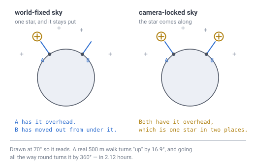

# 32 — The sky, the clouds and the moon

## The problem

You are standing on a planet you can walk around in two hours. What is above you?

On a normal world the answer is three well-understood pieces of decoration: a
skybox, a scrolling cloud texture, and a sprite for the moon. Every one of them
rests on the same quiet assumption — **that the player does not move far enough
to matter.** On this planet that assumption is false, and each of the three breaks
in a different way.

None of this is expensive. All three are **presentation**
([doc 29](29-what-runs-where.md)): client-side, never compared between machines,
and therefore allowed the transcendental functions [doc 23](23-determinism.md)
forbids in the generator. That freedom is used here, and it is why the answers
come out cheap.

[Doc 11](11-open-topics.md) listed these three as *discussed and in no document at
all*. This is the document.

---

## The sky turns because you walk, not because it moves

A classic skybox is drawn centred on the camera and never translates. That works
because a flat world has **one** up, shared by everyone, forever. Here `up` is
`normalize(position)` ([invariant 8](../CLAUDE.md)) and it is different at every
cell, so walking rotates your whole frame against a sky that is standing still.

> **[verified]** `verification/sky.js`, section 1. On the worked planet the
> circumference is **10,681 m**. Walking turns your own `up` by `s/R`:
>
> | Walk | `up` turns by |
> |---|---|
> | 10 m | 0.34° |
> | 100 m | **3.37°** |
> | 500 m | 16.85° |
> | 2,670 m | 90° |
> | 10,681 m | **360°** |
>
> So a player who walks round the planet sees the **entire celestial sphere** pass
> overhead, in **2.12 hours**, without waiting for anything.



*Drawn at 70° of separation so it reads; a real 500 m walk is 16.9°. On the left
the star is fixed in the world, so walking from A to B slides you out from under
it — which is what a sky is for. On the right it is locked to the camera, and the
same star has to appear in two places at once. That is not a subtle artefact: it
is the sky painted on the inside of the player's helmet.*

**So the skybox is fixed in world space, not view space.** It is drawn as a
sphere at large radius centred on the *planet*, and the camera's orientation
within it comes from the player's own frame. That is one matrix, and it is the
whole design.

**Demo:** [`demos/sky-on-a-small-planet.html`](../demos/sky-on-a-small-planet.html)
— drag a walker round the planet and watch the sky turn, then switch the sky to
*locked to the camera* and watch the view freeze however far you go. The moon is
drawn to scale, so the 0.52° option really is a speck, and it slides against the
stars as you move.

### Which means a player can outwalk the sunrise

[Doc 16](16-lighting.md) already gets day and night from one dot product against
`up`, and measures the terminator's speed as `circumference / dayLength`. Compare
that to the player rather than to the ground and something specific to a small
planet falls out:

> **[verified]** Same script, section 2.
>
> | Day length | Terminator | A walking player is |
> |---|---|---|
> | 0.5 h | 5.93 m/s | 4.2× slower |
> | **2.12 h** | 1.40 m/s | **exactly matched** |
> | 6 h | 0.49 m/s | 2.8× faster |
> | 24 h | 0.12 m/s | **11.3× faster** |

Below about **2.12 hours** of day length the sun outruns the player and the sky
behaves like any other game's. Above it, **a player walking west can hold the
sunset in place**, or walk east into dawn.

That is not a defect to design around. It is the most legible way this world tells
you it is small, and it costs nothing — doc 16 computes the lighting from one dot
product either way. **Pick the day length in units of how long it takes to walk
round**, which is what doc 16 suggested without knowing this was the reason.

---

## Clouds borrow the lattice and are not cells

Earlier drafts of this document said a cloud was "a cell of the same grid at a
bigger radius, with no new addressing". That is wrong in a way worth being precise
about, because it invites exactly the mistake it should be preventing.

**Clouds have no address at all.** Not a cell ID, not a chunk, not a layer.

Two things are being confused when they are described as one:

| | Reused | Why |
|---|---|---|
| **the lattice** — the icosahedron, the subdivision, the hexagon corners | **yes** | it is a construction, and it is radius-independent |
| **the address** — [doc 03](03-addressing.md)'s ID word, the layer field, the chunk, the delta store | **no** | it is an identity, and clouds have none |

The lattice is free to reuse. That is what [invariant 10](../CLAUDE.md) is really
saying — same face, same path, same `(q, r)`, evaluated at a different radius —
and the construction does not care whether the radius is smaller or larger than
the surface. So the hexagons come out right, and
[doc 18](18-cell-boundary.md)'s corner rule draws them with code that already
exists.

**The address is not free to reuse, and one field settles it.** The `layer` in
doc 03's word is *a radial index counting downward from the crust top*
([doc 12](12-glossary.md)). Clouds are **up**. There is no layer number for a
cloud, and inventing one — a negative layer, a reserved range, an "altitude mode"
bit — would mean the addressing had grown a second meaning to carry decoration.

And an address is not a neutral label. **An address is what makes a thing
storable.** Everything the specification does to blocks, it does *by cell ID*:

- the **delta store** is keyed by it ([doc 07](07-data-structures.md))
- the **side table** is keyed by it ([doc 27](27-block-state.md))
- **interest** routes edits by the chunk it truncates to ([doc 22](22-multiplayer-interest.md))
- an **edit message** names one ([doc 30](30-authority-and-cheating.md))

Give clouds IDs and every one of those becomes *possible*, which means eventually
someone will do it: a cloud in the delta store, a cloud in an edit message, a
cloud synced to other players. Withholding the address is what keeps "cosmetic, no
collision, never stored" true by construction rather than by discipline.

**So a cloud is a lattice point, not a cell.** It is indexed by `(face, i, j)` at
a coarse level, as an offset into a small transient buffer the renderer owns — the
way a vertex is indexed, not the way a block is. It is never named to the server
and never written anywhere.

### And it stays small, which is why a buffer is enough

> **[verified]** `verification/sky.js`, section 4. Lattice spacing by level, and
> the whole-sheet point count:
>
> | Level | Spacing at the surface | At 300 m up | Points on the whole sheet |
> |---|---|---|---|
> | 4 | 128.0 m | 150.6 m | 2,562 |
> | **5** | **64.0 m** | **75.3 m** | **10,242** |
> | 6 | 32.0 m | 37.6 m | 40,962 |
>
> **Level 5** is a ~64 m puff and **10,242 points for the entire sky** — against
> 41,943,042 cells for one layer of the surface at `D` 11. The cloud sheet is
> **four thousand times smaller** than the world beneath it.

Ten thousand floats is a buffer, not a data structure. And only a fraction is ever
on screen, because an elevated object clears the horizon from much further away
than the ground does — the same `R·acos(R/(R+h))` doc 14 uses for a distant peak:

> **[verified]** Same section. Clouds at **150 m** are visible out to 765 m, which
> is **5.0%** of the sheet; at **300 m**, out to 1,019 m and **8.7%**; at
> **600 m**, out to 1,332 m and **14.6%**.

So the visible sheet is a few hundred points. **It is a sheet and not a volume**:
no crust, no layers, no chunk, no delta store, no collision, and nothing that
[doc 07](07-data-structures.md) has to make room for. Coverage is one noise lookup
on the point's direction — the same `fbm` [doc 08](08-terrain-generation.md)
already pins.

### Wind cannot blow the same way everywhere

This is the part that looks like a five-minute job and is not, and the reason is a
theorem this specification already cites.

[Invariant 8](../CLAUDE.md) says there is no global north, because of the **hairy
ball theorem**: any continuous field of tangent vectors on a sphere is zero
somewhere. Wind is a continuous field of tangent vectors on a sphere. **So there
is no such thing as "the wind blows east", and any wind model must have calm
points.**

The question is only where they go, and there are two obvious candidates:

- **project a world vector onto the surface** — take a direction, subtract the
  part pointing up, use what is left;
- **rigid rotation about an axis** — what a spinning planet does.

Both have exactly two calm points. They are not otherwise interchangeable:

> **[verified]** `verification/sky.js`, section 3. Numerical divergence over
> **50,000** points — how much the field piles air up or thins it out:
>
> | Field | mean \|div\| | max \|div\| |
> |---|---|---|
> | project a world vector | **0.9988** | 1.9999 |
> | rigid rotation | **3.3e−12** | 2.3e−11 |

**Rigid rotation is divergence-free** to numerical noise — it is a Killing field,
it slides the sphere along itself. The projected vector is not: it pours air out
of one pole and into the other, so a cloud pattern carried by it stretches at one
end and bunches at the other, permanently and visibly.

Rotation also gets the shape right without being asked. Speed goes as the cosine
of latitude — fastest at the equator, calm at the poles — which is what a real
atmosphere does and what a player expects without being told. And the calm patches
are small:

> **[verified]** Same section. At a **10%**-of-maximum threshold the becalmed
> region is **0.50%** of the surface, within **5.7°** of an axis pole.

**So wind is one axis and one rate.** Rotate the sample point about that axis by
`time × rate` before the noise lookup, and the whole sheet drifts correctly. No
stored vectors, no per-cell field, and no conflict with invariant 8 — because the
axis is a property of the **world**, never a heading carried by a cell.

*(The rotation needs `sin` and `cos`. That is fine here and would not be in the
generator: clouds are presentation, and doc 23's rule is about results that are
**stored or shared**. This is the first place in the specification where the
freedom that rule leaves is actually spent.)*

---

## The moon's size is an art decision, and its distance is not

Scale the real Earth–Moon system down to this planet and something unhelpful
happens:

> **[verified]** `verification/sky.js`, section 5. At `R` = 1,700 m the scale
> factor is `2.67e-4`, giving a moon of radius **463 m** at **102.6 km** — and an
> angular size of **0.52°**, which is **exactly the real value**, because scaling
> preserves angles.

A faithfully scaled moon looks precisely like the real one: half a degree, about a
fingernail at arm's length. Every game that wants a moon you actually notice makes
it bigger, and **there is no physical size that gets you there** — you cannot
scale your way to a dramatic moon, because the drama is in the angle and the angle
is scale-free.

**So the angular size is an art decision.** Once that is admitted, the moon is a
painted disc rather than a place, and this document stops there:
[doc 11](11-open-topics.md) keeps *space travel* unscoped, and a cosmetic moon is
not a destination.

But do not therefore put it in the skybox texture, because the **distance** is not
a free choice:

> **[verified]** Same section. Drawn at **0.52°** the moon sits 102.6 km away and
> shifts **1.90°** against the stars as the player walks round the planet. Drawn
> at 2° it sits 26.6 km away and shifts **7.33°**; at 5°, **18.20°**.

Walking round the planet moves you **3,400 m across the moon's line of sight** —
the full diameter — so it swings against the stars by a couple of degrees, several
times its own width. Paint it into the skybox at infinity and that motion is
missing; the moon stays pinned to the stars in a way players read as cheap without
being able to say why. **Draw it as an object at a finite distance and the
parallax is free.**

---

## The atmosphere is the one thing that does not scale

The section above found that the moon **survives** shrinking: scaling preserves
angles, so a faithfully scaled moon still subtends 0.52°. Atmospheric scattering
is the mirror image, and earlier drafts of this document got it wrong — they filed
sky colour under *"art direction and no measurement here constrains it"* and moved
on. A measurement does constrain it, and quite hard.

**Optical depth is not scale-free.** It is *(a property of air)* × *(a path
length)* — and when the planet shrinks, only the path shrinks. Air does not
become more scattering because the world got smaller.

> **[verified]** `verification/sky.js`, section 6. Rayleigh optical depth for blue
> light, where Earth's zenith value is `0.241` and anything below about `0.01`
> reads as a black sky:
>
> | World | Scale height | Zenith `τ` | Horizon `τ` |
> |---|---|---|---|
> | Earth | 8,500 m | **0.241** | 9.3 |
> | this planet, air scaled with it | **2.27 m** | **6.4e−5** | 2.5e−3 |
>
> The scaled sky is **3,748× too thin.**

That is four orders of magnitude, not a tuning problem. **Stand on this planet
with correctly scaled air and the daytime sky is black with stars in it**, because
there is barely any air between you and space — which is exactly right, and
exactly not a game.

So the two ends of the sky fail in opposite directions and land in the same place:

```
angular size    is scale-free       so the moon survives, and is still too small
optical depth   is not              so the sky does not survive at all
```

**Both are art assets**, for opposite reasons. Getting an Earth-like sky here
would take air **3,748× denser than real air**, or an atmosphere **8,500 m tall on
a 1,700 m planet** — five times the radius, a pebble suspended inside a ball of
air. Neither is a physical planet, so neither is a defensible default.

**And the horizon glow has no geometry to work with either.** On Earth the sky is
bright at the horizon because the grazing sightline crosses **329 km** of air, for
`τ` = 9.3 — saturated. Here that path is **88 m**, and
[doc 13](13-gravity-and-orientation.md)'s ground horizon is only **76 m** away in
any case. There is no long sightline to accumulate colour along, whatever the air
is made of.

### So the model runs on a planet that does not exist

The recommendation is specific rather than a shrug. **Run whichever scattering
model you like on a fictional Earth-sized atmosphere.** Preetham, Hosek–Wilkie and
Bruneton are all parameterised by planet radius and scale height — feed them
Earth's, not this planet's. **Only the sun direction comes from the real world**,
and [doc 16](16-lighting.md) already has it as a world vector.

That composes with the skybox rather than fighting it. The gradient depends on the
angle between the view direction and the sun, and **both of those are real** — so
sunsets move when the player walks, on the same 2.12 h clock as everything else in
this document, over an atmosphere that is entirely invented.

*(One thing that does survive: the sky is blue and the sunset red because of the
`λ⁻⁴` law — zenith `τ` of `0.241` for blue against `0.041` for red. That ratio is a
property of light and air, not of any planet, so it needs no fiction.)*

---

## Still open

- **Most of how they look.** This document settles where the sky is, how clouds
  are addressed and moved, how big the moon can be, and **that the atmosphere must
  be invented** — but not what any of it looks like. Cloud shading, star fields,
  the actual palette: art direction, and nothing here constrains those.
  *(An earlier draft put sky colour in this bullet too. It does not belong: the
  scattering section above is a measurement, not a preference.)*
- **Which scattering model, and its fictional parameters.** "Feed it Earth's
  radius and scale height" is a starting point, not a decision. Whether the
  atmosphere should visibly thin as a player climbs — 600 m is **35%** of this
  planet's radius, and would be nothing on Earth — is a choice nobody has made,
  and the answer depends on the fiction rather than on physics.
- **The day length.** Section 2 gives the number where a player and the sun draw
  level — **2.12 h** — and does not pick a side of it.
- **Cloud shadows on the ground.** [Doc 16](16-lighting.md)'s sky light is per
  column and monotone, and a moving shadow would break that. Nothing here has
  priced it, and cosmetic clouds do not need it.
- **Whether the wind axis is the polar axis.** [Doc 20](20-player-coordinates.md)
  fixes a polar axis through vertices 0 and 3. Reusing it puts the doldrums on the
  poles, which is tidy; choosing a different one makes weather independent of
  latitude, which may read better. Untested either way.
- **Cloud altitude.** 150, 300 and 600 m are measured; none is chosen.
- **Anything above the sky.** A star as the reference point for space travel was
  discussed and is still unscoped ([doc 11](11-open-topics.md)). The sun in this
  document is a **direction**, not a place — which is all doc 16 ever needed.

---

## In one breath

- **All three are presentation**, so they are client-only, free to differ between
  machines, and allowed the transcendentals doc 23 forbids in the generator. None
  of it is expensive. What makes it non-trivial is that a 1,700 m planet breaks
  the assumption underneath every standard technique: **that the player does not
  move far enough to matter.**
- **The skybox is fixed in world space, not view space.** Walking 10,681 m turns
  your own `up` through **360°** in **2.12 h**, so a camera-locked sky becomes
  stars glued to the player's head.
- **A player outwalks the sun** for any day longer than **2.12 h**, and can hold a
  sunset in place by walking west. That is the world telling you it is small, for
  free.
- **Clouds borrow the lattice and are not cells.** The *construction* is
  radius-independent so the hexagons are free; the **address is not reused at
  all**. There is no layer number for a cloud — `layer` counts **downward** — and
  an address is what makes a thing storable, so withholding it keeps "never
  stored" true by construction. **Level 5** is a 64 m puff and **10,242 points for
  the whole sky**, under **9%** ever in view: a buffer, not a data structure.
- **Wind is one axis and one rate.** The hairy ball theorem forbids a uniform
  wind, and of the two obvious fields only **rigid rotation is divergence-free**
  (`3.3e−12` against `0.9988`), so only it carries a pattern without stretching it.
  Calm patches are **0.5%** of the surface, at the poles.
- **The atmosphere is the one sky feature that does not survive scaling.** Optical
  depth is a path through a medium and only the path shrinks, so correctly scaled
  air is **3,748× too thin** and the daytime sky is **black**. Run the scattering
  model on a **fictional Earth-sized atmosphere** and take only the sun direction
  from the real world.
- **The moon's angular size is an art decision** — a faithfully scaled one is
  still **0.52°** — but its **distance is not**: walking round the planet shifts
  it **1.9°** against the stars, and a skybox-painted moon loses that.
- **Angles scale and path lengths do not**, which is why the moon survives
  shrinking and the sky does not — and why both end up invented anyway.
